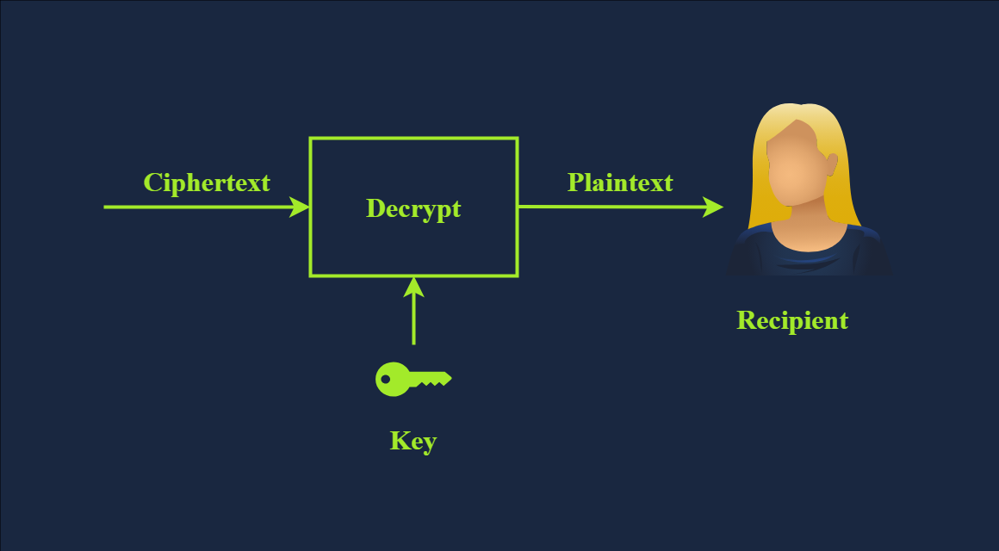
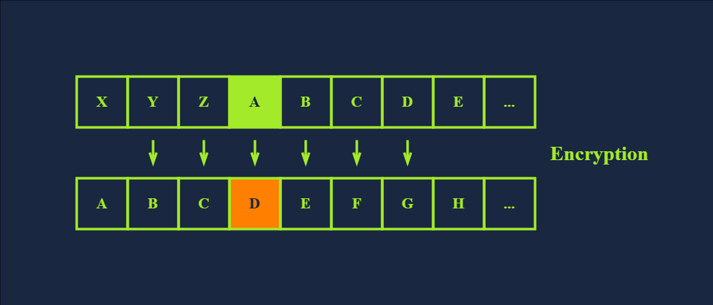
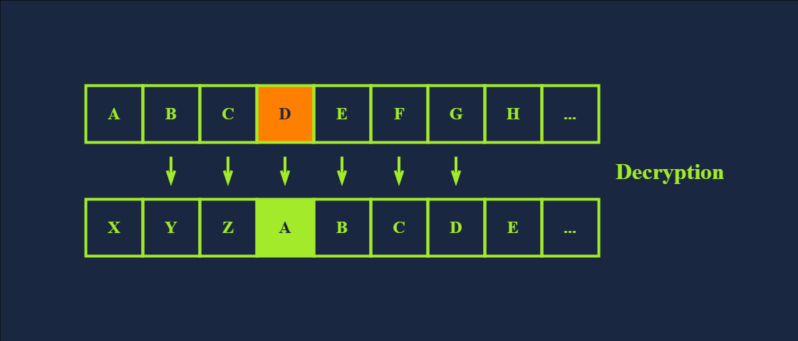
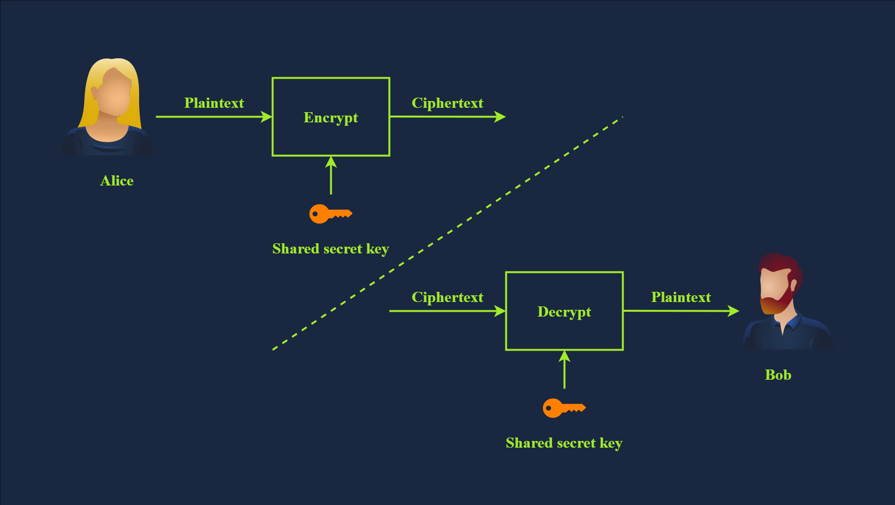
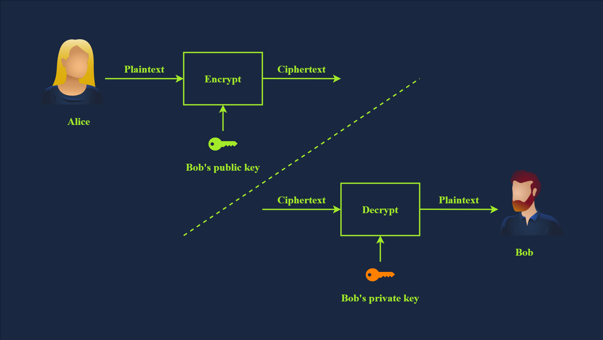
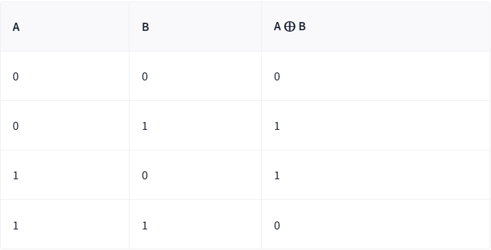

# Cryptography Basics
## 1. Introduce
### 1. Giới thiệu
_Bạn đã bao giờ tự hỏi làm thế nào để ngăn chặn bên thứ ba đọc tin nhắn của mình chưa?_ Làm thế nào ứng dụng hoặc trình duyệt web của bạn có thể thiết lập một kênh bảo mật với máy chủ từ xa? Bảo mật ở đây có nghĩa là không ai có thể đọc hoặc thay đổi dữ liệu được trao đổi; hơn nữa, chúng ta có thể chắc chắn rằng mình đang kết nối với máy chủ thực sự. Nhờ mật mã học, những yêu cầu này được đáp ứng.

Mật mã học đặt nền tảng cho thế giới kỹ thuật số của chúng ta. Trong khi các giao thức mạng cho phép các thiết bị trên toàn cầu giao tiếp với nhau, mật mã học đã giúp cho việc giao tiếp này trở nên đáng tin cậy.
### 2. Mục tiêu
Sau khi hoàn thành căn phòng này, bạn sẽ học được những điều sau:
- _Các thuật ngữ chính trong mật mã học_
- _Tầm quan trọng của mật mã học_
- _Mật mã Caesar_
- _Các thuật toán mã hóa đối xứng tiêu chuẩn_
- _Các thuật toán mã hóa bất đối xứng thông dụng_
- _Toán học cơ bản thường được sử dụng trong mật mã học_.

## 2. Importance of Cryptography
Mục đích tối thượng của mật mã học là **đảm bảo liên lạc an toàn** khi có sự hiện diện của kẻ tấn công . Thuật ngữ "**an toàn**" bao gồm tính bảo mật và tính toàn vẹn của dữ liệu được truyền tải. Mật mã học có thể được định nghĩa là thực hành và nghiên cứu các kỹ thuật để liên lạc an toàn và bảo vệ dữ liệu trong trường hợp có sự hiện diện của kẻ tấn công và bên thứ ba. Nói cách khác, những kẻ tấn công này không được phép có được hoặc thay đổi nội dung của các thông điệp.

Mật mã học được sử dụng để bảo vệ **tính bảo mật, tính toàn vẹn** và **tính xác thực**. Trong thời đại này, bạn sử dụng mật mã học hàng ngày, và gần như chắc chắn bạn đang đọc bài viết này qua một kết nối được mã hóa. Hãy xem xét các tình huống sau đây mà bạn sẽ sử dụng mật mã học:
- Khi bạn đăng nhập vào TryHackMe, thông tin đăng nhập của bạn sẽ được mã hóa và gửi đến máy chủ để không ai có thể lấy lại chúng bằng cách theo dõi kết nối của bạn.
- Khi bạn kết nối qua `SSH` , **máy khách SSH** và máy chủ sẽ thiết lập một đường hầm mã hóa để không ai có thể nghe trộm phiên làm việc của bạn.
- Khi bạn thực hiện giao dịch ngân hàng trực tuyến, trình duyệt của bạn sẽ kiểm tra chứng chỉ của máy chủ từ xa để xác nhận rằng bạn đang giao tiếp với máy chủ của ngân hàng mình chứ không phải của kẻ tấn công.
- Khi tải xuống một tập tin, làm thế nào để bạn kiểm tra xem nó đã được tải xuống đúng cách hay chưa? Mật mã học cung cấp một giải pháp thông qua các hàm băm để xác nhận rằng tập tin của bạn giống hệt với tập tin gốc.

Như bạn thấy, bạn hiếm khi phải tương tác trực tiếp với mật mã học, nhưng các giải pháp và ứng dụng của nó lại hiện diện khắp mọi nơi trong thế giới kỹ thuật số. Hãy xem xét trường hợp một công ty muốn xử lý thông tin thẻ tín dụng và các giao dịch liên quan. Khi xử lý thẻ tín dụng, công ty đó phải tuân thủ và thực thi _Tiêu chuẩn Bảo mật Dữ liệu Ngành Thẻ Thanh toán_ ( `PCI DSS` ). Trong trường hợp này, `PCI DSS` đảm bảo mức độ bảo mật tối thiểu để lưu trữ, xử lý và truyền tải dữ liệu liên quan đến tín dụng thẻ. Nếu bạn kiểm tra `PCI DSS` dành cho các Tổ chức Lớn , bạn sẽ biết rằng dữ liệu phải được mã hóa cả khi được **lưu trữ** (_ở trạng thái nghỉ_) và khi được **truyền tải** (_ở trạng thái di chuyển_).

## 3. Plaintext to Ciphertext
Trước khi giới thiệu các thuật ngữ chính, chúng ta hãy bắt đầu bằng một _ví dụ minh họa_. Chúng ta bắt đầu với văn bản gốc mà chúng ta muốn mã hóa. **Plaintext** là dữ liệu có thể đọc được; nó có thể là bất cứ thứ gì, _từ một lời chào đơn giản, một bức ảnh con mèo, thông tin thẻ tín dụng hoặc hồ sơ sức khỏe_. Từ góc độ mật mã học, tất cả những thứ này đều là các thông điệp "văn bản gốc" đang chờ được mã hóa. **Plaintext** được đưa qua hàm mã hóa cùng với một khóa thích hợp; hàm mã hóa trả về một **Ciphertext**. **Hàm mã hóa** là một phần của thuật toán mã hóa; thuật toán mã hóa là một thuật toán để **chuyển đổi văn bản gốc thành văn bản mã hóa và ngược lại**.

Để khôi phục văn bản gốc, chúng ta phải truyền văn bản mã hóa cùng với khóa thích hợp qua **hàm giải mã**, điều này sẽ cho chúng ta văn bản gốc ban đầu. Điều này được minh họa trong hình bên dưới.

Chúng ta vừa được giới thiệu một số thuật ngữ mới, và chúng ta cần phải học chúng để hiểu bất kỳ văn bản nào về mật mã học. Các thuật ngữ được liệt kê bên dưới:

- `Plaintext` là thông điệp hoặc dữ liệu ban đầu, có thể đọc được trước khi được mã hóa. Đó có thể là _một tài liệu, một hình ảnh, một tệp đa phương tiện hoặc bất kỳ dữ liệu nhị phân_ nào khác.
- `Ciphertext` là phiên bản _bị xáo trộn_, không thể đọc được của thông điệp sau khi mã hóa. Về lý thuyết, chúng ta không thể thu được bất kỳ thông tin nào về văn bản gốc ngoại trừ kích thước gần đúng của nó.
- `Cipher` là một thuật toán hoặc phương pháp chuyển đổi văn bản gốc thành văn bản mã hóa và ngược lại. Thuật toán mã hóa thường được phát triển bởi một nhà toán học.
- `Key` là một chuỗi bit mà thuật toán mã hóa sử dụng để mã hóa hoặc giải mã dữ liệu. Nói chung, thuật toán mã hóa được sử dụng là thông tin công khai; tuy nhiên, khóa phải được giữ bí mật trừ khi đó là khóa công khai trong mã hóa bất đối xứng. Chúng ta sẽ tìm hiểu về mã hóa bất đối xứng trong một bài tập khác.
- `Encryption` là quá trình chuyển đổi văn bản gốc thành văn bản mã hóa bằng cách sử dụng thuật toán mã hóa và khóa. Khác với khóa, việc lựa chọn thuật toán mã hóa là thông tin được công khai.
- `Decryption` là quá trình ngược lại của mã hóa, chuyển đổi văn bản mã hóa trở lại văn bản gốc bằng cách sử dụng thuật toán mã hóa và khóa. Mặc dù thuật toán mã hóa được công khai, nhưng việc khôi phục văn bản gốc mà không biết khóa là điều không thể (bất khả thi).

## 4. Historical Ciphers
Lịch sử mật mã học rất lâu đời, bắt nguồn từ Ai Cập cổ đại vào năm 1900 trước Công nguyên. Tuy nhiên, một trong những mật mã đơn giản nhất trong lịch sử là **mật mã Caesar** từ thế kỷ thứ nhất trước Công nguyên. Ý tưởng rất đơn giản: **dịch chuyển mỗi chữ cái một số nhất định để mã hóa thông điệp.**

Hãy xem xét ví dụ sau:
- Văn bản gốc: `TRYHACKME`
- Chú thích: **3** (`Giả sử đó là phép dịch phải 3.`)
- Mật mã: **Mật mã Caesar**

Ta có thể dễ dàng nhận ra rằng `T` trở thành `W`, `R` trở thành `U`, `Y` trở thành `B`, v.v. Như bạn đã thấy, khi đến `Z`, ta lại bắt đầu lại từ đầu, như hình dưới đây. Do đó, ta thu được bản mã: `WUBKDFNPH`

Để giải mã, chúng ta cần những thông tin sau:
- Văn bản mã hóa: `WUBKDFNPH`
- Mã số: **3**
- Mật mã: **Mật mã Caesar**

## 5. Types of Encryption
Hai loại mã hóa chính là **mã hóa đối xứng** và **mã hóa bất đối xứng**.

### 1. Mã hóa đối xứng
**Mã hóa đối xứng** , còn được gọi là **mật mã đối xứng** , sử dụng cùng một khóa để mã hóa và giải mã dữ liệu, như hình minh họa bên dưới. Việc giữ bí mật khóa là điều bắt buộc; nó còn được gọi là **mật khóa riêng** . Hơn nữa, việc truyền đạt khóa cho các bên được chỉ định có thể gặp khó khăn vì nó yêu cầu một kênh liên lạc an toàn. Việc duy trì tính bí mật của khóa có thể là một thách thức đáng kể, đặc biệt nếu có nhiều người nhận. Vấn đề trở nên nghiêm trọng hơn khi có sự hiện diện của một đối thủ mạnh; ví dụ, hãy xem xét mối đe dọa của hoạt động gián điệp công nghiệp.

Hãy xem xét trường hợp đơn giản sau: bạn tạo một tài liệu được bảo vệ bằng mật khẩu để chia sẻ với đồng nghiệp. Bạn có thể dễ dàng gửi tài liệu đã mã hóa qua email cho đồng nghiệp, nhưng rất có thể bạn không thể gửi mật khẩu cho họ. Lý do là bất kỳ ai có quyền truy cập vào hộp thư của họ đều có thể truy cập cả tài liệu được bảo vệ bằng mật khẩu và mật khẩu đó. Do đó, bạn cần nghĩ đến một cách khác, tức là một kênh khác, để chia sẻ mật khẩu. Trừ khi bạn nghĩ ra một kênh an toàn và dễ truy cập, một giải pháp là gặp mặt trực tiếp và trao đổi mật khẩu với họ.

Ví dụ về mã hóa đối xứng là `DES` (Data Encryption Standard), `3DES` (Triple DES ) và `AES` (Advanced Encryption Standard).

Có rất nhiều thuật toán mã hóa đối xứng khác được sử dụng trong nhiều ứng dụng khác nhau; tuy nhiên, chúng chưa được chấp nhận làm tiêu chuẩn.

### 2. Mã hóa bất đối xứng
Không giống như mã hóa đối xứng, sử dụng cùng một khóa cho cả mã hóa và giải mã, **mã hóa bất đối xứng** sử dụng một cặp khóa, một khóa để mã hóa và một khóa để giải mã, như minh họa bên dưới. Để bảo vệ tính bảo mật, mã hóa bất đối xứng hay **mật mã bất đối xứng** mã hóa dữ liệu bằng khóa công khai; do đó, nó còn được gọi là **mật mã khóa công khai** .

Ví dụ về các thuật toán này bao gồm `RSA` , `Diffie-Hellman` và mật mã đường cong `Elliptic` ( **ECC** ). Hai khóa tham gia vào quá trình này được gọi là **Public Key** (_khóa công khai_) và **Private Key** (_khóa riêng tư_) . Dữ liệu được mã hóa bằng khóa công khai có thể được giải mã bằng khóa riêng tư. Khóa riêng tư của bạn cần được giữ bí mật.

**Mã hóa bất đối xứng** dựa trên một nhóm các bài toán toán học cụ thể, dễ tính toán theo một chiều nhưng _cực kỳ khó đảo ngược_. Trong ngữ cảnh này, "_cực kỳ khó_" có nghĩa là gần như không khả thi. Ví dụ, chúng ta có thể dựa vào một bài toán toán học mà nếu sử dụng công nghệ hiện nay sẽ mất rất nhiều thời gian, chẳng hạn như **hàng triệu năm** để giải quyết

## 6. Basic Math
Các nguyên tắc cơ bản của mật mã học hiện đại nằm ở toán học. Để minh họa một số thuật toán cơ bản, chúng ta sẽ xem xét hai phép toán được sử dụng trong nhiều thuật toán khác nhau:
- Phép toán **XOR**
- Phép toán **modulo**

### 1. XOR
`XOR` , viết tắt của “**exclusive OR**” (_phép OR độc quyền_), là một phép toán logic trong số học nhị phân đóng vai trò quan trọng trong nhiều ứng dụng tính toán và mật mã. Trong hệ nhị phân, `XOR` so sánh hai bit và trả về `1` nếu các bit **khác nhau** và `0` nếu chúng **giống nhau**, như được thể hiện trong bảng chân lý bên dưới. Phép toán này thường được biểu diễn bằng ký hiệu `⊕` hoặc `^`.

### 2. Modulo
Một phép toán khác mà chúng ta thường gặp trong mật mã học là toán tử `modulo`, thường được viết là `%` hoặc `modulo` . Toán tử `modulo`, `X % Y` , là phần dư thu được khi X chia cho Y. Trong các phép tính hàng ngày, chúng ta tập trung nhiều hơn vào kết quả phép chia hơn là phần dư. Phần dư đóng một vai trò quan trọng trong mật mã học.

Bạn cần làm việc với các số lớn khi giải một số bài tập mật mã. Nếu máy tính bỏ túi của bạn không đáp ứng được, chúng tôi khuyên bạn nên sử dụng một ngôn ngữ lập trình như **Python**. **Python** có kiểu dữ liệu tích hợp `int` có thể xử lý các số nguyên có kích thước tùy ý và sẽ tự động chuyển sang các kiểu dữ liệu lớn hơn khi cần thiết. Nhiều ngôn ngữ lập trình khác cũng có thư viện chuyên dụng cho các số nguyên lớn

Chúng ta hãy xem xét một vài ví dụ.
- `25%5 = 0` vì `25` chia cho `5` bằng `5`, có số dư là `0`, tức là `25 = 5 × 5 + 0`
- `23%6 = 5` vì `23` chia cho `6` bằng `3`, dư `5`, tức là `23 = 3 × 6 + 5`
- `23%7 = 2` vì `23` chia cho `7` bằng `3` với số dư là `2`, tức là `23 = 3 × 7 + 2`

Một điều quan trọng cần nhớ về phép toán `modulo` là nó không thể đảo ngược. Nếu ta có phương trình `x % 5 = 4` , thì vô số giá trị của `x` sẽ thỏa mãn phương trình này.

Phép toán `modulo` luôn trả về kết quả **không âm và nhỏ hơn số chia**. Điều này có nghĩa là với bất kỳ số nguyên `a` và số nguyên dương `n` nào , kết quả của `a % n` sẽ luôn nằm trong khoảng từ `0` đến `n  − 1` .