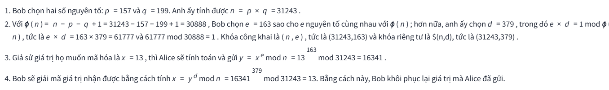
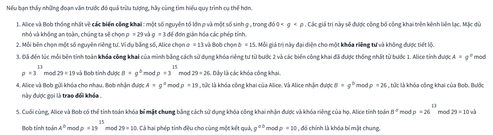
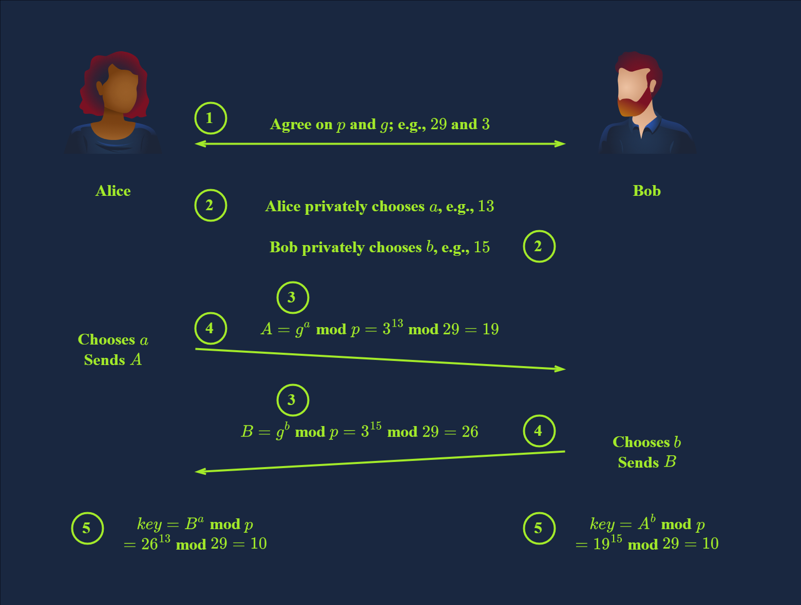
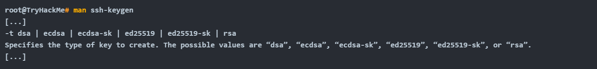
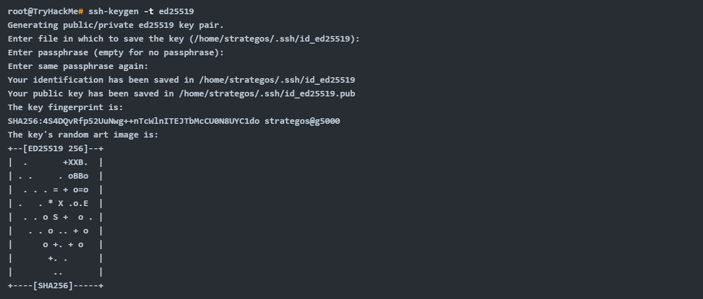
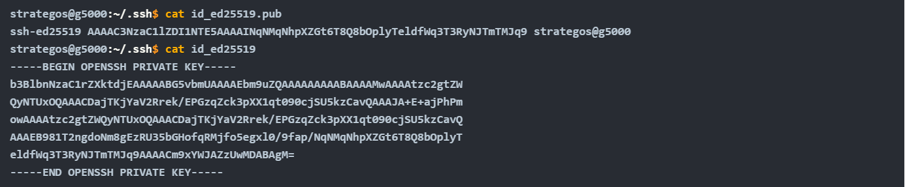
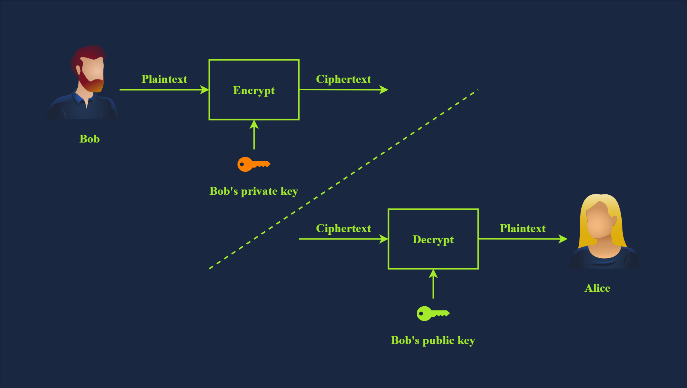
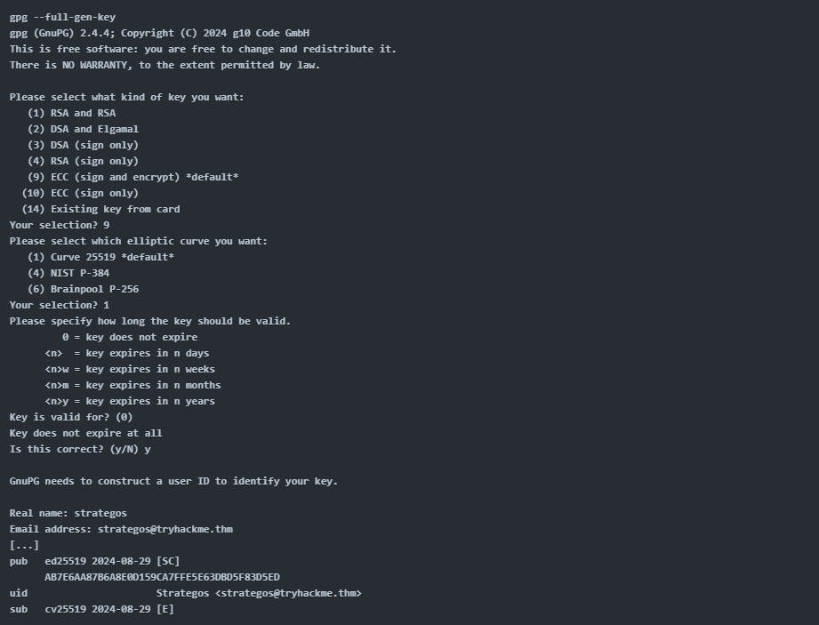

# Public Key Cryptography Basics
## 1. Introduction
_Khi ai đó gửi cho bạn một tin nhắn văn bản, làm sao bạn có thể chắc chắn rằng họ đúng là người mà họ tự xưng?_ Làm sao bạn có thể chắc chắn rằng không có gì thay đổi nội dung tin nhắn khi nó được truyền qua nhiều đường truyền mạng khác nhau? Khi bạn giao tiếp với đối tác kinh doanh của mình qua nền tảng nhắn tin trực tuyến, bạn cần phải chắc chắn về những điều sau:
- **Xác thực** : Bạn cần chắc chắn rằng mình đang giao tiếp với đúng người, chứ không phải ai đó giả mạo.
- **Tính xác thực** : Bạn có thể kiểm chứng xem thông tin có đến từ nguồn được nêu hay không.
- **Tính toàn vẹn** : Bạn phải đảm bảo rằng không ai thay đổi dữ liệu mà bạn trao đổi.
- **Bảo mật** : Bạn muốn ngăn chặn người không được phép nghe lén các cuộc trò chuyện của mình.

Mật mã học có thể cung cấp các giải pháp để đáp ứng các yêu cầu nêu trên, cùng với nhiều yêu cầu khác. **Mật mã khóa riêng**, tức là **mã hóa đối xứng**, chủ yếu bảo vệ tính bảo mật. Tuy nhiên, **mật mã khóa công khai**, tức là **mật mã bất đối xứng**, đóng vai trò quan trọng trong việc _xác thực, tính xác thực và tính toàn vẹn_. Phòng này sẽ trình bày nhiều ví dụ về cách mật mã khóa công khai đạt được điều đó.

### Mục tiêu
Trong phòng này, chúng ta sẽ tìm hiểu về các hệ mật mã bất đối xứng khác nhau và các ứng dụng sử dụng chúng, chẳng hạn như:
- RSA
- Diffie-Hellman
- SSH
- Chứng chỉ SSL/ TLS
- PGP và GPG

## 2. Common Use of Asymmetric Encryption
**Trao đổi khóa cho mã hóa đối xứng** là một ứng dụng phổ biến của **mật mã bất đối xứng**. Mã hóa bất đối xứng tương đối chậm so với mã hóa đối xứng; do đó, chúng ta dựa vào mã hóa bất đối xứng để đàm phán và thống nhất về thuật toán và khóa mã hóa đối xứng.

Trên thực tế, bạn cần nhiều thuật toán mã hóa hơn để xác minh người bạn đang nói chuyện có đúng là người mà họ tự xưng hay không. Điều này được thực hiện bằng cách sử dụng chữ ký số và chứng chỉ số, mà chúng ta sẽ tìm hiểu thêm sau trong buổi học này.

## 3. RSA
`RSA` là một thuật toán mã hóa khóa công khai cho phép truyền dữ liệu an toàn qua các kênh không an toàn. Với một kênh không an toàn, chúng ta dự đoán rằng kẻ tấn công có thể nghe trộm dữ liệu.

Nhân hai số nguyên tố với nhau rất đơn giản, thậm chí chỉ cần tính trên giấy, ví dụ `113 × 127 = 14351`. Mặt khác, việc xác định 2 số nguyên tố nào nhân với nhau để tạo thành `14351` khá khó khăn

Trong các ví dụ thực tế, các số nguyên tố sẽ lớn hơn nhiều so với các số trong ví dụ này. Máy tính có thể dễ dàng phân tích thừa số nguyên tố của `166764499494295486767649` ; tuy nhiên, nó không thể phân tích thừa số nguyên tố của một số có nhiều hơn `600` chữ số. Và bạn cũng sẽ đồng ý rằng phép nhân hai số nguyên tố khổng lồ, mỗi số có khoảng `300` chữ số, sẽ dễ dàng hơn việc phân tích thừa số nguyên tố của tích chúng.

**Cách hoạt động**

Bằng chứng cho thấy thuật toán trên hoạt động có thể được tìm thấy trong số học `modulo` và nằm ngoài phạm vi của mô-đun này. Cần nhắc lại rằng trong ví dụ này, chúng ta đã chọn một số nguyên tố có 3 chữ số, trong khi trong một ứng dụng thực tế, `p` và `q` sẽ là các số nguyên tố có ít nhất `300` chữ số.

## 4. Diffie-Hellman Key Exchange
Một trong những thách thức khi sử dụng mã hóa đối xứng là việc chia sẻ khóa bí mật. Giả sử bạn muốn gửi một tài liệu được bảo vệ bằng mật khẩu cho đối tác kinh doanh để thảo luận về các chiến lược kinh doanh bí mật. Làm thế nào bạn có thể chia sẻ mật khẩu với họ? Tốt nhất là bạn nên có một kênh an toàn để gửi mật khẩu, biết rằng kẻ thù không thể đọc hoặc thay đổi nó.

### 1. Trao đổi khóa Diffie-Hellman
`Trao đổi khóa` nhằm mục đích thiết lập một bí mật chung giữa hai bên. Đây là một phương pháp cho phép hai bên thiết lập một bí mật chung trên một kênh liên lạc không an toàn mà không cần có bí mật chung tồn tại từ trước và không cho phép người quan sát có được khóa này. Do đó, khóa chung này có thể được sử dụng để mã hóa đối xứng trong các lần liên lạc tiếp theo.

**CÁCH HOẠT ĐỘNG**

Giao thức trao đổi khóa Diffie-Hellman thường được sử dụng cùng với mật mã khóa công khai RSA . Diffie-Hellman được dùng để thỏa thuận khóa, trong khi RSA được dùng cho chữ ký số, truyền tải khóa và xác thực, cùng nhiều ứng dụng khác. Ví dụ, RSA giúp chứng minh danh tính của người bạn đang nói chuyện thông qua chữ ký số, vì bạn có thể xác nhận dựa trên khóa công khai của họ. Điều này sẽ ngăn chặn ai đó tấn công kết nối bằng kiểu tấn công trung gian (man-in-the-middle attack) nhắm vào Alice bằng cách giả danh Bob. Tóm lại, Diffie-Hellman và RSA được tích hợp vào nhiều giao thức và tiêu chuẩn bảo mật để cung cấp một giải pháp bảo mật toàn diện.

## 5. SSH
### 1. Xác thực máy khách
Giờ chúng ta đã xác nhận đang kết nối với máy chủ chính xác, chúng ta cần xác định danh tính và được xác thực. Trong nhiều trường hợp, người dùng SSH được xác thực bằng tên người dùng và mật khẩu giống như khi đăng nhập vào máy vật lý. Tuy nhiên, xét đến những vấn đề tiềm ẩn của mật khẩu, cách làm này không nằm trong các biện pháp bảo mật tốt nhất.

Chắc chắn sẽ có lúc bạn gặp phải máy tính cấu hình SSH bằng xác thực khóa. Phương thức xác thực này sử dụng khóa công khai và khóa riêng tư để chứng minh máy khách là người dùng hợp lệ và được ủy quyền trên máy chủ. Theo mặc định, khóa SSH là khóa RSA. Bạn có thể chọn thuật toán để tạo và thêm mật khẩu để mã hóa khóa SSH .

`ssh-keygen` là chương trình thường được sử dụng để tạo cặp khóa. Nó hỗ trợ nhiều thuật toán khác nhau, như được trình bày trong trang hướng dẫn sử dụng bên dưới.

Hãy tạo một cặp khóa với các tùy chọn mặc định.

Trong ví dụ trên, chúng ta không sử dụng mật khẩu để hiển thị nội dung của khóa riêng tư. Hãy xem khóa công khai được tạo ra `id_ed25519.pub`, và khóa riêng tư được tạo ra `id_ed25519`.

Lưu ý rằng khóa riêng tư được chia sẻ ở trên chỉ nhằm mục đích minh họa và đã bị xóa sau đó. Chia sẻ khóa riêng tư là hành động thiếu an toàn nhất mà bất kỳ ai có thể thực hiện đối với bảo mật của mình. Mặt khác, nếu chúng ta sử dụng `-t rsa`, các khóa thu được sẽ dài hơn nhiều.

### 2. SSH Private Key
Như đã đề cập, bạn nên coi khóa SSH riêng tư của mình như mật khẩu. Tuyệt đối không bao giờ chia sẻ chúng trong bất kỳ trường hợp nào; chúng được gọi là khóa riêng tư vì lý do đó. Người nào đó có khóa riêng tư của bạn có thể đăng nhập vào các máy chủ chấp nhận nó, tức là có thể thêm nó vào danh sách các khóa được ủy quyền, trừ khi khóa đó được mã hóa bằng mật khẩu.

Điều rất quan trọng cần lưu ý là mật khẩu dùng để giải mã khóa riêng không hề xác định danh tính của bạn với máy chủ; nó chỉ dùng để giải mã khóa riêng SSH. Mật khẩu này không bao giờ được truyền đi và không bao giờ rời khỏi hệ thống của bạn.

Sử dụng các công cụ như **John the Ripper**, bạn có thể tấn công khóa SSH được mã hóa để cố gắng tìm ra mật khẩu, điều này nhấn mạnh tầm quan trọng của việc sử dụng mật khẩu phức tạp và giữ bí mật khóa riêng tư của bạn.

Khi tạo khóa SSH để đăng nhập vào máy tính từ xa, bạn nên tạo khóa trên máy của mình rồi sao chép khóa công khai sang, vì điều này có nghĩa là khóa riêng tư không bao giờ tồn tại trên máy đích `ssh-copy-id`. Tuy nhiên, điều này không quá quan trọng đối với các khóa tạm thời được tạo để truy cập vào các hộp CTF.

Bạn phải thiết lập quyền truy cập chính xác để sử dụng khóa SSH riêng tư ; nếu không, trình khách SSH của bạn sẽ bỏ qua tệp và hiển thị cảnh báo. Chỉ chủ sở hữu mới được phép đọc hoặc ghi vào khóa riêng tư ( 600hoặc quyền nghiêm ngặt hơn). `ssh -i privateKeyFileName user@host` là cách bạn chỉ định khóa cho trình khách OpenSSH tiêu chuẩn của Linux.

**Các khóa được máy chủ từ xa tin cậy**
Thư mục `~/.ssh` là nơi mặc định để lưu trữ các khóa cho OpenSSH. `authorized_keys` chứa các khóa công khai được phép truy cập vào máy chủ nếu xác thực bằng khóa được bật. Theo mặc định trên nhiều bản phân phối Linux, xác thực bằng khóa được bật vì nó an toàn hơn so với việc sử dụng mật khẩu để xác thực. Chỉ nên chấp nhận xác thực bằng khóa nếu bạn muốn cho phép người dùng root truy cập SSH.

### 3. Sử dụng khóa SSH để có được "quyền truy cập tốt hơn"
Trong các cuộc thi CTF, kiểm thử xâm nhập và diễn tập tấn công giả lập, khóa SSH là một cách tuyệt vời để "nâng cấp" một shell đảo ngược, giả sử người dùng đã bật tính năng đăng nhập. Lưu ý rằng tài khoản **www-data** thường không cho phép điều này, nhưng người dùng thông thường và người dùng root thì được. Để lại khóa SSH trong `authorized_keys` trên máy có thể là một cửa hậu hữu ích, và bạn không cần phải đối phó với bất kỳ vấn đề nào của shell đảo ngược không ổn định như nhấn tổ hợp phím Control-C hoặc thiếu tính năng tự động hoàn thành bằng phím Tab.

### 6. Chữ ký và chứng chỉ số
Trong thế giới "**analog**" , bạn thỉnh thoảng được yêu cầu ký giấy tờ. Khi đến ngân hàng để mở tài khoản tiết kiệm, bạn rất có thể được yêu cầu ký một số giấy tờ. Khi muốn tạo tài khoản tại thư viện địa phương, bạn sẽ được yêu cầu điền và ký đơn đăng ký. Mục đích có thể khác nhau tùy thuộc vào tình huống. Ví dụ, nó có thể xác nhận rằng bạn đồng ý với các điều khoản và điều kiện, ủy quyền giao dịch hoặc xác nhận đã nhận được một vật phẩm. Trong thế giới "**kỹ thuật số**" , bạn không thể sử dụng chữ ký, con dấu hoặc dấu vân tay của mình; bạn cần **chữ ký điện tử**(_Digital Signature_).

### 1. What’s a Digital Signature?
Chữ ký số cung cấp một cách để xác minh tính xác thực và toàn vẹn của một tin nhắn hoặc tài liệu kỹ thuật số. Việc chứng minh tính xác thực của các tệp có nghĩa là chúng ta biết ai đã tạo hoặc sửa đổi chúng. Sử dụng mật mã bất đối xứng, bạn tạo ra một chữ ký bằng khóa riêng của mình, có thể được xác minh bằng khóa công khai của bạn. Chỉ bạn mới nên có quyền truy cập vào khóa riêng của mình, điều này chứng minh bạn đã ký vào tệp. Ở nhiều quốc gia hiện đại, chữ ký số và chữ ký vật lý có giá trị pháp lý như nhau.

Hình thức đơn giản nhất của chữ ký số là mã hóa tài liệu bằng khóa riêng của bạn. Nếu ai đó muốn xác minh chữ ký này, họ sẽ giải mã nó bằng khóa công khai của bạn và kiểm tra xem các tệp có khớp nhau hay không. Quá trình này được minh họa trong hình ảnh bên dưới.

Chúng ta sử dụng thuật ngữ **chữ ký số** để chỉ việc ký một tài liệu bằng khóa riêng hoặc chứng chỉ. Quá trình này tương tự như hình ảnh minh họa ở trên, trong đó Bob mã hóa một mã băm của tài liệu và chia sẻ nó với Alice, cùng với tài liệu gốc. Alice có thể giải mã mã băm đã mã hóa và so sánh nó với mã băm của tệp mà cô ấy nhận được. Cách tiếp cận này chứng minh tính toàn vẹn của tài liệu, khác với việc chỉ dán một hình ảnh chữ ký giả

### 2. Certificates: Prove Who You Are!(_Chứng chỉ số: chứng minh bạn là ai_)
Chứng chỉ là một ứng dụng thiết yếu của mật mã khóa công khai, và chúng cũng liên quan đến chữ ký số. Một lĩnh vực phổ biến mà chúng được sử dụng là HTTPS. Làm thế nào trình duyệt web của bạn biết rằng máy chủ mà bạn đang kết nối là `tryhackme.com` thật?

Câu trả lời nằm ở các chứng chỉ. Máy chủ web có một chứng chỉ xác nhận rằng nó là trang web tryhackme.com chính hãng. Các chứng chỉ này có một chuỗi tin cậy, bắt đầu từ một **CA gốc** (_Certificate Authority - Tổ chức cấp chứng chỉ_). Từ khi cài đặt, thiết bị, hệ điều hành và trình duyệt web của bạn tự động tin tưởng các **CA gốc** khác nhau. Chứng chỉ chỉ được tin tưởng khi các **CA gốc** xác nhận rằng họ tin tưởng tổ chức đã ký chứng chỉ đó. Nói cách khác, đó là một chuỗi; ví dụ, chứng chỉ được ký bởi một tổ chức, tổ chức đó được một CA tin tưởng , và CA đó được trình duyệt của bạn tin tưởng. Do đó, trình duyệt của bạn tin tưởng chứng chỉ đó. Nhìn chung, có những chuỗi tin cậy dài

Giả sử bạn có một trang web và muốn sử dụng `HTTPS`. Bước này yêu cầu bạn phải có chứng chỉ `TLS` . Bạn có thể nhận được chứng chỉ từ các tổ chức cấp chứng chỉ khác nhau với một khoản phí hàng năm. Hơn nữa, bạn có thể tự tạo chứng chỉ `TLS` cho các tên miền mình sở hữu bằng cách sử dụng **Let's Encrypt** miễn phí. Nếu bạn điều hành một trang web, việc thiết lập và chuyển sang `HTTPS` là rất đáng giá, giống như bất kỳ trang web hiện đại nào khác.

## 6. PGP và GPG
`PGP` là viết tắt của **Pretty Good Privacy**. Đây là phần mềm thực hiện mã hóa để mã hóa tệp tin, thực hiện chữ ký số và nhiều hơn nữa. `GnuPG`(_GNU Privacy Guard_) hoặc `GPG` là một triển khai mã nguồn mở của tiêu chuẩn `OpenPGP`.

`GPG` thường được sử dụng trong email để bảo vệ tính bảo mật của các tin nhắn email. Hơn nữa, nó có thể được dùng để ký điện tử vào tin nhắn email và xác nhận tính toàn vẹn của nó.

Dưới đây là một ví dụ về việc tạo `GPG Key` . Bạn được hỏi về mục đích sử dụng `gpg`, liệu chỉ để ký hay cả ký và mã hóa. Bên cạnh việc chọn thuật toán mã hóa, chúng ta cần chọn ngày hết hạn cho khóa được tạo. Cuối cùng, chúng ta cung cấp một số thông tin về bản thân: _tên, địa chỉ email và một lời bình luận thường về mục đích sử dụng khóa này_.

Bạn có thể cần sử dụng GPG để giải mã các tập tin trong **CTF**. Với `PGP/ GPG` , khóa riêng có thể được bảo vệ bằng mật khẩu tương tự như cách chúng ta bảo vệ `khóa riêng SSH`. Nếu khóa được bảo vệ bằng mật khẩu, bạn có thể thử bẻ khóa nó bằng J`ohn the Ripper` và [tên `gpg-john` công cụ bẻ khóa].

### Ví dụ thực tế
Giờ bạn đã có `cặp khóa GPG`, bạn có thể chia sẻ khóa công khai với những người trong danh bạ của mình. Bất cứ khi nào những người trong danh bạ muốn liên lạc một cách an toàn, họ sẽ mã hóa tin nhắn gửi cho bạn bằng khóa công khai của bạn. Để giải mã tin nhắn, bạn sẽ phải sử dụng khóa riêng tư của mình. Do tầm quan trọng của các `khóa GPG`, điều cần thiết là bạn phải giữ một bản sao lưu ở một vị trí an toàn.

Giả sử bạn vừa mua một máy tính mới. Tất cả những gì bạn cần làm là nhập khóa của mình, và bạn có thể bắt đầu giải mã các tin nhắn đã nhận được trở lại:
- Bạn sẽ sử dụng `gpg --import backup.key` để nhập khóa của mình từ tệp `backup.key`.
- Để giải mã tin nhắn của bạn, bạn cần thực hiện lệnh sau: `gpg --decrypt confidential_message.gpg`

