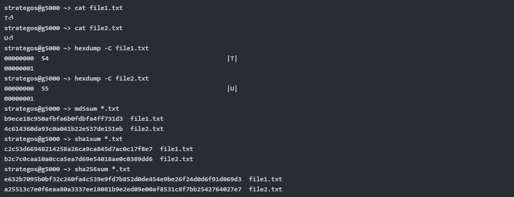
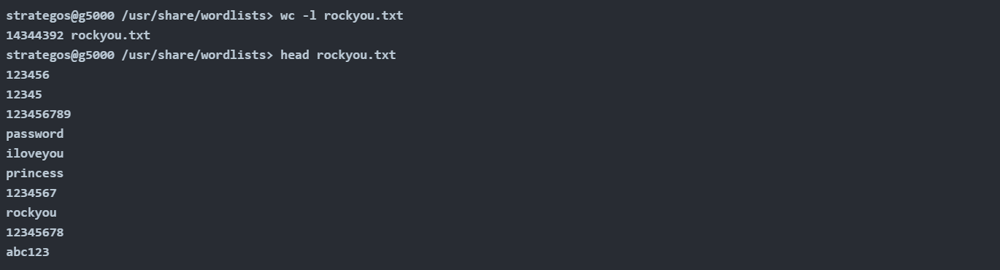
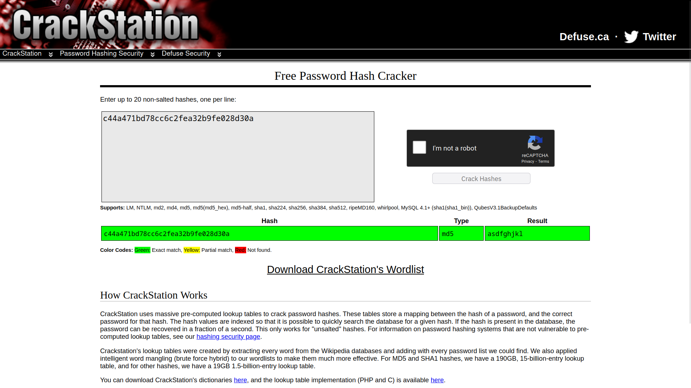
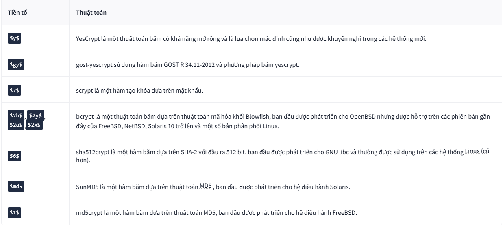
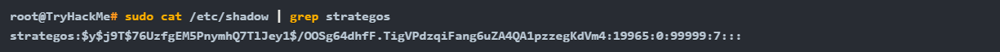
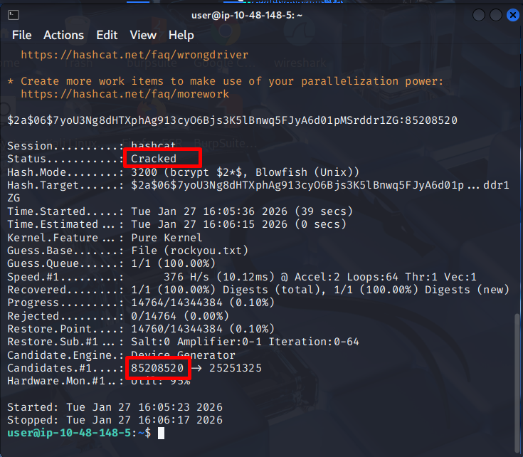
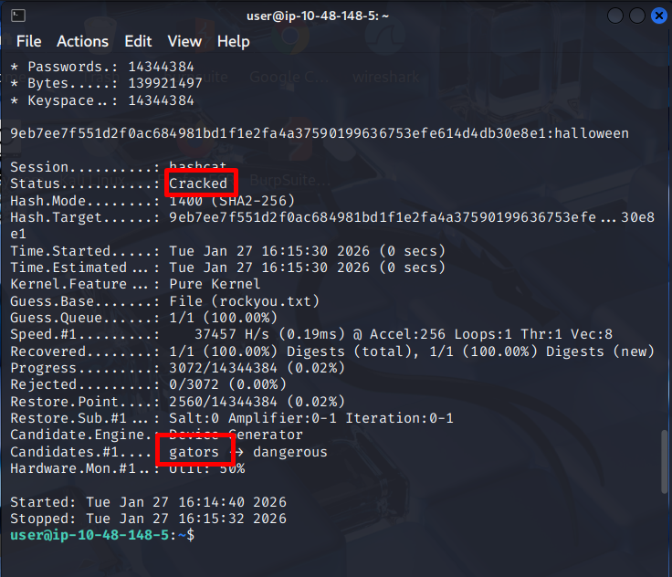
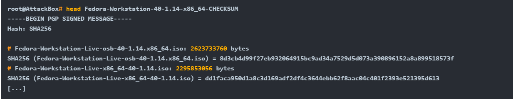
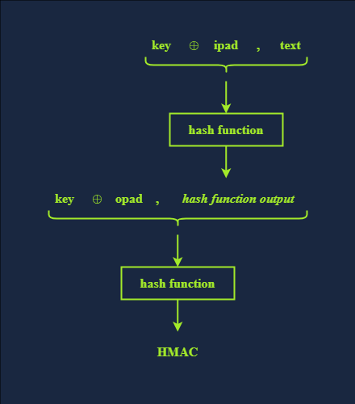

# Hashing Basics
## 1. Introduction
_Hãy xem xét tình huống bạn vừa tải xuống một tập tin `6 GB` và muốn biết liệu bản sao bạn tải xuống có giống hệt tập tin gốc, từng bit một hay không. Bạn sẽ làm điều đó như thế nào? Hoặc nếu một người tốt bụng đưa cho bạn tập tin `6 GB` này trên ổ USB, làm thế nào bạn có thể chắc chắn rằng nó giống hệt với tập tin bạn muốn tải xuống?_

Câu trả lời cho cả hai câu hỏi trên nằm ở việc so sánh giá trị **hash** của hai tập tin; nếu hai giá trị **hash** bằng nhau, bạn có thể khẳng định với độ chắc chắn rất cao rằng hai tập tin đó giống hệt nhau. _Nhưng giá trị **hash** là gì?_

**Giá trị hash** là một chuỗi ký tự có kích thước cố định được tính toán bởi một **hàm hash**. **Hàm hash** nhận đầu vào có kích thước tùy ý và trả về đầu ra có độ dài cố định, tức là một **giá trị hash**. Chúng ta sẽ tìm hiểu nhiều ứng dụng thú vị và thông minh của các **hàm hash** và **giá trị hash** trong buổi học này.

Lưu ý về thuật ngữ: Chúng tôi ưu tiên sử dụng các thuật ngữ hàm **hash** và giá trị **hash**. Tuy nhiên, đôi khi chúng tôi sử dụng từ "hash " như một động từ để chỉ việc tính toán giá trị **hash**; hơn nữa, đôi khi chúng tôi sử dụng từ "hash" đứng riêng như một danh từ để chỉ giá trị **hash**.

### Mục tiêu
Sau khi hoàn thành phòng học này, bạn sẽ tìm hiểu về:
- Hàm **hash** và xung đột
- Vai trò của hàm **hash** trong các hệ thống xác thực
- Nhận dạng các giá trị **hash** được lưu trữ
- Giải mã giá trị **hash**
- Việc sử dụng hàm **hash** để bảo vệ tính toàn vẹn dữ liệu.

## 2. Hash funcion
### 1. Hàm hash là gì?
**Hàm hash** khác với mã hóa. Không có khóa, và mục đích là không thể (hoặc không khả thi về mặt tính toán) để đảo ngược từ đầu ra trở lại đầu vào.

**Hàm hash** nhận dữ liệu đầu vào bất kỳ kích thước nào và tạo ra một bản tóm tắt hoặc bản tổng hợp của dữ liệu đó. Đầu ra có kích thước cố định. Rất khó để dự đoán đầu ra cho bất kỳ đầu vào nào và ngược lại. Các thuật toán băm tốt sẽ có tốc độ tính toán tương đối nhanh và tốc độ đảo ngược cực kỳ chậm, tức là, từ đầu ra, ta có thể xác định đầu vào. Bất kỳ thay đổi nhỏ nào trong dữ liệu đầu vào, thậm chí chỉ một bit, cũng sẽ gây ra sự thay đổi đáng kể trong đầu ra.

Hãy xem một ví dụ. Trong cửa sổ terminal bên dưới, ta thấy hai tập tin; tập tin thứ nhất chứa chữ `T`, trong khi tập tin thứ hai chứa chữ `U`. Nếu bạn tra cứu `T` và `U` trong bảng mã **ASCII** hoặc sử dụng lệnh `hexdump`, bạn sẽ nhận thấy hai chữ cái này khác nhau ở một bit duy nhất.

Kết quả đầu ra của hàm băm thường là các byte thô, sau đó được mã hóa. Các phương pháp mã hóa phổ biến là **base64** hoặc **thập lục phân**. Các hàm `md5sum`, `sha1sum`, `sha256sum`, và `sha512sum` tạo ra kết quả đầu ra ở định dạng thập lục phân. Hãy nhớ rằng định dạng thập lục phân in mỗi byte thô dưới dạng `2` chữ số thập lục phân.

### 2. Tại sao hàm băm lại quan trọng?
Hàm băm đóng vai trò thiết yếu trong việc sử dụng Internet hàng ngày của chúng ta. Giống như các chức năng mã hóa khác, hàm băm được ẩn khỏi người dùng. Hàm băm giúp bảo vệ tính toàn vẹn của dữ liệu và đảm bảo tính bảo mật của mật khẩu.

Hãy xem xét ví dụ này về việc sử dụng hàm băm để bảo vệ an ninh mạng của bạn. Khi bạn đăng nhập vào TryHackMe, máy chủ sử dụng hàm băm để xác minh mật khẩu của bạn. Trên thực tế, theo các nguyên tắc bảo mật tốt, máy chủ không lưu trữ mật khẩu của bạn; nó lưu trữ giá trị băm của mật khẩu đó. Bất cứ khi nào bạn muốn đăng nhập, nó sẽ tính toán giá trị băm của mật khẩu bạn đã nhập với giá trị băm đã được lưu trữ. Tương tự, khi bạn đăng nhập vào máy tính của mình, hàm băm đóng vai trò trong việc xác minh mật khẩu. Bạn tương tác với hàm băm một cách gián tiếp nhiều hơn bạn nghĩ, và hầu như hàng ngày trong bối cảnh mật khẩu.

### 3. Hash Collision là gì?
Va chạm hàm băm xảy ra khi hai đầu vào khác nhau cho ra cùng một đầu ra. Các hàm băm được thiết kế để tránh va chạm ở mức tốt nhất có thể. Hơn nữa, các hàm băm được thiết kế để ngăn chặn kẻ tấn công tạo ra, tức là cố tình tạo ra, một va chạm. Tuy nhiên, vì số lượng đầu vào thực tế là không giới hạn và số lượng đầu ra có thể có là có giới hạn, điều này dẫn đến **hiệu ứng chuồng bồ câu.**

**Hiệu ứng chuồng bồ câu** cho rằng số lượng vật phẩm ( bồ câu ) nhiều hơn số lượng vật chứa ( chuồng bồ câu ); một số vật chứa phải chứa nhiều hơn một vật phẩm. Nói cách khác, trong ngữ cảnh này, có một số lượng cố định các giá trị đầu ra khác nhau cho hàm băm, nhưng bạn có thể cung cấp cho nó bất kỳ kích thước đầu vào nào. Vì có nhiều đầu vào hơn đầu ra, nên một số đầu vào chắc chắn sẽ cho ra cùng một đầu ra. Nếu bạn có 21 con bồ câu và 16 chuồng bồ câu, một số con bồ câu sẽ dùng chung chuồng. Do đó, xung đột là không thể tránh khỏi. Tuy nhiên, một hàm băm tốt sẽ đảm bảo rằng xác suất xảy ra xung đột là không đáng kể.

`MD5` và `SHA1` đã bị tấn công và hiện được coi là không an toàn do khả năng tạo ra xung đột băm (**hash collision**). Tuy nhiên, chưa có cuộc tấn công nào tạo ra xung đột đồng thời ở cả hai thuật toán, vì vậy nếu bạn so sánh giá trị băm của `MD5` và `SHA1`, bạn sẽ thấy chúng khác nhau. Do đó, bạn không nên tin tưởng bất kỳ thuật toán nào trong hai thuật toán này để băm mật khẩu hoặc dữ liệu.

## 3. Insecure Password Storage for Authentication (_Lưu mật khẩu không an toàn_)
Mã hóa băm có nhiều ứng dụng trong an ninh mạng. Trong buổi học này, chúng ta sẽ tập trung vào hai ứng dụng: **lưu trữ mật khẩu** và **bảo toàn dữ liệu**. Chúng ta đề cập đến việc lưu trữ mật khẩu khi nó được sử dụng để xác thực.

Điều quan trọng cần lưu ý là điều này không áp dụng cho các trình quản lý mật khẩu, nơi bạn phải lấy lại mật khẩu dưới dạng văn bản thuần . Mặt khác, các cơ chế xác thực chỉ cần xác nhận rằng người dùng biết mật khẩu để họ có thể được cấp quyền truy cập vào tài nguyên; do đó, vấn đề này khác với các trình quản lý mật khẩu.

### 1. Những câu chuyện về việc lưu trữ mật khẩu không an toàn để xác thực.
Hầu hết các ứng dụng web đều cần xác minh mật khẩu của người dùng tại một thời điểm nào đó. Việc lưu trữ mật khẩu dưới dạng văn bản thuần là một biện pháp bảo mật rất không an toàn. Chắc hẳn bạn đã từng thấy những tin tức về các công ty bị rò rỉ dữ liệu. Biết rằng nhiều người sử dụng cùng một mật khẩu cho nhiều tài khoản khác nhau, bao gồm cả tài khoản ngân hàng trực tuyến, việc rò rỉ mật khẩu từ một tài khoản sẽ gây nguy hiểm cho bảo mật của tất cả các tài khoản khác.

Chúng ta sẽ xem xét `3` thói quen không an toàn khi sử dụng mật khẩu:
- Lưu trữ mật khẩu dưới dạng văn bản thuần
- Lưu trữ mật khẩu bằng phương pháp mã hóa lỗi thời.
- Lưu trữ mật khẩu bằng thuật toán băm không an toàn

**Lưu trữ mật khẩu dưới dạng văn bản thuần**
Khá nhiều vụ rò rỉ dữ liệu đã làm lộ mật khẩu dưới dạng văn bản thuần. Có lẽ bạn đã quen thuộc với danh sách mật khẩu “`rockyou.txt`” trên Kali Linux , cùng với nhiều bản phân phối bảo mật tấn công khác. Danh sách mật khẩu này đến từ RockYou, một công ty phát triển các ứng dụng và tiện ích mạng xã hội. Họ lưu trữ mật khẩu của mình dưới dạng văn bản thuần , và công ty này đã bị rò rỉ dữ liệu. Tệp văn bản này chứa hơn 14 triệu mật khẩu. Bạn có thể tìm thấy nó `rockyou.txt` trong `/usr/share/wordlists`.

**Sử dụng thuật toán mã hóa không an toàn**
Vụ rò rỉ dữ liệu đáng chú ý của **Adobe** có phần khác biệt. Thay vì sử dụng hàm băm an toàn để lưu trữ giá trị băm của mật khẩu, công ty này đã sử dụng định dạng mã hóa lỗi thời. Hơn nữa, các gợi ý mật khẩu được lưu trữ dưới dạng văn bản thuần, đôi khi chứa cả mật khẩu. Do đó, mật khẩu dạng văn bản thuần có thể được khôi phục tương đối nhanh chóng.

**Sử dụng hàm băm không an toàn**
**LinkedIn** cũng từng bị rò rỉ dữ liệu vào năm 2012. **LinkedIn** đã sử dụng thuật toán băm không an toàn, `SHA-1`, để lưu trữ mật khẩu người dùng. Hơn nữa, họ không sử dụng kỹ thuật `password salt`. " Muối mật khẩu" là việc thêm một `salt` , tức là một giá trị ngẫu nhiên, vào mật khẩu trước khi băm.

## 4. Using Hashing for Secure Password Storage (_Sử dụng hash để lưu mật khẩu an toàn_)
### 1. Sử dụng hàm băm để lưu trữ mật khẩu
Đây là lúc hàm băm phát huy tác dụng. Điều gì sẽ xảy ra nếu thay vì lưu trữ mật khẩu, bạn chỉ lưu trữ giá trị băm của nó bằng một hàm băm an toàn? Quá trình này có nghĩa là bạn không bao giờ phải lưu trữ mật khẩu của người dùng, và nếu cơ sở dữ liệu của bạn bị rò rỉ, kẻ tấn công sẽ phải bẻ khóa từng mật khẩu để tìm ra mật khẩu đó là gì.

Chỉ có một vấn đề với điều này. Điều gì sẽ xảy ra nếu hai người dùng có cùng mật khẩu? Vì hàm băm luôn chuyển đổi cùng một đầu vào thành cùng một đầu ra, bạn sẽ lưu trữ cùng một mã băm mật khẩu cho mỗi người dùng. Điều đó có nghĩa là nếu ai đó bẻ khóa mã băm đó, họ sẽ có quyền truy cập vào nhiều hơn một tài khoản. Điều đó cũng có nghĩa là ai đó có thể tạo ra bảng `Rainbow Table` để phá vỡ các mã băm.

`Rainbow Table` là một bảng tra cứu các mã băm (hash) tương ứng với văn bản gốc, cho phép bạn nhanh chóng tìm ra mật khẩu mà người dùng đã sử dụng chỉ dựa vào mã băm. Bảng cầu vồng giúp tiết kiệm dung lượng ổ cứng bằng cách giảm thời gian giải mã băm, nhưng việc tạo ra nó lại tốn thời gian. Dưới đây là một ví dụ đơn giản để bạn hình dung bảng cầu vồng trông như thế nào.

Các trang web như `CrackStation` và `Hashes.com` sử dụng các bảng cầu vồng khổng lồ bên trong để cung cấp khả năng bẻ khóa mật khẩu nhanh chóng cho các hàm băm không có `salt` . Việc tra cứu trong một danh sách các hàm băm được sắp xếp nhanh hơn so với việc cố gắng bẻ khóa hàm băm đó.

### 2. Phương pháp chống lại Rainbow Table
Để chống lại thuật toán bảng cầu vồng (rainbow table), chúng tôi thêm một chuỗi ngẫu nhiên (salt) vào mật khẩu. Chuỗi ngẫu nhiên này là một giá trị được tạo ngẫu nhiên và lưu trữ trong cơ sở dữ liệu, phải là duy nhất cho mỗi người dùng. Về lý thuyết, bạn có thể sử dụng cùng một chuỗi ngẫu nhiên cho tất cả người dùng, nhưng các mật khẩu trùng lặp vẫn sẽ có cùng giá trị băm (hash) và thuật toán bảng cầu vồng vẫn có thể được tạo ra cho các mật khẩu có chuỗi ngẫu nhiên đó.

Chuỗi "muối" được thêm vào đầu hoặc cuối mật khẩu trước khi băm, điều này có nghĩa là mỗi người dùng sẽ có một mật khẩu băm khác nhau ngay cả khi họ có cùng một mật khẩu. Các hàm băm như Bcrypt và Scrypt xử lý việc này tự động. Chuỗi "salt" không cần phải được giữ bí mật.

### 3. Ví dụ về cách lưu trữ mật khẩu an toàn
Bạn có thể tìm thấy nhiều hướng dẫn hữu ích trực tuyến về các biện pháp bảo mật tốt nhất khi lưu trữ mật khẩu. Vui lòng kiểm tra xem có tiêu chuẩn nào bạn cần tuân theo khi lưu trữ mật khẩu trước khi áp dụng một tiêu chuẩn nào đó. Hãy xem ví dụ này về việc tuân thủ các biện pháp bảo mật tốt khi lưu trữ mật khẩu người dùng:
- Lựa chọn một hàm băm an toàn, chẳng hạn như **Argon2, Scrypt, Bcrypt hoặc PBKDF2**.
- Thêm một chuỗi ngẫu nhiên (**salt**) duy nhất vào mật khẩu, ví dụ như...`Y4UV*^(=go_!`
- Nối mật khẩu với chuỗi muối duy nhất. Ví dụ, nếu mật khẩu là `AL4RMc10k`, chuỗi kết quả sẽ là `AL4RMc10kY4UV*^(=go_!`
- Tính giá trị băm của mật khẩu và **salt** kết hợp. Trong ví dụ này, sử dụng thuật toán đã chọn, bạn cần tính giá trị băm của `AL4RMc10kY4UV*^(=go_!`
- Lưu trữ giá trị băm và chuỗi **salt** duy nhất được sử dụng (` Y4UV*^(=go_!`).

### 4. Sử dụng mã hóa để lưu trữ mật khẩu
Xét đến vấn đề lưu trữ mật khẩu để xác thực, tại sao chúng ta không mã hóa mật khẩu thay vì thực hiện tất cả các bước rườm rà này? Lý do là ngay cả khi chúng ta chọn một thuật toán băm an toàn để mã hóa mật khẩu trước khi lưu trữ, chúng ta vẫn cần lưu trữ khóa được sử dụng. Do đó, nếu ai đó có được khóa, họ có thể dễ dàng giải mã tất cả các mật khẩu.

## 5. Recognising Password Hashes (_Phân tích password đã được hash_)
Từ góc độ phòng thủ mạng, chúng ta đã tìm hiểu cách lưu trữ mật khẩu một cách an toàn cho các hệ thống xác thực. Giờ hãy cùng xem xét vấn đề này từ góc độ tấn công mạng; nếu bắt đầu với một mã băm, _làm thế nào chúng ta có thể nhận biết loại mã băm đó, cuối cùng là giải mã và khôi phục mật khẩu gốc?_

Các công cụ nhận dạng mã băm tự động như  `hashID`  tồn tại nhưng không đáng tin cậy đối với nhiều định dạng. Đối với các mã băm có tiền tố, các công cụ này đáng tin cậy. Hãy sử dụng sự kết hợp hợp lý giữa ngữ cảnh và công cụ. Nếu bạn tìm thấy mã băm trong cơ sở dữ liệu của một ứng dụng web, nhiều khả năng đó là `MD5` hơn là `NTLM` (_NT LAN Manager_). Các công cụ nhận dạng mã băm tự động thường nhầm lẫn giữa các loại mã băm này, cho thấy tầm quan trọng của việc tự học

### 1. Linux Passwords
Trên Linux , mã băm mật khẩu được lưu trữ trong thư mục `/etc/shadow`, thường chỉ người dùng `root` mới có thể đọc được. Trước đây, chúng được lưu trữ trong thư mục `/etc/password/`, mà mọi người đều có thể đọc được.

Tệp `shadow` chứa thông tin mật khẩu. Mỗi dòng chứa `9` trường, được phân tách bằng dấu hai chấm (`:`). `2` trường đầu tiên là **tên đăng nhập** và **mật khẩu đã hash**. Có thể tìm thêm thông tin về các trường khác bằng cách thực thi lệnh `man 5 shadow` trên hệ thống **Linux**.

Trường mật khẩu được mã hóa chứa cụm mật khẩu đã được băm với `4` thành phần: `prefix` (_mã định danh thuật toán_), `options` (_tham số_), `salt` và `hash value`. Nó được lưu ở định dạng `$prefix$options$salt$hash`. `Prefix` giúp dễ dàng nhận biết mật khẩu kiểu **Unix và Linux** ; nó chỉ định thuật toán băm được sử dụng để tạo ra giá trị băm

Dưới đây là bảng tóm tắt nhanh một số `password prefix` kiểu **Unix** phổ biến nhất mà bạn có thể gặp. Chúng được liệt kê theo thứ tự độ mạnh giảm dần. Bạn có thể tìm hiểu thêm về chúng bằng cách xem trang hướng dẫn sử dụng (`man page`) với lệnh `man 5 crypt.`.

### 2. Ví dụ về Linux hiện đại
Hãy xem xét dòng sau đây từ `shadow` ủa một hệ thống Linux hiện đại.

Các trường được phân tách bằng dấu hai chấm. Những trường quan trọng là _tên người dùng, thuật toán băm, salt và giá trị băm_. Nó có định dạng `$prefix$options$salt$hash`.\
Trong ví dụ trên, chúng ta có bốn phần được phân tách bởi dấu hai chấm $(`:`):
- `y` Cho biết thuật toán băm được sử dụng, yescrypt
- `j9T` là một tham số được truyền cho thuật toán.
- `76UzfgEM5PnymhQ7TlJey1` là loại muối được sử dụng
- `/OOSg64dhfF.TigVPdzqiFang6uZA4QA1pzzegKdVm4` là giá trị băm

### 3. MS Windows Passwords
**Mật khẩu MS Windows** được mã hóa bằng `NTLM` , một biến thể của `MD4`. Chúng trông giống hệt như mã băm `MD4` và `MD5` , vì vậy điều rất quan trọng là phải sử dụng ngữ cảnh để xác định loại mã băm.

Trên hệ điều hành MS Windows, mã băm mật khẩu được lưu trữ trong `SAM` (_Security Accounts Manager_). MS Windows cố gắng ngăn người dùng thông thường trích xuất chúng, nhưng các công cụ như `mimikatz` tồn tại để vượt qua hệ thống bảo mật của MS Windows. Đáng chú ý, các mã băm được tìm thấy ở đó được chia thành **mã băm NT** và **mã băm LM**.

Một nơi tuyệt vời để tìm thêm các định dạng băm và tiền tố mật khẩu là trang `Hashcat Example Hashes` . Đối với các loại băm khác, bạn thường cần kiểm tra độ dài hoặc mã hóa, hoặc thậm chí nghiên cứu về ứng dụng đã tạo ra chúng. Đừng bao giờ đánh giá thấp sức mạnh của việc nghiên cứu.

## 6. Crack Password
Chúng ta đã đề cập đến `Rainbow Table` như một phương pháp để bẻ khóa các hàm băm không sử dụng **salt**, _nhưng nếu có **salt** thì sao?_

Bạn không thể "**giải mã**" các **password hash**. Chúng không được mã hóa. Bạn phải bẻ khóa các hash bằng cách băm nhiều đầu vào khác nhau (vì `rockyou.txt` bao gồm nhiều mật khẩu có thể có), có thể thêm "**salt**" nếu có và so sánh nó với **giá trị hash** mục tiêu. Khi khớp, bạn sẽ biết mật khẩu là gì. Các công cụ như `Hashcat` và `John the Ripper` thường được sử dụng cho mục đích này.

### 1. Phá mật khẩu bằng GPU
Các `GPU` (_Bộ xử lý đồ họa_) hiện đại có hàng nghìn lõi. Chúng chuyên về xử lý ảnh kỹ thuật số và tăng tốc đồ họa máy tính. Mặc dù không thể thực hiện cùng loại công việc như `CPU`, nhưng chúng rất giỏi trong một số phép tính toán học liên quan đến hàm băm. Bạn có thể sử dụng **card đồ họa** để giải mã nhiều loại hàm băm một cách nhanh chóng. Một số thuật toán băm, chẳng hạn như `Bcrypt`, được thiết kế sao cho việc băm trên `GPU` không mang lại bất kỳ cải thiện tốc độ nào so với việc sử dụng `CPU`; điều này giúp chúng chống lại việc bị giải mã.

### 2. Vấn đề về bẻ hash trên máy ảo
Cần lưu ý rằng máy ảo (VM) thường không có quyền truy cập vào card đồ họa của máy chủ. Tùy thuộc vào phần mềm ảo hóa bạn đang sử dụng, bạn có thể thiết lập điều này, nhưng khá phức tạp. Hơn nữa, hiệu năng sẽ bị suy giảm khi bạn sử dụng CPU từ hệ điều hành ảo hóa, và khi mục đích của bạn là giải mã băm, bạn cần từng chu kỳ CPU bổ sung.

Nếu bạn muốn chạy `Hashcat` , tốt nhất nên chạy nó trên máy chủ của bạn để tận dụng tối đa GPU, nếu có. Nếu bạn thích hệ điều hành MS Windows, bạn thật may mắn; các bản dựng MS Windows có sẵn trên trang web và bạn có thể chạy nó từ `PowerShell`. Bạn có thể chạy Hashcat với OpenCL trong máy ảo, nhưng tốc độ có thể sẽ chậm hơn so với việc chạy trên máy chủ của bạn.

`John the Ripper` sử dụng CPU theo mặc định và hoạt động trong máy ảo ngay từ đầu, mặc dù bạn có thể đạt được tốc độ tốt hơn khi chạy nó trên hệ điều hành máy chủ để tránh bất kỳ chi phí ảo hóa nào và tận dụng tối đa các lõi và luồng CPU của bạn.

### 3. Một vài ví dụ về bẻ hash
Tôi sẽ cung cấp các mã băm. Hãy giải mã chúng. Bạn có thể chọn cách giải. Bạn cần sử dụng các công cụ trực tuyến, `Hashcat` hoặc John the `Ripper` . Mặc dù bạn có thể sử dụng `Rainbow Table Online` để giải quyết các bài toán sau, nhưng chúng tôi đặc biệt khuyên bạn không nên làm vậy vì điều này sẽ hạn chế trải nghiệm học tập của bạn. Đối với 3 câu hỏi đầu tiên, chỉ cần sử dụng `hashcat`, tương tự `rockyou.txt` là đủ để tìm ra câu trả lời.

`Hashcat` sử dụng cú pháp cơ bản sau: `hashcat -m <hash_type> -a <attack_mode> hashfile_name wordlist_name`, trong đó:
- `-m <hash_type>` Chỉ định loại hàm băm ở định dạng số. Ví dụ, `-m 1000` là dành cho `NTLM`. Kiểm tra tài liệu chính thức (`man hashcat`) và trang ví dụ để tìm mã loại hàm băm cần sử dụng.
- `-a <attack_mode>` Chỉ định chế độ tấn công. Ví dụ, `-a 0` dành cho tấn công trực tiếp, tức là thử từng mật khẩu một từ danh sách từ.
- `hashfile_name` Đây là tập tin chứa mã băm mà bạn muốn giải mã.
- `wordlist_name` Đây là danh sách từ khóa bảo mật mà bạn muốn sử dụng trong cuộc tấn công của mình.

Ví dụ, `hashcat -m 3200 -a 0 hash.txt /usr/share/wordlists/rockyou.txt` nó sẽ coi mã băm là `Bcrypt` và thử các mật khẩu trong r`ockyou.txt`

> Dùng **hashcat** để giải mã băm `$2a$06$7yoU3Ng8dHTXphAg913cyO6Bjs3K5lBnwq5FJyA6d01pMSrddr1ZG` được lưu trong `~/Hashing-Basics/Task-6/hash1.txt`.

`hashcat -m 3200 -a 0 Hashing-Basics/Task-6/hash1.txt rockyou.txt`

> Dùng **hashcat** để giải mã băm SHA2-256, `9eb7ee7f551d2f0ac684981bd1f1e2fa4a37590199636753efe614d4db30e8e1` được lưu trong `~/Hashing-Basics/Task-6/hash2.txt`

`hashcat -m 1400 -a 0 ./Hashing-Basics/Task-6/hash2.txt rockyou.txt` 

## 6. Hashing for Integrity Checking(_Kiểm tra tính toán vẹn bằng hash_)
Trong task `3`, chúng ta đã đề cập rằng chúng ta sẽ tập trung vào hai ứng dụng của hàm băm: _lưu trữ mật khẩu và bảo mật dữ liệu_. Chúng ta đã thảo luận rất nhiều về cách hàm băm bảo mật mật khẩu trong các hệ thống xác thực. Trong bài tập này, chúng ta sẽ thảo luận về cách chúng ta có thể sử dụng các hàm băm để **kiểm tra tính toàn vẹn** của các tập tin.

### 1. Kiểm tra tính toàn vẹn
Mã băm có thể được sử dụng để kiểm tra xem các tệp có bị thay đổi hay không. Nếu bạn nhập cùng một dữ liệu, bạn luôn nhận được cùng một dữ liệu đầu ra. Ngay cả khi chỉ một bit thay đổi, mã băm cũng sẽ thay đổi đáng kể, như đã được chứng minh trong task 2. Điều này có nghĩa là bạn có thể sử dụng nó để kiểm tra xem các tệp có bị sửa đổi hay không hoặc để đảm bảo rằng tệp bạn đã tải xuống giống hệt với tệp trên máy chủ web. Tệp văn bản được liệt kê bên dưới hiển thị mã băm **SHA256** của hai tệp _ISO Fedora Workstation_. Nếu chạy `sha256sum` trên tệp bạn đã tải xuống trả về cùng một mã băm được liệt kê trong tệp đã ký này, bạn có thể tự tin rằng tệp của bạn giống hệt với tệp chính thức.

Bạn cũng có thể sử dụng hàm băm để tìm các tệp trùng lặp; nếu hai tài liệu có cùng mã băm, chúng là cùng một tài liệu. Điều này rất tiện lợi để tìm và xóa các tệp trùng lặp.

### 2. HMACs
`HMAC` (**Keyed-Hash Message Authentication Code**) là một loại mã xác thực thông điệp (`MAC`) sử dụng hàm băm mật mã kết hợp với khóa bí mật để xác minh tính xác thực và toàn vẹn của dữ liệu.

`HMAC` có thể được sử dụng để đảm bảo rằng người tạo ra `HMAC` chính là người mà họ tự xưng, tức là xác nhận tính xác thực; hơn nữa, nó chứng minh rằng thông điệp chưa bị sửa đổi hoặc bị hỏng, tức là tính toàn vẹn được duy trì. Điều này đạt được thông qua việc sử dụng khóa bí mật để chứng minh tính xác thực và thuật toán băm để tạo ra giá trị băm và chứng minh tính toàn vẹn.

Các bước sau đây sẽ giúp bạn hiểu khá rõ cách thức hoạt động của `HMAC`:
1. Khóa bí mật được thêm phần đệm sao cho phù hợp với kích thước khối của hàm băm.
2. Khóa được thêm phần đệm được XOR với một hằng số (thường là một khối toàn số `0` hoặc `1`)
3. Thông điệp được mã hóa bằng hàm băm với khóa được **XOR hóa**
4. Kết quả từ *Bước 3* sau đó được băm lại bằng cùng một hàm băm nhưng sử dụng khóa được đệm và thực hiện phép XOR với một hằng số khác.
5. Kết quả cuối cùng là giá trị HMAC, thường là một chuỗi ký tự có kích thước cố định.

Về mặt kỹ thuật, hàm HMAC được tính toán bằng biểu thức sau:\
`H M A C ( K , M ) =  H (( K ⊕ o p a d )|| H (( K ⊕ i p a d ) || M ))`
_*Lưu ý_ rằng `M` và `K` lần lượt đại diện cho thông điệp và khóa.

