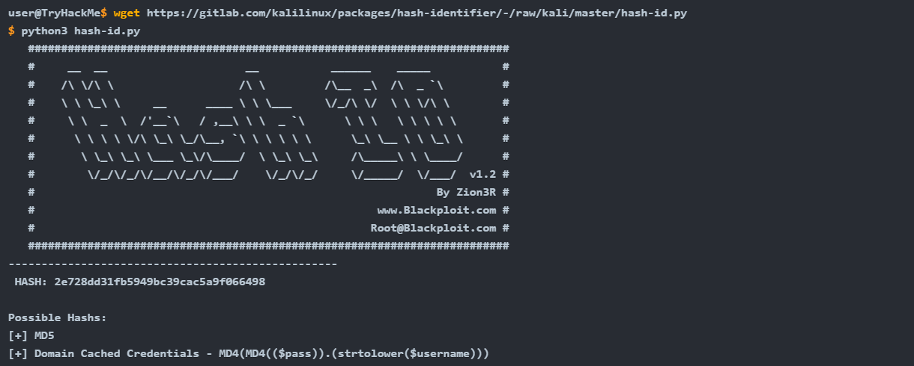
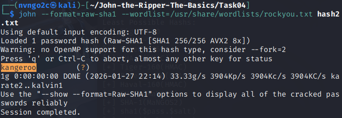
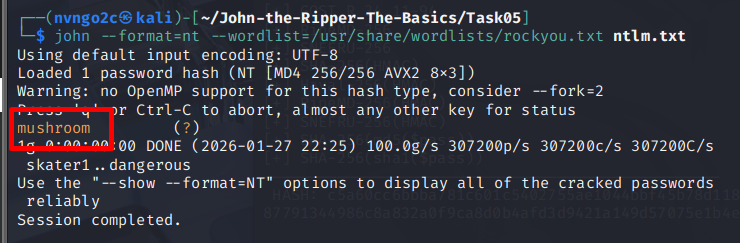
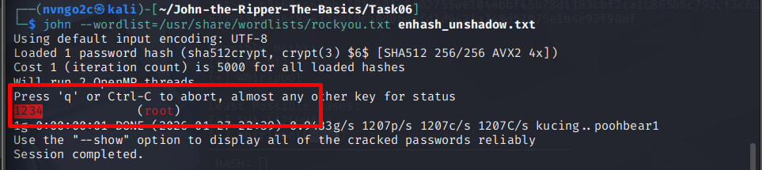
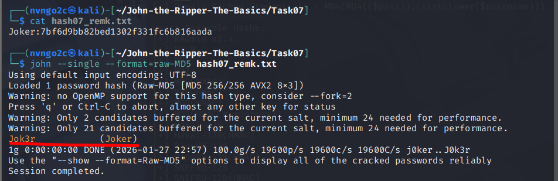

# John the Ripper: The Basics
## 1. Introduction
**John the Ripper** là một công cụ bẻ khóa hash nổi tiếng, được yêu thích và rất đa năng. Nó kết hợp tốc độ bẻ khóa nhanh với phạm vi tương thích với nhiều loại hash khác nhau.

### Mục tiêu
Sau khi hoàn thành căn phòng này, bạn sẽ tìm hiểu về cách sử dụng John cho các mục đích sau:
- Giải mã mã băm xác thực Windows
- Crack `/etc/shadow` hashes
- Giải mã các tệp **Zip** được bảo vệ bằng mật khẩu
- Giải mã các tệp **RAR** được bảo vệ bằng mật khẩu
- Phá khóa **SSH**

## 2. Các thuật ngữ cơ bản
### 1. Hash là gì?
`Hash` là một cách để lấy một đoạn dữ liệu có độ dài bất kỳ và biểu diễn nó dưới dạng một dạng có độ dài cố định khác. Quá trình này che giấu giá trị gốc của dữ liệu. Giá trị băm được thu được bằng cách chạy dữ liệu gốc qua một thuật toán băm. Có nhiều thuật toán băm phổ biến, chẳng hạn như `MD4`, `MD5` , `SHA1` và `NTLM` . Hãy thử minh họa điều này bằng một ví dụ:\
Nếu ta cho một xâu `polo` đi qua hàm hash `MD5`, ta sẽ nhận được kết quả là `b53759f3ce692de7aff1b5779d3964da` (_Đầu ra của MD5 là 32 kí tự_)\
Tương tự, nếu ta lấy `polomints`, một chuỗi gồm `9` ký tự, và chạy nó qua thuật toán băm `MD5` tương tự, ta sẽ nhận được kết quả là một mã băm `MD5584b6e4f4586e136bc280f27f9c64f3b` tiêu chuẩn khác gồm 32 ký tự .

### 2. Điều gì làm cho hàm băm trở nên an toàn?
Các hàm băm được thiết kế như các **hàm một chiều**. Nói cách khác, việc tính toán giá trị băm của một đầu vào nhất định rất dễ dàng; tuy nhiên, việc tìm ra đầu vào gốc khi biết giá trị băm lại là một vấn đề khó khăn. Nói một cách đơn giản, một vấn đề khó khăn nhanh chóng trở nên bất khả thi về mặt tính toán trong khoa học máy tính

### 3. Mục đích của JTR
Mặc dù thuật toán này không thể đảo ngược một cách khả thi, điều đó không có nghĩa là việc giải mã các hàm băm là bất khả thi. Ví dụ, nếu bạn có phiên bản băm của một mật khẩu và bạn biết thuật toán băm, bạn có thể sử dụng thuật toán băm đó để băm một lượng lớn từ, được gọi là từ điển. Sau đó, bạn có thể so sánh các hàm băm này với hàm băm mà bạn đang cố gắng giải mã để xem chúng có khớp nhau hay không. Nếu chúng khớp, bạn biết từ nào tương ứng với hàm băm đó - bạn đã giải mã thành công!

Quá trình này được gọi là `wordlist attack`(_tấn công từ điển_) , và John the Ripper , hay John như thường được viết tắt, là một công cụ để thực hiện các cuộc tấn công vét cạn nhanh chóng vào nhiều loại hàm băm khác nhau.

## 3. Setup hệ thống 
Trong suốt các hoạt động của phòng học này, chúng ta sẽ sử dụng những công cụ sau:
- Phiên bản __Jumbo John__ của John the Ripper
- Danh sách mật khẩu **RockYou**

Jumbo John đã được cài đặt sẵn trên máy ảo được kết nối và trên AttackBox, vì vậy nếu bạn dự định sử dụng một trong hai, bạn không cần thực hiện thêm bất kỳ thao tác nào. Hơn nữa, các bản phân phối Linux tấn công như Kali cũng được cài đặt sẵn Jumbo John.

### 1. Kiểm tra và cài đặt
Bạn có thể kiểm tra lại bằng cách gõ `john` vào terminal. Bạn sẽ thấy hướng dẫn sử dụng cho John, với dòng đầu tiên ghi là “**John the Ripper 1.9.0-jumbo-1**” hoặc tương tự với số phiên bản khác.

Nếu chưa có thì có thể sử dụng lệnh: `sudo apt install john` hoặc `sudo dnf install john`

### 2. Wordlist
Như đã đề cập trước đó, để sử dụng tấn công từ điển chống lại các hàm băm, bạn cần một danh sách các từ để băm và so sánh; không có gì ngạc nhiên khi danh sách này được gọi là **wordlist**. Có rất nhiều danh sách từ khác nhau, và bạn có thể tìm thấy một bộ sưu tập tốt trong kho lưu trữ [SecList](https://github.com/danielmiessler/SecLists) . Có một vài nơi bạn có thể tìm kiếm danh sách từ để tấn công hệ thống đã chọn; chúng ta sẽ nhanh chóng điểm qua nơi bạn có thể tìm thấy chúng.

Trên các bản phân phối AttackBox và `Kali Linux`, `/usr/share/wordlists`  chứa một loạt các `wordlist` tuyệt vời.

`Rockyou`
Đối với tất cả các bài tập trong phòng này, chúng ta sẽ sử dụng _rockyou.txt_ danh sách từ khóa nổi tiếng, một danh sách từ khóa mật khẩu phổ biến rất lớn được lấy từ vụ rò rỉ dữ liệu trên trang web _rockyou.com_  năm 2009. Nếu bạn không sử dụng bất kỳ bản phân phối nào ở trên, bạn có thể lấy danh _rockyou.txt_ sách từ khóa từ kho lưu trữ SecLists trong /`Passwords/Leaked-Databases `phần phụ. Bạn có thể cần trích xuất nó từ .tar.gz định dạng bằng cách sử dụng `tar xvzf rockyou.txt.tar.gz`.

## 4. Crack Hash Basics
Có nhiều cách để sử dụng John the Ripper để bẻ khóa các hàm băm đơn giản. Chúng ta sẽ cùng xem xét một vài cách trước khi tự mình thực hiện việc bẻ khóa một số hàm băm

### 1. Cú pháp cơ bản của John
Cú pháp cơ bản của các lệnh trong John the Ripper như sau. Chúng ta sẽ tìm hiểu các tùy chọn và bổ ngữ cụ thể khi sử dụng chúng.

`john [options] [file path]`
- `john`: Kích hoạt chương trình John the Ripper
- `[options]`: Chỉ định các tùy chọn bạn muốn sử dụng
- `[file path]` là tệp chứa mã băm mà bạn đang cố gắng giải mã

### 2. Auto crack
Có thể dùng JTR để có thể phát hiện thể loại hash:\
`john --wordlist=[path to wordlist] [path to file]`
- `--wordlist=` Chỉ định chế độ đọc từ danh sách từ, đọc nội dung từ tệp do bạn cung cấp trong đường dẫn được chỉ định.
- `[path to wordlist]` Đường dẫn đến danh sách từ bạn đang sử dụng, như đã mô tả trong nhiệm vụ trước đó

_Ví dụ_: `john --wordlist=/usr/share/wordlists/rockyou.txt hash_to_crack.txt`

### 3. Xác định định dạng hash
Đôi khi dùng JTR để kết hợp việc xác định lẫn giải mã có thể sẽ không hoạt động tốt. Ta có thể lựa chọn công cụ khác để xác định định dạng hash rồi sau đó thiết lập thẳng cho JTR để có thể hoạt động tốt nhất có thể\
Có thể định dạng bằng công cụ online: [Hashes.com](https://hashes.com/en/tools/hash_identifier), hoặc một tool có sẵn trong Kali là `hash-indentifier`

Để sử dụng `hash-indentifier` có thể tải từ [Git](https://gitlab.com/kalilinux/packages/hash-identifier/-/raw/kali/master/hash-id.py), sau đó sử dụng bằng `python3 hash-id.py`

### 4. Bẻ khóa theo định dạng cụ thể
Khi bạn đã xác định được mã băm cần xử lý, bạn có thể yêu cầu John sử dụng mã băm đó trong quá trình giải mã bằng cú pháp sau:

`john --format=[format] --wordlist=[path to wordlist] [path to file]`
- `--format=` Đây là tín hiệu để báo cho John biết rằng bạn đang cung cấp cho nó một mã băm có định dạng cụ thể và yêu cầu nó sử dụng định dạng sau để giải mã.
- `[format]`: Định dạng của mã băm
_Ví dụ_: `john --format=raw-md5 --wordlist=/usr/share/wordlists/rockyou.txt hash_to_crack.txt`

Khi bạn yêu cầu John sử dụng các định dạng, nếu bạn đang làm việc với một loại băm chuẩn, ví dụ như  `md5` như trong ví dụ trên, bạn phải thêm tiền tố `raw-` để cho John biết bạn chỉ đang làm việc với một loại băm chuẩn, mặc dù điều này không phải lúc nào cũng áp dụng.\
Để kiểm tra xem bạn có cần thêm tiền tố hay không, bạn có thể liệt kê tất cả các định dạng của John bằng cách sử dụng lệnh `john --list=formats` và kiểm tra thủ công hoặc tìm kiếm loại băm của bạn bằng lệnh tương tự như `john --list=formats | grep -iF "md5"`

## 5. Phá mã băm xác thực Windows
Giờ chúng ta đã hiểu cú pháp và cách sử dụng cơ bản của John the Ripper , hãy chuyển sang giải mã một thứ phức tạp hơn một chút, thứ mà bạn thậm chí có thể muốn thử nếu đang tham gia một cuộc kiểm thử xâm nhập hoặc nhóm tấn công giả lập (Red Team) thực tế. Mã băm xác thực là phiên bản băm của mật khẩu được lưu trữ bởi hệ điều hành; đôi khi có thể giải mã chúng bằng các phương pháp tấn công vét cạn. Để có được những mã băm này, bạn thường phải là người dùng có quyền hạn, vì vậy chúng ta sẽ giải thích một số mã băm mà chúng ta dự định giải mã khi thực hiện chúng.

### 1. NTHash / NTLM
NThash là định dạng băm mà các máy tính chạy hệ điều hành Windows hiện đại sử dụng để lưu trữ mật khẩu người dùng và dịch vụ. Nó cũng thường được gọi là NTLM , ám chỉ phiên bản trước của định dạng băm mật khẩu Windows được gọi là LM, do đó là NT/LM.

Một chút lịch sử: ký hiệu `NT` cho các sản phẩm Windows ban đầu có nghĩa là __New Technology__. Nó được sử dụng bắt đầu từ **Windows NT** để chỉ các sản phẩm không được xây dựng từ hệ điều hành **MS- DOS** . Cuối cùng, dòng "NT" trở thành loại hệ điều hành tiêu chuẩn được Microsoft phát hành, và tên gọi này đã bị loại bỏ, nhưng nó vẫn còn tồn tại trong tên của một số công nghệ của Microsoft.

Trong Windows, `SAM` (_Security Account Manager_) được sử dụng để lưu trữ thông tin tài khoản người dùng, bao gồm tên người dùng và mật khẩu đã được mã hóa. Bạn có thể lấy được mã băm NTHash/ NTLM bằng cách trích xuất cơ sở dữ liệu SAM trên máy tính Windows, sử dụng công cụ như Mimikatz hoặc sử dụng cơ sở dữ liệu Active Directory. `NTDS.dit` Bạn có thể không cần phải bẻ khóa mã băm để tiếp tục leo thang đặc quyền, vì bạn thường có thể thực hiện tấn công "truyền mã băm" thay thế, nhưng đôi khi, bẻ khóa mã băm là một lựa chọn khả thi nếu chính sách mật khẩu yếu.

## 6. Phá mã băm từ `/etc/shadow`
### 1. Giải mã băm từ /etc/shadow
`/etc/shadow` là tệp trên các máy Linux nơi lưu trữ các mã băm mật khẩu. Nó cũng lưu trữ các thông tin khác, chẳng hạn như ngày thay đổi mật khẩu lần cuối và thông tin về thời hạn hết hạn của mật khẩu. Mỗi dòng chứa một mục nhập cho mỗi người dùng hoặc tài khoản người dùng của hệ thống. Tệp này thường chỉ có thể truy cập được bởi người dùng root, vì vậy bạn phải có đủ đặc quyền để truy cập các mã băm. Tuy nhiên, nếu bạn có đủ đặc quyền, bạn có khả năng sẽ giải mã được một số mã băm đó.

### 2. Unshadowing
John rất kén chọn về định dạng dữ liệu cần thiết để có thể làm việc với nó; vì lý do này, để bẻ khóa `/etc/shadow`, bạn phải kết hợp nó với `/etc/passwd` để John có thể hiểu dữ liệu được cung cấp. Để làm điều này, chúng ta sử dụng một công cụ được tích hợp sẵn trong bộ công cụ của John có tên là ` unshadow`. Cú pháp cơ bản của `unshadown` như sau:\
`unshadow [path to passwd] [path to shadow]`
- `[path to passwd]`: bản sao của tệp `/etc/passwd`
- `[path to shadow]`: bản sao của tệp `/etc/shadow`

Ví dụ: `unshadow local_passwd local_shadow > unshadowed.txt`

### 3. Crack
Sau đó, chúng ta có thể đưa trực tiếp đầu ra từ _unshadow_, trong ví dụ sử dụng của chúng ta được gọi là `unshadowed.txt`, vào John. Chúng ta không cần phải chỉ định chế độ ở đây vì chúng ta đã tạo đầu vào dành riêng cho John; tuy nhiên, trong một số trường hợp, bạn sẽ cần chỉ định định dạng như chúng ta đã làm trước đây bằng cách sử dụng: `--format=sha512crypt`

`john --wordlist=/usr/share/wordlists/rockyou.txt --format=sha512crypt unshadowed.txt`

## 7. Single Crack Mode
Cho đến nay, chúng ta đã sử dụng chế độ danh sách từ của John để tấn công vét cạn các hàm băm đơn giản và không quá đơn giản. Nhưng John cũng có một chế độ khác, được gọi là chế độ **Single Crack Mode** . Trong chế độ này, John chỉ sử dụng thông tin được cung cấp trong tên người dùng để cố gắng tìm ra các mật khẩu khả thi bằng cách thay đổi nhẹ các chữ cái và số có trong tên người dùng.

### 1. Word Mangling(_Tạo các biến thể của một từ_)
Hãy xem xét tên người dùng “Markus”.\
Một số mật khẩu khả thi có thể là:
- Markus1, Markus2, Markus3 (etc.)
- MArkus, MARkus, MARKus (etc.) 
- Markus!, Markus$, Markus* (etc.)

Kỹ thuật này được gọi là _biến đổi từ ngữ_ (**word mangling**). John xây dựng từ điển của mình dựa trên thông tin được cung cấp và sử dụng một tập hợp các quy tắc gọi là "_quy tắc biến đổi từ ngữ_", xác định cách nó có thể biến đổi từ ban đầu để tạo ra một danh sách từ dựa trên các yếu tố liên quan đến mục tiêu mà bạn đang cố gắng bẻ khóa. Điều này khai thác điểm yếu của mật khẩu dựa trên thông tin về tên người dùng hoặc dịch vụ mà người dùng đang đăng nhập.

### 2. GECOS
Phương pháp mã hóa từ ngữ của John cũng tương thích với trường GECOS của hệ điều hành UNIX, cũng như các hệ điều hành tương tự UNIX khác như Linux . GECOS là viết tắt của **General Electric Comprehensive Operating System** (_Hệ điều hành toàn diện của General Electric_). Trong bài tập trước, chúng ta đã xem xét các mục nhập cho cả hai trường `/etc/shadow` và `/etc/passwd`. Quan sát kỹ, bạn sẽ nhận thấy rằng các trường được phân tách bằng dấu hai chấm `:`. Trường thứ 5 trong bản ghi tài khoản người dùng là trường `GECOS`. Nó lưu trữ thông tin chung về người dùng, chẳng hạn như họ tên đầy đủ, số văn phòng và số điện thoại, cùng nhiều thông tin khác. John có thể lấy thông tin được lưu trữ trong các bản ghi đó, chẳng hạn như họ tên đầy đủ và tên thư mục chính, để thêm vào danh sách từ mà nó tạo ra khi giải `/etc/shadow` mã băm bằng Single Crack Mode.

### 3. Use Single Crack Mode
Để sử dụng chế độ bẻ khóa đơn lẻ, chúng ta sử dụng cú pháp tương tự như đã sử dụng trước đây; ví dụ, nếu muốn bẻ khóa mật khẩu của người dùng có tên “Mike”, chúng ta sẽ sử dụng:\
`john --single --format=[format] [path to file]`
- `--single` Cờ này báo cho John biết bạn muốn sử dụng chế độ bẻ khóa băm đơn.
- `--format=[format]` Như mọi khi, việc xác định đúng định dạng là vô cùng quan trọng

_Ví dụ_: `john --single --format=raw-sha256 hashes.txt`

*Lưu ý về định dạng tập tin*

Nếu bạn đang bẻ khóa mã băm ở chế độ Single Crack Mode, bạn cần thay đổi định dạng tệp mà bạn cung cấp cho John để nó hiểu dữ liệu nào cần dùng để tạo danh sách từ. Bạn thực hiện điều này bằng cách thêm tên người dùng mà mã băm đó thuộc về vào đầu mã băm, vì vậy theo ví dụ trên, chúng ta sẽ thay đổi tệp `hashes.txt` từ `1efee03cdcb96d90ad48ccc7b8666033` thành `mike:1efee03cdcb96d90ad48ccc7b8666033`

## 8. Custom rules
### 1. Tùy chỉnh quy tắc
Khi chúng ta tìm hiểu những gì John có thể làm ở Chế độ Bẻ khóa Đơn lẻ, bạn có thể đã có một số ý tưởng về các mẫu biến đổi mật khẩu tốt hoặc các mẫu mà mật khẩu của bạn thường sử dụng có thể được sao chép bằng một mẫu biến đổi mật khẩu cụ thể. Tin tốt là bạn có thể định nghĩa các quy tắc của riêng mình, mà John sẽ sử dụng để tạo mật khẩu một cách linh hoạt. Khả năng định nghĩa các quy tắc như vậy rất hữu ích khi bạn biết nhiều thông tin hơn về cấu trúc mật khẩu của mục tiêu mà bạn đang nhắm đến.

### 2. Các quy tắc tùy chỉnh thông thường
Nhiều tổ chức yêu cầu mật khẩu có độ phức tạp nhất định để chống lại các cuộc tấn công bằng từ điển. Nói cách khác, khi tạo tài khoản mới hoặc thay đổi mật khẩu, nếu bạn thử mật khẩu như `polopassword`, rất có thể nó sẽ không hoạt động. Lý do là do yêu cầu về độ phức tạp của mật khẩu. Do đó, bạn có thể nhận được thông báo cho biết mật khẩu phải chứa ít nhất một ký tự từ mỗi nhóm sau:
- Chữ cái viết thường
- Chữ cái viết hoa
- Con số
- Kí tự đặc biệt

Độ phức tạp của mật khẩu là tốt! Tuy nhiên, chúng ta có thể tận dụng thực tế là hầu hết người dùng đều có thể đoán được vị trí của các ký hiệu này. Với các tiêu chí trên, nhiều người dùng sẽ sử dụng mật khẩu kiểu như sau:\
`Polopassword1!`

Hãy xem xét mật khẩu có chữ cái viết hoa đầu tiên, tiếp theo là một số và cuối cùng là một ký hiệu. Mẫu mật khẩu quen thuộc này, được thêm vào trước và sau bởi các ký hiệu (như chữ cái viết hoa hoặc ký hiệu), là một mẫu dễ nhớ mà mọi người thường sử dụng và tái sử dụng khi tạo mật khẩu. Mẫu này cho phép chúng ta khai thác khả năng dự đoán độ phức tạp của mật khẩu.

Điều này đáp ứng được yêu cầu về độ phức tạp của mật khẩu; tuy nhiên, với tư cách là kẻ tấn công, chúng ta có thể lợi dụng việc biết vị trí có khả năng xuất hiện của các yếu tố được thêm vào này để tạo ra mật khẩu động từ danh sách từ của mình.

### 3. Cách tạo quy tắc tùy chỉnh
Các quy tắc tùy chỉnh được định nghĩa trong `john.conf`. Nó thường có đường dẫn `/etc/john/john.conf`

Dòng đầu tiên:

`[List.Rules:THMRules]` Tham số này được dùng để định nghĩa tên của quy tắc; đây là tham số bạn sẽ sử dụng để gọi quy tắc tùy chỉnh của mình là đối số John.

Sau đó, chúng ta sử dụng mẫu khớp kiểu regex để xác định vị trí từ sẽ được sửa đổi; một lần nữa, ở đây chúng ta chỉ đề cập đến các từ sửa đổi chính và phổ biến nhất:
- `Az`: Lấy từ và nối thêm các ký tự bạn định nghĩa vào sau.
- `A0`: Lấy từ và thêm các ký tự bạn định nghĩa vào đầu từ đó.
- `c`: Viết hoa chữ cái theo vị trí

Những công cụ này có thể được sử dụng kết hợp để xác định vị trí và nội dung trong từ mà bạn muốn sửa đổi.

Cuối cùng, chúng ta cần xác định những ký tự nào nên được thêm vào đầu, cuối hoặc bao gồm bằng cách khác. Chúng ta thực hiện điều này bằng cách thêm các nhóm ký tự trong dấu ngoặc vuông `[]` tại những vị trí cần sử dụng. Các nhóm ký tự này tuân theo các mẫu bổ ngữ bên trong dấu ngoặc kép `""`. Dưới đây là một số ví dụ phổ biến:
- `[0-9]` Sẽ bao gồm các số từ 0 đến 9.
- `[0]`: Chỉ bao gồm số 0
- `[A-z]` Sẽ bao gồm cả chữ hoa và chữ thường.
- `[A-Z]`: Chỉ bao gồm các chữ cái viết hoa
- `[a-z]`: Chỉ bao gồm các chữ cái viết thường

Tóm lại, để tạo ra một danh sách từ từ các quy tắc phù hợp với mật khẩu ví `dụ Polopassword1!` (giả sử từ đó `polopassword` có trong danh sách từ của chúng ta), chúng ta sẽ tạo một mục quy tắc có dạng như sau:\
`[List.Rules:PoloPassword]`
`cAz"[0-9] [!£$%@]"`\
- `c` Viết hoa chữ cái đầu tiên
- `Az`: Được thêm vào cuối từ
- `[0-9]` Một số nằm trong khoảng từ 0 đến 9.
- `[!£$%@]` Mật khẩu được theo sau bởi một trong những ký hiệu này.

### 4. Sử dụng
Sau đó, chúng ta có thể gọi quy tắc tùy chỉnh này là một đối số John bằng cách sử dụng  `--rule=PoloPassword` 

Dưới dạng một lệnh đầy đủ: `john --wordlist=[path to wordlist] --rule=PoloPassword [path to file]`

Lưu ý rằng, tôi thấy việc trình bày rõ các mẫu khi viết quy tắc rất hữu ích; như đã nêu ở trên, điều tương tự cũng áp dụng khi viết các mẫu RegEx.

Jumbo John đã có sẵn một danh sách đầy đủ các quy tắc tùy chỉnh chứa các bổ ngữ để sử dụng trong hầu hết mọi trường hợp. Nếu bạn gặp khó khăn, hãy thử xem các quy tắc đó [khoảng dòng 678] nếu cú ​​pháp của bạn không hoạt động chính xác.

## 9. Cracking Password Protected Zip Files(_Phá mật khẩu file ZIP được hash_)
Chúng ta có thể dùng John để phá mật khẩu của các tập tin Zip được bảo vệ bằng mật khẩu. Một lần nữa, chúng ta sẽ sử dụng một phần riêng biệt của bộ công cụ John để chuyển đổi tập tin Zip sang định dạng mà John có thể hiểu được, nhưng về cơ bản chúng ta sẽ sử dụng cú pháp mà bạn đã quen thuộc.

### 1. Zip2John
Tương tự như `unshadow`-công cụ chúng ta đã sử dụng trước đây, chúng ta sẽ sử dụng `zip2john`-công cụ này để chuyển đổi tệp Zip thành định dạng băm mà John có thể hiểu và hy vọng là có thể giải mã. Cách sử dụng chính như sau:\
`zip2john [options] [zip file] > [output file]`
- `[options]` Cho phép bạn truyền các tùy chọn kiểm tra tổng cụ thể zip2john; điều này thường không cần thiết
- `[zip file]` Đường dẫn đến tệp Zip mà bạn muốn lấy mã băm (hash) của tệp đó
- `>` Lệnh này chuyển hướng đầu ra của lệnh này sang một tệp khác
- `[output file]`  là tệp sẽ lưu trữ kết quả đầu ra.

_Ví dụ_: `zip2john zipfile.zip > zip_hash.txt`

### 2. Crack
Sau đó, chúng ta có thể lấy tập tin đầu ra từ `zip2john` ví dụ sử dụng của mình, `zip_hash.txt` và, giống như chúng ta đã làm với `unshadow`, đưa trực tiếp nó vào John vì chúng ta đã tạo đầu vào dành riêng cho nó.

`john --wordlist=/usr/share/wordlists/rockyou.txt zip_hash.txt`

## 10. Cracking Password-Protected RAR Archives(_Phá mật khẩu file RAR được hash_)
## 1. Rar2John
`rar2john [rar file] > [output file]`

## 2. Crack
Một lần nữa, chúng ta có thể lấy tập tin mà chúng ta đã xuất ra `rar2john` trong ví dụ sử dụng của mình, `rar_hash.txt` và đưa trực tiếp vào John như chúng ta đã làm với `zip2john`.

`john --wordlist=/usr/share/wordlists/rockyou.txt rar_hash.txt`

## 11. Crack SSH Password
### 1. Cracking SSH Key Passwords
Được rồi, được rồi, tôi hiểu rồi. Không còn kho lưu trữ tập tin nào nữa! Tốt! Hãy cùng khám phá thêm một công dụng khác của John thường xuất hiện trong các cuộc thi CTF—sử dụng John để bẻ khóa mật khẩu khóa riêng SSH `id_rsa` của các tập tin. Trừ khi được cấu hình khác, bạn xác thực đăng nhập SSH bằng mật khẩu. Tuy nhiên, bạn có thể cấu hình xác thực dựa trên khóa, cho phép bạn sử dụng khóa riêng của mình `id_rsa` làm khóa xác thực để đăng nhập vào máy từ xa qua SSH . Tuy nhiên, việc này thường yêu cầu mật khẩu để truy cập khóa riêng; ở đây, chúng ta sẽ sử dụng John để bẻ khóa mật khẩu này nhằm cho phép xác thực qua SSH bằng khóa đó.

### 2. SSH2John
Công cụ `ssh2john` chuyển đổi `id_rsa` khóa riêng tư, được sử dụng để đăng nhập vào phiên SSH, thành định dạng băm mà John có thể sử dụng. Nói đùa vậy thôi, đây lại là một ví dụ tuyệt vời khác về tính linh hoạt của John. Cú pháp thì khá quen thuộc. Lưu ý rằng nếu bạn chưa `ssh2john` cài đặt, bạn có thể sử dụng `ssh2john.py` (`/usr/share/john/ssh2john.py`)

`ssh2john [id_rsa private key file] > [output file]`

_Ví dụ_: `/usr/share/ssh2john.py id_rsa > id_rsa_hash.txt`