# Metasploit: Introduction
## 1. Introduction to Metasploit
Metasploit là framework khai thác lỗ hổng được sử dụng rộng rãi nhất. Metasploit là một công cụ mạnh mẽ có thể hỗ trợ tất cả các giai đoạn của một hoạt động kiểm thử xâm nhập, từ thu thập thông tin đến hậu khai thác.

Metasploit có hai phiên bản chính:
- **Metasploit Pro** : Phiên bản thương mại giúp tự động hóa và quản lý các tác vụ. Phiên bản này có giao diện người dùng đồ họa ( GUI ).
- **Metasploit Framework** : Phiên bản mã nguồn mở hoạt động từ dòng lệnh. Buổi học này sẽ tập trung vào phiên bản này, được cài đặt trên AttackBox và hầu hết các bản phân phối Linux dùng để kiểm thử xâm nhập .

Metasploit Framework là một bộ công cụ cho phép thu thập thông tin, quét, khai thác, phát triển mã khai thác, xử lý sau khai thác và nhiều hơn nữa. Mặc dù mục đích sử dụng chính của Metasploit Framework tập trung vào lĩnh vực kiểm thử xâm nhập, nó cũng hữu ích cho nghiên cứu lỗ hổng và phát triển mã khai thác.

Các thành phần chính của Metasploit Framework có thể được tóm tắt như sau:
- **msfconsole** : Giao diện dòng lệnh chính.
- **Các mô-đun** : các mô-đun hỗ trợ như công cụ khai thác, công cụ quét, phần mềm độc hại, v.v.
- **Công cụ** : Các công cụ độc lập hỗ trợ nghiên cứu lỗ hổng, đánh giá lỗ  hổng hoặc kiểm thử xâm nhập. Một số công cụ này là msfvenom, pattern_create và pattern_offset. Chúng ta sẽ tìm hiểu về msfvenom trong module này, nhưng pattern_create và pattern_offset là các công cụ hữu ích trong phát triển mã khai thác, điều này nằm ngoài phạm vi của module này.

Khóa học này sẽ giới thiệu các thành phần chính của Metasploit , đồng thời cung cấp cho bạn nền tảng vững chắc về cách tìm kiếm các lỗ hổng bảo mật, thiết lập tham số và khai thác các dịch vụ dễ bị tổn thương trên hệ thống mục tiêu. Sau khi hoàn thành khóa học này, bạn sẽ có thể điều hướng và sử dụng dòng lệnh Metasploit một cách thành thạo.

## 2. Main Components of Metasploit(*Các thành phần chính của Metasploit*)
Khi sử dụng Metasploit Framework, bạn chủ yếu sẽ tương tác với giao diện dòng lệnh Metasploit . Bạn có thể khởi chạy nó từ terminal của AttackBox bằng  `msfconsole` lệnh. Giao diện dòng lệnh sẽ là giao diện chính để bạn tương tác với các mô-đun khác nhau của Metasploit Framework. Mô-đun là các thành phần nhỏ trong Metasploit Framework được xây dựng để thực hiện một nhiệm vụ cụ thể, chẳng hạn như khai thác lỗ hổng, quét mục tiêu hoặc thực hiện tấn công vét cạn.
- **Exploit**: Một đoạn mã sử dụng điểm yếu hiện có trên hệ thống mục tiêu.
- **Vulnerability**: Là lỗi thiết kế, lập trình hoặc logic ảnh hưởng đến hệ thống mục tiêu. Việc khai thác lỗ hổng này có thể dẫn đến việc tiết lộ thông tin mật hoặc cho phép kẻ tấn công thực thi mã trên hệ thống mục tiêu.
- **Payload**: Một cuộc tấn công sẽ khai thác lỗ hổng bảo mật. Tuy nhiên, nếu muốn cuộc tấn công đạt được kết quả mong muốn (truy cập vào hệ thống mục tiêu, đọc thông tin mật, v.v.), chúng ta cần sử dụng payload. Payload - là đoạn mã sẽ được thực thi trên hệ thống mục tiêu.

### 1. Auxiliary (_Phụ trợ_)
Mọi mô-đun hỗ trợ, chẳng hạn như máy quét, trình thu thập dữ liệu và trình kiểm thử lỗi, đều có thể được tìm thấy ở đây.\
Sử dụng `/opt/metasploit-framework/embedded/framework/modules# tree -L 1 auxiliary/` để xem danh sách các phụ trợ
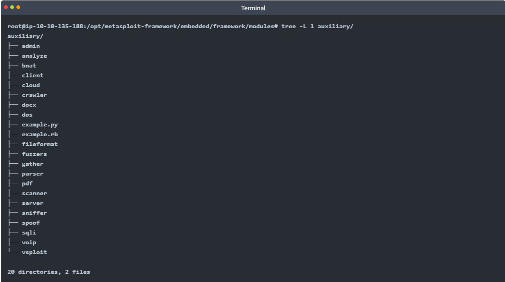

### 2. Encoders
Các công cụ mã hóa sẽ cho phép bạn mã hóa payload với hy vọng rằng có thể bypass được hệ thống AntiVirus.

Các phần mềm AntiVirus dựa trên chữ ký có một cơ sở dữ liệu về các mối đe dọa đã biết. Chúng phát hiện các mối đe dọa bằng cách so sánh các tệp đáng ngờ với cơ sở dữ liệu này và đưa ra cảnh báo nếu có sự trùng khớp. Do đó, các công cụ mã hóa có thể có tỷ lệ thành công hạn chế vì phần mềm AntiVirus có thể thực hiện thêm các kiểm tra khác.
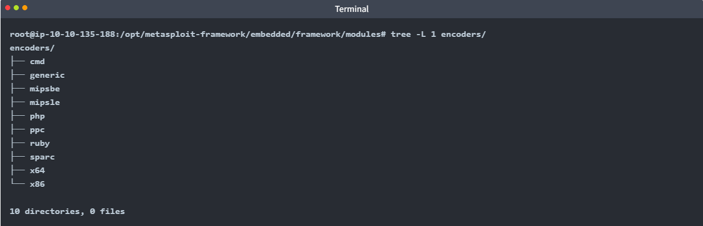

### 3. Evasion(_Ẩn thân_)
Mặc dù các bộ encoder sẽ mã hóa dữ liệu cần mã hóa, nhưng chúng không nên được coi là cách trực tiếp nhằm né tránh phần mềm AntiVirus. Mặt khác, các mô-đun "Evasion" sẽ cố gắng làm điều đó, với mức độ thành công khác nhau.
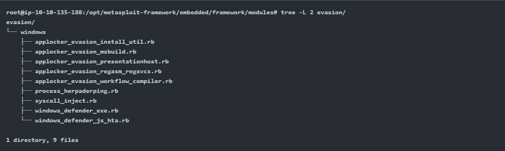

### 4. Exploit
Các lỗ hổng bảo mật được sắp xếp gọn gàng theo hệ thống mục tiêu.
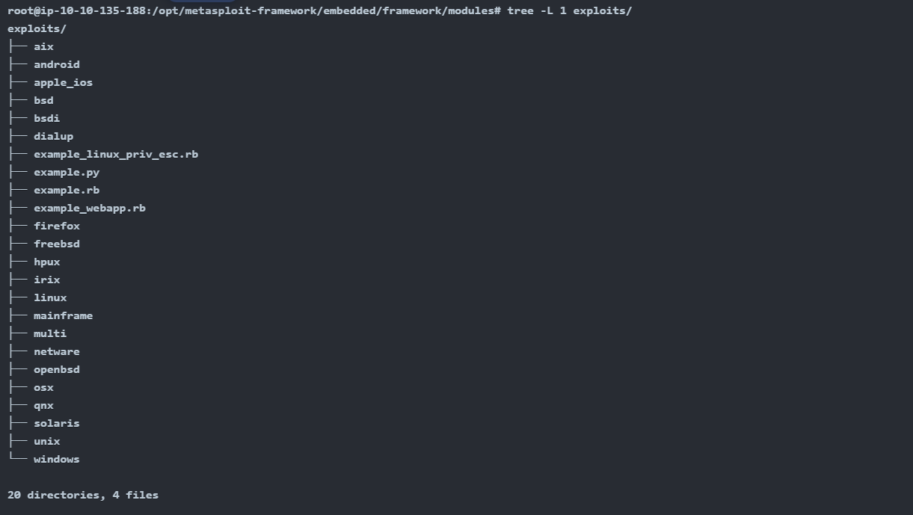

### 5. NOPs
Lệnh NOP (No OPeration) nghĩa là không làm gì cả. Chúng được biểu diễn trong dòng CPU Intel x86 bằng mã 0x90, sau đó CPU sẽ không làm gì trong một chu kỳ. Chúng thường được sử dụng như một bộ đệm để đạt được kích thước dữ liệu nhất quán.
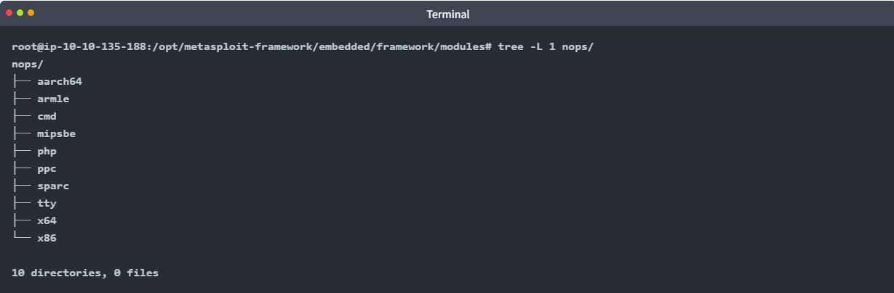

### 6. Payloads
Payload là các đoạn mã sẽ được thực thi trên hệ thống mục tiêu.

Các cuộc tấn công sẽ khai thác lỗ hổng trên hệ thống mục tiêu, nhưng để đạt được kết quả mong muốn, chúng ta cần một payload (tải trọng). Ví dụ như: lấy được shell, tải phần mềm độc hại hoặc backdoor vào hệ thống mục tiêu, chạy một lệnh, hoặc khởi chạy calc.exe như một bằng chứng về khả năng thực thi lệnh để bổ sung vào báo cáo kiểm thử xâm nhập. Khởi động máy tính trên hệ thống mục tiêu từ xa bằng cách chạy ứng dụng calc.exe là một cách vô hại để chứng minh rằng chúng ta có thể chạy các lệnh trên hệ thống mục tiêu.

Việc chạy lệnh trên hệ thống mục tiêu đã là một bước quan trọng, nhưng việc có một kết nối tương tác cho phép bạn nhập các lệnh sẽ được thực thi trên hệ thống mục tiêu thì tốt hơn. Dòng lệnh tương tác như vậy được gọi là "shell". Metasploit cung cấp khả năng gửi các payload khác nhau có thể mở shell trên hệ thống mục tiêu.
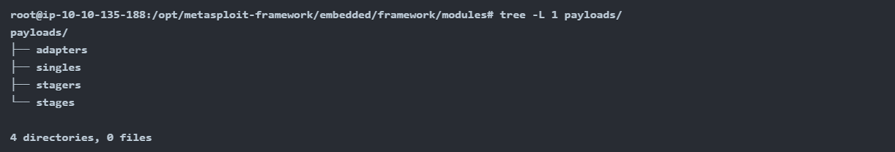

Bạn sẽ thấy bốn thư mục khác nhau bên dưới payloads: adapters, singles, stagers và stages.

- **Adapters**: Bộ chuyển đổi bao bọc các payload đơn lẻ để chuyển đổi chúng thành các định dạng khác nhau. Ví dụ, một payload đơn lẻ thông thường có thể được bao bọc bên trong một bộ chuyển đổi PowerShell, tạo ra một lệnh PowerShell duy nhất để thực thi payload đó.
- **Singles**:  Các gói tin độc lập (thêm người dùng, khởi chạy notepad.exe, v.v.) không cần tải xuống thêm thành phần nào khác để chạy.
- **Stagers**: Chịu trách nhiệm thiết lập kênh kết nối giữa Metasploit và hệ thống mục tiêu. Hữu ích khi làm việc với các Staged payloads. “Staged payloads” sẽ tải lên một stager trên hệ thống mục tiêu trước, sau đó tải xuống phần còn lại của payload (giai đoạn). Điều này mang lại một số lợi thế vì kích thước ban đầu của payload sẽ tương đối nhỏ so với toàn bộ payload được gửi cùng một lúc.
- **Stages**: Được tải xuống bởi trình quản lý giai đoạn. Điều này cho phép bạn sử dụng các gói dữ liệu có kích thước lớn hơn.

Metasploit có một phương pháp tinh tế giúp bạn xác định các payload đơn lẻ (còn gọi là inline) và Staged payloads.
- generic/shell_reverse_tcp
- windows/x64/shell/reverse_tcp

Cả hai đều là các shell đảo ngược của Windows. Cái đầu tiên là một payload nội tuyến (inline), được chỉ ra bởi dấu gạch dưới "_" giữa "shell" và "reverse". Trong khi đó, cái thứ hai là một payload được dàn dựng(_Staged payloads_), được chỉ ra bởi dấu gạch chéo "/" giữa "shell" và "reverse".

### 7. Post
Các mô-đun sau xử lý sẽ hữu ích ở giai đoạn cuối cùng của quy trình kiểm thử xâm nhập được liệt kê ở trên, giai đoạn sau khai thác.
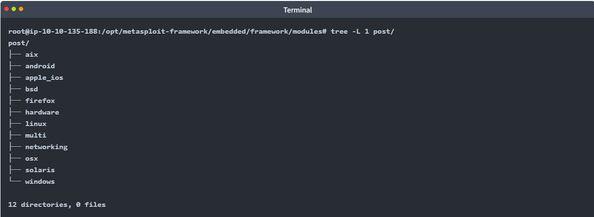
Nếu bạn muốn tìm hiểu thêm về các mô-đun này, bạn có thể tìm thấy chúng trong thư mục modules của bản cài đặt Metasploit . Đối với AttackBox, chúng nằm trong `/opt/ metasploit -framework/embedded/framework/modules`

## 3. Msfconsole
Như đã đề cập trước đó, giao diện dòng lệnh sẽ là giao diện chính của bạn với Metasploit Framework. Bạn có thể khởi chạy nó bằng `msfconsole` trên terminal AttackBox hoặc bất kỳ hệ thống nào đã cài đặt Metasploit Framework.
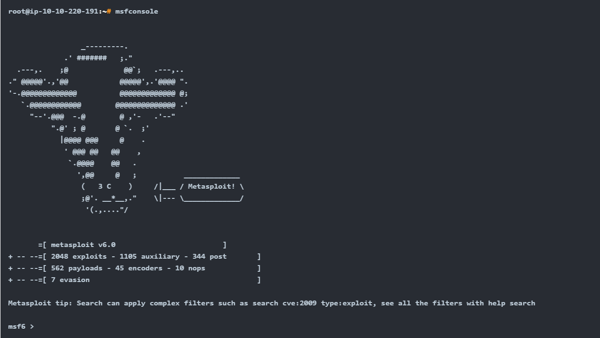

Sau khi khởi chạy, bạn sẽ thấy dòng lệnh thay đổi thành msf6 (hoặc msf5 tùy thuộc vào phiên bản Metasploit đã cài đặt ). Bảng điều khiển Metasploit (msfconsole) có thể được sử dụng giống như một trình shell dòng lệnh thông thường, như bạn có thể thấy bên dưới. Lệnh đầu tiên là `ls` lệnh liệt kê nội dung của thư mục mà từ đó Metasploit được khởi chạy bằng `msfconsole`.

Tiếp theo đó là một lệnh ping `ping` được gửi đến địa chỉ IP DNS của Google (8.8.8.8). Vì chúng tôi vận hành trên AttackBox, một hệ điều hành Linux, nên chúng tôi phải thêm `-c 1` tùy chọn này để chỉ gửi một lệnh ping duy nhất. Nếu không, quá trình ping sẽ tiếp tục cho đến khi bị dừng lại bằng lệnh `CTRL+C`.
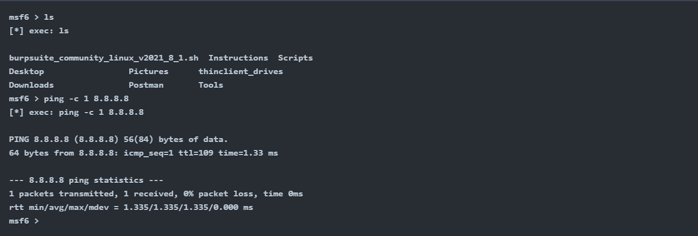

Nó sẽ hỗ trợ hầu hết các lệnh Linux , bao gồm cả `clear` lệnh (xóa màn hình terminal), nhưng sẽ không cho phép bạn sử dụng một số tính năng của dòng lệnh thông thường (ví dụ: không hỗ trợ chuyển hướng đầu ra), như được thấy bên dưới.
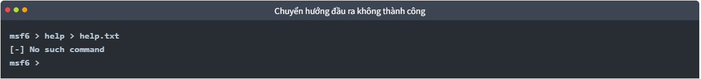

Nhân tiện nói về vấn đề này, lệnh trợ giúp có thể được sử dụng riêng lẻ hoặc cho một lệnh cụ thể. Dưới đây là menu trợ giúp cho lệnh `set` mà chúng ta sẽ tìm hiểu sau.

Bạn có thể sử dụng lệnh history để xem các lệnh bạn đã nhập trước đó.
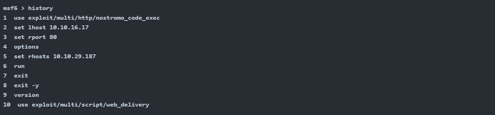

Một tính năng quan trọng của msfconsole là hỗ trợ tự động hoàn thành bằng phím Tab. Điều này sẽ rất hữu ích sau này khi sử dụng các lệnh Metasploit hoặc làm việc với các module. Ví dụ, nếu bạn bắt đầu gõ `he` và nhấn phím Tab, bạn sẽ thấy nó tự động hoàn thành thành `help`.

Một tính năng quan trọng của msfconsole là hỗ trợ tự động hoàn thành bằng phím Tab. Điều này sẽ rất hữu ích sau này khi sử dụng các lệnh Metasploit hoặc làm việc với các module. Ví dụ, nếu bạn bắt đầu gõ he và nhấn phím Tab, bạn sẽ thấy nó tự động hoàn thành thành help.

Hãy xem ví dụ dưới đây để hiểu rõ hơn về tính năng này. Chúng ta sẽ sử dụng lỗ hổng bảo mật `MS17-010 “Eternalblue”` để minh họa.

Sau khi gõ `use exploit/windows/smb/ms17_010_eternalblue` lệnh, bạn sẽ thấy dấu nhắc lệnh thay đổi từ `msf6` thành `msf6 exploit(windows/ smb /ms17_010_eternalblue)`. “EternalBlue” là một lỗ hổng được cho là do Cơ quan An ninh Quốc gia Hoa Kỳ (NSA) phát triển để khai thác điểm yếu ảnh hưởng đến máy chủ SMBv1 trên nhiều hệ thống Windows. SMB (Server Message Block) được sử dụng rộng rãi trong mạng Windows để chia sẻ tệp và thậm chí gửi tệp đến máy in. EternalBlue bị rò rỉ bởi nhóm tội phạm mạng “Shadow Brokers” vào tháng 4 năm 2017. Vào tháng 5 năm 2017, lỗ hổng này đã bị khai thác trên toàn thế giới trong cuộc tấn công ransomware WannaCry.
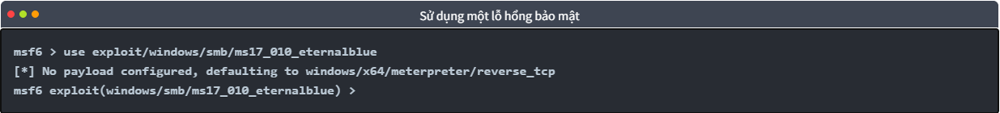

Bạn cũng có thể chọn mô-đun cần sử dụng bằng `use`, theo sau là số ở đầu dòng kết quả tìm kiếm.

Mặc dù dấu nhắc lệnh đã thay đổi, bạn sẽ nhận thấy chúng ta vẫn có thể chạy các lệnh đã đề cập trước đó. Điều này có nghĩa là chúng ta không "vào" một thư mục như bạn thường thấy trong dòng lệnh của hệ điều hành.
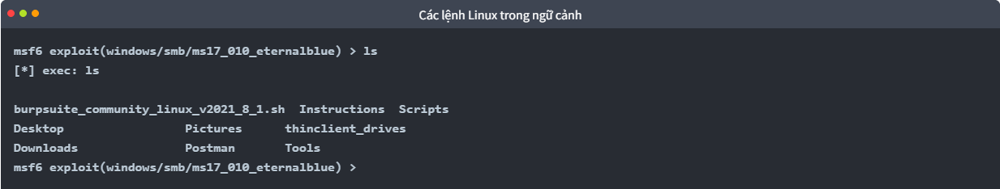

Thông báo cho chúng ta biết rằng hiện tại chúng ta đã thiết lập được ngữ cảnh làm việc. Bạn có thể xem điều này bằng cách gõ lệnh `show options`.
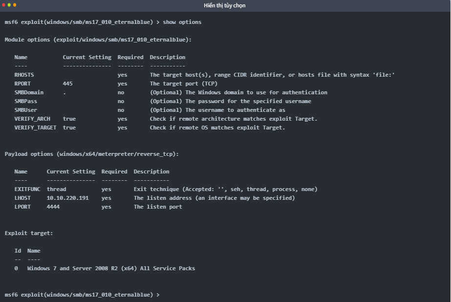

Lệnh này sẽ in ra các tùy chọn liên quan đến lỗ hổng mà chúng ta đã chọn trước đó. Lệnh `show options` sẽ cho ra các kết quả khác nhau tùy thuộc vào ngữ cảnh sử dụng. Ví dụ trên cho thấy lỗ hổng này sẽ yêu cầu chúng ta thiết lập các biến như RHOSTS và RPORT. Mặt khác, một mô-đun hậu khai thác có thể chỉ cần chúng ta thiết lập ID phiên (xem ảnh chụp màn hình bên dưới). Phiên là một kết nối hiện có đến hệ thống mục tiêu mà mô-đun hậu khai thác sẽ sử dụng.
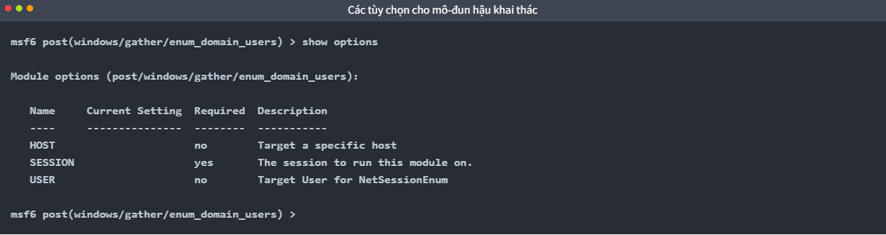

Lệnh `show` có thể được sử dụng trong bất kỳ ngữ cảnh nào, theo sau là loại mô-đun (phụ trợ, tải trọng, khai thác, v.v.) để liệt kê các mô-đun có sẵn. Ví dụ dưới đây liệt kê các payload có thể được sử dụng với lỗ hổng khai thác ms17-010 Eternalblue.
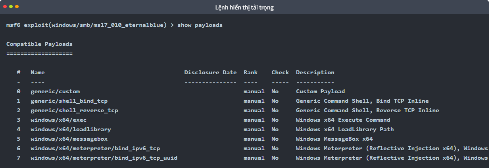

Nếu sử dụng lệnh này từ dấu nhắc msfconsole, nó sẽ liệt kê tất cả các mô-đun.

Các lệnh `use` mà `show options` chúng ta đã thấy cho đến nay đều giống hệt nhau đối với tất cả các mô-đun trong Metasploit.

Bạn có thể thoát bằng `back` 
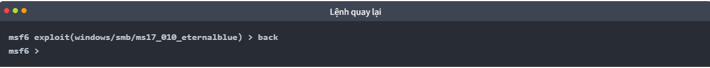

Bạn có thể tìm thêm thông tin về bất kỳ mô-đun nào bằng lệnh `info` trong ngữ cảnh của nó.
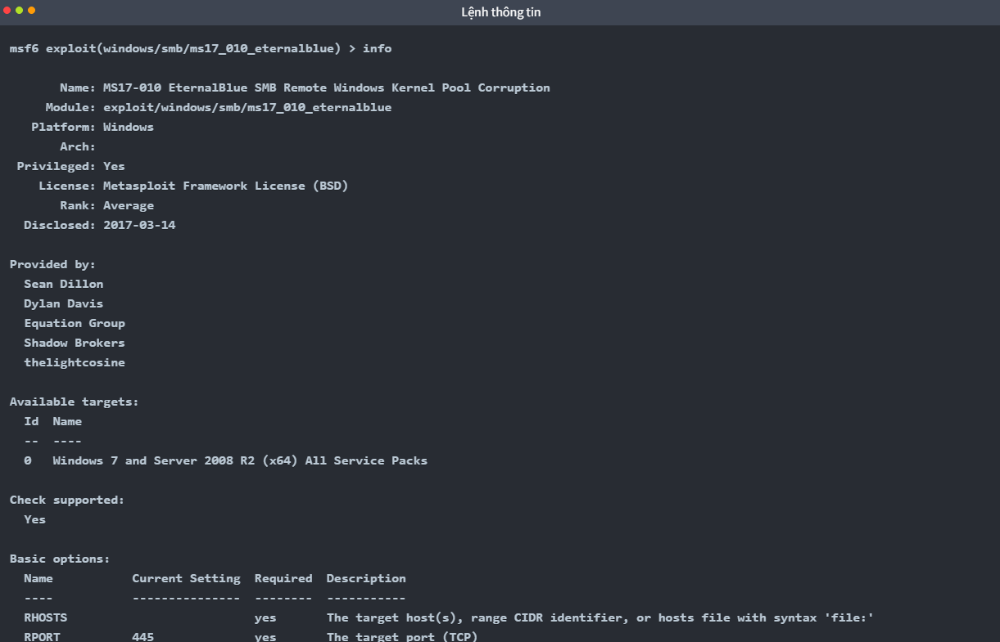

Ngoài ra, bạn cũng có thể sử dụng `info` theo sau là đường dẫn của mô-đun từ dấu nhắc msfconsole (ví dụ: `info exploit/windows/smb/ms17_010_eternalblue`). *Info không phải là menu trợ giúp*; nó sẽ hiển thị thông tin chi tiết về mô-đun như tác giả, nguồn liên quan, v.v.

### Search
Một trong những lệnh hữu ích nhất trong msfconsole là `search`. Lệnh này sẽ tìm kiếm trong cơ sở dữ liệu Metasploit Framework các mô-đun liên quan đến tham số tìm kiếm đã cho. Bạn có thể thực hiện tìm kiếm bằng số CVE, tên khai thác (eternalblue, heartbleed, v.v.) hoặc hệ thống mục tiêu.
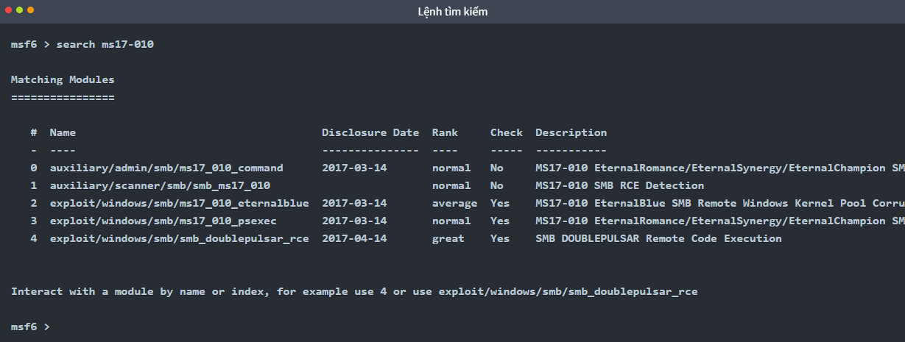

Kết quả đầu ra của `search` cung cấp tổng quan về từng mô-đun được trả về. Bạn có thể nhận thấy cột "name" đã cung cấp nhiều thông tin hơn là chỉ tên mô-đun. Bạn có thể thấy loại mô-đun (phụ trợ, khai thác, v.v.) và danh mục của mô-đun (trình quét, quản trị, Windows, Unix, v.v.). Bạn có thể sử dụng bất kỳ mô-đun nào được trả về trong kết quả tìm kiếm bằng lệnh `use` theo sau là số ở đầu dòng kết quả. (ví dụ: `use 0` thay vì `use auxiliary/admin/smb/ms17_010_command`)

Một thông tin quan trọng khác được trả về nằm ở cột “xếp hạng”. Các lỗ hổng bảo mật được đánh giá dựa trên độ tin cậy của chúng. Bảng dưới đây cung cấp mô tả tương ứng.

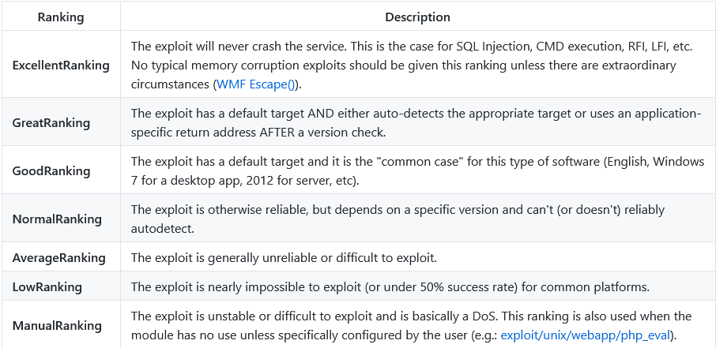

Nguồn: [tại đây](https://github.com/rapid7/metasploit-framework/wiki/Exploit-Ranking)

Bạn có thể điều chỉnh chức năng tìm kiếm bằng cách sử dụng các từ khóa như loại và nền tảng.

Ví dụ, nếu chúng ta muốn kết quả tìm kiếm chỉ bao gồm các mô-đun phụ trợ, chúng ta có thể đặt loại là auxiliary. Ảnh chụp màn hình bên dưới hiển thị kết quả của lệnh `search type:auxiliary telnet`
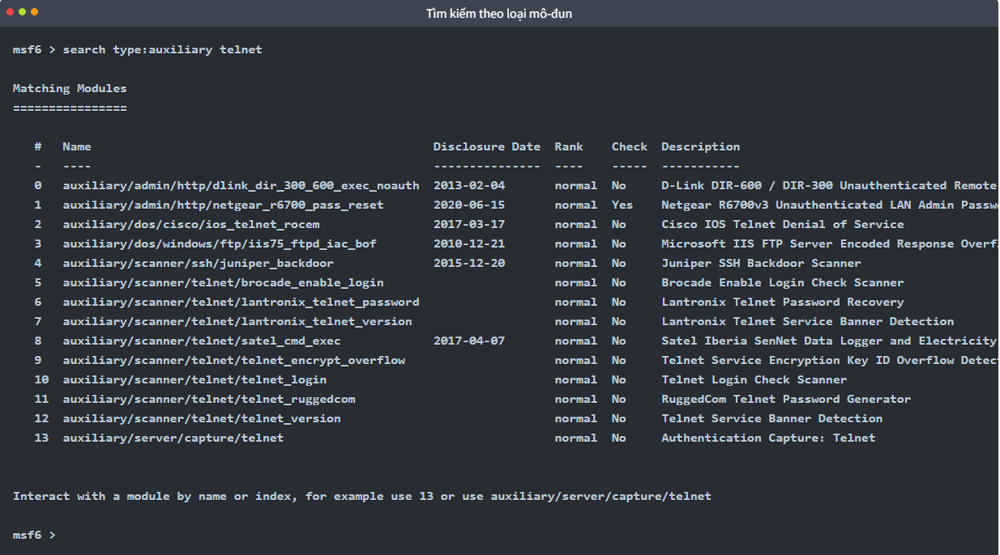

Hãy nhớ rằng các cuộc tấn công khai thác lỗ hổng trên hệ thống mục tiêu và luôn có thể thể hiện hành vi không mong muốn. Một cuộc tấn công có xếp hạng thấp có thể hoạt động hoàn hảo, trong khi một cuộc tấn công có xếp hạng xuất sắc có thể không hoạt động, hoặc tệ hơn là làm sập hệ thống mục tiêu.

## 4. Working with modules
Bạn có thể khởi chạy máy mục tiêu được kết nối với phòng này để tái tạo các ví dụ được hiển thị bên dưới. Bất kỳ phiên bản Metasploit 5 hoặc 6 nào cũng sẽ có các menu và màn hình tương tự như những hình ảnh được hiển thị ở đây, vì vậy bạn có thể sử dụng AttackBox hoặc bất kỳ hệ điều hành nào được cài đặt trên máy tính cục bộ của mình.

Sau khi bạn đã vào được ngữ cảnh của một mô-đun bằng cách sử dụng `use`  theo sau là tên mô-đun, như đã thấy trước đó, bạn cần thiết lập các tham số. Các tham số phổ biến nhất mà bạn sẽ sử dụng được liệt kê bên dưới. Hãy nhớ rằng, tùy thuộc vào mô-đun bạn sử dụng, có thể cần phải thiết lập thêm hoặc các tham số khác. Tốt nhất nên sử dụng lệnh `show options` để liệt kê các tham số cần thiết.

Tất cả các tham số đều được thiết lập bằng cùng một cú pháp lệnh:
`set PARAMETER_NAME VALUE`

Trước khi tiếp tục, hãy nhớ luôn kiểm tra dấu nhắc msfconsole để đảm bảo bạn đang ở đúng ngữ cảnh. Khi làm việc với Metasploit, bạn có thể thấy `5` dấu nhắc khác nhau:

- **Cửa sổ dòng lệnh thông thường**: Bạn không thể sử dụng các lệnh Metasploit ở đây.
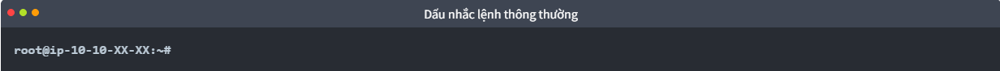

- **Dấu nhắc msfconsole**: `msf6` (hoặc `msf5` tùy thuộc vào phiên bản bạn đã cài đặt) là dấu nhắc msfconsole. Như bạn thấy, không có ngữ cảnh nào được thiết lập ở đây, vì vậy các lệnh cụ thể theo ngữ cảnh để thiết lập tham số và chạy mô-đun không thể được sử dụng ở đây.
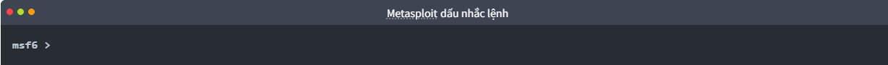

- Lời nhắc ngữ cảnh: Sau khi bạn đã quyết định sử dụng một mô-đun và sử dụng lệnh để chọn nó, msfconsole sẽ hiển thị ngữ cảnh. Bạn có thể sử dụng các lệnh cụ thể theo ngữ cảnh (ví dụ: `set RHOSTS 10.10.xx`) tại đây.
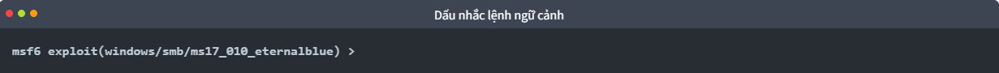

- `Dấu nhắc Meterpreter`: Meterpreter là một payload quan trọng mà chúng ta sẽ xem xét chi tiết hơn sau trong module này. Điều này có nghĩa là một agent Meterpreter đã được tải lên hệ thống mục tiêu và kết nối trở lại với bạn. Bạn có thể sử dụng các lệnh dành riêng cho Meterpreter tại đây.
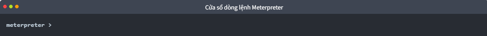

- `Giao diện dòng lệnh trên hệ thống mục tiêu`: Sau khi quá trình khai thác hoàn tất, bạn có thể truy cập vào giao diện dòng lệnh trên hệ thống mục tiêu. Đây là một dòng lệnh thông thường, và tất cả các lệnh được gõ vào đây sẽ được thực thi trên hệ thống mục tiêu.

Như đã đề cập trước đó,  `show options` - lệnh này sẽ liệt kê tất cả các tham số có sẵn.
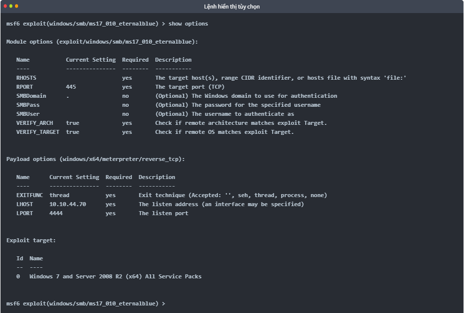

Như bạn có thể thấy trong ảnh chụp màn hình ở trên, một số tham số này yêu cầu giá trị để lỗ hổng hoạt động. Một số giá trị tham số bắt buộc sẽ được điền sẵn, hãy đảm bảo bạn kiểm tra xem các giá trị này có nên giữ nguyên cho mục tiêu của mình hay không. Ví dụ, một lỗ hổng web có thể có giá trị RPORT (cổng từ xa: cổng trên hệ thống mục tiêu mà Metasploit sẽ cố gắng kết nối và chạy lỗ hổng) được đặt trước là 80, nhưng ứng dụng web mục tiêu của bạn có thể đang sử dụng cổng 8080.

Trong ví dụ này, chúng ta sẽ thiết lập tham số RHOSTS thành địa chỉ IP của hệ thống mục tiêu bằng `set`
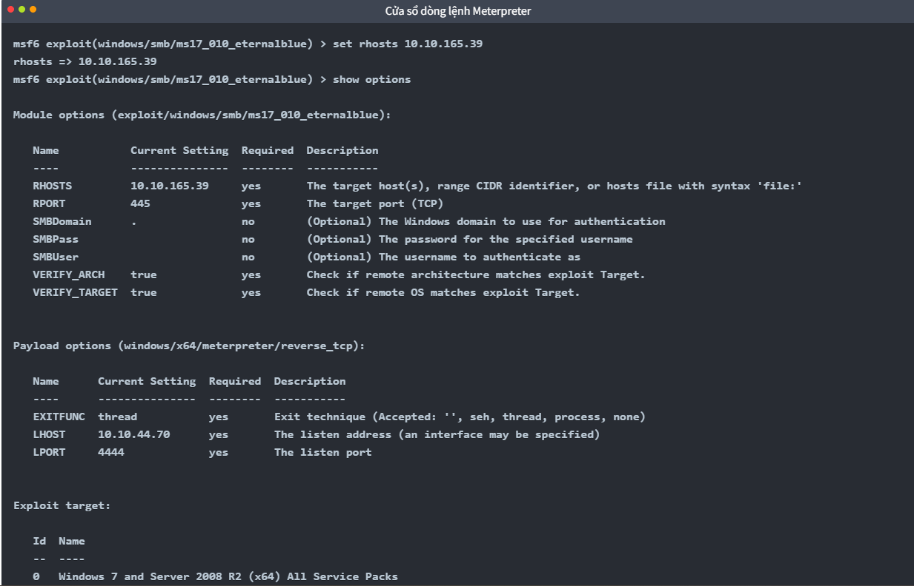

Sau khi đã thiết lập tham số, bạn có thể sử dụng `show options` - lệnh để kiểm tra xem giá trị đã được thiết lập chính xác hay chưa.

Các tham số bạn thường sẽ sử dụng là:

- `RHOSTS`: “Máy chủ từ xa”, địa chỉ IP của hệ thống mục tiêu. Có thể thiết lập một địa chỉ IP duy nhất hoặc một dải địa chỉ mạng. Điều này sẽ hỗ trợ ký hiệu CIDR (Định tuyến liên miền không phân lớp) (/24, /16, v.v.) hoặc một dải địa chỉ mạng (10.10.10.x – 10.10.10.y). Bạn cũng có thể sử dụng một tệp liệt kê các mục tiêu, mỗi mục tiêu trên một dòng bằng cách sử dụng `file:/path/of/the/target_file.txt`, như bạn có thể thấy bên dưới.
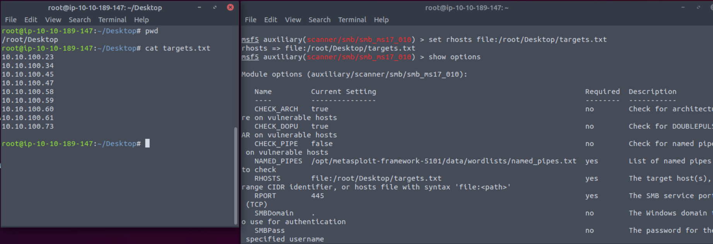
- **RPORT**: “Cổng từ xa”, là cổng trên hệ thống mục tiêu nơi ứng dụng có lỗ hổng đang chạy.
- **PAYLOAD**: Payload bạn sẽ sử dụng với lỗ hổng bảo mật.
- **LHOST**: “Localhost”, địa chỉ IP của máy tấn công (AttackBox hoặc Kali Linux của bạn).
- **LHOST**: “Localhost”, địa chỉ IP của máy tấn công (AttackBox hoặc Kali Linux của bạn).
- **Session**: Mỗi kết nối được thiết lập đến hệ thống mục tiêu bằng Metasploit sẽ có một ID phiên. Bạn sẽ sử dụng ID này với các mô-đun hậu khai thác để kết nối đến hệ thống mục tiêu bằng cách sử dụng kết nối hiện có.

Có thể ghi đè bất kì tham số nào bằng cách nhập lại lệnh `set` hoặc có thể xóa giá trị của một tham số nào đó bằng `unset` hoặc có thể reset lại giá trị của tất cả các tham số bằng `unset all`
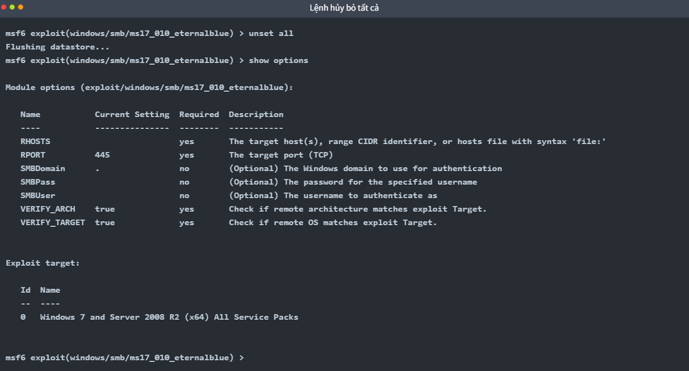

Lệnh setg là cách thiết lập giá trị toàn cục (mặc định cho tất cả các mô-đun).

Sự khác biệt: Nếu bạn dùng `set`, giá trị đó chỉ có hiệu lực trong mô-đun hiện tại; khi bạn chuyển sang mô-đun mới, bạn sẽ phải nhập lại từ đầu. Trong khi đó, `setg` giúp bạn "lưu nhớ" giá trị đó xuyên suốt toàn bộ phiên làm việc, dù bạn có đổi bao nhiêu mô-đun đi chăng nữa.
- Cách sử dụng: Sử dụng tương tự lệnh `set`.
- Cách xóa: Để hủy bỏ một giá trị toàn cục, bạn sử dụng lệnh `unsetg`

Quy trình:
- Chúng tôi sử dụng lỗ hổng bảo mật `ms17_010_eternalblue`.
- Chúng ta thiết lập biến `RHOSTS` bằng `setg` lệnh thay vì lệnh `set`.
- Chúng ta sử dụng `back` lệnh này để thoát khỏi ngữ cảnh khai thác.
- Chúng tôi sử dụng một mô-đun phụ trợ (mô-đun này là một máy quét để phát hiện các lỗ hổng **MS17-010**)
- Lệnh `show options` cho thấy tham số `RHOSTS` đã được điền sẵn địa chỉ IP của hệ thống mục tiêu.
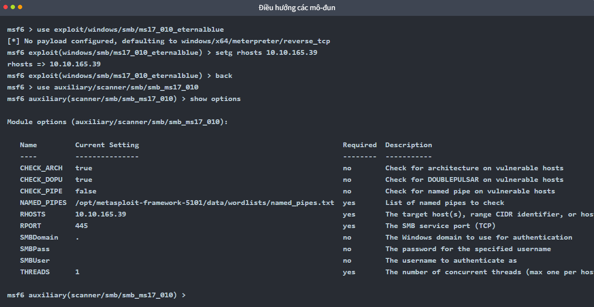

Lệnh này `setg` thiết lập một giá trị toàn cục sẽ được sử dụng cho đến khi bạn thoát khỏi Metasploit hoặc xóa nó bằng `unsetg` lệnh tương ứng.

### Using modules
Về mặt kỹ thuật, hai lệnh này có chức năng hoàn toàn giống nhau trong Metasploit.
- `exploit`: Thường được dùng cho các mô-đun tấn công (Exploits) nhằm chiếm quyền điều khiển.
- `run`: Là một "bí danh" (alias) của lệnh `exploit`. Người dùng thường dùng run khi làm việc với các mô-đun hỗ trợ như máy quét cổng hoặc máy quét lỗ hổng (Auxiliary) vì từ "exploit" (khai thác) nghe không phù hợp trong ngữ cảnh chỉ là đi thăm dò.

Thông thường, khi một cuộc tấn công thành công, Metasploit sẽ tự động đưa bạn vào giao diện điều khiển của máy nạn nhân (ví dụ: vào thẳng Meterpreter shell). Tuy nhiên, tham số `-z` sẽ thay đổi hành vi này:

`exploit -z`: Chạy mã khai thác nhưng sẽ đưa phiên làm việc (session) vào chế độ nền (background) ngay khi nó vừa được mở. Bạn sẽ không bị nhảy thẳng vào máy nạn nhân mà vẫn đứng ở giao diện msfconsole
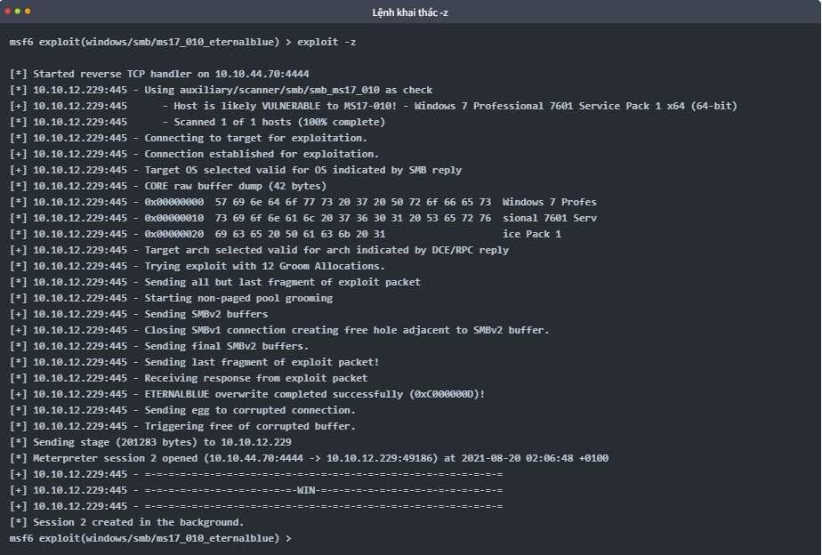

### Sessions
Sau khi lỗ hổng được khai thác thành công, một phiên làm việc sẽ được tạo ra. Đây là kênh liên lạc được thiết lập giữa hệ thống mục tiêu và Metasploit.

Bạn có thể sử dụng `background` - lệnh này để đưa cửa sổ nhắc lệnh phiên làm việc về chế độ nền và quay lại cửa sổ nhắc lệnh msfconsole.
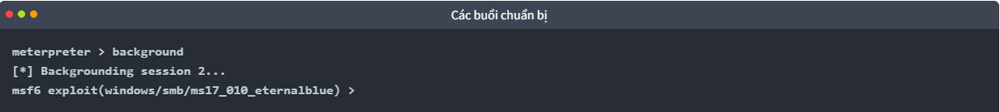

Ngoài ra,  `CTRL+Z` cũng có thể được sử dụng cho các phiên chạy ngầm.

Lệnh `sessions` có thể được sử dụng từ dấu nhắc msfconsole hoặc bất kỳ ngữ cảnh nào để xem các phiên hiện có.
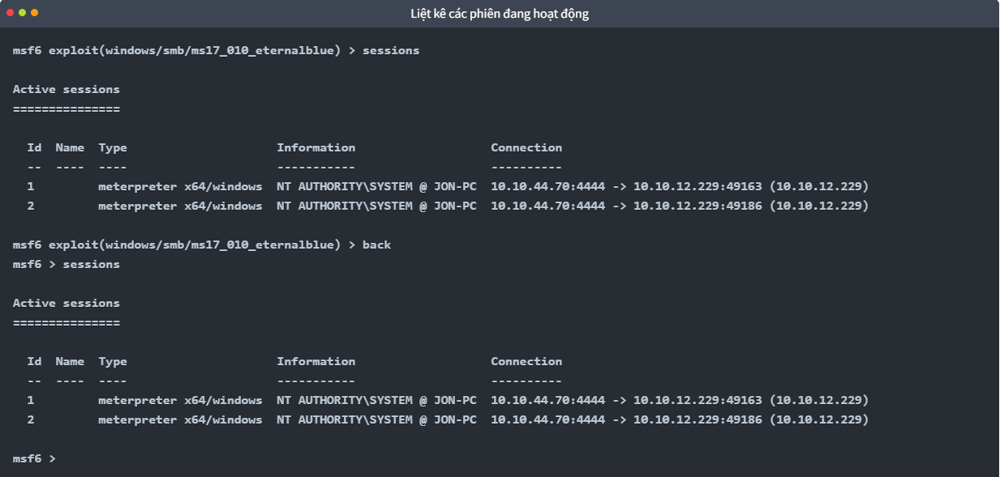

Để tương tác với bất kỳ phiên nào, bạn có thể sử dụng `sessions -i`, lệnh theo sau là số phiên mong muốn.
