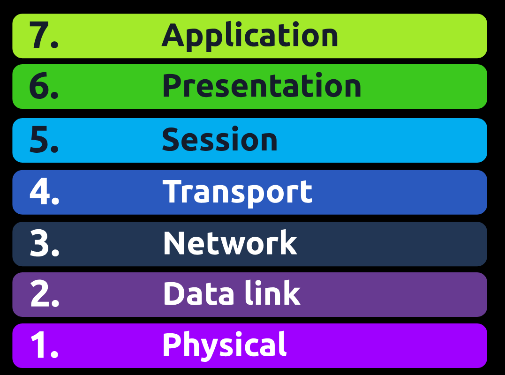
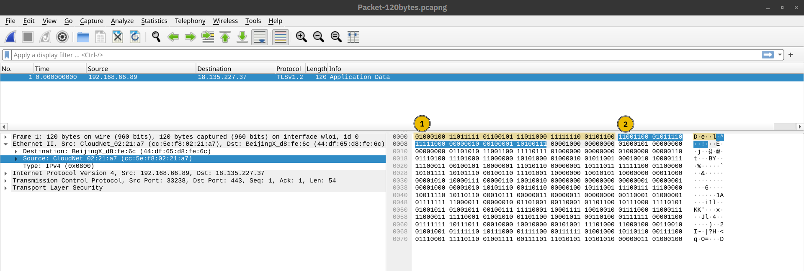
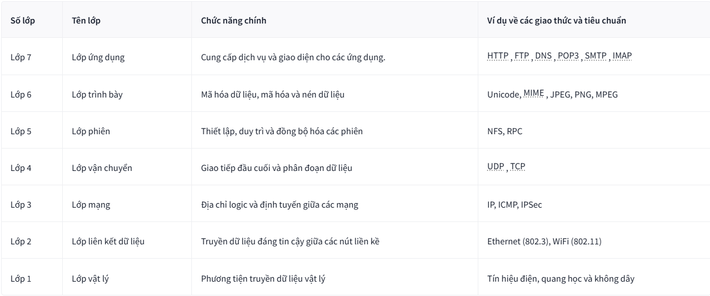
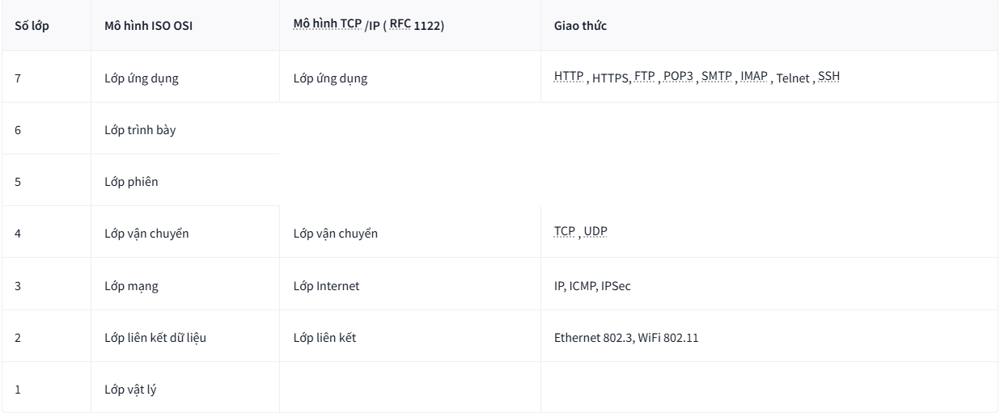
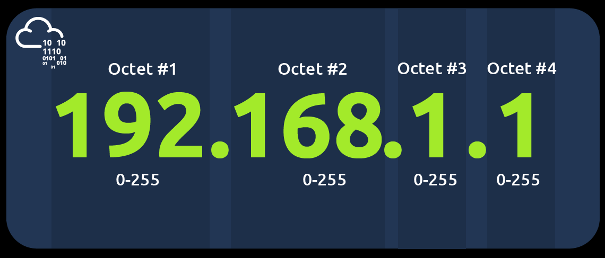
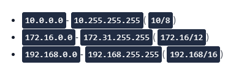
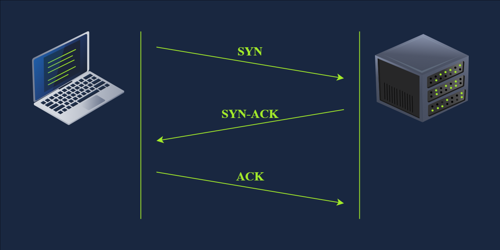

# Networking Concepts
## 1. Introduction
### MỤC TIÊU
Khi hoàn thành căn phòng này, bạn sẽ học được những điều sau:
- _Mô hình mạng ISO OSI_
- _Địa chỉ IP, mạng con và định tuyến_
- _TCP , UDP và số cổng_
- _Cách kết nối đến một cổng TCP đang mở từ dòng lệnh_
## 2. OSI Model
Mô hình `OSI` (_Open Systems Interconnection_) là một mô hình khái niệm được phát triển bởi __Tổ chức Tiêu chuẩn hóa Quốc tế__ (_ISO_) mô tả cách thức giao tiếp trong mạng máy tính. Nói cách khác, mô hình `OSI` định nghĩa một khuôn khổ cho giao tiếp mạng máy tính. Mặc dù mô hình này _mang tính lý thuyết_, nhưng việc học và hiểu nó rất quan trọng vì nó giúp nắm bắt các khái niệm mạng ở mức độ sâu sắc hơn. Mô hình `OSI` bao gồm `7` tầng:
1. Tầng vật lý
2. Tầng liên kết dữ liệu
3. Tầng mạng
4. Tầng vận chuyển
5. Tầng phiên
6. Tầng trình bày
7. Tầng ứng dụng

### 1. Tầng vật lý
_Tầng vật lý_, hay còn gọi là _Tầng 1_, xử lý kết nối vật lý giữa các thiết bị; điều này bao gồm phương tiện truyền dẫn, chẳng hạn như _dây dẫn, và định nghĩa của các chữ số nhị phân __0__ và **1**_. Việc truyền dữ liệu có thể được thực hiện thông qua tín hiệu điện, quang học hoặc không dây. Do đó, chúng ta cần cáp dữ liệu hoặc ăng-ten, tùy thuộc vào phương tiện vật lý mà chúng ta sử dụng.

Ngoài cáp _Ethernet_, như minh họa bên dưới, và cáp quang, các ví dụ về phương tiện Tầng vật lý bao gồm các băng tần vô tuyến _WiFi_, băng tần `2.4 GHz`, băng tần `5 GHz` và băng tần `6 GHz`.

### 2. Tầng liên kết dữ liệu
_Tầng vật lý_ định nghĩa phương tiện để truyền tín hiệu. _Tầng liên kết dữ liệu_, tức là _Tầng 2_, đại diện cho giao thức cho phép __truyền dữ liệu giữa__ các nút trên cùng một phân đoạn mạng. Nói một cách đơn giản hơn, _Tầng liên kết dữ liệu_ mô tả một thỏa thuận giữa các hệ thống khác nhau trên cùng một phân đoạn mạng về cách thức giao tiếp. Một phân đoạn mạng đề cập đến một nhóm các thiết bị được kết nối mạng sử dụng một phương tiện hoặc kênh dùng chung để truyền thông tin. Ví dụ, _hãy xem xét một văn phòng công ty với mười máy tính được kết nối với một bộ chuyển mạch mạng; đó là một phân đoạn mạng_.

Ví dụ về Tầng 2 bao gồm _Ethernet_, tức là `802.3`, và `WiFi`, tức là `802.11`. Địa chỉ _Ethernet_ và `WiFi` có `6` byte. Địa chỉ của chúng được gọi là địa chỉ `MAC`, trong đó `MAC` viết tắt của _Media Access Control_ (Kiểm soát truy cập phương tiện). Chúng thường được biểu thị ở định dạng _thập lục phân_ với dấu hai chấm phân tách mỗi hai chữ số thập lục phân (một byte). _Ba byte bên trái nhất xác định nhà cung cấp_.

Trong giao tiếp mạng thực tế qua `Ethernet` hoặc `WiFi`, chúng ta thường thấy `2` địa chỉ `MAC` trong mỗi khung dữ liệu. Gói dữ liệu trong ảnh chụp màn hình bên dưới cho thấy điều đó:
- Địa chỉ liên kết dữ liệu đích (địa chỉ MAC) được tô sáng __màu vàng__.
- Địa chỉ liên kết dữ liệu nguồn (địa chỉ MAC) được tô sáng __màu xanh lam__.
- Các phần còn lại hiển thị dữ liệu đang được gửi đi.

### 3. Tầng mạng
Lớp liên kết dữ liệu tập trung vào việc gửi dữ liệu giữa hai nút trên cùng một phân đoạn mạng. Lớp mạng, tức là lớp 3, liên quan đến việc gửi dữ liệu giữa các mạng khác nhau. Nói một cách kỹ thuật hơn, lớp mạng xử lý việc định địa chỉ logic và định tuyến, tức là tìm đường dẫn để truyền các gói mạng giữa các mạng khác nhau.

Ở lớp liên kết dữ liệu, chúng ta đã đưa ra ví dụ về một văn phòng công ty với mười máy tính, trong đó lớp liên kết dữ liệu chịu trách nhiệm cung cấp kết nối giữa chúng. Giả sử công ty này có nhiều văn phòng phân bố ở nhiều thành phố, quốc gia, hoặc thậm chí châu lục khác nhau. Lớp mạng chịu trách nhiệm kết nối các văn phòng khác nhau với nhau.

Sơ đồ mạng bên dưới cho thấy máy tính A và B được kết nối với nhau, mặc dù trên các mạng khác nhau. Bạn cũng có thể nhận thấy hai đường dẫn kết nối hai máy tính; lớp mạng sẽ định tuyến các gói mạng thông qua đường dẫn mà nó cho là tốt hơn.

Các ví dụ về lớp mạng bao gồm Giao thức Internet (IP), Giao thức Thông báo Điều khiển Internet (ICMP) và các giao thức Mạng riêng ảo ( VPN ) như IPSec và SSL/ TLS VPN

### 4. Lớp vận chuyển
Lớp 4, lớp vận chuyển, cho phép giao tiếp đầu cuối giữa các ứng dụng đang chạy trên các máy chủ khác nhau. Trình duyệt web của bạn được kết nối với máy chủ web TryHackMe thông qua lớp vận chuyển, lớp này có thể hỗ trợ nhiều chức năng khác nhau như kiểm soát luồng, phân đoạn và sửa lỗi.

Ví dụ về lớp 4 là Giao thức điều khiển truyền dẫn ( TCP ) và Giao thức dữ liệu người dùng ( UDP ).

### 5. Lớp phiên
Lớp phiên chịu trách nhiệm thiết lập, duy trì và đồng bộ hóa giao tiếp giữa các ứng dụng chạy trên các máy chủ khác nhau. Thiết lập một phiên có nghĩa là khởi tạo giao tiếp giữa các ứng dụng và đàm phán các tham số cần thiết cho phiên đó. Đồng bộ hóa dữ liệu đảm bảo dữ liệu được truyền theo đúng thứ tự và cung cấp các cơ chế phục hồi trong trường hợp xảy ra lỗi truyền tải.

Ví dụ về lớp phiên là Hệ thống Tệp Mạng (NFS) và Gọi Thủ tục Từ xa (RPC).

### 6. Lớp Trình bày
Lớp trình bày đảm bảo dữ liệu được truyền tải ở dạng mà lớp ứng dụng có thể hiểu được. Lớp 6 xử lý mã hóa, nén và mã hóa dữ liệu. Một ví dụ về mã hóa là mã hóa ký tự, chẳng hạn như ASCII hoặc Unicode.

Nhiều tiêu chuẩn khác nhau được sử dụng ở lớp trình bày. Hãy xem xét trường hợp chúng ta muốn gửi một hình ảnh qua email. Đầu tiên, chúng ta sử dụng JPEG, GIF và PNG để lưu hình ảnh; hơn nữa, mặc dù bị ẩn khỏi người dùng bởi trình soạn thảo email, chúng ta sử dụng MIME (Multipurpose Internet Mail Extensions) để đính kèm tệp vào email. MIME mã hóa một tệp nhị phân bằng các ký tự ASCII 7 bit.

### 7. Lớp ứng dụng
Lớp ứng dụng cung cấp các dịch vụ mạng trực tiếp cho các ứng dụng người dùng cuối. Trình duyệt web của bạn sẽ sử dụng giao thức HTTP để yêu cầu một tập tin, gửi biểu mẫu hoặc tải lên một tập tin.

Lớp ứng dụng là lớp trên cùng, và bạn có thể đã gặp nhiều giao thức của nó khi sử dụng các ứng dụng khác nhau. Ví dụ về các giao thức của lớp 7 là HTTP , FTP , DNS , POP3 , SMTP và IMAP . Đừng lo lắng nếu bạn không quen thuộc với tất cả chúng.

## 2. TCP/IP
Trong bài thuyết trình về mô hình ISO OSI, chúng ta đã đi từ dưới lên trên, từ lớp 1 đến lớp 7. Trong bài tập này, chúng ta hãy xem xét mọi thứ từ một góc độ khác, từ trên xuống dưới. Từ trên xuống dưới, ta có:
- **Lớp ứng dụng** : Trong mô hình OSI, các lớp ứng dụng, trình bày và phiên, tức là các lớp 5, 6 và 7, được nhóm lại thành lớp ứng dụng trong mô hình TCP /IP.
- **Lớp vận chuyển** : Đây là lớp 4.
- **Lớp Internet** : Đây là lớp 3. Lớp mạng của mô hình OSI được gọi là lớp - Internet trong mô hình TCP /IP.
- **Lớp liên kết** : Đây là lớp 2.

## 3. IP address và Subnet
Địa chỉ IP bao gồm `4 octet`, tức là `32 bit`. Mỗi octet gồm `8 bit`, cho phép chúng ta biểu diễn một số thập phân nằm giữa `0` và `255`. Địa chỉ IP được thể hiện trong hình ảnh bên dưới.

`0` và `255` được dành riêng cho địa chỉ mạng và địa chỉ quảng bá(_broadcast_) tương ứng

### 1. Private IP

## UDP và TCP
Giao thức _IP_ cho phép chúng ta truy cập vào máy chủ đích trên mạng; máy chủ được xác định bằng địa chỉ _IP_ của nó. Chúng ta cần các giao thức cho phép các tiến trình trên các máy chủ trong mạng giao tiếp với nhau. Có hai giao thức vận chuyển để thực hiện điều đó: `UDP` và `TCP` .
### 1. UDP
Giao thức `UDP` (_User Datagram Protocol_) cho phép chúng ta truy cập một tiến trình cụ thể trên máy chủ đích. `UDP` là một giao thức đơn giản không cần thiết lập kết nối, hoạt động ở lớp vận chuyển, tức là `lớp 4`. Việc không cần thiết lập kết nối có nghĩa là nó không cần thiết lập kết nối. `UDP` thậm chí không cung cấp cơ chế để biết gói tin đã được gửi đi thành công hay chưa.

Một ví dụ thực tế tương tự như `UDP` là dịch vụ thư tín tiêu chuẩn, không có xác nhận đã gửi thành công. Nói cách khác, không có gì đảm bảo rằng gói `UDP` đã được nhận thành công, tương tự như trường hợp gửi bưu kiện bằng thư tín tiêu chuẩn mà không có xác nhận giao hàng. Trong trường hợp thư tín tiêu chuẩn, điều đó có nghĩa là tốn ít tài nguyên hơn so với các tùy chọn gửi có xác nhận. Trong trường hợp `UDP` , điều đó có nghĩa là tốc độ tốt hơn so với giao thức gửi có xác nhận thành công.

### 2. TCP
`TCP` (Transmission Control Protocol) là một giao thức vận chuyển hướng kết nối. Nó sử dụng nhiều cơ chế khác nhau để đảm bảo việc truyền dữ liệu đáng tin cậy được gửi bởi các tiến trình khác nhau trên các máy chủ trong mạng. Giống như `UDP` , nó là một giao thức `lớp 4`. Vì là giao thức hướng kết nối, nó yêu cầu thiết lập kết nối `TCP` trước khi bất kỳ dữ liệu nào có thể được gửi đi.

Trong giao thức `TCP` , mỗi byte dữ liệu đều có một số thứ tự; điều này giúp bên nhận dễ dàng xác định các gói bị mất hoặc trùng lặp. Mặt khác, bên nhận xác nhận việc nhận dữ liệu bằng một số xác nhận chỉ định byte cuối cùng được nhận.

Kết nối `TCP` được thiết lập bằng cách sử dụng cái gọi là `three-way handshake`. Hai cờ được sử dụng: `SYN` (_Synchronise_) và `ACK` (_Acknowledge_). Các gói tin được gửi như sau:
- **Gói SYN**: Máy khách khởi tạo kết nối bằng cách gửi gói `SYN` đến máy chủ. Gói này chứa số thứ tự ban đầu được máy khách chọn ngẫu nhiên.
- **Gói SYN-ACK**: Máy chủ phản hồi gói `SYN` bằng gói `SYN-ACK`, trong đó thêm số thứ tự ban đầu được máy chủ chọn ngẫu nhiên.
- **Gói ACK**: Quá trình bắt tay ba bước hoàn tất khi máy khách gửi gói `ACK` để xác nhận đã nhận được gói `SYN-ACK`

