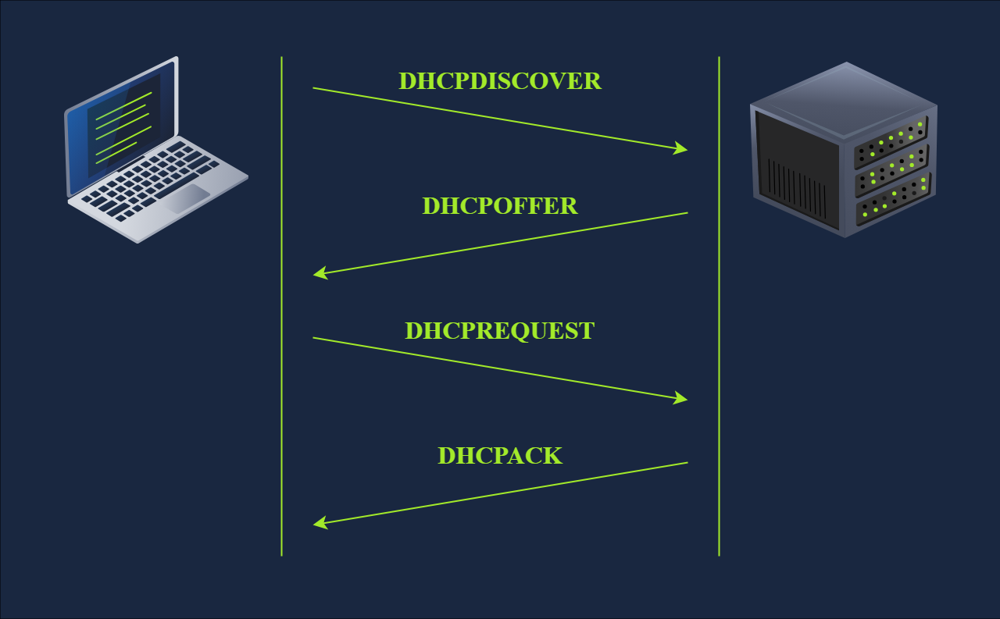
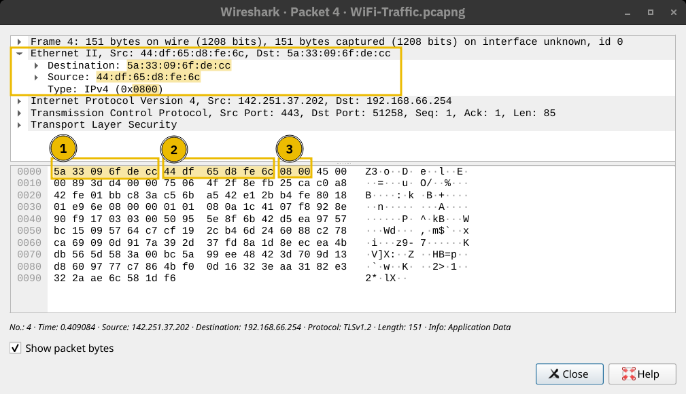
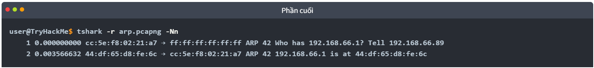
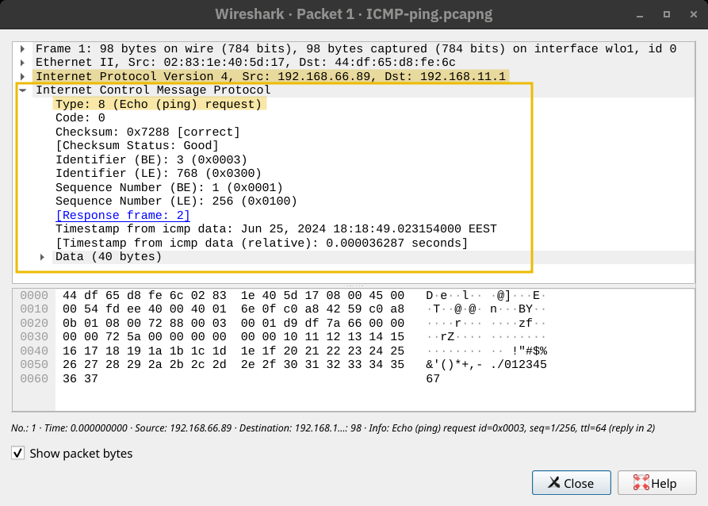
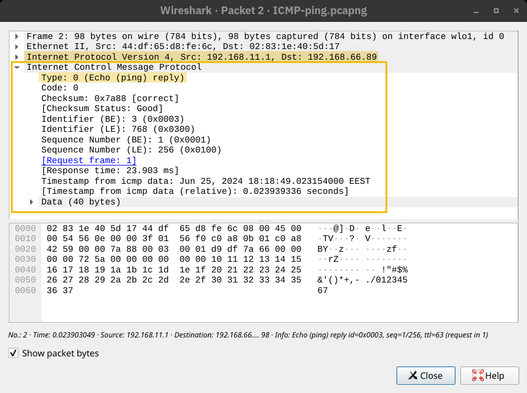
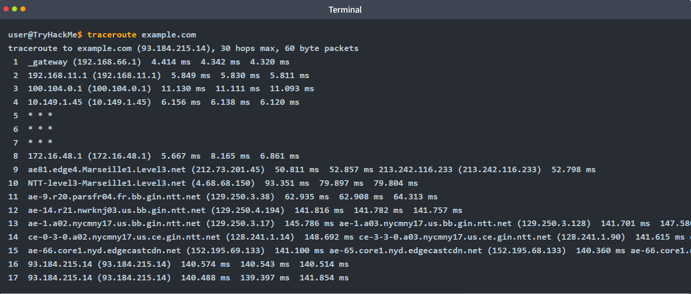
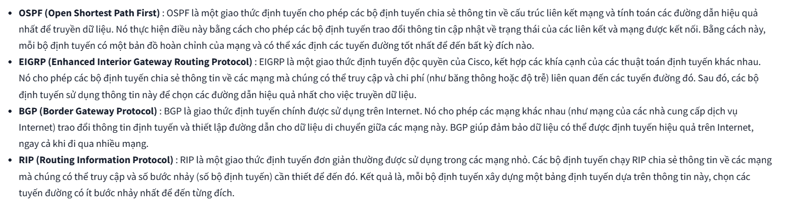
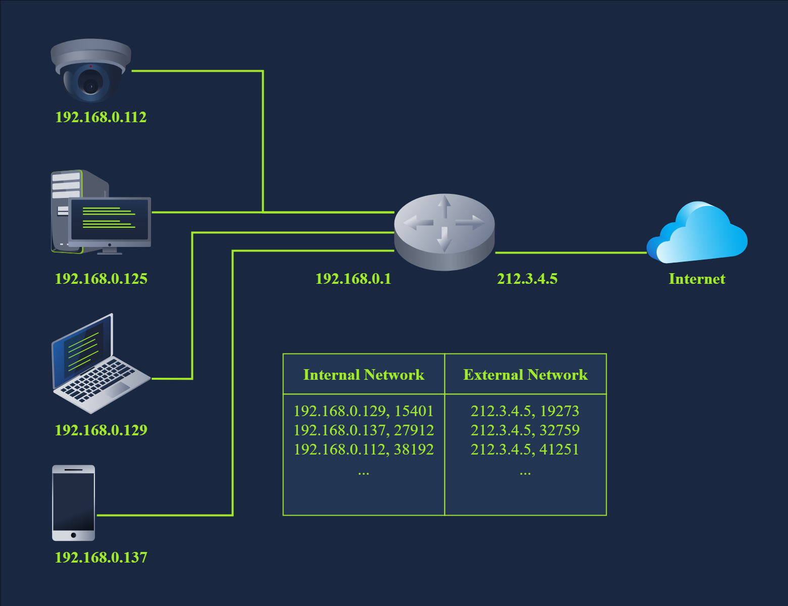

# Network Essentials
## 1. Giới thiệu
## 1. Điều kiện tiên quyết
Để học bài học này trước hết phải biết:
- Mô hình và các lớp của `OSI`
- Mô hình `TCP/IP`
    - Giao thức `Ethernet, IP, TCP`
    ### 2. Mục tiêu học tập
    Tìm hiểu về các giảo thức và công nghệ tiêu chuẩn giúp mạng kết nối các thiết bị với nhau:
    - _DHCP_
    - _ARP_
    - _NAT_
    - _ICMP_:
        - _Ping_
        - _Router_
## 2. DHCP

### 1.1. Khái niệm
**DHCP** (Dynamic Host Configuration Protocol) là một giao thức mạng quan trọng trong việc quản lí và phân phối địa chỉ **IP** trên một mạng [1].

*   **Chức năng:** Tự động cấp địa chỉ **IP** cho những thiết bị kết nối vào mạng (không phải cấu hình thủ công), giúp tránh sai sót và tiết kiệm thời gian [1].
*   **Mô hình hoạt động:** Hoạt động ở **tầng 7** (Application) của mô hình OSI [1].

> *Câu hỏi thảo luận:* Tại sao cung cấp địa chỉ mà lại hoạt động trên **tầng 7** mà không phải là **tầng 3**? [1]

### 1.2. Tác dụng
*   Giúp người dùng không phải cấu hình mạng thủ công [1].
*   **Tránh xung đột địa chỉ:** Đảm bảo không có 2 thiết bị có cùng một **IP** trong một mạng. Nếu trùng, cả 2 máy sẽ *không sử dụng được tài nguyên mạng* [1].

> *Câu hỏi thảo luận:* Tại sao 2 máy trùng **IP** lại không thể sử dụng được tài nguyên mạng? (Lưu ý: Chứ không phải là cả 2 đều nhận được thông tin khi truy cập đến **IP** khác, chỉ là không giao tiếp được với nhau thôi) [1].

### 1.3. Cách hoạt động

**Giao thức vận chuyển:**
DHCP ứng dụng **UDP** để làm giao thức vận chuyển [2]:
*   Máy chủ **DHCP** lắng nghe trên port **67** [2].
*   Máy khách lắng nghe trên port **68** [2].

> *Tại sao không dùng **TCP** làm giao thức vận chuyển mà phải dùng **UDP**?*
> Tại vì **TCP** cần một IP chính xác để hoạt động, chỉ hoạt động **1-1**, không hỗ trợ **broadcast** như **UDP** [2].

**Quy trình 4 bước (DORA):**
DHCP hoạt động tuân theo 4 bước gọi tắt là **DORA** [2], [3]:

1.  **Discover** (Khám phá): Máy khách tìm máy chủ **DHCP** (Giao tiếp từ port 68 -> 67) [2].
2.  **Offer** (Đề nghị): Máy chủ **DHCP** kiểm tra và gửi lại một **IP** cho máy khách (Giao tiếp từ port 67 -> 68) [2].
3.  **Request** (Yêu cầu): Máy khách gửi lại thông tin đã chấp nhận địa chỉ **IP** được offer (Giao tiếp từ port 68 -> 67) [2].
4.  **Acknowledge** (Xác nhận): Máy chủ xác nhận đã gán địa chỉ **IP** cho máy khách [3].

**Kết quả:**
Khi kết thúc quá trình, máy khách sẽ được cấu hình các thông số sau [3]:
*   IP
*   DNS
*   GateWay (router)

## 3. ARP (Address Resolution Protocol): kết nối địa chỉ layer 3 với layer 2
Bất cứ khi nào một máy chủ cần giao tiếp với một máy chủ khác trên cùng mạng _Ethernet_ hoặc _WiFi_, nó phải gửi gói tin _IP_ trong _data link layer frame_ (khung liên kết dữ liệu)\
Mặc dù nó biết địa chỉ _IP_ của máy chủ đích, nhưng nó cần tra cứu địa chỉ _MAC_ của máy chủ đích để có thể tạo _Header_ liên kết dữ liệu phù hợp.\
Địa chỉ _MAC_ chỉ cần biết khi hai thiết bị đang giao tiếp, mọi thứ vẫn xoay quanh _IP_.\

Chúng ta thấy một gói tin _IP_ nằm trong _Ethernet Frame_. Phần _Header_ của _Ethernet Frame_ chứa:
- MAC source
- MAC Destination
- Type (_IPv4 hoặc IPv6_)

Giao thức `ARP` cho phép tìm địa chỉ _MAC_ của một thiết bị khác trên mạng Ethernet\
Ví dụ,  một máy chủ có địa chỉ _IP_ `192.168.66.89` muốn liên lạc với một hệ thống khác cũng có địa chỉ _IP_ `192.168.66.1`\
Nó gửi một `ARP Request` để yêu cầu máy chủ có địa chỉ IP `192.168.66.1` phản hồi\
`ARP Request` được gửi từ địa chỉ MAC của bên yêu cầu đến địa chỉ _MAC Broadcast_ `ff:ff:ff:ff:ff:ff`\
Máy chủ có IP `192.168.66.1` phản hồi lại bằng lại chỉ MAC của chính nó. Từ thời điểm này, hai máy có thể trao đổi ở tầng 2

## 4. ICMP (Information Control Message Protocol): Khắc phục sự cố mạng
ICMP gồm 2 lệnh dùng để sử dụng để chẩn đoán mạng và lỗi:
- `ping`: xác định xem hệ thống mục tiêu có đang hoạt động hay không và phản hồi của nó có thể đến được hệ thống hay không
- `tracert` (_tracerouter_): tìm đường đến máy mục tiêu

### 1. Ping 
Được bắt nguồn từ bóng bàn, như kiểu đánh đi đánh lại một quả bóng\
Lệnh này gửi một `ICMP Echo Request`

Máy tính ở đầu nhận phản hồi bằng gói tin `ICMP Echo Reply`

Có nhiều yếu tố có thể ngăn cản chúng ta nhận được phản hồi, có thể hệ thống mục tiêu bị ngoại tuyến hoặc tắt, tường lửa trên đường truyền cũng có thể chặn các gói dữ liệu cần thiết để _ping_ hoạt động

### 2. Traceroute
`Traceroute` là một công cụ giúp làm lộ diện mọi router nằm trên đường đi giữa hệ thống của bạn và một hệ thống đích cụ

`Traceroute` hoạt động dựa trên trường _Time-to-Live_ (TTL) trong giao thức Internet: xác định số lượng tối đa router mà gói tin có thể đi qua trước khi bị hủy

Khi bạn chạy lệnh `traceroute`, kết quả đầu ra sẽ hiển thị các router nằm giữa hệ thống của bạn và đích đến: _Router của ISP, Vị trí địa lý_

Không phải lúc nào Traceroute cũng hiển thị đầy đủ thông tin do _không phản hồi, bị chặn_

## 5. Routing

## 6. NAT (Network Address Translation)

