# Network Core Protocol
## 1. Giới thiệu
### Mục Tiêu
- DNS
- WHOIS
- HTTP, FTP
- SMTP, POP3, IMAP

## 2. DNS
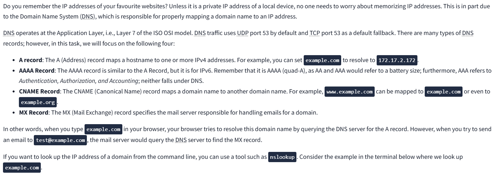

## 3. WHOIS
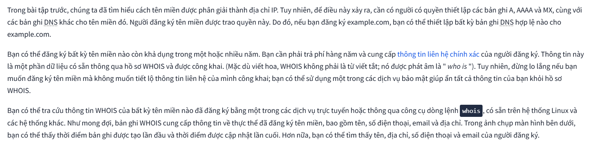

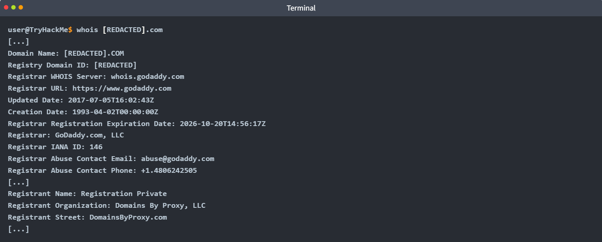

## 4. HTTP(s)

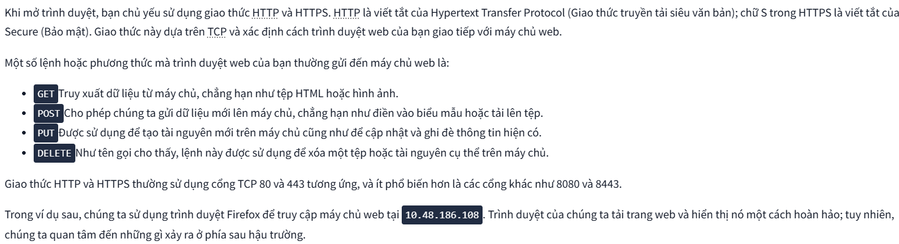

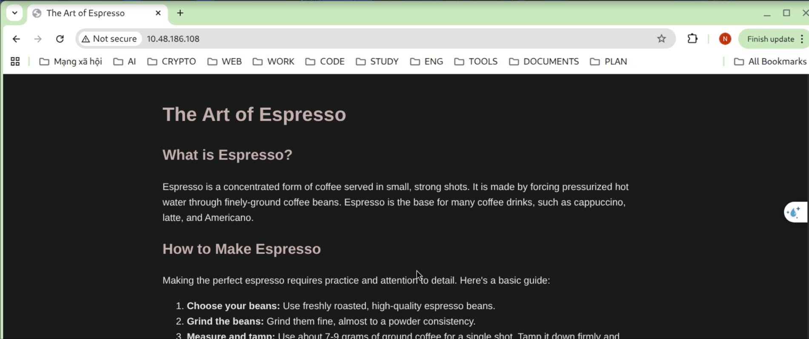

Sử dụng Wireshark, chúng ta có thể kiểm tra kỹ hơn sự trao đổi dữ liệu giữa trình duyệt Firefox và máy chủ web. Ảnh chụp màn hình bên dưới từ Wireshark hiển thị văn bản được trình duyệt gửi đi ( màu đỏ) và phản hồi của máy chủ web ( màu xanh) . Như bạn có thể thấy, rất nhiều thông tin được trao đổi giữa máy khách và máy chủ mà không được hiển thị cho người dùng. Ví dụ như phiên bản máy chủ web và thời điểm trang được sửa đổi lần cuối.
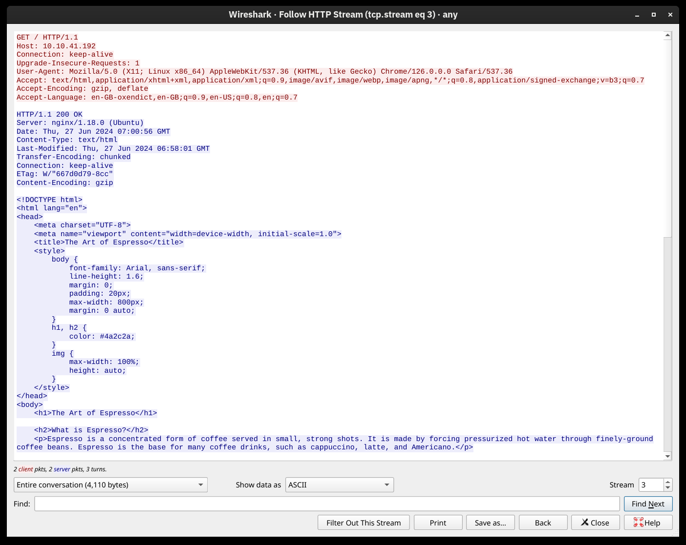

## 5. FTP
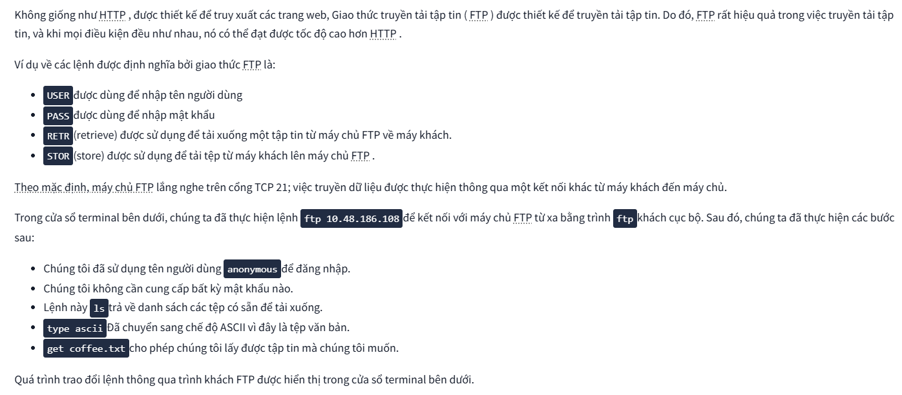
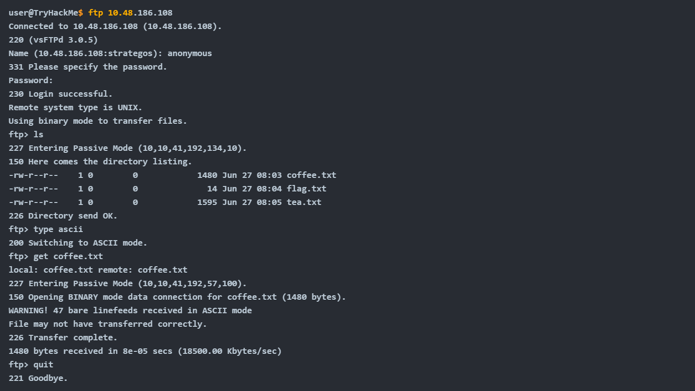

## 6. SMTP
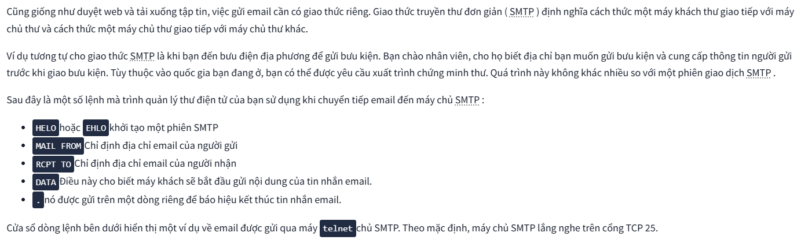

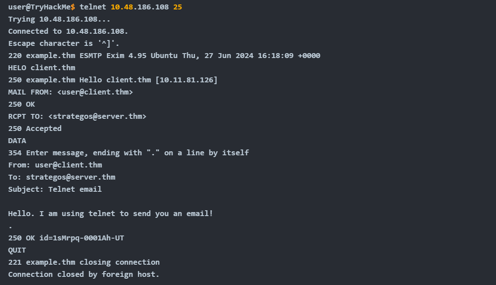

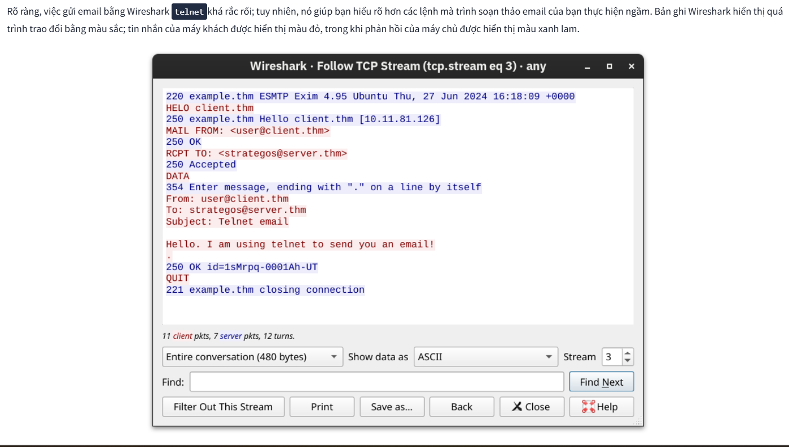

## 7. POP3

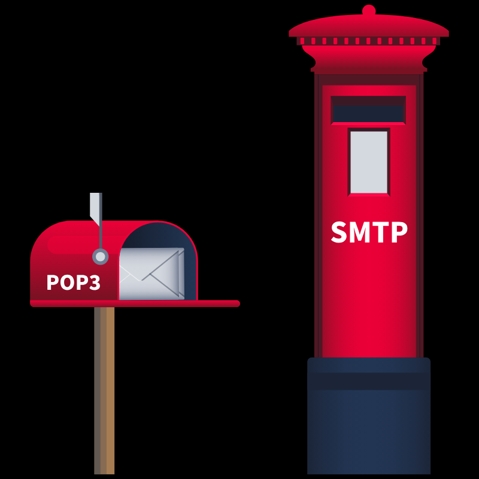

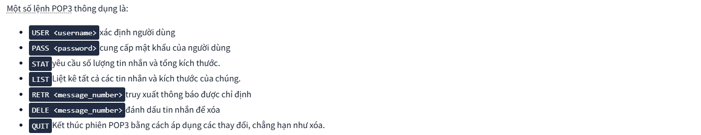

Trong cửa sổ terminal bên dưới, ta có thể thấy một phiên POP3 qua telnet. Vì máy chủ POP3 mặc định lắng nghe trên cổng TCP 110, lệnh để kết nối đến cổng TELNET là telnet `10.48.186.108 110`. Đoạn mã trao đổi bên dưới truy xuất tin nhắn email đã gửi trong tác vụ trước đó.
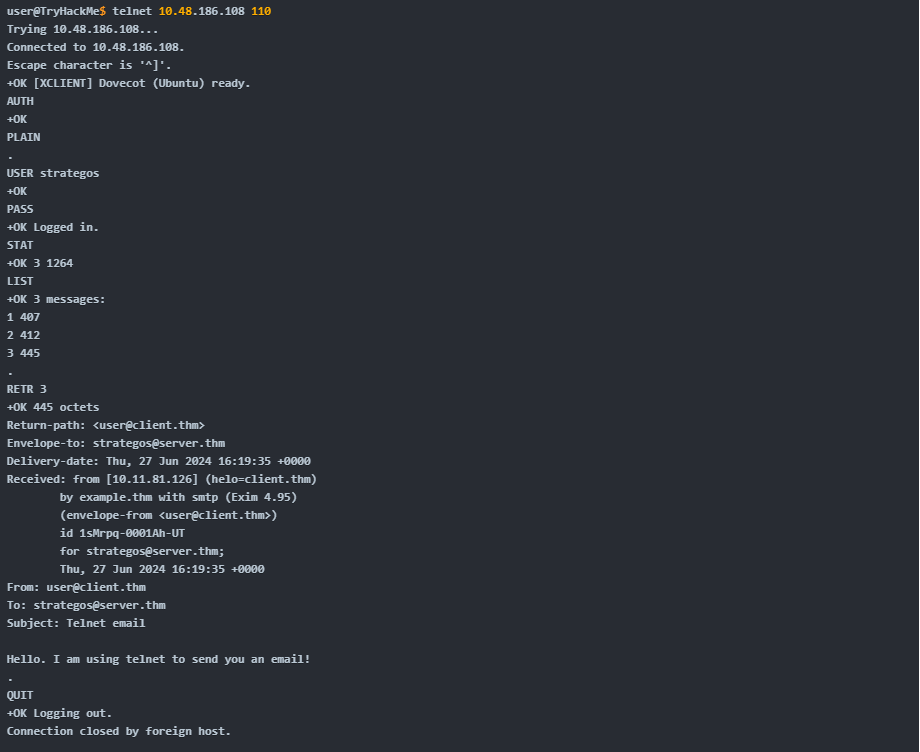

Theo các bản ghi Wireshark trước đây, các lệnh màu đỏ được gửi bởi máy khách, và các dòng màu xanh là của máy chủ. Rõ ràng là người nào đó thu thập lưu lượng truy cập cũng có thể đọc được mật khẩu.
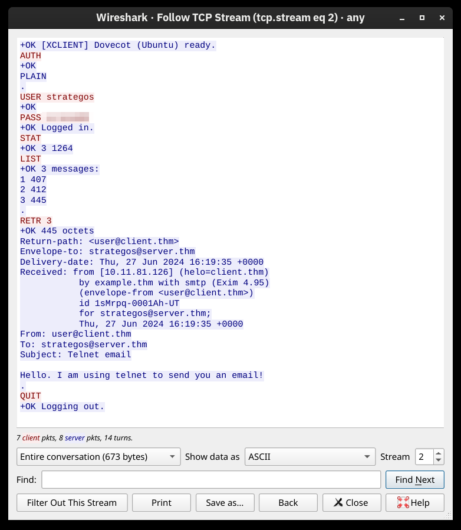

## 8. Kết luận
