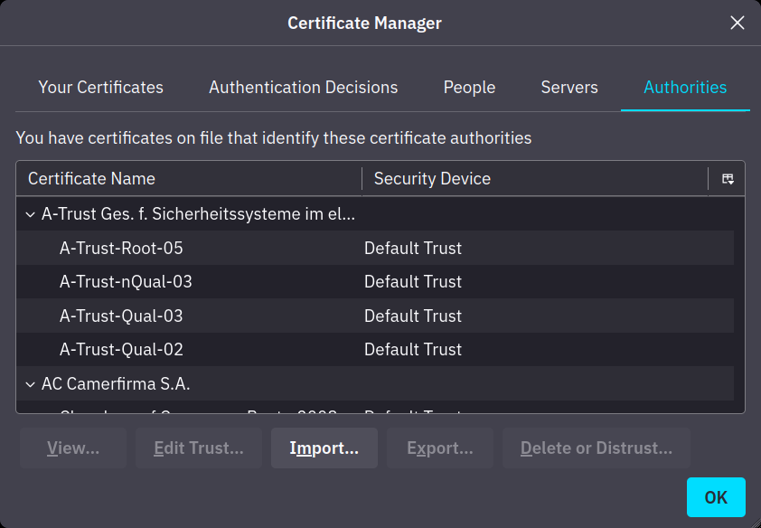
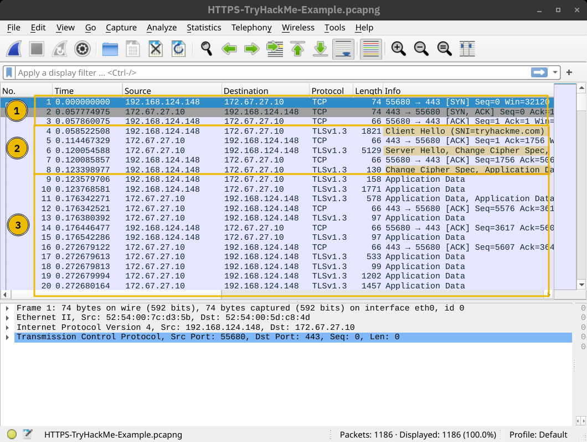
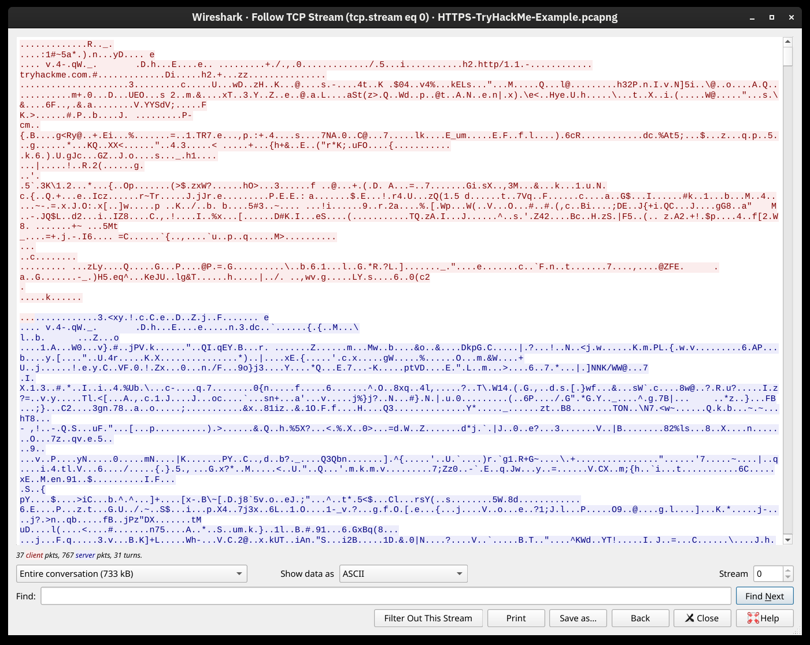
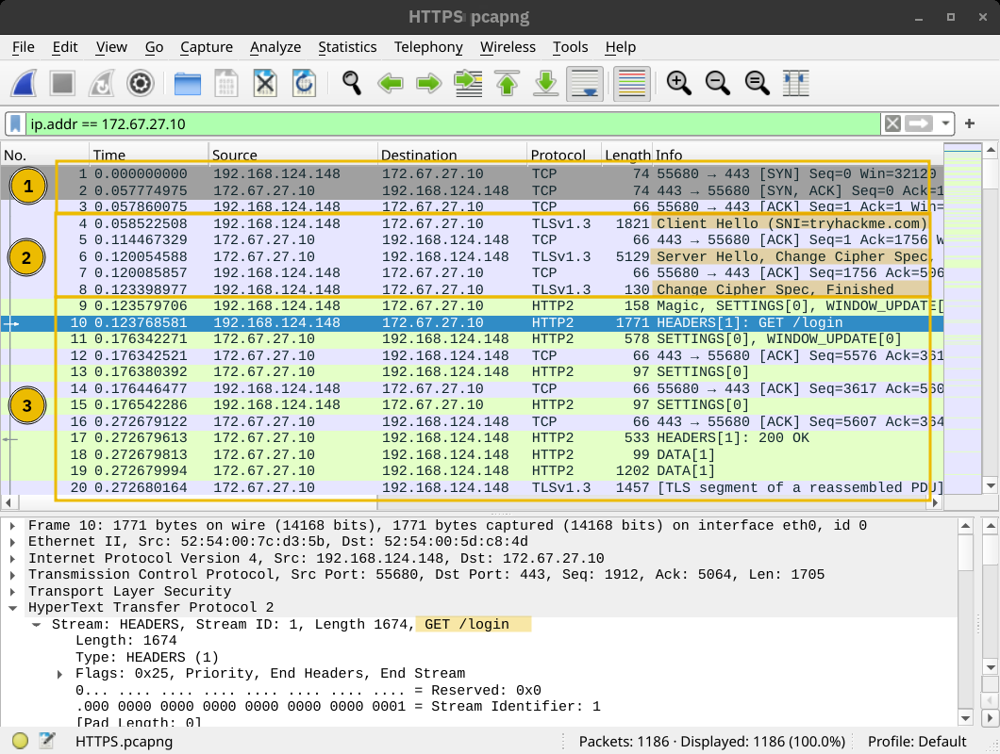
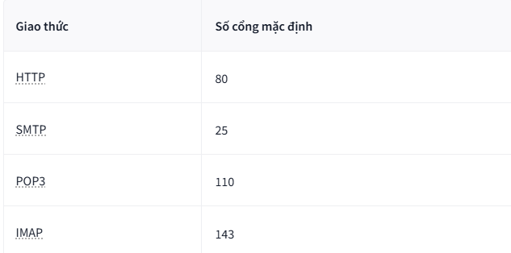
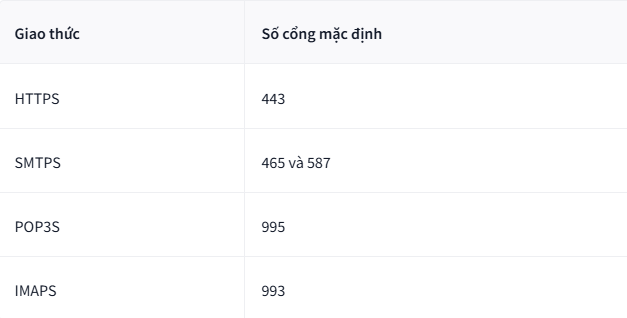
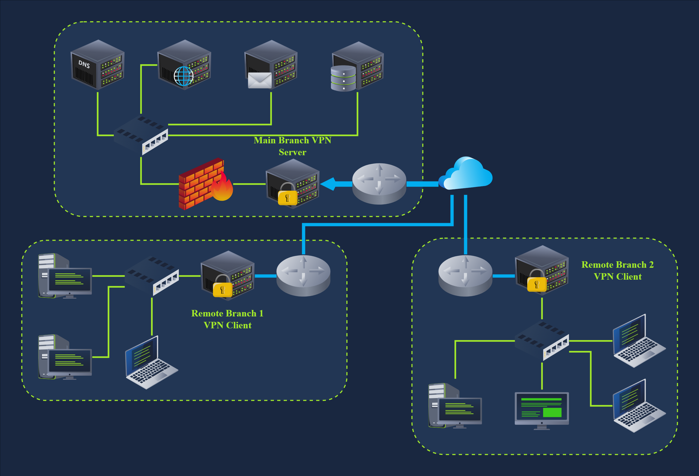
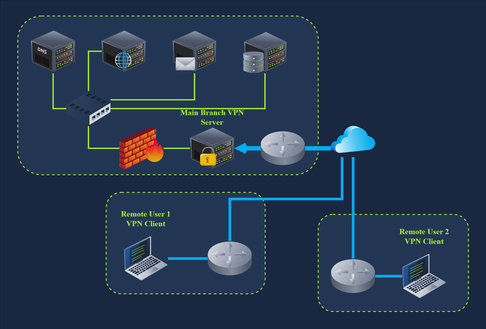
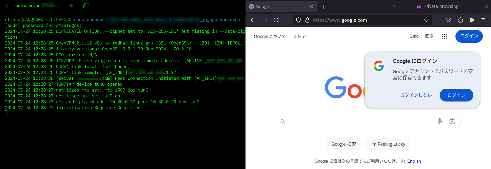

# Network Secure Protocols
## 1. Introduction
`Transport Layer Security` _Giao thức Bảo mật Lớp Vận chuyển_ ( `TLS` ) được thêm vào các giao thức hiện có để bảo vệ _tính bảo mật, toàn vẹn và xác thực_ của thông tin liên lạc. Do đó, _HTTP , POP3 , SMTP và IMAP_ trở thành __HTTPS, POP3S, SMTPS__ và __IMAPS__, trong đó chữ “__S__” được thêm vào viết tắt cho __Secure__ (_Bảo mật_). Chúng ta sẽ xem xét các giao thức này và những lợi ích mà chúng ta thu được từ `TLS` .

Tương tự, việc truy cập từ xa vào một hệ thống bằng giao thức `TELNET` được coi là không an toàn; Giao thức __Secure Shell__ ( _SSH_ ) được tạo ra để cung cấp một cách an toàn để truy cập vào các hệ thống từ xa. Hơn nữa, `SSH` là một giao thức mở rộng, cung cấp thêm các tính năng bảo mật cho các giao thức khác.

### Mục tiêu học tập
Sau khi hoàn thành căn phòng này, bạn sẽ học được về:

- __SSL/ TLS__
- Làm thế nào để bảo mật các giao thức văn bản thuần hiện có:
 - __HTTP__
 - __SMTP__
 - __POP3__
 - __IMAP__
- `SSH` đã thay thế `TELNET` bằng văn bản thuần như thế nào?
- `VPN` tạo ra mạng bảo mật trên một mạng không bảo mật như thế nào ?

## 2. TLS
`SSL`(_Secure Socket Layer_) là tiền thân của `TLS`(_Transport Layer Secure_)

### Technical Background
Bước đầu tiên đối với mọi máy chủ (hoặc máy khách) cần xác định danh tính của mình là phải có chứng chỉ `TLS` đã được ký . Thông thường, quản trị viên máy chủ sẽ tạo `Cert Singing Request` (_CSR_) và gửi đến Tổ chức cấp chứng chỉ ( `CA` ); `CA` sẽ xác minh `CSR` và cấp chứng chỉ số. Sau khi nhận được chứng chỉ (_đã ký_), nó có thể được sử dụng để xác định máy chủ (hoặc máy khách) với những người khác, những người có thể xác nhận tính hợp lệ của chữ ký. Để máy chủ xác nhận tính hợp lệ của chứng chỉ đã ký, chứng chỉ của các tổ chức ký cần được cài đặt trên máy chủ đó. Trong thế giới thực, điều này tương tự như việc nhận biết con dấu của các cơ quan khác nhau. Ảnh chụp màn hình bên dưới hiển thị các cơ quan đáng tin cậy được cài đặt trong trình duyệt web.

Nhìn chung, việc có được chứng chỉ được ký điện tử thường yêu cầu trả phí hàng năm. Tuy nhiên, `Let's Encrypt` cho phép bạn có được chứng chỉ được ký điện tử miễn phí.

Cuối cùng, chúng ta cần lưu ý rằng một số người dùng chọn tạo chứng chỉ tự ký. Chứng chỉ tự ký không thể chứng minh tính xác thực của máy chủ vì chưa có bên thứ ba nào xác nhận.

## 3. HTTPS
Như chúng ta đã học trong phòng về các giao thức cốt lõi của mạng , `HTTP` dựa trên `TCP` và sử dụng cổng `80` theo mặc định. Chúng ta cũng đã thấy cách tất cả lưu lượng `HTTP` được gửi đi dưới dạng văn bản thuần túy, cho phép bất kỳ ai cũng có thể chặn và theo dõi. Ảnh chụp màn hình bên dưới là từ phòng học trước, và nó cho thấy rõ cách hacker có thể dễ dàng đọc được tất cả lưu lượng được trao đổi giữa máy khách và máy chủ.

### 1. HTTP qua TLS
`HTTPS` là viết tắt của **Hypertext Transfer Protocol Secure** (_Giao thức truyền tải siêu văn bản an toàn_). Về cơ bản, nó là `HTTP` trên nền `TLS`. Do đó, việc yêu cầu một trang web qua `HTTPS` sẽ yêu cầu `3` bước sau (sau khi đã phân giải tên miền):
1. Thiết lập quá trình `three-ways handshake` TCP với máy chủ mục tiêu.
2. Thiết lập phiên `TLS`
3. Giao tiếp bằng giao thức `HTTP`; ví dụ, gửi các yêu cầu `HTTP`, chẳng hạn như: `GET / HTTP/1.1`

Ảnh chụp màn hình bên dưới cho thấy một phiên `TCP` được thiết lập trong `3` gói tin đầu tiên, được đánh dấu bằng `1`. Sau đó, một số gói tin được trao đổi để đàm phán giao thức `TLS`, được đánh dấu bằng `2`. `1` và `2` là  nơi  diễn ra quá trình đàm phán và thiết lập `TLS`  .

Cuối cùng, dữ liệu ứng dụng `HTTP` được trao đổi, được đánh dấu bằng `3`. Nhìn vào ảnh chụp màn hình __Wireshark__, chúng ta thấy rằng nó ghi là “_Application Data_” vì không có cách nào để biết liệu đó thực sự là `HTTP` hay một giao thức khác được gửi qua cổng `443`.

Đúng như dự đoán, nếu cố gắng theo dõi luồng gói dữ liệu và kết hợp tất cả nội dung của chúng, ta sẽ chỉ nhận được những ký tự vô nghĩa, như trong ảnh chụp màn hình bên dưới. Lưu lượng trao đổi được mã hóa; **màu đỏ** là do máy khách gửi, và **màu xanh** là do máy chủ gửi. Không có cách nào để biết nội dung nếu không có khóa.

### 2. Getting the Encryption Key

- Khối 1: Quá trình bắt tay 3 bước
- KHối 2: Trao đổi thông tin kĩ thuật giữa 2 bên:
    - __Client__: gửi `Client Hello` chứa thông tin về các __Share Key__ và các thuật toán Client hỗ trợ
    - __Server__: gửi `Server Hello` chứa thông tin về chứng chỉ và thuật toán mã hóa đã chọn cho tối ưu
    - __Change Cipher Spec__: hai bên thống nhất khóa mã hóa để quá trình truyền dữ liệu bắt đầu
- Khối 3: __Client__ xác nhận lại lần cuối. Sau bước này, đường truyền đã sẵn sàng

Điểm mấu chốt là `TLS` cung cấp tính bảo mật cho `HTTP` mà không yêu cầu bất kỳ thay đổi nào trong các giao thức lớp thấp hơn hoặc cao hơn. Nói cách khác, `TCP` và `IP` không bị sửa đổi, trong khi `HTTP` được gửi qua `TLS` giống như cách nó được gửi qua `TCP` .

## 4. SMTPS, POP3S và IMAPS
Việc thêm ``TLS`` vào `SMTP` , `POP3` và `IMAP` không khác gì việc thêm `TLS` vào HTTP . Tương tự như cách HTTP được thêm hậu tố S (viết tắt của Secure - bảo mật) và trở thành HTTPS, `SMTP` , `POP3` và `IMAP` lần lượt trở thành `SMTPS`, `POP3S` và `IMAPS`. Sử dụng các giao thức này qua `TLS` không khác gì việc sử dụng `HTTP` qua `TLS` ; do đó, hầu hết các điểm đã thảo luận về `HTTPS` đều áp dụng cho các giao thức này.

Các phiên bản không an toàn sử dụng số cổng `TCP` mặc định được hiển thị trong bảng bên dưới:

Các phiên bản bảo mật, tức là sử dụng `TLS` , mặc định sử dụng các số cổng `TCP` sau :

_**TLS** có thể được tích hợp vào nhiều giao thức khác; lý do và lợi ích sẽ tương tự._

## 5. SSH
`telnet` mặc dù rất tiện lợi để remote các hệ thống từ xa, nhưng nó lại tiềm ẩn nhiều rủi ro bảo mật do những dữ liệu được truyền bằng giao thức này không được mã hóa dẫn đến việc có thể bị nghe lén trên đường truyền mạng. Từ những nhược điểm đó thì người ta đã phát triển giao thức **Secure Shell**(`SSH`)

Năm 1999, các nhà phát triển *OpenBSD* đã phát hành `OpenSSH`, một triển khai mã nguồn mở của `SSH`. Ngày nay, khi bạn sử dụng một máy khách `SSH`, rất có thể nó dựa trên các thư viện và mã nguồn `OpenSSH`

- `OpenSSH` mang lại một số lợi ích. Chúng tôi sẽ liệt kê một vài điểm chính:
    - __Xác thực an toàn__ : Bên cạnh xác thực bằng mật khẩu, SSH hỗ trợ xác thực bằng khóa công khai và xác thực hai yếu tố.
    - __Bảo mật__ : `OpenSSH` cung cấp mã hóa đầu cuối, bảo vệ chống lại việc nghe lén. Hơn nữa, nó thông báo cho bạn về các khóa máy chủ mới để bảo vệ chống lại các cuộc tấn công trung gian (man-in-the-middle attacks).
    - __Tính toàn vẹn__ : Ngoài việc bảo vệ tính bí mật của dữ liệu được trao đổi, mật mã học còn bảo vệ tính toàn vẹn của lưu lượng truy cập.
    - __Tạo đường hầm__ : `SSH` có thể tạo một "_đường hầm_" bảo mật để định tuyến các giao thức khác thông qua `SSH`. Cấu hình này dẫn đến một kết nối tương tự như `VPN`.
    - __Chuyển tiếp X11__ : Nếu bạn kết nối với một hệ thống giống _Unix_ có giao diện người dùng đồ họa, `SSH` cho phép bạn sử dụng ứng dụng đồ họa đó qua mạng.

Bạn sẽ nhập lệnh `ssh username@hostname` để kết nối với máy chủ `SSH` . Nếu tên người dùng trùng với tên người dùng bạn đang đăng nhập, bạn chỉ cần `ssh hostname` nhập lệnh đó. Sau đó, bạn sẽ được yêu cầu nhập mật khẩu; tuy nhiên, nếu sử dụng xác thực khóa công khai, bạn sẽ được đăng nhập ngay lập tức.

## 6. SFTP and FTPS
`SFTP` là viết tắt của **SSH File Transfer Protocol** và cho phép truyền tải tệp an toàn. Nó là một phần của bộ giao thức `SSH` và sử dụng cùng số cổng `22`. Nếu được bật trong cấu hình máy chủ `OpenSSH`, bạn có thể kết nối bằng lệnh như ` sftp username@hostname.`. Sau khi đăng nhập, bạn có thể sử dụng các lệnh như `get filename` và `put filename` để tải xuống và tải lên tệp tương ứng. Nói chung, các lệnh `SFTP` tương tự như lệnh **Unix** và có thể khác với các lệnh **FTP** .

Không nên nhầm lẫn `SFTP` với `FTPS`. Bạn đúng khi cho rằng `FTPS` là viết tắt của **File Transfer Protocol Secure** (Giao thức truyền tải tệp an toàn). Vậy `FTPS` được bảo mật như thế nào? Đúng vậy, bạn đoán đúng rằng nó được bảo mật bằng `TLS` , giống như `HTTPS`. Trong khi `FTP` sử dụng cổng `21`, `FTPS` thường sử dụng cổng `990`. Nó yêu cầu thiết lập chứng chỉ và việc cho phép truy cập qua các tường lửa nghiêm ngặt có thể khá phức tạp vì nó sử dụng các kết nối riêng biệt cho việc điều khiển và truyền tải dữ liệu.

Việc thiết lập máy chủ `SFTP` dễ dàng như việc bật một tùy chọn trong máy chủ `OpenSSH`. Giống như **HTTPS, SMTPS, POP3S, IMAPS** và các giao thức khác dựa trên `TLS` để bảo mật, `FTPS` yêu cầu chứng chỉ `TLS` hợp lệ để hoạt động an toàn.

## 7. VPN
Hãy xem xét một công ty có các văn phòng ở nhiều địa điểm khác nhau. _Liệu công ty này có thể kết nối tất cả các văn phòng và chi nhánh của mình với chi nhánh chính để bất kỳ thiết bị nào cũng có thể truy cập vào các tài nguyên dùng chung như thể chúng đang ở vị trí vật lý tại chi nhánh chính?_ Câu trả lời là **có**; hơn nữa, giải pháp tiết kiệm nhất là thiết lập **Virtual Private Network** ( `VPN` ) sử dụng cơ sở hạ tầng Internet

Khi kết nối Internet, giao thức `TCP/IP` chỉ làm nhiệm vụ truyền tải, và đảm bảo dữ liệu đến đúng nơi và đủ. Nhưng không có cơ chế nào đảm bảo rằng dữ liệu được bảo vệ và không bị thay đổi trên đường truyền. Khi đó giải pháp chính là `VPN`

Hầu hết các công ty đều yêu cầu trao đổi thông tin "_riêng tư_" trong mạng ảo của họ. Vì vậy, `VPN` cung cấp một giải pháp rất tiện lợi và tương đối tiết kiệm chi phí. Các yêu cầu chính là kết nối Internet, máy chủ và máy khách `VPN` .

Sơ đồ mạng bên dưới minh họa ví dụ về một công ty có `2` chi nhánh từ xa kết nối với chi nhánh chính. Một máy khách `VPN` tại các chi nhánh từ xa dự kiến ​​sẽ kết nối với máy chủ `VPN` tại chi nhánh chính. Trong trường hợp này, máy khách `VPN` sẽ mã hóa lưu lượng truy cập và chuyển tiếp đến chi nhánh chính thông qua đường hầm `VPN` đã thiết lập (hiển thị màu xanh lam). Lưu lượng `VPN` chỉ giới hạn trong các đường màu xanh lam; các đường màu xanh lục sẽ mang lưu lượng VPN đã được giải mã .

Trong sơ đồ mạng bên dưới, ta thấy hai người dùng từ xa đang sử dụng phần mềm ``VPN`` để kết nối với máy chủ `VPN` tại chi nhánh chính. Trong trường hợp này, phần mềm `VPN` chỉ kết nối với một thiết bị duy nhất.

Sau khi thiết lập đường hầm `VPN`, tất cả lưu lượng truy cập Internet của chúng ta thường sẽ được định tuyến qua kết nối `VPN` , tức là thông qua đường hầm `VPN` . Do đó, khi chúng ta cố gắng truy cập một dịch vụ Internet hoặc ứng dụng web, họ sẽ không thấy địa chỉ **IP công cộng** của chúng ta mà là địa chỉ **IP** của máy chủ `VPN` . Đây là lý do tại sao một số người dùng Internet kết nối qua `VPN` để vượt qua các hạn chế về địa lý. Hơn nữa, nhà cung cấp dịch vụ Internet (**ISP**) địa phương sẽ chỉ thấy lưu lượng truy cập được mã hóa, điều này hạn chế khả năng kiểm duyệt truy cập Internet của họ.

Nói cách khác, nếu người dùng kết nối với máy chủ `VPN` ở Nhật Bản, họ sẽ được các máy chủ mà họ truy cập coi như đang ở Nhật Bản. Các máy chủ này sẽ tùy chỉnh trải nghiệm của họ cho phù hợp, chẳng hạn như chuyển hướng họ đến phiên bản tiếng Nhật của dịch vụ. Ảnh chụp màn hình bên dưới hiển thị trang Tìm kiếm Google sau khi kết nối với máy chủ `VPN` ở Nhật Bản.

Cuối cùng, mặc dù trong nhiều trường hợp, người ta sẽ thiết lập kết nối `VPN` để định tuyến toàn bộ lưu lượng truy cập qua **đường hầm VPN** , nhưng một số kết nối `VPN` lại không làm như vậy. Máy chủ `VPN` có thể được cấu hình để cho phép bạn truy cập vào mạng riêng nhưng không định tuyến lưu lượng truy cập của bạn. Hơn nữa, một số máy chủ `VPN` làm lộ địa chỉ **IP** thực của bạn, mặc dù chúng được thiết kế để định tuyến toàn bộ lưu lượng truy cập của bạn qua VPN . Tùy thuộc vào lý do bạn sử dụng kết nối VPN , bạn có thể cần thực hiện thêm một vài thử nghiệm, chẳng hạn như kiểm tra **rò rỉ DNS**.

