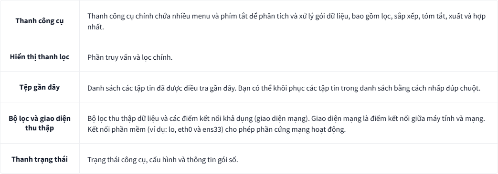
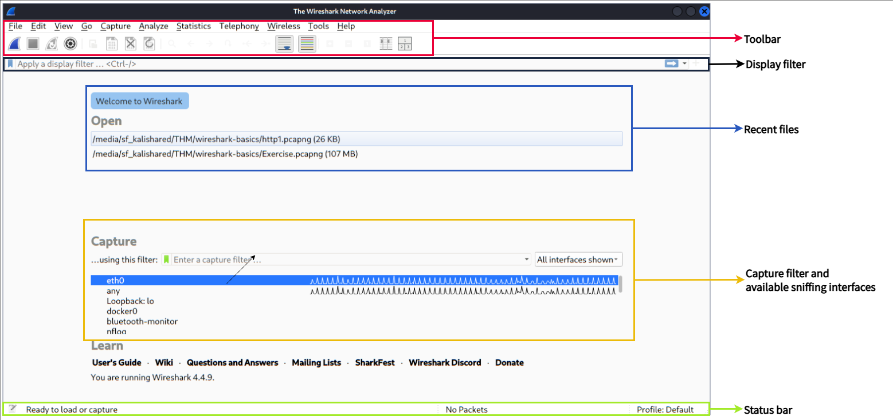
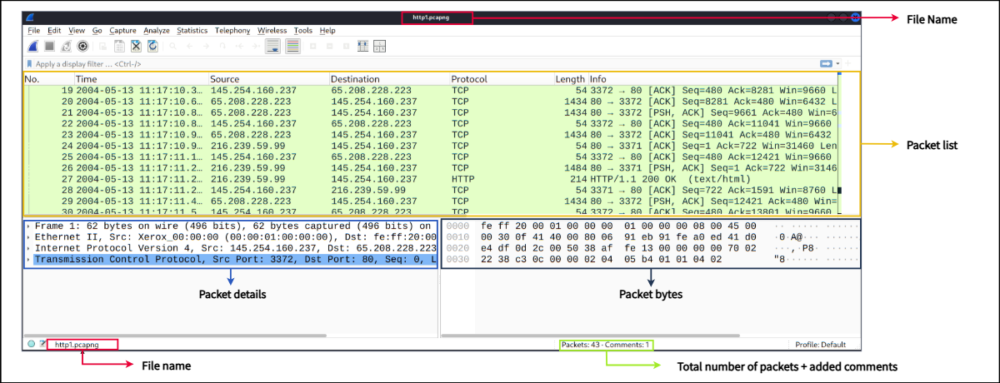
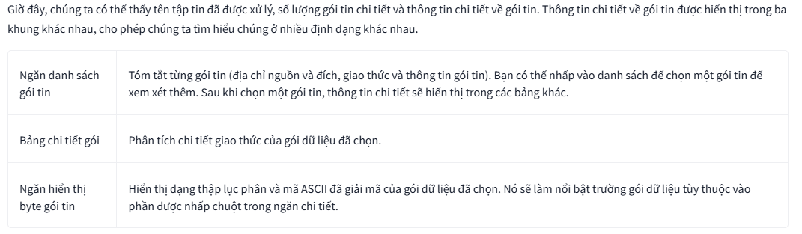
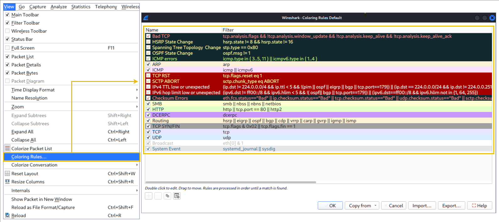

# WireShark Basic
## 1. Giới thiệu
`Wireshark` là một công cụ phân tích gói mạng mã nguồn mở, đa nền tảng, có khả năng theo dõi và điều tra lưu lượng truy cập trực tiếp cũng như kiểm tra các bản ghi gói ( _PCAP_ ). Nó thường được sử dụng như một trong những công cụ phân tích gói tốt nhất. Trong bài học này, chúng ta sẽ tìm hiểu những kiến ​​thức cơ bản về Wireshark và sử dụng nó để thực hiện các phân tích gói cơ bản.
### 1. Mục tiêu
> Điều hướng và cấu hình Wireshark
> Kiểm tra các gói dữ liệu và khám phá thông tin từ các lớp khác nhau của TCP /IP.
> Áp dụng Filter hiển thị
### 2. Điều kiện
Đã học module Network

## 2. Tổng quan về công cụ
### Các trường hợp sử dụng
Wireshark là một trong những công cụ phân tích lưu lượng mạnh mẽ nhất hiện có. Nó được sử dụng cho nhiều mục đích khác nhau:
- Phát hiện và khắc phục sự cố mạng, chẳng hạn như các điểm gây lỗi tải mạng và tắc nghẽn mạng.
- Phát hiện các bất thường về bảo mật, chẳng hạn như máy chủ giả mạo, sử dụng cổng bất thường và lưu lượng truy cập đáng ngờ.
- Nghiên cứu và tìm hiểu chi tiết về giao thức, chẳng hạn như mã phản hồi và dữ liệu tải trọng.

_Lưu ý_: Wireshark không phải là Hệ thống Phát hiện Xâm nhập ( IDS ). Nó chỉ cho phép các nhà phân tích khám phá và điều tra các gói dữ liệu một cách chuyên sâu. Nó cũng không sửa đổi các gói dữ liệu; nó chỉ đọc chúng. Do đó, việc phát hiện bất kỳ sự bất thường hoặc vấn đề mạng nào phụ thuộc rất nhiều vào kiến ​​thức và kỹ năng điều tra của nhà phân tích.

### Giao diện người dùng và dữ liệu
Giao diện người dùng đồ họa (_GUI_) của Wireshark mở ra với một trang duy nhất tích hợp tất cả các chức năng, giúp người dùng phân tích lưu lượng truy cập theo nhiều cách khác nhau. Có 5 phần nổi bật

Hình ảnh bên dưới hiển thị cửa sổ chính của Wireshark. Các phần được giải thích trong bảng được đánh dấu nổi bật. Bây giờ hãy mở Wireshark và làm theo hướng dẫn.

### Loading PCAP Files
Hình ảnh trên cho thấy giao diện trống của Wireshark. Thông tin duy nhất có sẵn là `http1.pcap` tập tin vừa được xử lý. Hãy tải tập tin đó lên và xem cách Wireshark hiển thị chi tiết các gói tin. Lưu ý rằng bạn cũng có thể sử dụng menu "__Tệp__" , kéo và thả tập tin hoặc nhấp đúp vào tập tin để tải tệp `pcap` .

### Colouring Packets
Bên cạnh thông tin gói tin nhanh chóng, Wireshark còn tô màu các gói tin theo thứ tự các điều kiện khác nhau và giao thức để nhanh chóng phát hiện các bất thường và giao thức trong các bản ghi (điều này giải thích tại sao hầu hết mọi thứ đều có màu xanh lá cây trong các ảnh chụp màn hình đã cho). Cái nhìn thoáng qua về thông tin gói tin này có thể giúp bạn theo dõi chính xác những gì bạn đang tìm kiếm trong quá trình phân tích. Bạn có thể tạo các quy tắc màu tùy chỉnh để phát hiện các sự kiện quan trọng bằng cách sử dụng bộ lọc hiển thị, và chúng ta sẽ đề cập đến chúng trong phần tiếp theo. Bây giờ, hãy tập trung vào các thiết lập mặc định và hiểu cách xem và sử dụng các chi tiết dữ liệu được hiển thị.

Wireshark có hai loại phương pháp tô màu gói tin: các quy tắc tạm thời chỉ khả dụng trong một phiên chương trình và các quy tắc vĩnh viễn được lưu trong tệp tùy chọn (hồ sơ) và khả dụng cho phiên chương trình tiếp theo. Bạn có thể sử dụng menu "chuột phải" hoặc  menu "__View__ --> __Coloring Rules__"  để tạo các quy tắc tô màu vĩnh viễn.  Menu "__Colourise Packet List__"  kích hoạt/vô hiệu hóa các quy tắc tô màu. Việc tô màu gói tin tạm thời được thực hiện bằng menu "chuột phải" hoặc  menu "__View --> Conversation Filter__"  , được trình bày trong NHIỆM VỤ 5.

### Traffic Sniffing
