# tcpdump
## 1. Giới thiệu
Thách thức chính khi nghiên cứu các giao thức mạng là chúng ta không có cơ hội quan sát các _"cuộc hội thoại_" giữa các giao thức diễn ra. Tất cả sự phức tạp về kỹ thuật đều ẩn sau giao diện người dùng.  Bạn truy cập các tài nguyên trên mạng cục bộ mà không bao giờ thấy một truy vấn _ARP_ nào. Tương tự, bạn có thể truy cập các dịch vụ Internet trong nhiều năm mà không thấy một lần _three-way handshake_ nào cho đến khi bạn xem sách về mạng hoặc kiểm tra bản ghi lưu lượng mạng. Phương pháp học tập tốt nhất là _ghi lại lưu lượng mạng và xem xét kỹ hơn các giao thức khác nhau_; điều này giúp chúng ta hiểu rõ hơn cách thức hoạt động của mạng

Phần này giới thiệu một số đối số dòng lệnh cơ bản để sử dụng `Tcpdump`. Công cụ _Tcpdump_ và thư viện `libpcap` của nó được viết bằng _C và C++_ và được phát hành cho các hệ thống giống _Unix_ vào cuối những năm 1980 hoặc đầu những năm 1990. Do đó, chúng rất ổn định và cung cấp tốc độ tối ưu. Thư viện _libpcap_ này là nền tảng cho nhiều công cụ mạng khác hiện nay. Hơn nữa, nó đã được chuyển đổi sang _MS Windows_ dưới dạng `winpcap`

### Mục tiêu học tập
Phòng học này nhằm cung cấp cho bạn những kiến ​​thức cơ bản cần thiết để sử dụng phần mềm _tcpdump_. Cụ thể, bạn sẽ học cách:
- Thu thập các gói dữ liệu và lưu chúng vào tệp.
- Đặt bộ lọc cho các gói tin đã bắt được
- Kiểm soát cách hiển thị các gói tin đã thu thập

### Điều kiện
người dùng nên làm quen với mô hình _TCP/IP_, các khái niệm liên quan và các giao thức khác nhau của nó

## 2. Basic Packet Capture (Các các bắt gói tin đơn giản)
Bạn có thể chạy _tcpdump_ mà _không cần cung cấp bất kỳ tham số nào_; tuy nhiên, điều này chỉ hữu ích _để kiểm tra xem bạn đã cài đặt nó hay chưa_! Trong bất kỳ tình huống thực tế nào, chúng ta phải chỉ rõ cần lắng nghe cái gì, ghi ở đâu và hiển thị các gói dữ liệu như thế nào.

### 1. Specify the Network Interface (Chỉ định giao diện mạng) 
Việc đầu tiên cần quyết định là chọn giao diện mạng nào để lắng nghe bằng cách sử dụng lệnh `-i INTERFACE`

Bạn có thể chọn _lắng nghe trên tất cả các giao diện khả dụng_ bằng cách sử dụng lệnh `-i any`

Bạn có thể _chỉ định một giao diện mà bạn muốn lắng nghe_, chẳng hạn như `-i eth0`

Một lệnh như `ip address show` (`ip a s`) sẽ liệt kê các giao diện mạng khả dụng. Trong cửa sổ terminal bên dưới, chúng ta thấy một card mạng, `ens5`, ngoài địa chỉ `loopback`(_lo_):
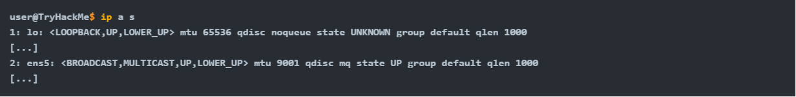

### 2. Save the Captured Packets
Trong nhiều trường hợp, bạn nên kiểm tra lại các gói dữ liệu đã thu được sau đó. Điều này có thể được thực hiện bằng cách lưu vào một tệp bằng lệnh `-w file_name.pcap`\
Các gói dữ liệu đã lưu có thể được kiểm tra sau này bằng một chương trình khác, chẳng hạn như Wireshark\
Khi dùng `-w` thì nó chỉ thực hiện ghi vào file chứ không in ra màn hình quá trình nó thực hiện hành động 

### 3. Read Captured Packets from a File
Bạn có thể sử dụng _tcpdump_ để đọc các gói tin từ một tệp bằng cách sử dụng lệnh `-r file_name.pcap`. Điều này rất hữu ích để tìm hiểu về hành vi của giao thức. Bạn có thể thu thập lưu lượng mạng trong một khung thời gian phù hợp để kiểm tra một giao thức cụ thể, sau đó đọc tệp đã thu thập trong khi áp dụng các bộ lọc để hiển thị các gói tin mà bạn quan tâm. Hơn nữa, đó có thể là một tệp thu thập gói tin chứa thông tin về một cuộc tấn công mạng đã xảy ra, và bạn kiểm tra nó để phân tích cuộc tấn công đó.

### 4. Limit the Number of Captured Packets (_Giới hạn số lượng gói tin được thu thập_)
Bạn có thể chỉ định số lượng gói tin cần thu thập bằng cách sử dụng tham số `-c COUNT`. Nếu không chỉ định `-c`, quá trình thu thập gói tin sẽ tiếp tục cho đến khi bạn ngắt nó, ví dụ như bằng cách nhấn tổ hợp phím CTRL-C. Tùy thuộc vào mục tiêu của bạn, bạn chỉ cần một số lượng gói tin giới hạn

### 5. Don’t Resolve IP Addresses and Port Numbers (_Nếu không phân giải địa chỉ IP và Port_) 
Khi dùng _tcpdump_, nó sẽ tự động phân giải tên miền và port, ví dụ:
> 8.8.8.8 --> google.com
> 80 --> HTTP
> 443 --> HTTPS
Mà những thao tác này vô tình lại sử dụng _DNS_ tạo ra những packet rác 

Bạn có thể sử dụng đối số `-n` để ngừng việc phần giải _tên miền_, `-nn` để ngừng phân giải cả _tên miền và port_
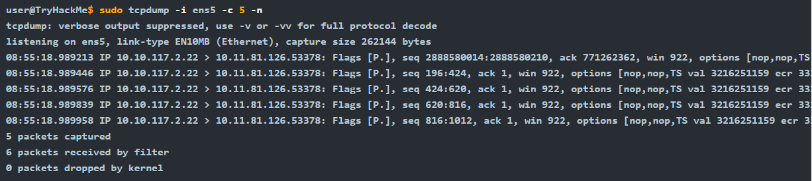

### 5. Produce (More) Verbose Output (_Tạo ra đầu ra chi tiết hơn_)
Nếu bạn muốn in thêm chi tiết về các gói tin, bạn có thể sử dụng `-v` để tạo ra đầu ra chi tiết hơn\
Việc thêm `-v` sẽ in ra _thời gian tồn tại, định danh, tổng chiều dài và các tùy chọn trong một gói IP_ cùng với các kiểm tra khác\
`-vv` sẽ in chi tiết hơn, `-vvv` sẽ in chi tiết hơn nữa

### 6. Tóm tắt

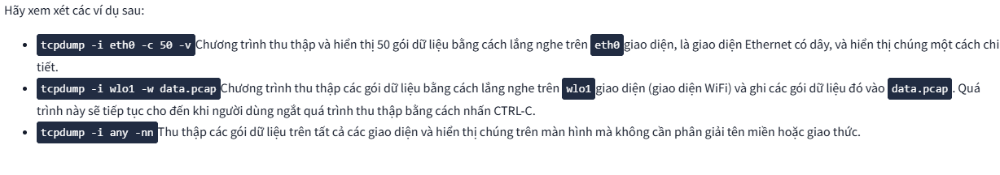

## 3. Filtering Expressions (_Biểu thức lọc_)
Mặc dù bạn có thể chạy _tcpdump_ mà không cần cung cấp bất kỳ biểu thức lọc nào, nhưng điều này sẽ không hữu ích.\
Xét đến số lượng gói tin mà card mạng của chúng ta nhận được, việc xem xét mọi thứ cùng một lúc là không thể; chúng ta cần phải cụ thể và thu thập những gì chúng ta quan tâm để kiểm tra

### 1. Filtering by Host (_Lọc theo Host_)
Giả sử bạn chỉ quan tâm đến các gói _IP_ được trao đổi với _máy in mạng_ hoặc _game server_ cụ thể nào đó. Bạn có thể dễ dàng giới hạn các gói được thu thập chỉ đến máy chủ này bằng cách sử dụng _host IP_ hoặc _host HOSTNAME_\
Trong cửa sổ _terminal_ bên dưới, chúng ta thu thập tất cả các gói được trao đổi với _example.com_ và lưu chúng vào `http.pcap`. Điều quan trọng cần lưu ý là việc thu thập gói yêu cầu bạn phải đăng nhập với tư cách _root_ hoặc sử dụng `sudo`
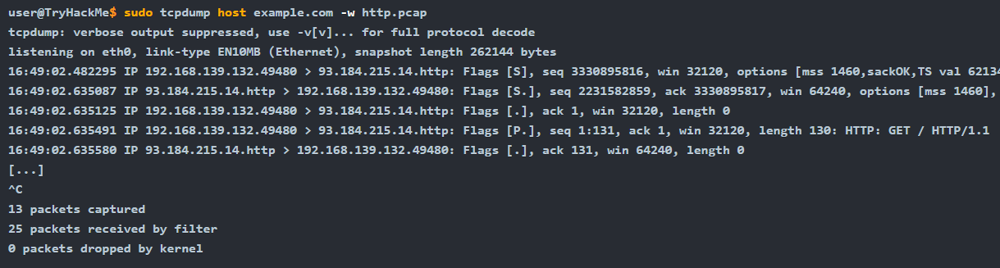

Nếu bạn muốn giới hạn các gói tin chỉ đến từ một địa chỉ _IP_ hoặc tên máy chủ cụ thể, bạn phải sử dụng `src host IP` hoặc `src host HOSTNAME`. Tương tự, bạn có thể giới hạn các gói tin chỉ được gửi đến một đích cụ thể bằng cách sử dụng `dst host IP` hoặc `dst host HOSTNAME`.

### 2. Filtering by Protocol (_Lọc theo giao thức_)
Loại lọc cuối cùng mà chúng ta sẽ đề cập đến là _lọc theo giao thức_. Bạn có thể giới hạn việc thu thập gói tin của mình theo một giao thức cụ thể; ví dụ bao gồm: _ip, ip6, udp, tcp, và icmp_.\
Trong ví dụ bên dưới, chúng ta giới hạn việc thu thập gói tin của mình chỉ ở các gói _ICMP_. Chúng ta có thể thấy một yêu cầu và phản hồi _ICMP echo_, đây có thể là dấu hiệu cho thấy ai đó đang chạy lệnh `ping`.\
Ngoài ra còn có một thông báo _ICMP time exceeded_; điều này có thể do chạy lệnh `traceroute` 
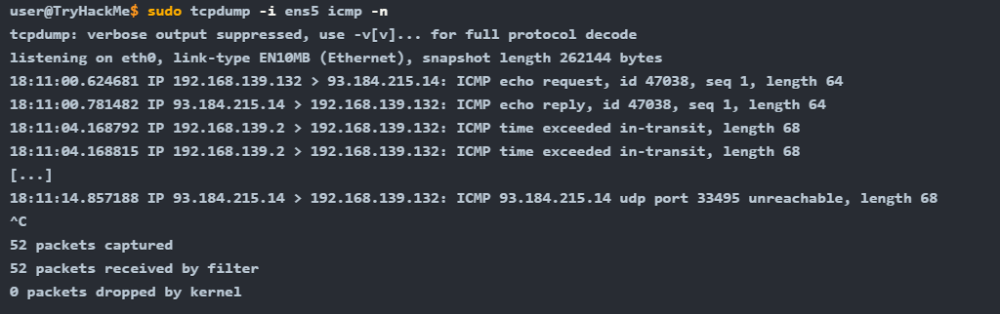

### 3. Logic Operator (_Toán tử logic_)
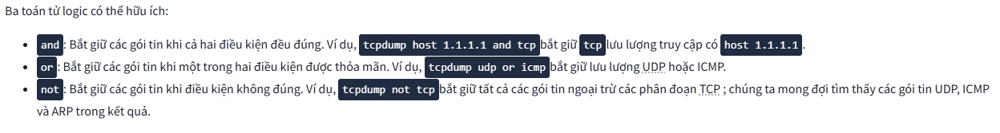

### 4. Tom tắt và ví dụ
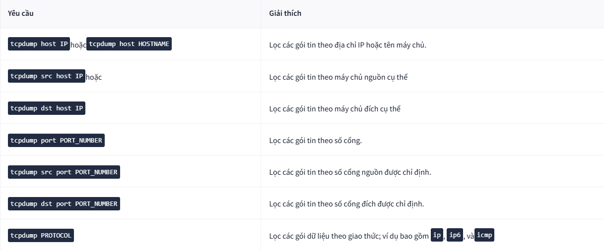
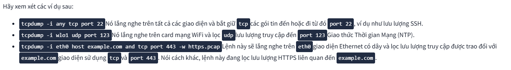

## 4. Advanced Filtering (_Lọc nâng cao_)
Có rất nhiều cách khác để lọc gói dữ liệu. Xét cho cùng, trong bất kỳ tình huống thực tế nào, chúng ta đều cần lọc qua hàng nghìn hoặc thậm chí hàng triệu gói dữ liệu. Việc có thể xác định chính xác các gói dữ liệu cần hiển thị là điều không thể thiếu. Ví dụ, chúng ta có thể giới hạn các gói dữ liệu được hiển thị chỉ bao gồm những gói có độ dài nhỏ hơn hoặc lớn hơn một độ dài nhất định:
- `greater _length`: Lọc các gói tin có độ dài lớn hơn hoặc bằng độ dài được chỉ định.
- `less _length`: Lọc các gói tin có độ dài nhỏ hơn hoặc bằng độ dài được chỉ định

### 1. Binary Operations (_Các phép toán nhị phân_)
Trước khi tiếp tục, chúng ta nên tìm hiểu về các phép toán nhị phân. Phép toán nhị phân hoạt động trên các bit, tức là các số `0` và `1`. Một phép toán nhận vào một hoặc hai bit và trả về một bit. Hãy cùng giải thích chi tiết hơn và xem xét ba phép toán nhị phân sau: `&`, `|`, và `!`.

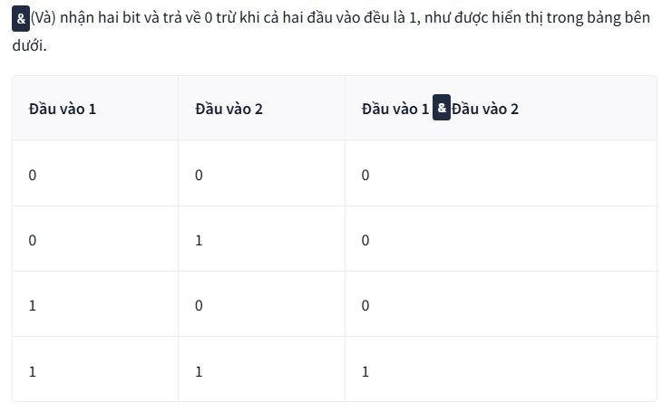
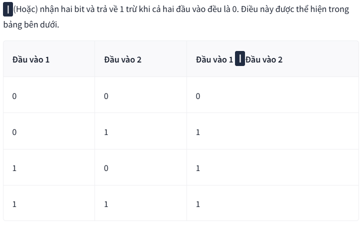
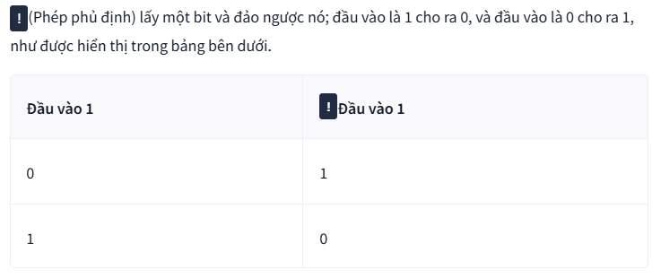

### 2. Header Bytes 
Mục đích của phần này là để có thể lọc các gói tin dựa trên nội dung của một byte tiêu đề. Hãy xem xét các giao thức sau: _ARP, Ethernet, ICMP, IP, TCP và UDP_. Đây chỉ là một vài giao thức mạng mà chúng ta đã nghiên cứu. Làm thế nào chúng ta có thể hướng dẫn _tcpdump_ lọc các gói tin dựa trên nội dung của các byte tiêu đề giao thức? _(Chúng ta sẽ không đi sâu vào chi tiết về tiêu đề của từng giao thức vì điều này nằm ngoài phạm vi của phần này; thay vào đó, chúng ta sẽ tập trung vào các cờ __TCP__.)_

Sử dụng _pcap-filter_, `Tcpdump` cho phép bạn tham chiếu đến nội dung của bất kỳ byte nào trong phần tiêu đề bằng cú pháp sau `proto[expr:size]`, trong đó:
- `proto` đề cập đến giao thức. Ví dụ: _arp, ether, icmp, ip, ip6, tcp, udp_
- `expr` vị trí byte, trong đó `0` đề cập đến _byte đầu tiên_
- `size` cho biết số byte mà chúng ta quan tâm, có thể là _một, hai hoặc bốn_. Tham số này là tùy chọn và mặc định là _một_.

Để hiểu rõ hơn điều này, hãy xem xét hai ví dụ sau từ trang hướng dẫn sử dụng _pcap-filter_:
- `ether[0] & 1 != 0`: Hàm này lấy byte đầu tiên trong tiêu đề _Ethernet_ và số thập phân 1 (_tức là 0000 0001 trong hệ nhị phân_) và áp dụng phép `&`(_toán AND_). Nó sẽ trả về `true` nếu kết quả không bằng `0` (_tức là 0000 0000_). Mục đích của bộ lọc này là để hiển thị các gói tin được gửi đến _multicast_. Địa chỉ _Ethernet multicast_ là một địa chỉ cụ thể xác định một nhóm thiết bị dự định nhận cùng một dữ liệu.
- `ip[0] & 0xf != 5`: Hàm này lấy byte đầu tiên trong tiêu đề IP và so sánh nó với số thập lục phân `F` (_tức là 0000 1111 trong hệ nhị phân_). Nó sẽ trả về `true` nếu kết quả không bằng số `5`(thập phân) (_tức là 0000 0101 trong hệ nhị phân_). Mục đích của bộ lọc này là để bắt tất cả các gói _IP_ có tùy chọn.

Đừng lo lắng nếu bạn thấy hai ví dụ trên phức tạp. Chúng tôi đưa chúng vào để bạn biết bạn có thể đạt được điều gì; tuy nhiên, việc hiểu đầy đủ các ví dụ trên không cần thiết để hoàn thành nhiệm vụ này. Thay vào đó, chúng ta sẽ tập trung vào việc lọc các gói _TCP_ dựa trên các _TCP flag_ đã thiết lập.

Bạn có thể sử dụng `tcp[tcpflags]` để tham chiếu đến trường _TCP flag_ . Các _TCP flag_ sau đây có sẵn để so sánh:
- `tcp-syn` TCP SYN (Đồng bộ hóa)
- `tcp-ack` TCP ACK (Xác nhận)
- `tcp-fin` TCP FIN (Kết thúc)
- `tcp-rst` TCP RST (Khởi động lại)
- `tcp-push` TCP Push
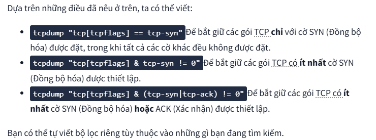

## 5. Display packets
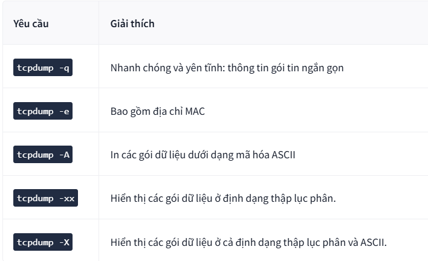