# nmap
## 1. Giới thiệu
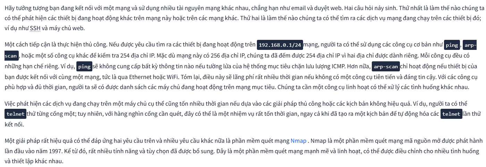

### Mục tiêu
Phòng học này nhằm cung cấp cho bạn những kiến ​​thức cơ bản cần thiết để sử dụng công cụ quét `Nmap`:
- _Tìm máy đang hoạt động_
- _Tìm dịch vụ đang chạy_
- _Phân biệt kiểu quét cổng_
- _Xác định phiên bản dịch vụ_
- _Điều chỉnh tốc độ quét_
- _Định dạng kết quả_

## 2. Host Discovery: Who Is Online
Nmap sử dụng nhiều cách để chỉ định mục tiêu của nó:\
- Sử dụng phạm vi _IP_ `-`: Nếu bạn muốn quét tất cả các địa chỉ _IP_ từ `192.168.0.1` đến `192.168.0.10`, bạn có thể viết như sau: `192.168.0.1-10`
- Sử dụng mạng con _IP_ `/` : Nếu bạn muốn quét một mạng con, bạn có thể biểu diễn nó dưới dạng `192.168.0.1/24`, và điều này sẽ tương đương với `192.168.0.0-255`
- __Host name__: Bạn cũng có thể chỉ định mục tiêu của mình bằng tên máy chủ, ví dụ: `example.thm`

Có thể dử dụng `-sn` có tác dụng tương tự như `ping`

### 1. Scanning a “Local” Network(_Quét mạng cục bộ_)
Trong ngữ cảnh này, chúng ta sử dụng thuật ngữ “_cục bộ_” để chỉ mạng mà chúng ta kết nối trực tiếp, chẳng hạn như mạng _Ethernet_ hoặc _WiFi_. Trong ví dụ đầu tiên, chúng ta sẽ quét mạng _WiFi_ mà chúng ta đang kết nối. Địa chỉ _IP_ của chúng ta là `192.168.66.89`, và chúng ta đang quét mạng `192.168.66.0/2` . Lệnh `nmap -sn 192.168.66.0/24` và kết quả của nó được hiển thị trong cửa sổ terminal bên dưới.
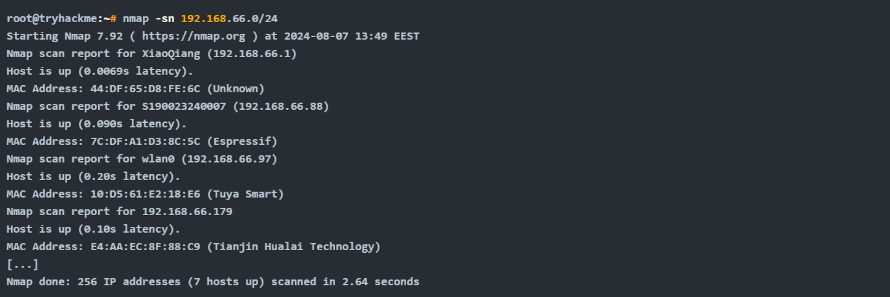

Vì chúng ta đang quét mạng cục bộ, nơi chúng ta kết nối qua _Ethernet_ hoặc _WiFi_, nên chúng ta có thể tra cứu địa chỉ _MAC_ của các thiết bị. Do đó, chúng ta có thể xác định được nhà sản xuất card mạng, đây là thông tin hữu ích vì nó có thể giúp chúng ta đoán được loại thiết bị mục tiêu.

Khi quét một mạng được kết nối trực tiếp, `Nmap` bắt đầu bằng cách gửi các yêu cầu _ARP_. Khi một thiết bị phản hồi yêu cầu _ARP_, `Nmap` sẽ gắn nhãn cho thiết bị đó là “_Host is up_”.

### 2. Scanning a “Remote” Network(_Quét mạng từ xa_)
Hãy xem xét trường hợp của một mạng "từ xa". Trong ngữ cảnh này, "từ xa" có nghĩa là ít nhất một bộ định tuyến ngăn cách hệ thống của chúng ta với mạng này. Do đó, tất cả lưu lượng truy cập của chúng ta đến các hệ thống mục tiêu phải đi qua một hoặc nhiều bộ định tuyến. Không giống như việc quét mạng cục bộ, chúng ta không thể gửi yêu cầu ARP đến mục tiêu.

Hệ thống của chúng ta có địa chỉ IP `192.168.66.89` và thuộc về `192.168.66.0/24` mạng này. Trong cửa sổ dòng lệnh bên dưới, chúng ta sẽ quét mạng mục tiêu, `192.168.11.0/24` nơi có từ hai bộ định tuyến (hop) trở lên ngăn cách hệ thống cục bộ của chúng ta với các máy chủ mục tiêu.
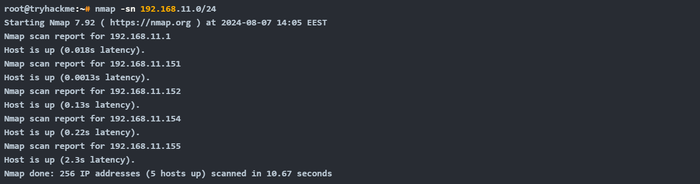

Kết quả đầu ra của `Nmap` cho thấy năm máy chủ đang hoạt động. Nhưng làm thế nào `Nmap` phát hiện ra điều này? Để tìm hiểu thêm, hãy xem một số lưu lượng truy cập mẫu do `Nmap` tạo ra . Trong ảnh chụp màn hình bên dưới, chúng ta có thể thấy phản hồi từ hai máy chủ:
- `192.168.11.1` Hiện đang hoạt động và đã phản hồi yêu cầu ICMP echo (ping).
- `192.168.11.2` Có vẻ như hệ thống đang gặp sự cố. `Nmap` đã gửi hai yêu cầu _ICMP echo_ (ping), hai yêu cầu _ICMP timestamp_, hai gói _TCP_ đến cổng _443_ với cờ _SYN_ được đặt và hai gói _TCP_ đến cổng _80_ với cờ _ACK_ được đặt. Mục tiêu không phản hồi bất kỳ gói nào. Chúng tôi quan sát thấy một số gói _ICMP_ báo lỗi "_unreachable_" từ bộ định tuyến `192.168.11.151`.
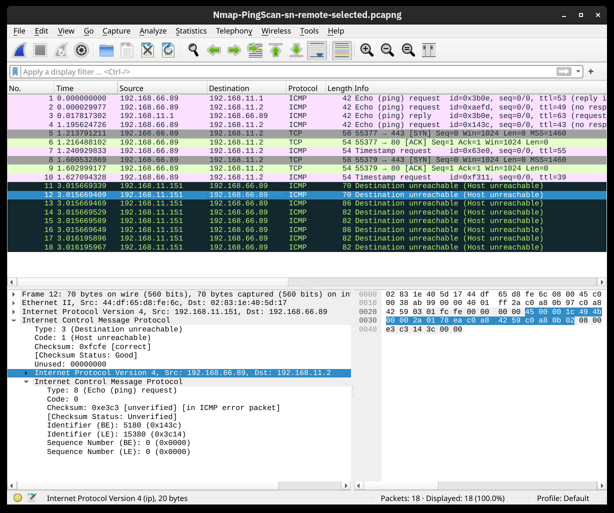

Chúng ta có thể kiểm soát nhiều hơn cách Nmap phát hiện các máy chủ đang hoạt động, chẳng hạn như `-PS[portlist]`, `-PA[portlist]`, `-PU[portlist]`đối với _TCP SYN, TCP ACK và UDP_ thông qua các cổng đã cho

`-sL` list ra một danh sách các _IP_ sẽ scan chứ chưa scan(_chỉ là những IP sẽ scan, chưa hành động_) 

## 3. Port Scanning: Who Is Listening
Trước đây, chúng ta đã `-sn` tìm ra các máy chủ đang hoạt động. Trong nhiệm vụ này, chúng ta muốn tìm ra các dịch vụ mạng đang lắng nghe trên các máy chủ đó. Dịch vụ mạng ở đây được hiểu là bất kỳ tiến trình nào đang lắng nghe các kết nối đến trên cổng _TCP hoặc UDP_. Các dịch vụ mạng phổ biến bao gồm máy chủ web, thường lắng nghe trên các cổng _TCP_ _80 và 443_, và _máy chủ DNS_, thường lắng nghe trên cổng _UDP (và TCP) 53_.

Theo thiết kế, TCP có `65.535` cổng, và _UDP_ cũng vậy. Làm thế nào chúng ta có thể xác định được cổng nào đang được một dịch vụ liên kết? Hãy cùng tìm hiểu

### 1. Scanning TCP Ports
Cách dễ nhất và cơ bản nhất để biết một cổng _TCP_ có mở hay không là thử kết nối đến _telnet_ cổng đó. Nếu bạn muốn quét bằng trình khách _telnet_, hãy thử thiết lập kết nối _TCP_ với mọi cổng mục tiêu. Nói cách khác, bạn cố gắng hoàn thành quá trình bắt tay ba bước _TCP_ với mọi cổng mục tiêu; tuy nhiên, chỉ những cổng _TCP_ đang mở mới phản hồi thích hợp và cho phép thiết lập kết nối _TCP_ . Quy trình này không khác nhiều so với quét kết nối của `Nmap`.

Trong ảnh chụp màn hình bên dưới, máy quét của chúng tôi có địa chỉ _IP_ `192.168.124.148` và hệ thống mục tiêu có cổng _TCP_ 22 đang mở và cổng 23 đang đóng. Ở phần được đánh dấu số `1`, bạn có thể thấy quá trình bắt tay ba bước _TCP_ đã hoàn tất và sau đó bị ngắt quãng bằng gói tin _TCP RST-ACK_ bởi `Nmap`. Phần được đánh dấu số `2` cho thấy một nỗ lực kết nối đến một cổng đang đóng, và hệ thống mục tiêu đã phản hồi bằng gói tin _TCP RST-ACK_.
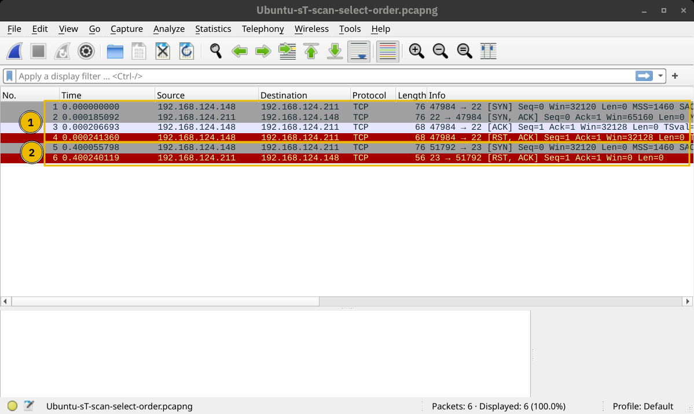

### 2. SYN Scan (Stealth)
Không giống như quét kết nối, vốn cố gắng kết nối đến cổng _TCP_ mục tiêu , tức là hoàn thành _quá trình bắt tay ba bước_, _SYN scan_ chỉ thực hiện bước đầu tiên: nó gửi một gói _TCP_ SYN. ​​Do đó, quá trình bắt tay ba bước _TCP_ không bao giờ được hoàn thành. Ưu điểm là điều này được kỳ vọng sẽ dẫn đến ít _log_ hơn vì kết nối không bao giờ được thiết lập, và do đó, nó được coi là một kiểu quét tương đối kín đáo. Bạn có thể chọn _SYN scan_ bằng cách sử dụng `-sS`.

Trong ảnh chụp màn hình bên dưới, chúng tôi quét cùng một hệ thống với cổng `22` đang mở. Phần được đánh dấu số `1` cho thấy dịch vụ đang lắng nghe phản hồi bằng gói _TCP SYN-ACK_. Tuy nhiên, Nmap đã phản hồi bằng gói _TCP RST_ thay vì hoàn tất quá trình bắt tay ba bước _TCP_. Phần được đánh dấu số `2` cho thấy nỗ lực kết nối _TCP_ đến một cổng đã đóng. Trong trường hợp này, quá trình trao đổi gói tin giống như trong quá trình quét kết nối.
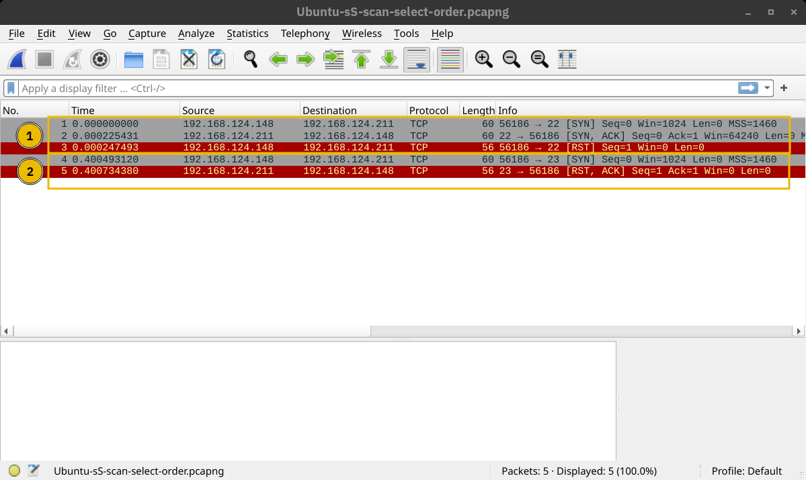

### 3. Scanning UDP Ports
Mặc dù hầu hết các dịch vụ sử dụng _TCP_ để liên lạc, nhưng nhiều dịch vụ lại sử dụng _UDP_. Ví dụ như _DNS, DHCP, NTP (Giao thức thời gian mạng), SNMP (Giao thức quản lý mạng đơn giản) và VoIP (Thoại qua IP)_. _UDP_ không yêu cầu thiết lập kết nối và ngắt kết nối sau đó. Hơn nữa, nó rất phù hợp cho giao tiếp thời gian thực, chẳng hạn như phát sóng trực tiếp. Tất cả những lý do này đều đáng để xem xét việc quét và phát hiện các dịch vụ đang lắng nghe trên các cổng _UDP_.

`Nmap` cung cấp tùy chọn `-sU` quét các dịch vụ _UDP_ . Vì _UDP_ đơn giản hơn _TCP_ , chúng ta dự đoán lưu lượng truy cập sẽ khác nhau. Ảnh chụp màn hình bên dưới hiển thị một số phản hồi _ICMP_ đích không thể truy cập (cổng không thể truy cập) khi `Nmap` gửi các gói _UDP_ đến các cổng _UDP_ bị đóng .(_Port nào phản hồi thì port đó không hoạt động_)
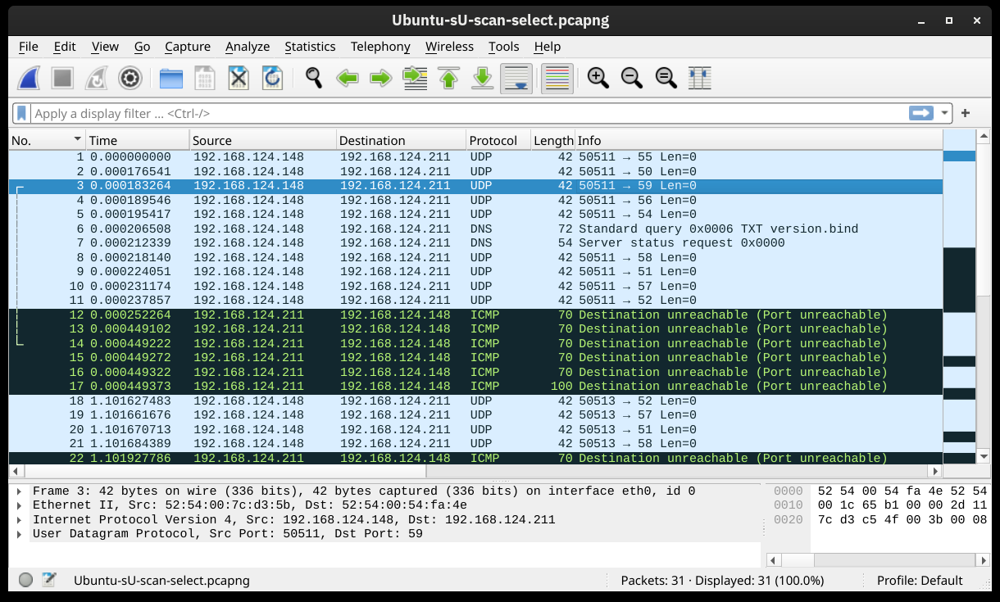

### 4. Limiting the Target Ports
Theo mặc định, `Nmap` quét `1.000` cổng phổ biến nhất. Tuy nhiên, đây có thể không phải là điều bạn đang tìm kiếm. Do đó, `Nmap` cung cấp cho bạn thêm một vài tùy chọn khác.

- `-F` Tùy chọn này dành cho _chế độ Nhanh_, quét `100` cổng phổ biến nhất (_thay vì 1000 cổng mặc định_).

- `-p[range]` Cho phép bạn chỉ định một phạm vi cổng để quét. Ví dụ, `-p10-1024` lệnh này quét từ cổng `10 đ`ến cổng `1024`, trong khi lệnh `-p-25` sẽ quét tất cả các cổng từ `1` đến `25`. \
_*Lưu ý_ rằng lệnh `-p-` quét tất cả các cổng và tương đương với lệnh `-p1-65535`, và là lựa chọn tốt nhất nếu bạn muốn quét kỹ càng nhất có thể.\
_Mẹo_: Các dịch vụ phổ biến nhất sử dụng số cổng từ `1` đến `1024` cho cả _UDP_ hoặc _TCP_. Các cổng này còn được gọi là __well-known ports__ . Sử dụng `-p1-1023` lệnh để quét các cổng nổi tiếng.

#### 5. Tổng hợp
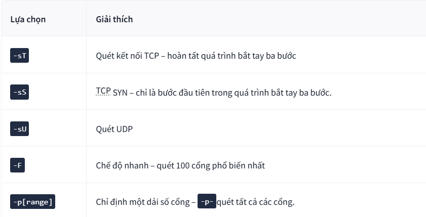

## 4. Version Detection: Extract More Information(_Xác định phiên bản và những thông tin khác_)
### 1. OS Detection
Bạn có thể xác định phát hiện hệ điều hành bằng cách thêm `-O`. Như tên gọi, tùy chọn phát hiện hệ điều hành cho phép `Nmap` dựa vào nhiều chỉ báo khác nhau để đưa ra dự đoán chính xác về hệ điều hành của mục tiêu. Trong trường hợp này, nó phát hiện mục tiêu đang chạy _Linux 4.x hoặc 5.x_. Điều đó thực sự đúng. Tuy nhiên, không có trình phát hiện hệ điều hành nào hoàn toàn chính xác. Nhận định rằng nó nằm trong khoảng từ `4.15` đến `5.8` là rất gần đúng vì hệ điều hành của máy chủ mục tiêu là `5.15`.
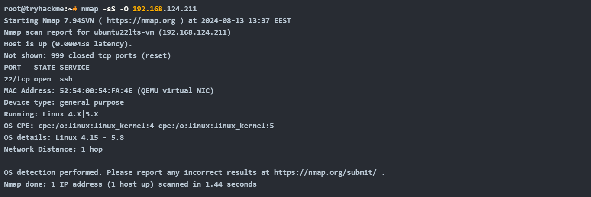

### 2. Service and version Detection
Bạn đã phát hiện một số cổng mở và muốn biết dịch vụ nào đang lắng nghe trên chúng. `-sV` cho phép phát hiện phiên bản. Điều này rất tiện lợi để thu thập thêm thông tin về mục tiêu của bạn chỉ với ít thao tác gõ phím hơn. Kết quả đầu ra trên terminal bên dưới hiển thị một cột bổ sung có tên “_VERSION_”, cho biết phiên bản máy chủ `SSH` được phát hiện.
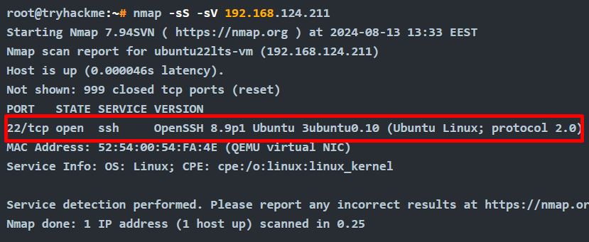

Thêm cả `-sV -O` = `-A`

### 3. Forcing the Scan(Bắt buộc quét)
Khi sử dụng `-sS`, `nmap` sẽ bỏ qua quét port nếu máy đó xác định rằng không hoạt động\
Khi ta muốn quét port của những host kể cả không hoạt động thì dùng `-Pn`(_no ping_)

### 4. Tóm tắt
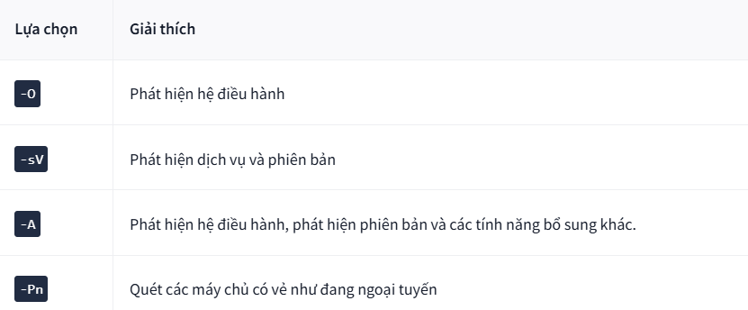

## 5. Timing: How Fast is Fast
`Nmap` cung cấp nhiều tùy chọn để kiểm soát tốc độ và thời gian quét.

Chạy quá trình quét ở tốc độ bình thường có thể _kích hoạt hệ thống phát hiện xâm nhập (IDS)_ hoặc các giải pháp bảo mật khác. Việc kiểm soát tốc độ quét là điều hợp lý. `Nmap` cung cấp cho bạn `6` mẫu thời gian, và tên gọi của chúng đã nói lên tất cả: `paranoid` (0), `sneaky` (1), `polite` (2), `normal` (3), `aggressive`(4) và `insane` (5). Bạn có thể chọn mẫu thời gian bằng _tên_ hoặc _số_ của nó. Ví dụ, bạn có thể thêm `-T0`(hoặc `-T 0`) hoặc `-T paranoid` để chọn thời gian chậm nhất.

Trong các kết quả quét `Nmap` bên dưới, chúng tôi thực hiện `scan SYN` nhắm mục tiêu vào _100_ cổng _TCP phổ biến nhất_ `Nmap -sS 10.48.144.247 -F`. Chúng tôi lặp lại quá trình quét với các thời điểm khác nhau: _T0, T1, T2, T3 và T4_. Trong thiết lập phòng thí nghiệm của chúng tôi, `Nmap` mất các khoảng thời gian khác nhau để quét `100` cổng. Bảng bên dưới sẽ cung cấp cho bạn một ý tưởng, nhưng bạn sẽ nhận được các kết quả khác nhau tùy thuộc vào thiết lập mạng và hệ thống mục tiêu.
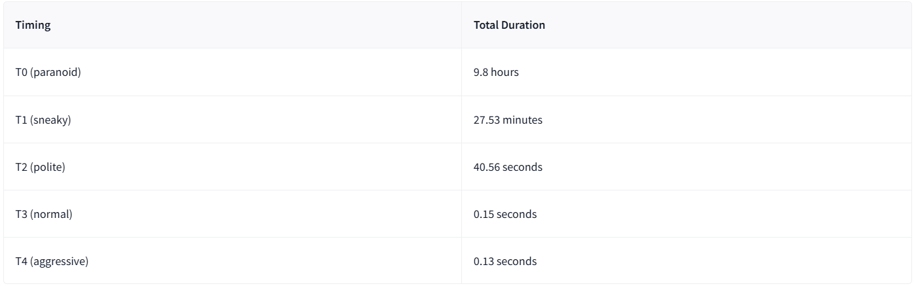

Trong các ảnh chụp màn hình sau đây, chúng ta có thể thấy thời gian `Nmap` gửi các gói tin khác nhau. Trong ảnh chụp màn hình bên dưới, với thời gian quét là `T0`, chúng ta có thể thấy rằng `Nmap` đã đợi `5 phút` trước khi chuyển sang cổng tiếp theo.
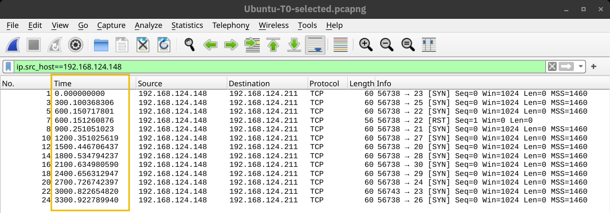

Tương tự:
- `T1`: `15s`
- `T2`: `0.4s`
- `T3`: _Được coi như là nhanh nhất có thể_
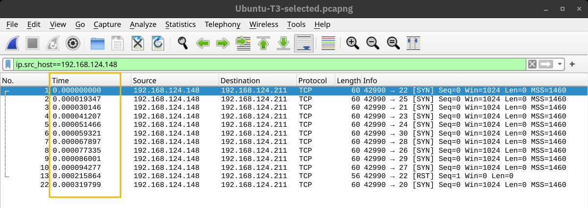

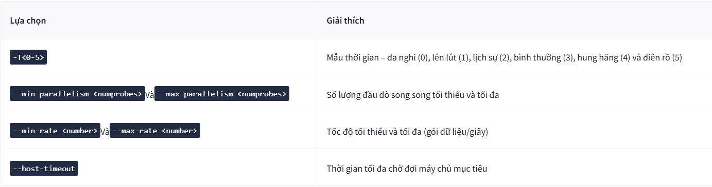

## 6. Output: Controlling What You See(_Kiểm soát những gì nhìn thấy_)
Nhiệm vụ này tập trung vào hai khía cạnh chính:
- _Hiển thị thông tin bổ sung trong khi quá trình quét đang diễn ra._
- _Chọn định dạng tệp để lưu báo cáo quét_

### 1. Verbosity and Debugging
Trong nhiều trường hợp việc quét diễn ra rất lâu, lúc đó ta cần in một số thông tin ra để theo dõi quá trình quét, khi đó ra sử dụng tham số `-v`(_Verbose_)

Chúng ta có thể thấy `Nmap` chuyển từ giai đoạn này sang giai đoạn khác: _quét ping ARP, phân giải DNS song song_ và cuối cùng là _SYN scan_ ẩn cho mọi máy chủ đang hoạt động.

Có thể xem chi tiết hơn bằng cách thêm nhiều kí tự `v` ví dụ `-vv`, `-vvv`..., có thể ghi `-v2`, `-v3`

Nếu muốn in thêm nhiều thông tin nữa thì có thể thêm tham số `-d` hiển thị ở chế độ `Debug`. Tương tự như `-v` thì `-d` cũng có thể chi tiết hơn dạng `-d1`,... và tối đa là `-d9`

### 2. Saving Scan Report
Trong nhiều trường hợp, chúng ta cần lưu lại kết quả quét. `Nmap` cung cấp cho chúng ta nhiều định dạng khác nhau. `3` định dạng hữu ích nhất là đầu ra `normal` (_dễ đọc_), `XML` và _đầu ra có thể lọc bằng grep_,(có thể dùng _grep_ để tìm kiếm). Bạn có thể chọn định dạng báo cáo quét như sau:
- `-oN <filename>`- Đầu ra bình thường
- `-oX <filename>`- Đầu ra XML
- `-oG <filename>-`-`grep` Đầu ra có thể (hữu ích cho grepvà awk)
- `-oA <basename>`- Xuất ra tất cả các định dạng chính.

In the terminal below, we can see an example of using the `-oA` option. It resulted in three reports with the extensions `nmap`, `xml`, and `gnmap` for _normal, XML, and grep-able_ output.

