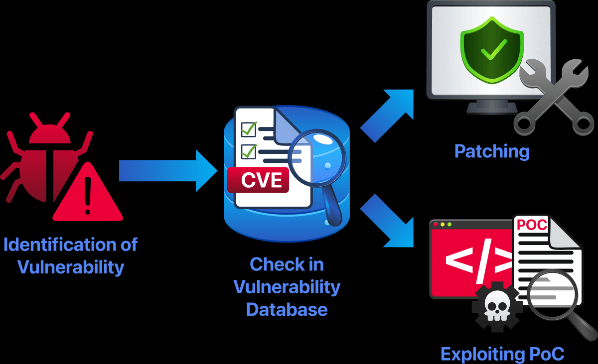

# **Understanding Vulnerability Databases**
## **1. Introduction**
**Vulnerability databases** là cơ sở dữ liệu lưu trữ các lỗ hổng đã được công bố bởi cộng đồng an ninh mạng. Thay vì tất cả các đội an ninh mạng tìm ra các vấn đề lặp lại, vulnerability databases cung cấp 1 nguồn chia sẻ thông tin tin cậy của cộng đồng an ninh mạng

## **2. Why we user Vulnerability databases**
Trước khi Vulnerability databases tồn tại, những đội ngũ bảo mật thường làm việc một cách độc lập, những lỗ hổng được tìm thấy nhiều lần bởi nhiều người khác nhau, họ mô tả bằng những tên khác, vá một cách không rõ ràng có thể dẫn đến những nghiêm trọng hoặc hiểu lầm vấn đề bảo mật

Sử dụng Vulnerability DB sẽ giúp làm việc một cách chuyên nghiệp:
- Tránh việc trùng lặp những vấn đề đã biết
- Sử dụng tên lỗ hổng một cách nhất quán thông qua tool và đội ngũ
- Luôn nhận thức được các bản và có lời khuyên tốt nhất

## **3. Key Building Blocks**
Cơ sở dữ liệu lỗ hổng sử dụng các tiêu chuẩn chung để xác định, đánh giá và quản lý các vấn đề bảo mật.

### CVE – Mã định danh lỗ hổng

* **CVE (Common Vulnerabilities and Exposures)** cung cấp mã duy nhất cho mỗi lỗ hổng.
* Giúp các công cụ, báo cáo và cơ sở dữ liệu cùng tham chiếu chính xác một lỗ hổng.
* Ví dụ: `CVE-2021-44228` là lỗ hổng **Log4Shell**.

### CVSS – Điểm mức độ nghiêm trọng

* **CVSS (Common Vulnerability Scoring System)** đánh giá mức độ nghiêm trọng từ **0 đến 10**.
* Điểm dựa trên khả năng khai thác và mức độ ảnh hưởng.
* Ví dụ: CVSS `9.8` được xem là **nghiêm trọng – Critical**.

### CPE – Xác định sản phẩm bị ảnh hưởng

* **CPE (Common Platform Enumeration)** chuẩn hóa tên nhà cung cấp, sản phẩm và phiên bản.
* Giúp xác định chính xác phiên bản phần mềm nào có lỗ hổng.

### CWE – Phân loại điểm yếu

* **CWE (Common Weakness Enumeration)** phân loại nguyên nhân gốc gây ra lỗ hổng.
* Ví dụ: `CWE-94` là lỗi kiểm soát không đúng quá trình tạo mã, có thể dẫn đến **Code Injection**.

### CNA – Tổ chức cấp mã CVE

* **CNA (CVE Numbering Authority)** là tổ chức được phép cấp mã CVE.
* Ví dụ: Microsoft có thể cấp CVE cho các lỗ hổng trong Windows và dịch vụ của Microsoft.

### Metadata – Thông tin bổ sung

Một bản ghi lỗ hổng thường chứa:

* Mô tả kỹ thuật.
* Liên kết tham khảo.
* Sản phẩm bị ảnh hưởng.
* Hướng dẫn vá hoặc khắc phục.

### Severity và Risk

* **Severity – Mức độ nghiêm trọng:** Tác động kỹ thuật của lỗ hổng.
* **Risk – Rủi ro:** Mức ảnh hưởng thực tế đối với một hệ thống cụ thể.

Ví dụ: Lỗ hổng nghiêm trọng trên máy thử nghiệm bị cô lập có thể ít rủi ro hơn lỗ hổng trung bình trên máy chủ thật được công khai trên Internet.

## **4. Danh sách CVE**

**CVE List** là danh mục công khai các lỗ hổng bảo mật đã biết. Mỗi lỗ hổng được cấp một mã riêng để có thể tham chiếu thống nhất trong các công cụ, báo cáo và cơ sở dữ liệu.

### Vai trò của MITRE

* CVE List được duy trì bởi **MITRE**.
* MITRE phối hợp với nhà cung cấp và nhà nghiên cứu để cấp mã CVE.
* MITRE chỉ chuẩn hóa và theo dõi tên lỗ hổng, không trực tiếp đánh giá mức độ nghiêm trọng hoặc đưa ra cách khắc phục.

### Thông tin trong một bản ghi CVE

Một CVE thường bao gồm:

* Mã định danh.
* Mô tả ngắn về lỗ hổng.
* Nhà cung cấp hoặc sản phẩm bị ảnh hưởng.
* Điểm CVSS và phiên bản bị ảnh hưởng nếu được cung cấp.

### Ví dụ: CVE-2026-22869

* Ngày công bố và cập nhật: `13/01/2026`.
* Cho phép thực thi mã tùy ý trong **Eigent** thông qua GitHub Actions.
* Thuộc `CWE-94`, tức lỗi kiểm soát không đúng quá trình tạo mã, dẫn đến **Code Injection**.
* Điểm `CVSS 4.0: 8.9 – High`.
* Có thể bị khai thác từ xa, không cần đăng nhập hoặc tương tác từ người dùng.
* Ảnh hưởng đến sản phẩm `eigent` của `eigent-ai` trước commit được chỉ định.

### Hạn chế của CVE List

CVE List cung cấp thông tin có cấu trúc về lỗ hổng, mức độ nghiêm trọng, loại điểm yếu và sản phẩm bị ảnh hưởng. Tuy nhiên, nó có thể không chứa:

* Cách khai thác chi tiết.
* Mã minh họa PoC.
* Hướng dẫn giảm thiểu hoặc vá lỗi.

Những thông tin này thường phải tìm thêm từ tài liệu của nhà cung cấp hoặc các nguồn nghiên cứu bảo mật.
