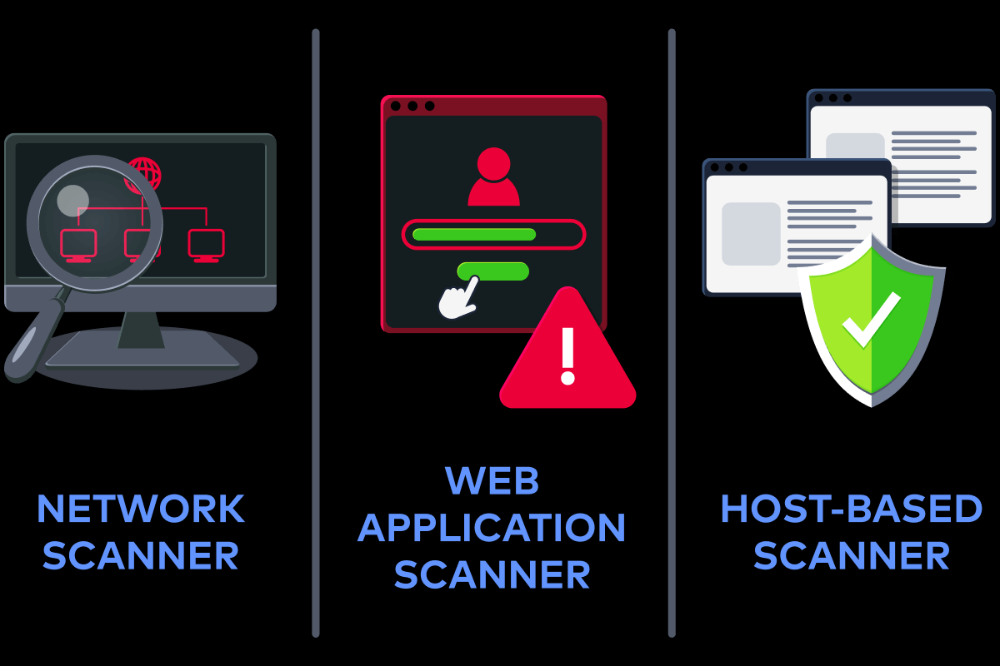
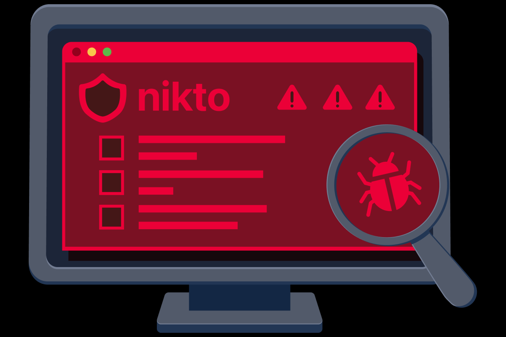
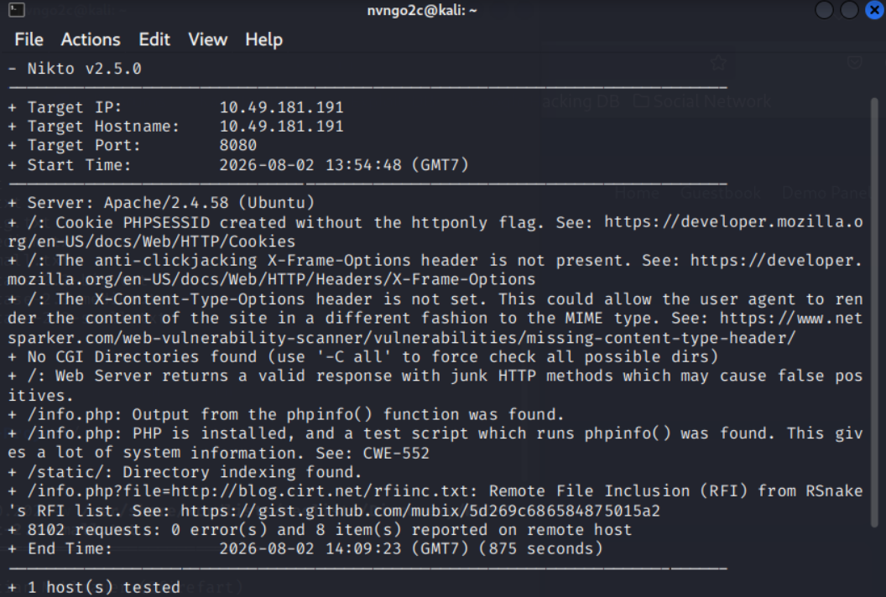

# **Vulnerability Scanning Tools**
## **1. Important Topics**
### **Core Terminology**
- **Vulnerability** là một điểm yếu hoặc khiếm khuyết trong hệ thống có thể bị khai thác để vượt qua hàng rào bảo mật hoặc truy cập trái phép
- **Common Vulnerabilities and Exposures (CVE)** là số định danh được chỉ định cho một điểm yếu bảo mật đã được công bố, nó giúp đảm bảo sự nhất quán giữ các tool và DB, nó cũng cho phép những đội ngũ bảo mật có thể tìm kiếm nhanh chóng những vấn đề bảo mật
- **Common Vulnerability Scoring System (CVSS)** cung cấp điểm số từ 0 đến 10 biểu thị mức độ nghiêm trọng và rủi ro của một lỗ hổng
- **Misconfiguration** xảy ra khi một hệ thống hoặc dịch vụ được cài đặt không chính xác và nó tạo ra những lỗ hổng bảo mật không đáng có
- **Software Vulnerability** là một khiếm khuyết trong trong code của app hoặc lỗi logic cho phép thực hiện những hành động không mong muốn hoặc có thể khai thác

---

### **Types of Vulnerability Scanners **


- **Network Scanner**: xác định những dịch vụ và port được mở, dịch vụ chạy, những điểm được mở ra
- **Web Application Scanner**: phân tích web hoặc những vấn đề bảo mật của web, bao gồm những thành phần lỗi thời, cấu hình lỗi, hành vi rủi ro. Nó hoạt động chủ yếu trên tầng 7 của **OSI**
- **Host-Based Scanner** chạy trực tiếp trên hệ thông để kiểm tra những bản vá, những phần mềm lỗi thời và những cấu hình kém bảo mật

## **2. Nmap**
(Đã tìm hiểu chi tiết ở module [Nmap](https://github.com/ngngocatr/tryhackme-notes/tree/main/Nmap))

## **3. Nikto Web Scanner**
Nikto cũng là một công cụ scan cho phép ta xác định liệu rằng web có tồn tại những điểm yếu đã được công bố 



### **Scanning the Environment**
```bash
nikto -h http://10.49.181.191:8080
```



### **Understanding the Nikto Scan Results**
Sau khi chạy Nikto trên mục tiêu, nó sẽ xác định một số vấn đề liên quan đến cấu hình sai, những thông tin không cần thiết bị lộ

- **Web Server Information Disclosure (Server: Apache/2.4.58)** phát hiện chính xác phiên bản của server, đó là thông tin hữu ích giúp attacker có thể khai thác bằng những lỗ hổng đã biết
- **Cookie Missing Security Flags (PHPSESSID created without the HttpOnly flag)**: cookie có thể bị script phía client đọc 
- **Missing Clickjacking Protection (X-Frame-Options header not present):** không có header đó sẽ khiến web có thể bị nhúng vào một trang web khác và có thể tồn tại lỗ hổng **clickjacking**
- **Potentially Dangerous HTTP Method (DEBUG HTTP verb available)**: vẫn còn phương thức DEBUG được cho phép, điều này có thể khiến web lộ khá nhiều thông tin nhạy cảm
- **Exposed PHP Info Page (/info.php found running phpinfo())**: `phpinfo()` file này sẽ làm lộ một số thông tin về hệ thống, module, biến môi trường và những thứ đáng ra phải được ẩn đi trên môi trường sản phẩm
- **Directory Indexing Enabled (/static/ directory indexing)**: web vẫn mở Directory Listing cho phép không giới hạn người dùng có thể đọc và biết được tất cả những file có trong thư mục đó
- **Remote File Inclusion (RFI) Test Detected (info.php?file=<external_link>):** phát  hiện ra lỗ hổng RFI do không xử li đúng cách, điều đó có thể giúp attacker có thể khai thác và chiếm quyền máy chủ


