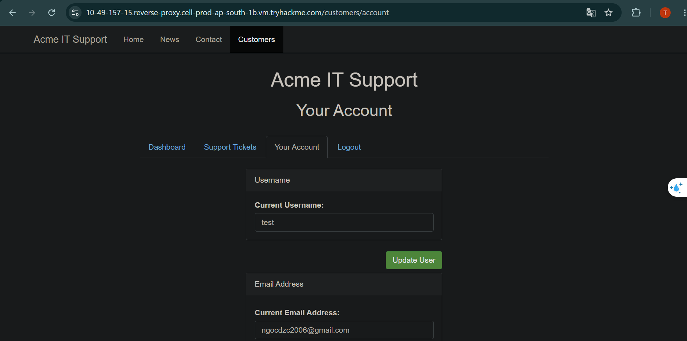
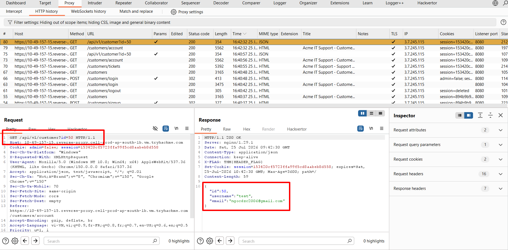
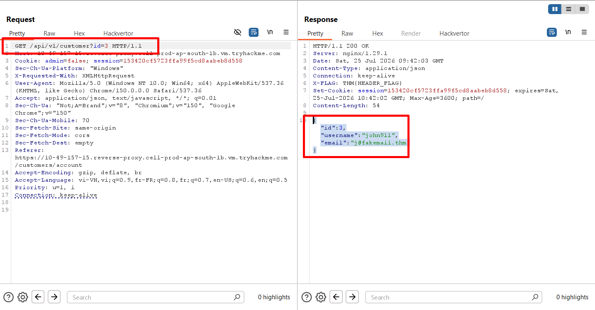

# **IDOR**
## **1. What is an IDOR**
- **IDOR** (*Insecure Direct Object Reference*) là một lỗ hổng thuộc thể loại truy cập trái phép
- Điểm nổi bật của lỗ hổng này là cách khai thác nó quá đơn giản nhưng những tác động của nó thì vô cùng lớn, nó có thể dân đến việc làm lộ thông tin hàng loạt thâm chí là chiếm đoạt hàng loạt tài khoản tùy thuộc vào endpoint của web

## **2. An IDOR Example**
- Một lỗ hổng IDOR xảy ra khi web sử dụng 1 tham số trực tiếp từ URL để truy vấn trên DB mà có bất kì kiếm tra phân quyền nào
- Ví dụ: Web có chức năng xem Profile cá nhân và URL cua nó có dạng

```url
http://online-service.thm/profile?user_id=1305
```

- Tham số `user_id` nói với server rằng lấy truy vấn và lấy bản ghi `1305`
- Giả định ta thay đổi giá trị của tham số sang `1000`

```url
http://online-service.thm/profile?user_id=1000
```

- Nếu kết quả nó xem được trang cá nhân của người khác, tức là đã tồn tại lỗ hổng IDOR
- Nguyên nhân không phải là do cơ chế xác thực của web, mà do cơ chế kiểm tra quyền của người dùng có được xem hồ sơ của người khác không

## **3. Finding IDORs in Encoded IDs**
- Không phải tất cả các đối tượng được lộ ra cũng ở văn bản dạng rõ. Lập trình viên thường encode nó sang 1 dạng cụ thể trước khi cho chúng vào một truy vấn, POST, hoặc cookie
- Dạng encode phổ biến là `base64`, nó thường kết thúc bằng 1 hoặc 2 dấu `=`, VD: `{"user_id": 5}` trở thành `eyJ1c2VyX2lkIjogNX0=`

---
- Có 4 bước để khai thác IDOR:
    - Decode giá trị từ request bằng các tool giải mã Base64
    - Chỉnh sửa tham số (`5` sang `1`)
    - Thực hiện encode lại sang dạng Base64
    - Thực hiện gửi request và nhận về kết quả

- Nếu web trả về thông tin khác hợp lệ, điều đó chứng tỏ rằng web có tồn tại lỗ hổng

## **3. Finding IDORs in Hashed IDs**
- Một số webapp lại băm dữ liệu trước khi đưa nó vào request, điều này có thể làm ẩn đi ID giảm thiểu bề mặt tấn công
- Tuy nhiên, nếu cấu hình hash không chặt chẽ, nó vẫn có thể bị attacker khai thác bằng cách đảo ngược hash 

## **4. Finding IDORs in Unpredictable IDs**
- Một số web app thực hiện sinh ra các chuỗi ngẫu nhiên, UUIDs, hoặc những dạng ID không thể đoán và liệt kê
- Tuy nhiên, một số web vẫn sử dụng những chuỗi, định dạng không thực sự ngẫu nhiên: chúng dễ đoán hay có tính tuần tự chẳng hạn
- Điều đó không làm lỗ hổng mất đi mà nó chỉ giảm thiểu được bước: enumeration của quá trình kiểm thử

---

- Cách tiếp cận hiệu quả khi gặp tình huống này là dùng kĩ thuật **two-account**:
    - Tạo 2 tài khoản trên web
    - Đăng nhập và ghi lại những thông tin danh tính như ID trên cả 2 tài khoản 
    - Đăng nhập lại tài khoản của A nhưng lần này lại lấy những thông tin xác thực của B để đăng nhập

- Nếu dữ liệu của tài khoản B được xuất hiện trong tài khoản A, điều đó có nghĩa là web đã không có bước kiểm tra phân quyền
- Kĩ thuât này nhằm bỏ qua định dạng của ID, nó chỉ kiểm tra xem liệu web có validate quyền trước khi gửi dữ liệu về không

## **5. Where are IDORs located**
- Các vectơ IDOR không bị giới hạn ở các tham số URL hiển thị trên thanh địa chỉ của trình duyệt.
- Điểm cuối dễ bị tổn thương có thể tồn tại ở bất kỳ nơi nào ứng dụng xử lý tham chiếu đối tượng do người dùng cung cấp
- Chỉ giới hạn việc kiểm tra của bạn trong thanh địa chỉ sẽ khiến một tỷ lệ đáng kể các lỗi IDOR không bị phát hiện

---
### **Background Requests**
- Các trang web hiện đại thường tải dữ liệu động thông qua các yêu cầu HTTP
- Khi một trang hiển thị, nó có thể kích hoạt một số lệnh gọi API để truy xuất dữ liệu mà nó hiển thị
- Những request này không bao giờ được xuất hiện trên URL nhưng chúng có thể hiển thị đầy đủ trên Devtool hoặc các công cụ như BurpSuite
- VD: Trang "**Your profile**" có thể kích hoạt yêu cầu nền tới `/api/v1/customer?id=15`

---
### **JavaScript Files**
- Các tệp JavaScript được ứng dụng tải thường chứa các tham chiếu đến điểm cuối API và tên tham số không được hiển thị qua giao diện hiển thị
- Việc xem xét các tệp này có thể tiết lộ các điểm cuối mà nhà phát triển không muốn người dùng tương tác trực tiếp

---
### **Parameter Mining**
- Một số điểm cuối chấp nhận các tham số mà giao diện người dùng không bao giờ gửi
- Các tham số này có thể đã được đưa vào trong quá trình phát triển để gỡ lỗi hoặc thử nghiệm và chưa bị xóa trước khi triển khai
- Ví dụ: `/user/details` thường có thể trả về hồ sơ của người dùng hiện tại chỉ dựa trên cookie phiên mà không có ID trong yêu cầu, tuy nhiên, việc thêm `?user_id=123` vào URL có thể khiến điểm cuối lấy tham số đó và trả về bản ghi của người dùng khác

---
### **Common Locations**
Tóm lại, bạn nên kiểm tra IDOR ở tất cả các vị trí sau: tham số chuỗi truy vấn, dữ liệu nội dung POST, giá trị cookie, HTTP Request Header, phân đoạn đường dẫn API REST (chẳng hạn như `/api/users/123/orders`) và các yêu cầu AJAX nền. Nguyên tắc chính là chặn và kiểm tra mọi yêu cầu mà trình duyệt đưa ra, không chỉ những gì hiển thị trên thanh địa chỉ.

## **6. Practical**


- Sau khi tạo tài khoản và đăng nhập, ta có thể xem được hồ sơ của mình trong tab **Your Account**



- Khi thực hiện quan sát bằng Burp Suite, ta thấy được có 1 request `/api` khi ta nhấn vào **Your Account** với đường dẫn là `/api/v1/customer?id=50`
- Tại đây ta thử chỉnh sửa tham số ID sang một giá trị khác



- Khi ta thay đổi giá trị của tham số, thực sự đã có thể xem được thông tin của người dùng khác


