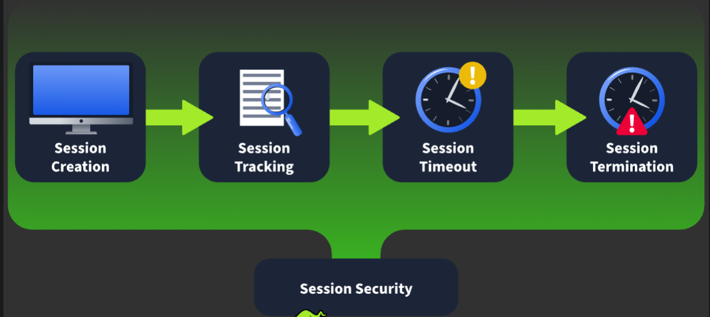
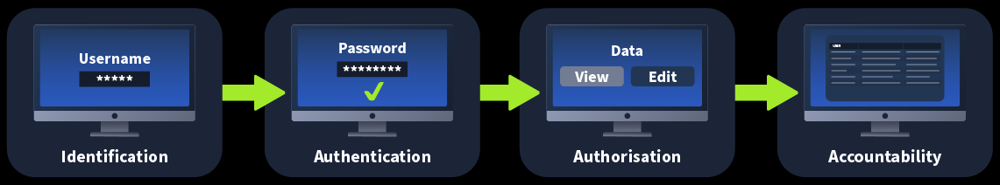

# **Session Management**
## **1. Introduction**
- Thông thường, bạn không phải lúc nào cũng phải cung cấp username, password cho web ở tất cả những request, thay vào đó, sau khi xác thực, ta được cấp một session
- Session dùng để duy trì trạng thái của chúng ta, theo dõi hành động và quyết định ta có được cho phép làm hành động gì đó hay là không, nó có mục đích là chắc chắn những hành động được thực hiện chính xác
- Mặt khác, nó có thể trở thành một tác nhân dễ bị khai thác, attacker có thể chiếm đoạt chúng

## **2. What is Session Management**
- Ta được biết rằng giao thức HTTP là giao thức không trạng thái, tức là nó request trước không liên quan đến các request sau
- Vì vậy session được dùng để theo dõi hành động và duy trì trạng thái của người dùng

---

### **Session Management Lifecycle** (*Quản lý vòng đời của session*)
#### **Session Creation**
- Session thường được tạo ra khi ta xác thực thành công 
- Nhưng trong một số trường hợp, việc tạo session diễn ra ngay khi ta truy cập vào web, bởi vì web muốn theo dõi hành động của ta ngay cả khi chưa xác thực
- Từ sau khi nhận được session, mỗi request mới của chúng ta đều gắn thêm session đó 

#### **Session Creation**
- Với mỗi request, web có thể khôi phục giá trị session từ request đó và thực hiện tra cứu máy chủ để session đó thuộc về ai và họ có quyền gì
- Đây cũng là vấn để của sesson biến nó thành tác nhân đe dọa vì chúng có thể bị chiếm đoạt hoặc mạo danh người dùng

#### **Session Expiry**
- HTTP là một giao thức không trạng thái, nên khi ta đóng tab, web sẽ không biết được hành động đó
- Đây vẫn là nhiệm vụ của session, nó được đính kèm thời gian hết hạn
- Một khi session đã hết hạn mà người dùng vẫn gửi lại request chưa session đó, web sẽ từ chối và thậm chí là chuyển hướng người dùng về trang **login**, yêu cầu người dùng đăng nhập lại và bắt đầu nhận một session mới

#### **Session Termination**
- Trong một số trường hợp, việc hủy session cần được thực hiện ngay lập tức, ví dụ như người dùng đăng xuất tài khoản của họ
- Khi đó, ngay cả khi thời gian đính kèm với session vẫn còn, nhưng session vẫn bị hủy và mất tác dụng ngay lập tức
- Vấn đề ở đây có thể xảy ra khi việc hủy bỏ session thực hiện không đúng cách, khi attacker có thể vẫn truy cập được tài khoản người dùng khi có session ngay cả khi họ đã đăng xuất khỏi tài khoản

## **3. Authentication vs Authorisation**

Để giải thích giữa **Authentication**(*Xác thực*)  và **Authorisation** (*Phân quyền*) ta sử sử dụng mô hình **IAAA**:
- **Identification** (*Nhận dạng*): là quá trình xác minh người dùng là ai, việc này được thực hiện bằng cách gửi **username** của bạn, một số web cho ta tạo **username** tùy ý, nhưng một số lại lấy chính email để làm tên người dùng

- **Authentication**: là quá trình xác thực bằng chứng để xác minh người đó có đúng với thông tin **username** họ khai báo không, thường thì các web sẽ sử dụng **password** đẻ thực hiện quá trình này, nếu thông tin trùng khớp, đây chính là thời điểm session được khởi tạo
- **Authorisation**: là quá trình xác nhận chắc chắn rằng người dùng cụ thể có quyền cần thiết để thực hiện hành động. Session tracking đóng vai trò quan trọng trong việc phân quyền
- **Accountability**: là quá trình tạo bản ghi của hành động được thưc hiện bởi người dùng, nó theo dõi và log lại tất cả những hành động của người dùng thông qua session của người đó; những thông tin này cực kì quan trọng, nó là một phần thông tin để xử lý khi có sự cố xảy ra trên hệ thống 

## **4. Cookies vs Tokens**

Có 2 hình thức sử dụng session thường bắt gặp là **cookies** và **tokens**

### **Cookie-Based Session Management**
- Khi web muốn thực hiện theo dõi, nó sẽ đính kèm Header `Set-Cookie` ví dụ: `Set-Cookie: session=12345;`
- Khi đó, trình duyệt sẽ lưu cookie có tên là `session` có giá trị là `12345`, cookie này có thể có ý nghĩa với một số quyền hạn trên trang web
- Có một số thuộc tính đáng chú ý với header này:
    - **Secure**: Cookie này chỉ được chuyển đi khi trình duyệt dùng HTTPS
    - **HTTPOnly**: Không cho JS ở phía client đọc cookie này
    - **Expire**: chỉ định rằng cookie này có thời hạn, bị remove khi hết hạn
    - **SameSite**: cookie chỉ được thực hiện chuyển đi trong cùng site, điều này tránh được **CSRF attack**

---
### **Token-Based Session Management**
- Token khác cookie ở chỗ là nó được trả về trong phần body của response và có dạng JSON
- Nó được lưu vào trong LocalStored và được JS phía client xử lý khi gửi chứ không tự động gửi đi như cookie
- VD: `Authorization: Bearer`

---

### **Benefits and Drawbacks**

Cookie:
- Trình duyệt tự lưu và tự gửi.
- Có các thuộc tính bảo mật hỗ trợ sẵn.
- Dễ bị CSRF nếu cấu hình không đúng.
- Thường gắn với một domain cụ thể.

Token:
- JavaScript phải tự lưu và tự gửi.
- Không có cơ chế bảo vệ tự động như cookie.
- Ít bị CSRF truyền thống.
- Phù hợp với API, SPA và hệ thống nhiều dịch vụ.

## **5. Securing the Session Lifecycle**
Đây là phần cuối cùng khi tìm hiểu về bảo mật session, ta sẽ tìm  hiểu và xác định những gì có thể sai và bị lợi dụng tạo thành lỗ hổng

### **Session Creation**
#### **Weak Session Values**
- Hiện nay, việc những trang web ít bị lỗ hổng này do có sự tồn tại của những framework 
- Nhưng nó lại trở lại khi có sự hỗ trợ code của AI, nhiều web thực sự để những cookie có giá trị có thể đoán (*base64*), từ đó attacker có thể dịch ngược, từ đó có thể chiếm đoạt session 

#### **Controllable Session Values**
Với JWT, nếu các biện pháp bảo mật không được thực thi, chẳng hạn như xác minh chữ ký của token hoặc đảm bảo rằng chữ ký đó được tạo một cách an toàn, thì attacker sẽ có thể tạo token của riêng họ.

#### **Session Fixation**
Hãy nhớ những ứng dụng web đã cấp cho bạn một session ngay cả trước khi đăng nhập. Những ứng dụng này có thể bị lỗ hổng gọi là session fixation. Nếu giá trị session không được thay đổi đầy đủ sau khi bạn xác thực, kẻ tấn công ở vị trí phù hợp có thể ghi lại session đó khi bạn vẫn chưa đăng nhập, sau đó chờ bạn đăng nhập để chiếm quyền truy cập vào phiên của bạn

#### **Insecure Session Transmission**
Một hệ thống được dùng để xác thực người dùng cho nhiều ứng dụng web khác nhau. Để quá trình này hoạt động, thông tin phiên đăng nhập phải được chuyển từ máy chủ xác thực sang máy chủ ứng dụng thông qua trình duyệt của người dùng.

Tuy nhiên, trong quá trình truyền này có thể xuất hiện các lỗi khiến thông tin session bị lộ cho kẻ tấn công. Trường hợp phổ biến nhất là insecure redirect, khi kẻ tấn công có thể kiểm soát URL mà người dùng được chuyển hướng tới sau khi đăng nhập.

### **Session Tracking**
#### **Authorisation Bypass**
Lỗi vượt qua phân quyền xảy ra khi hệ thống không thực hiện đầy đủ các bước kiểm tra để xác định người dùng có được phép thực hiện hành động họ yêu cầu hay không.

Về bản chất, ứng dụng không quản lý chính xác session của người dùng và các quyền được gắn với session đó.

Có hai loại vượt qua phân quyền:

- **Vertical bypass**: Người dùng thực hiện được hành động chỉ dành cho tài khoản có quyền cao hơn.
- **Horizontal bypass**: Người dùng thực hiện một hành động mà họ vốn được phép thực hiện, nhưng lại thực hiện trên dữ liệu mà họ không được quyền truy cập.

Trong phần lớn ứng dụng, lỗi **vertical bypass** thường dễ phòng chống hơn vì có thể sử dụng decorator, middleware hoặc cấu hình kiểm soát quyền theo đường dẫn.

Tuy nhiên, **horizontal bypass** khó xử lý hơn vì hành động mà người dùng thực hiện là hành động hợp lệ. Vấn đề nằm ở chỗ họ đang thực hiện hành động đó trên dữ liệu của người khác.

#### **Insufficient Logging**
Insufficient Logging nghĩa là hệ thống ghi log không đầy đủ, khiến đội ngũ bảo mật không thể điều tra chính xác khi xảy ra sự cố.

### **Session Expiry**
Session expiry chỉ có một vấn đề bảo mật chính: *thời gian hết hạn của session được đặt quá dài*.

Có thể xem session giống như một chiếc vé xem phim. Mỗi tối, cùng một bộ phim lại được chiếu, nhưng chúng ta không muốn một người có thể dùng lại chiếc vé cũ để xem vào ngày hôm sau.

Session cũng tương tự. Hệ thống phải đặt thời gian hết hạn phù hợp với mục đích sử dụng của từng ứng dụng

### **Session Termination**
Đối với việc chấm dứt session, vấn đề chính là session không được vô hiệu hóa đúng cách ở phía server khi người dùng thực hiện đăng xuất.

Giả sử kẻ tấn công đã chiếm được session của người dùng. Khi đó, kể cả người dùng phát hiện ra sự việc, nếu hệ thống không cho phép vô hiệu hóa session ở phía server thì người dùng cũng không có cách nào loại bỏ quyền truy cập của kẻ tấn công.

Điều này đặc biệt khó xử lý với token, vì thời gian sống của token thường được ghi trực tiếp bên trong token. Trong trường hợp đó, token có thể được thêm vào một blocklist để server kiểm tra và từ chối sử dụng.

Một số ứng dụng còn cho phép người dùng xem tất cả các session đang hoạt động và tự chấm dứt từng session.

Ngoài ra, sau khi đặt lại mật khẩu thành công, hệ thống nên chấm dứt toàn bộ session để người dùng có thể giành lại hoàn toàn quyền kiểm soát tài khoản.

