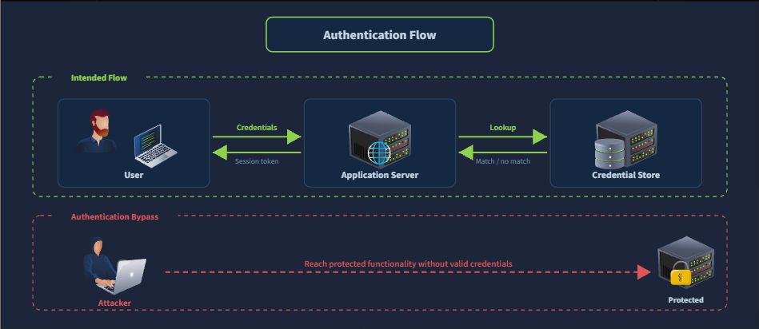
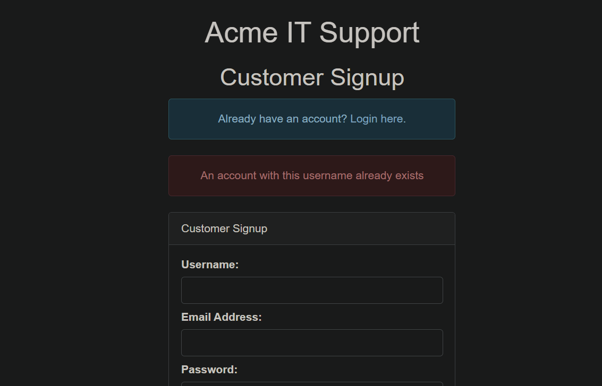
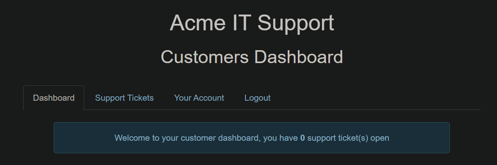
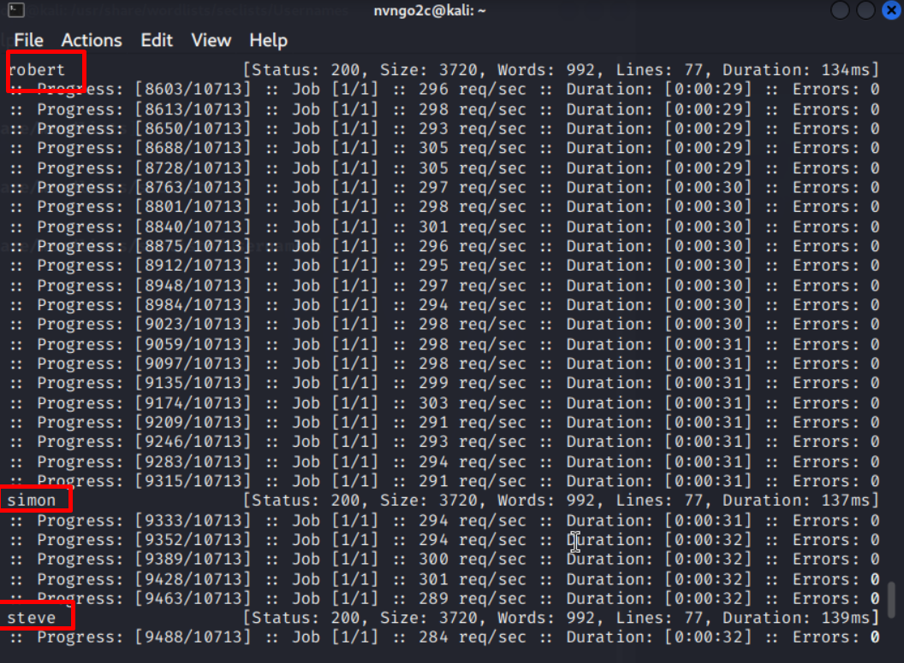
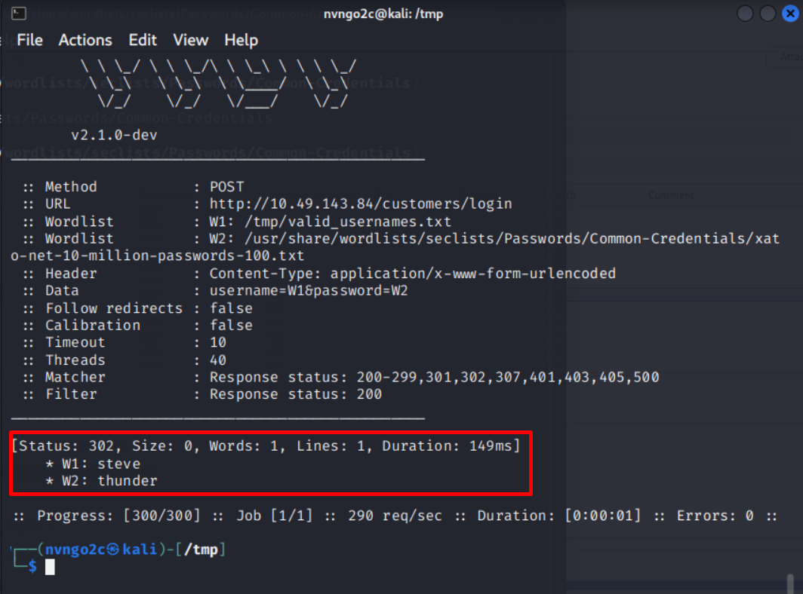
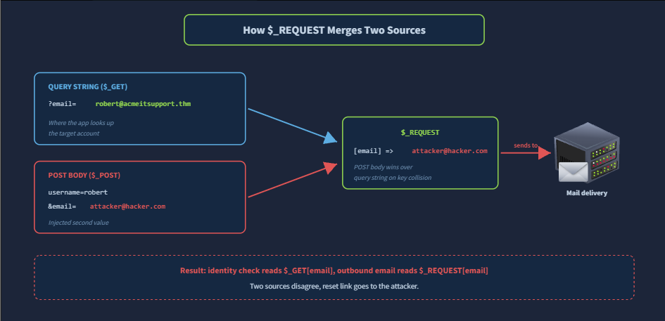

# **Broken Authentication**
## **1. Introduction**
**Authentication** (*Xác thực*) là một tiến trình của web nhằm xác minh danh tính của người dùng đã thực hiện request\
Nó thường được diễn ra ở phía server, nơi mà sẽ so sánh thông tin đăng nhập được gửi lên và thông tin đăng nhập được lưu trữ\
Khi trùng khớp, web sẽ trả về cho người dùng sesion token



## **2. Types of Authentication Bypass**
Có rất nhiều luồng dẫn đến việc chức năng xác thực bị bypass, nhưng phổ biến nhất có 4 loại: 
- **username enumeration** (*liệt kê người dùng*): sử dụng các form như **đăng nhập, đăng ký, quên mật khẩu** để có thể lấy được 1 list người dùng thực tế của web bằng những khác biệt giữa các phản hồi 
- **credential brute force** (*dò thông tin người dùng*): attacker sử dụng wordlist, user, password list để có thể dò thông tin của người dùng trong web app
- **logic flaws in account recovery** (*lỗi trong logic của chức năng lấy lại tài khoản*): attacker khai thác lỗi trong việc triển khai luồng hoạt động của các chức năng đổi mật khẩu, quên mật khẩu 
- **cookie manipulation** (*lợi dụng cookie*)

Mỗi loại đều có thành phần công nghệ và yêu câu cách tiếp cận khác nhau

## **3. Username Enumeration**
Username Enumeration là kĩ thuật phân tích sử dụng để lấy được danh sách các username tồn tại trong hệ thống\
Nó có thể dẫn đến các chuỗi tấn công khác như brute force, password spraying (*một mật khẩu thử trên nhiều tài khoản*), phishing\
Có nhiều vị trí mà thông tin có thể bị lộ, ví dụ như form đăng kí sẽ tiết lộ rằng tài khoản đã tồn tại khi ta cố gắng đăng kí nó lại một lần nữa

### **Error Message Differentials**
Tương tự như ví dụ bên trên, một form đăng kí có thể trả về thông báo lỗi, ta có thể dựa vào thông báo lỗi đó để có thể xác định xem người dùng đã tồn tại hay chưa



Khi thực hiện đăng kí bằng **admin**



Khi đăng nhập bằng username bất kì thì thành công, điều đó cho thấy web có người dùng **admin**\
Ta có thể thực hiện bruteforce bằng `ffuf`
```bash
ffuf -w /usr/share/wordlists/SecLists/Usernames/Names/names.txt -X POST -d "username=FUZZ&email=x&password=x&cpassword=x" -H "Content-Type: application/x-www-form-urlencoded" -u http://10.49.178.42/customers/signup -mr "username already exists"
```



Kết quả ta nhận được một số user tồn tại trên web

## **4. Brute-force a Login Form**
Là một cuộc tấn công nhắm đến lấy thông tin đăng nhập thông qua form đăng nhập, độ chính xác, hiệu quả, hiệu năng của nó hoàn toàn phụ thuộc và danh sách mà attacker cung cấp cho tool\
Nó sẽ kết hợp tất cả tất cả các từ trong 2 list thành từng cặp một rồi gửi request với thông tin đăng nhập đó đến khi nào có thông tin đăng nhập phù hợp thì thôi

### **Success Conditions**
Tất cả các tool brute-force đều phải có cách nào đó để nhận biết được sự khác biệt giữa các request thành công và thất bại\
Ví dụ: trong một web khi loggin thất bại sẽ trả về status code `200`, đó vẫn là trang web đăng nhập; khi thành công, nó sẽ trả về `302` tương ứng với việc chuyển hướng đến một trang khác, có thể là dashboard\
Các trang web có thể khác nhau về tín hiệu này, có thể là trả về một phần khác biệt ở body response, có thể là trả về một URL, ...\
Vì vậy attacker cần thực hiện cấu hình để có thể bắt được những khác biệt đó để có thể đưa ra được kết luận 

Ta có thể thực hiện với `ffuf`
```bash
ffuf -w valid_usernames.txt:W1,/usr/share/wordlists/seclists/Passwords/Common-Credentials/xato-net-10-million-passwords-100.txt:W2 -X POST -d "username=W1&password=W2" -H "Content-Type: application/x-www-form-urlencoded" -u http://10.49.143.84/customers/login -fc 200
```



Kết quả ta nhận được thông tin đăng nhập 

## **5. Logic Flaws**
Logic Flaws là một lỗ hổng trong đó luồng dự định của ứng dụng có thể được chuyển hướng bằng cách cung cấp đầu vào mà nhà phát triển không lường trước được\
Kẻ tấn công đạt đến trạng thái đặc quyền không phải bằng cách phá vỡ bất kỳ quy tắc đơn lẻ nào mà bằng cách khai thác sự không nhất quán giữa hai quy tắc được thiết kế để hoạt động độc lập



Những công cụ scan tự động hiếm khi tìm được những lỗ hổng liên quan đến logic

## **6. Cookie Manipulation**
### **Plain Text Cookies**
**Plain Text Cookies** lưu trữ trạng thái cơ bản trực tiếp trong tiêu đề, ở dạng mà bất kỳ ai giữ cookie đều có thể nhìn thấy và có thể chỉnh sửa một cách thông thường.\
Hãy xem xét một máy chủ phát hành cặp sau khi đăng nhập thành công:

```text
Set-Cookie: logged_in=true; Max-Age=3600; Path=/
Set-Cookie: admin=false; Max-Age=3600; Path=/
```

### **Hashed Cookies**
Hàm băm là đầu ra có độ dài cố định của hàm một chiều được áp dụng cho đầu vào. Cùng một đầu vào luôn tạo ra cùng một đầu ra và không thể đảo ngược hàm để khôi phục đầu vào từ đầu ra. Thuộc tính cuối cùng này khiến một số nhà phát triển lưu trữ các giá trị băm trong cookie với giả định rằng hàm băm làm cho dữ liệu cơ bản có khả năng chống giả mạo\
Giả định bị đặt sai chỗ. Hàm băm không phải là chữ ký; nó là một đại diện có thể định địa chỉ nội dung. Bất kỳ bên nào biết hoặc đoán giá trị ban đầu đều có thể tạo ra cùng một hàm băm một cách độc lập và thay thế nó vào cookie

### **Encoded Cookies**
Thông thường người cookie có dạng JSON sẽ bị mã hóa dạng base32 hoặc base64 để dễ dàng truyền đi\
Ví dụ:
```text
Set-Cookie: session=eyJpZCI6MSwiYWRtaW4iOmZhbHNlfQ==; Max-Age=3600; Path=/
```

Khi giải mã base64 ta có thể biết được cookie là `{"id":1,"admin":false}`


