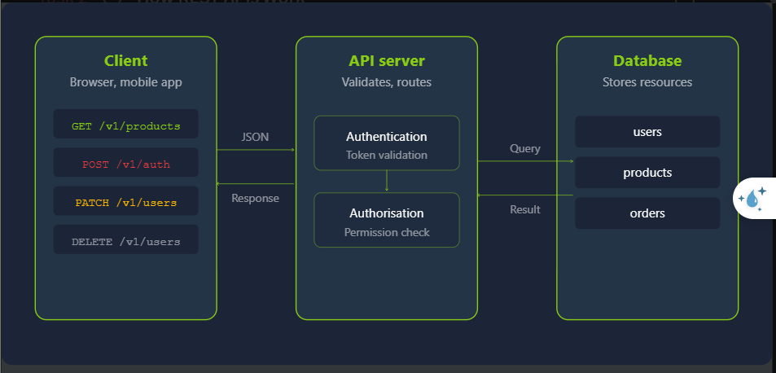
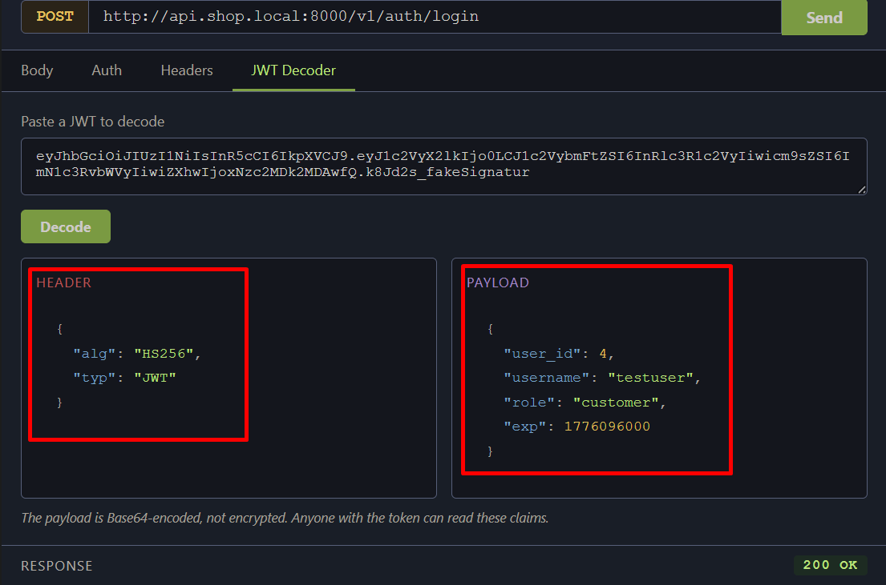
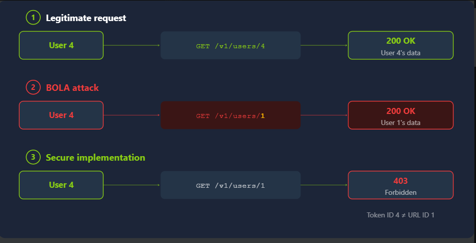
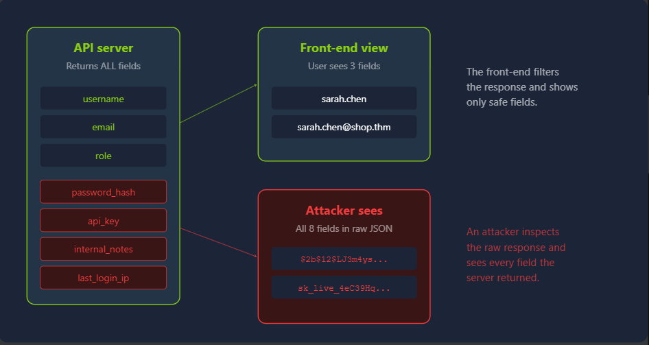

# **API Pentesting**
## **1. How REST APIs Work**
**REST API** (*Representational State Transfer*) không phải là một giao thức tiêu chuẩn, nó chỉ là một kiến trúc được tạo ra để lập trình viên có thể xây dựng API thông qua HTTPS\
Một API được gọi là **RESTful API** nếu nó được xây dựng theo mô hình



### **Resources and Endpoints**
Khái niệm cốt lõi trong RESTful API là **resource**. Mỗi tài nguyên được xác định bằng một URL, được gọi là điểm cuối. Ví dụ: API thương mại điện tử có thể hiển thị các điểm cuối như `/v1/users`, `/v1/products` và `/v1/orders`

### **HTTP Methods**
RESTful APIs sử dụng những phương thức tiêu chuẩn của HTTP; nó định nghĩa hành động tiếp theo được thực hiện trên resource; những phương thức này sẽ biểu thị cho các chức năng **CRUD**

- `GET`: `GET /v1/products/1` đọc và lấy dữ liệu của sản phẩm `1` (**R**)
- `POST`: `POST /v1/auth/login` dùng JSON để xác thực user và tạo token (**C**)
- `PUT`: **Full update**; VD: `PUT /v1/users/4 ` thay thế tất cả dữ liệu của người dùng 4 bằng dữ liệu được cung cấp (**U**)
- `PATCH`: **Partial Update**; VD: `PATCH /v1/users/me` chỉ update những trường nhất định (**U**)
- `DELETE`: `DELETE /v1/users/4` xóa user 4 (**D**)

### **Status Codes**
Tất cả các ressponse của HTTP đều có **Status Codes**, nó cho biết rằng kết quả chung của request

| Mã | Ý nghĩa | Liên quan đến bảo mật |
|---|---|---|
| `200` | Thành công | Yêu cầu đã được xử lý thành công |
| `201` | Đã tạo | Một tài nguyên mới đã được tạo, thường sau yêu cầu `POST` |
| `204` | Không có nội dung | Yêu cầu thành công nhưng không có nội dung phản hồi, thường dùng với `DELETE` |
| `400` | Yêu cầu không hợp lệ | Yêu cầu bị sai định dạng; hữu ích để kiểm tra cơ chế xác thực và kiểm tra dữ liệu đầu vào |
| `401` | Chưa được xác thực | Thiếu thông tin xác thực hoặc thông tin xác thực không hợp lệ |
| `403` | Bị cấm | Người dùng đã đăng nhập nhưng không có quyền truy cập; rất quan trọng khi kiểm tra BOLA |
| `404` | Không tìm thấy | Tài nguyên hoặc endpoint được yêu cầu không tồn tại |
| `405` | Phương thức không được phép | Phương thức HTTP không được hỗ trợ trên endpoint này |
| `429` | Quá nhiều yêu cầu | Cơ chế giới hạn số lượng request đang được áp dụng |
| `500` | Lỗi máy chủ nội bộ | Lỗi phía server; có thể liên quan đến injection, dữ liệu đầu vào chưa được xử lý hoặc lỗi logic |

### **Authentication Mechanisms**
Mỗi API đều yêu cầu xác thực danh tính của request, có 3 cơ chế phổ biến nhất:
- **API Keys**: đây là phương thức xác thực đơn giản nhất, client sẽ gửi API key bằng Header `X-API-Key`, server sẽ nhìn vào và xác thực user. Tuy nhiên API key có thời gian sử dụng rất lâu, việc truyền qua mạng có nguy cơ bị lộ và có thể dẫn đến bị truy cập trái phép toàn quyền
- **Bearer Tokens**: sau khi xác thực lần đầu, server sẽ trả về token, những request sau, client cần gửi lại token đó với header `Authorization`, điều đặc biệt là Bearer Tokens có thể được thu hồi và nó có thời gian sử dụng ngắn  

### **JSON Web Tokens (JWTs)**
Là dạng phổ biến nhất của **Bearer Tokens**, nó gồm 3 phần được encode bằng base64 được phân cách bởi dấu chấm: *header, payload, signature*



## **2. Broken Object Level Authorization (BOLA)**


**Broken Object Level Authorization (BOLA)** là một lỗi trong việc phân quyền khi API trả lại kết quả mà không thực hiện bất cứ kiểm tra nào\
API thực hiện xác thực nhưng không kiểm tra quyền của user có được phép truy cập vào tài nguyên đó hay không

### **Why BOLA Is the Number One API Risk**
Hầu hết các API Framework đều chỉ thực hiện việc xác thực nhưng phân quyền thì phải được triển khai thủ công trên tất cả những endpoint, kể cả 1 endpoint không được triển khai đúng cũng có thể dẫn đến lỗ hổng

### **How BOLA Works**
Giả sử bạn có một tài khoản là     **user4**, bạn có thể lấy thông tin của bạn bằng `GET /v1/users/4/orders`, nhưng khi bạn gửi `GET /v1/users/1/orders`, bạn lại nhận được cả thông tin của **user1**, điều đó cho thấy hệ thống đã tồn tại lỗ hổng cho phép truy cập trái phép vào tài nguyên của người khác\
Nếu API được bảo vệ, nó sẽ trả về `403 Forbidden` và không cho phép truy cập vào tài nguyên của người khác

BOLA không giới hạn các tham số đường dẫn URL. Nó có thể xuất hiện trong chuỗi truy vấn ( `?owner_id=13`), request body (`{"user_id": 13}`) và tiêu đề tùy chỉnh (`X-User-ID`: `13`). Bất kỳ vị trí nào mà mã định danh đối tượng được chấp nhận mà không cần xác thực đối với người dùng được xác thực đều là một vectơ tiềm năng

## **3. Broken Authentication and Excessive Data Exposure**
### **Broken Authentication**
#### **Lack of Rate Limiting on Login Endpoints**
Các trang web hệ thống thường triển khai hệ thống có sử dụng biện pháp rate limit, CAPTCHA để có thể giới hạn khả năng tấn công vét cạn\
Nhưng đối với API, nó được thiết kế để truy cập theo chương trình nên nó bỏ qua các biện pháp bảo vệ này. Kết quả là hệ thống có thể bị tấn công vét cạn 

#### **JWT Implementation Flaws**
**Khóa bí mật quá yếu**: JWT dùng thuật toán **HS256** sẽ ký token bằng một chuỗi bí mật gọi là secret key. Kẻ tấn công có thể lấy một JWT hợp lệ rồi thử hàng triệu mật khẩu phổ biến bằng **hashcat** hoặc **jwt_tool**

**JWT không có chữ ký**:\
Thông thường header JWT có thể là:
```Json
{
  "alg": "HS256",
  "typ": "JWT"
}
```

Kẻ tấn công thay thành:

```json
{
  "alg": "none",
  "typ": "JWT"
}
```

`none` có nghĩa là JWT không sử dụng thuật toán ký.

Attacker có thể tự tạo payload:

```json
{
  "username": "attacker",
  "role": "admin"
}
```

Sau đó bỏ phần signature: `header.payload.`

**Không kiểm tra thời hạn**:
```json
{
  "username": "an",
  "role": "user",
  "exp": 1785373200
}
```

`exp` là thời điểm token hết hạn\
Giả sử token bị đánh cắp. Token đã hết hạn nhưng server không kiểm tra `exp`, attacker vẫn có thể sử dụng token đó để đăng nhập

### **Excessive Data Exposure**



Trong kiến trúc API, backend trả về dạng JSON thô và frontend quyết định hiển thị cái gì\
Vấn đề xảy ra nếu Dev cho phép trả về hết các trường DB, và chỉ dùng frontend để filter\
Ví dụ frontend chỉ hiển thị `username`, `email` nhưng thực ra dữ liệu trả về lại bao gồm cả `password_hash`, `api_key`, `internal_notes`, `last_login_ip`

## **4. Mass Assignment and Rate Limits**
### **Understanding Mass Assignment**
Là lỗ hổng xảy ra khi không có bất kì kiểm tra nào khi lấy dữ liệu từ người dùng đưa trực tiếp vào **internal object**\
Ví dụ: có chức năng sửa đổi tên user, khi người dùng thông thường chỉ gửi lên 

```json
{
    "user":"changed_name"
}
```

Nhưng attacker có thể gửi thêm 

```json
{
    "user":"changed_name",
    "role":"admin"
}
```

Nếu hệ thống không thực hiện filter, attacker có thể được đẩy lên quyền admin

#### **Finding Mass Assignment Opportunities**
Ta thường tìm kiếm bằng việc gửi request lên và quan sát JSON trả về, từ đó tìm những trường có thể inject vào

```json
{
  "id": 4,
  "username": "testuser",
  "email": "testuser@shop.thm",
  "role": "customer",
  "api_key": "sk_test_dGVzdHVzZXJrZXk",
  "email_verified": true,
  "created_at": "2025-01-15T09:30:00Z"
}
```

Ở đây ta có thể thể thấy có các trường như `role`, `api_key`, `email_verified` là những trường tiềm năng để có thể inject

Ngoài nội dung của JSON, ta có thể dựa vào API document được công bố để có thể xem những trường đánh dấu là `readOnly`

#### **Rate Limiting Beyond Authentication**
Để kiểm tra API có triển khai ratelimit không, ta có thể thực hiện gửi một lượng lớn request\
Nếu stastus code trả về là `429 Too Many Requests ` thì tức là có rate limit\
Một số header rate limit

```
X-RateLimit-Limit: 100
X-RateLimit-Remaining: 25
X-RateLimit-Reset: 1785384000
```


