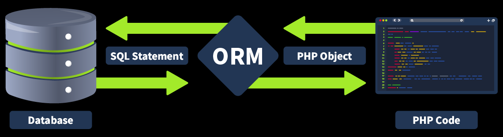

# **ORM Injection**
## **1. Understanding ORM**
**ORM** là kỹ thuật giúp lập trình viên làm việc với database bằng code của ngôn ngữ lập trình thay vì phải viết SQL trực tiếp, nó giúp giảm thiểu SQLi nhưng không hoàn toàn làm mất đi lỗi injection

Ví dụ: thay vì phải viết câu lệnh truy vấn: 

```sql
SELECT * FROM users WHERE id = 1;
```

Thì có thể dùng 

```php
User.objects.get(id=1)
```




