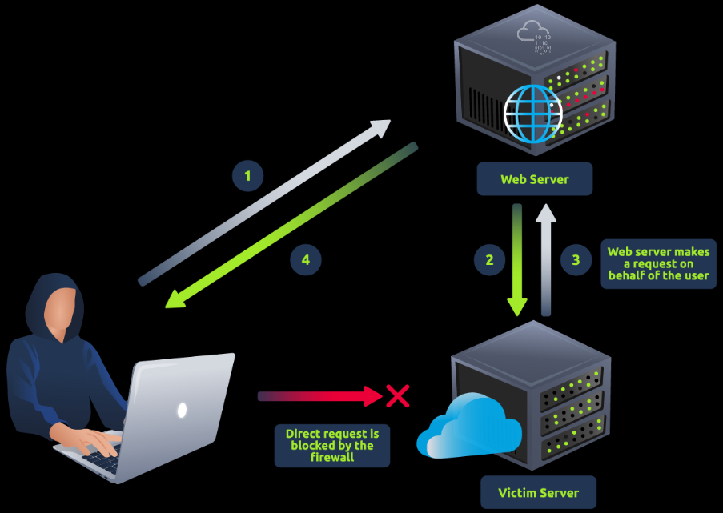
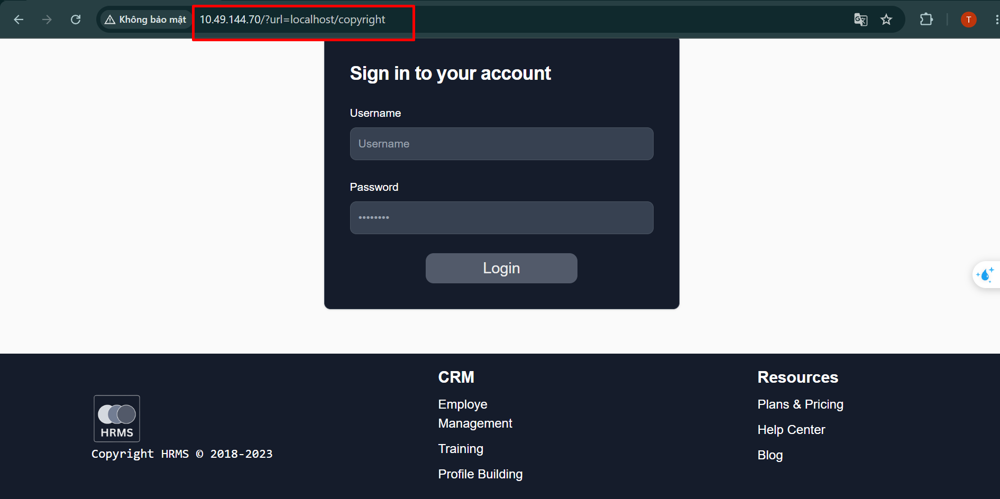
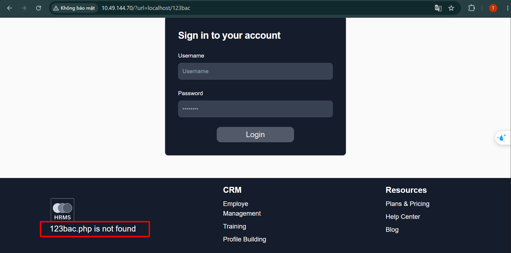
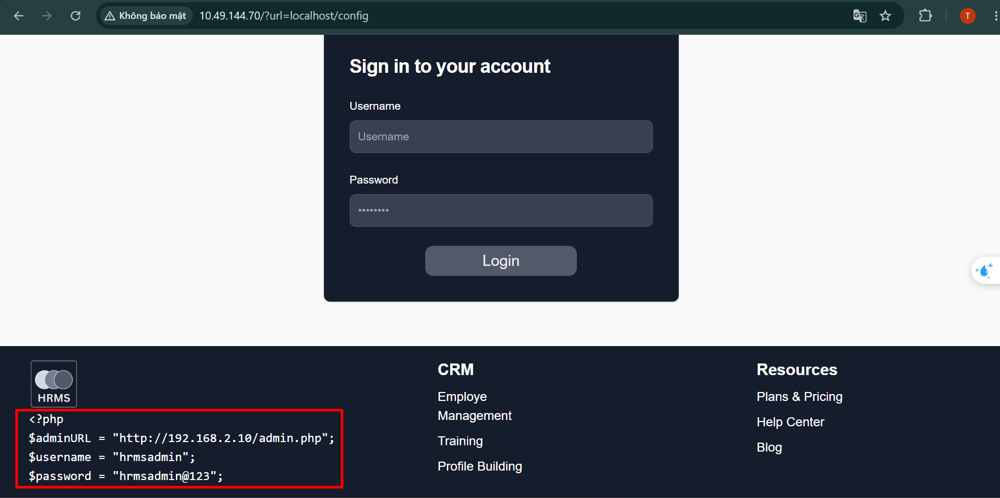
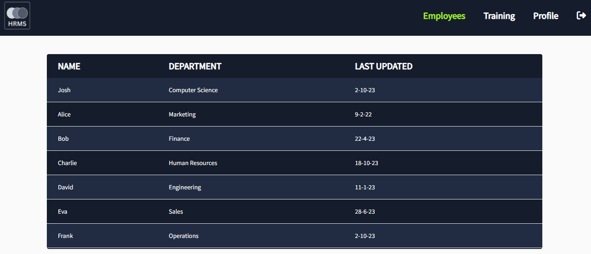
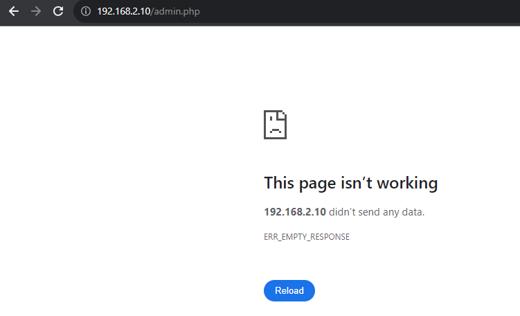
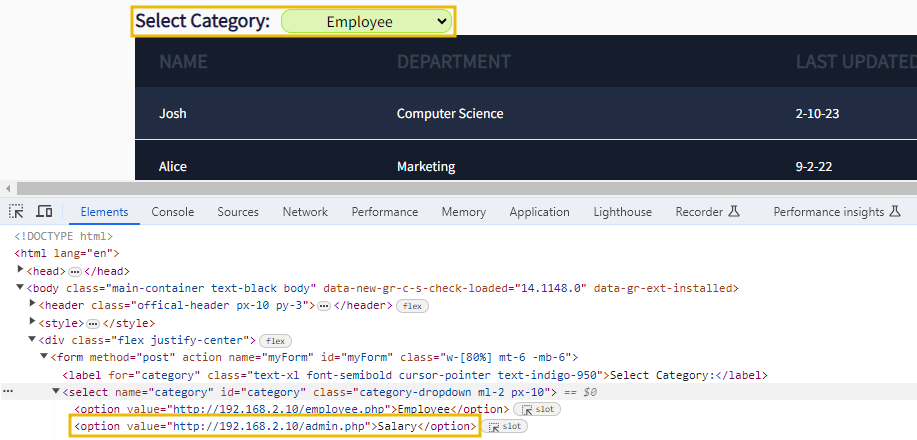

# **SSRF**
## **1. Anatomy SSRF**


## **2. Types of SSRF - Basic**

### **Scenario - I: SSRF Against a Local Server**
**SSRF basic** là một kỹ thuật tấn công web trong đó kẻ tấn công đánh lừa máy chủ thay mặt họ thực hiện các yêu cầu, thường nhắm mục tiêu vào các hệ thống nội bộ hoặc dịch vụ của bên thứ ba. Bằng cách khai thác các lỗ hổng trong xác thực đầu vào, kẻ tấn công có thể truy cập trái phép vào thông tin nhạy cảm hoặc kiểm soát các tài nguyên từ xa, gây ra rủi ro bảo mật đáng kể cho ứng dụng mục tiêu và cơ sở hạ tầng cơ bản của nó



Web cho ta một trang đăng nhập, nhưng khi truy cập, ta thấy web tự động điều hướng về `/?url=localhost/copyright`, ta thử đổi `copyright` thành một đường dẫn khác `123bac`



Kết quả là phần coppyright đã sử thay đổi thành `123bac.php is not found`\
Và logic code của web:
```php
$uri = rtrim($_GET['url'], "/");
...					
$path = ROOTPATH . $file;
...
if (file_exists($path)) {
  echo "<pre>";
  echo htmlspecialchars(file_get_contents($path));
  echo "</pre>";
  } else { ?>
    <p class="text-xl"><?= ltrim($file, "/") ?> is not found</p>
 <?php
... 
```

Ta thấy được web sẽ trả về màn hình kết quả của hàm `file_get_contents`\
Khi đó ta thử đổi thành `config` để lấy nội dung của file `config.php`



Kết quả là web trả về nội dung của file `config`

### **Scenario - II: Accessing an Internal Server**
Trong các ứng dụng web phức tạp, các ứng dụng web front-end thường tương tác với các máy chủ nội bộ back-end. Các máy chủ này thường được lưu trữ trên các địa chỉ IP không thể định tuyến, do đó người dùng internet không thể truy cập chúng. Trong trường hợp này, kẻ tấn công khai thác xác thực đầu vào của ứng dụng web dễ bị tấn công để lừa máy chủ yêu cầu tài nguyên nội bộ trên cùng một mạng. Họ có thể cung cấp một URL độc hại làm đầu vào, khiến máy chủ thay mặt họ tương tác với máy chủ nội bộ



Web show ra bảng lương của người dùng trong hệ thống\
Trong config ta đã tìm được `http://192.168.2.10/admin.php`, nhưng ta không thể truy cập từ bên ngoài WAN vào được vì IP đó thuộc dải mạng LAN của hệ thống



Kiêm tra source thì ta thấy web vẫn gọi IP trên để lấy dữ liệu, chứng tỏ rằng máy chủ web này có thể truy cập được những tài nguyên trong mạng nội bộ



Từ đó, ta sẽ sửa điều hướng của trang web thành `http://192.168.2.10/admin.php`


Khi đó ta chuyển sang `Salary` sẽ thấy được giao diện của admin

## **3. Types of SSRF - Blind**
**Blind SSRF** đề cập đến một tình huống trong đó kẻ tấn công có thể gửi yêu cầu đến máy chủ mục tiêu, nhưng chúng không nhận được phản hồi hoặc phản hồi trực tiếp về kết quả yêu cầu của chúng. Nói cách khác, kẻ tấn công không biết được phản hồi của máy chủ. Loại SSRF này có thể khó khai thác hơn vì kẻ tấn công không thể trực tiếp nhìn thấy kết quả hành động của chúng

### **Blind SSRF With Out-Of-Band** 

```python
from http.server import SimpleHTTPRequestHandler, HTTPServer
from urllib.parse import unquote
class CustomRequestHandler(SimpleHTTPRequestHandler):

    def end_headers(self):
        self.send_header('Access-Control-Allow-Origin', '*')  # Allow requests from any origin
        self.send_header('Access-Control-Allow-Methods', 'GET, POST, OPTIONS')
        self.send_header('Access-Control-Allow-Headers', 'Content-Type')
        super().end_headers()

    def do_GET(self):
        self.send_response(200)
        self.end_headers()
        self.wfile.write(b'Hello, GET request!')

    def do_POST(self):
        content_length = int(self.headers['Content-Length'])
        post_data = self.rfile.read(content_length).decode('utf-8')

        self.send_response(200)
        self.end_headers()

        # Log the POST data to data.html
        with open('data.html', 'a') as file:
            file.write(post_data + '\n')
        response = f'THM, POST request! Received data: {post_data}'
        self.wfile.write(response.encode('utf-8'))

if __name__ == '__main__':
    server_address = ('', 8080)
    httpd = HTTPServer(server_address, CustomRequestHandler)
    print('Server running on http://localhost:8080/')
    httpd.serve_forever()
```

Đoạn mã dùng để nhận request rồi ghi dữ liệu nhận được vào file `data.html`

## **4. Crashing the Server**
Kẻ tấn công có thể lạm dụng SSRF bằng cách làm hỏng máy chủ hoặc tạo ra sự từ chối dịch vụ cho các máy chủ khác. Có nhiều trường hợp (WordPress(mở trong tab mới), CairoSVG(mở trong tab mới)) trong đó kẻ tấn công cố gắng phá hoại tính khả dụng của hệ thống bằng cách phát động các cuộc tấn công SSRF

kẻ tấn công có thể nhập URL trỏ đến một tệp lớn trên máy chủ chậm hoặc dịch vụ phản hồi với lượng dữ liệu quá lớn. Khi ứng dụng dễ bị tấn công truy cập vào URL này một cách ngây thơ, nó sẽ thực hiện một hành động làm cạn kiệt tài nguyên hệ thống của chính nó, dẫn đến làm chậm hoặc sập hoàn toàn

